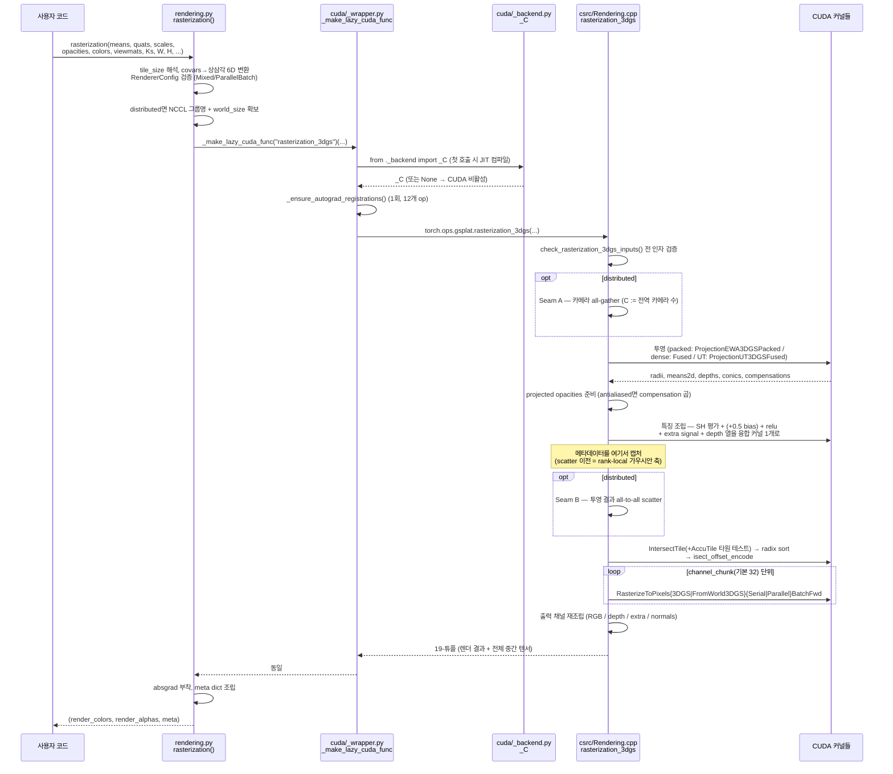
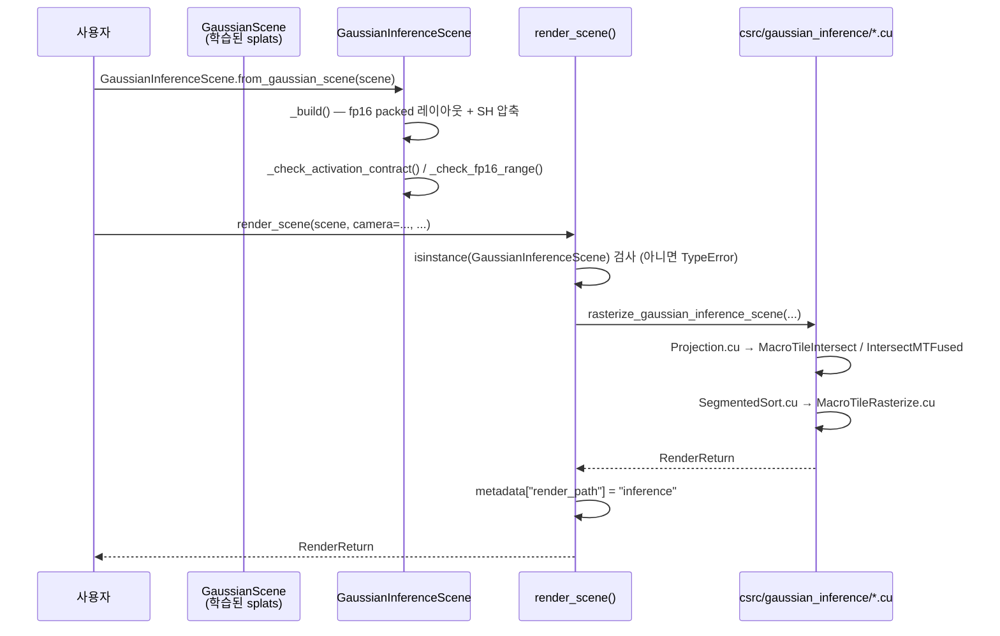
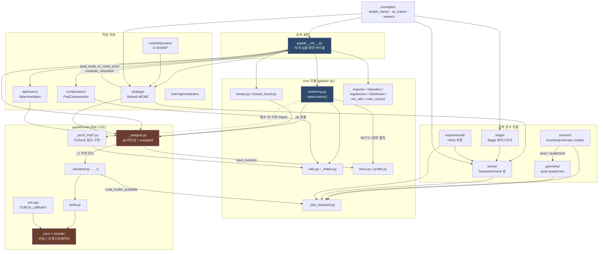

# gsplat 전체 분석

> 분석 범위: 저장소 루트 기준 2,658개 파일 (submodule/캐시 제외).
> 소스 규모: 약 132K LOC (gsplat 패키지) + 45K LOC (tests) + 13K LOC (examples).

---

## Phase 1: 프로젝트 개요

### 프로젝트 목적

gsplat은 **3D Gaussian Splatting의 미분 가능한(differentiable) 래스터라이제이션**을 CUDA로 가속하고 Python API로 노출하는 라이브러리다. SIGGRAPH 논문 *3D Gaussian Splatting for Real-Time Rendering of Radiance Fields*의 구현을 출발점으로 하되, 원본보다 최대 4배 적은 GPU 메모리와 15% 짧은 학습 시간을 목표로 재작성되었다.

핵심 가치는 "**연구용 커널 라이브러리**"라는 점이다. 학습 파이프라인(trainer)은 [examples/](examples/)에 예시로만 존재하고, 패키지 본체는 forward/backward 커널과 그 위의 얇은 Python 계약(shape/dtype 검증, autograd 등록)만 제공한다. 다운스트림(nerfstudio 등)이 자체 트레이너를 붙일 수 있도록 설계되어 있다.

### 기술 스택

| 레이어 | 사용 기술 |
|---|---|
| 언어 | Python ≥3.7 (실제 CI는 3.10), C++20, CUDA (12.6 / 12.8 / 13.2 검증) |
| 프레임워크 | PyTorch ≥2.7 (`torch.library` custom op / custom class 기반) |
| 빌드 | setuptools + `torch.utils.cpp_extension` (AOT), ninja, JIT fallback |
| 수치/타입 | numpy, jaxtyping, typeguard |
| 관측성 | nvtx (NVTX range), rich (콘솔) |
| 테스트 | pytest, pytest-check, pytest-xdist, pytest-env, googletest (C++) |
| 포맷/린트 | black 22.3.0, isort 5.10.1, clang-format 22.1.5, pylint |
| 문서 | Sphinx (`docs/source`) |
| 선택적 | scipy (LiDAR), cupy, nerfacc, PLAS, torchpq (압축) |

C++20을 요구하는 점이 특징이다. 뒤에서 보는 `dispatch::` 라이브러리와 `to_torch_op` 마샬링이 concepts / 템플릿 람다에 의존한다.

### 디렉토리 구조

```
gsplat/
├── gsplat/                      # 배포 패키지 본체 (~132K LOC)
│   ├── __init__.py              # 공개 API 평면 재수출 (174행, __all__ 76개)
│   ├── rendering.py             # 최상위 렌더 진입점 rasterization() (1,717행)
│   ├── losses.py                # 40+ 손실/정규화 함수 (1,183행)
│   ├── losses_fused.py          # CUDA 융합 손실 래퍼
│   ├── strategy/                # 밀도화(densification) 전략: Default / MCMC
│   ├── optimizers/              # SelectiveAdam (가시 가우시안만 갱신)
│   ├── compression/             # PNG 기반 splat 압축 (PLAS 정렬 + PQ)
│   ├── cuda/                    # ★ 핵심 커널 레이어 (56K LOC, 108 파일)
│   │   ├── _wrapper.py          # 모든 CUDA op의 Python 바인딩 (3,216행)
│   │   ├── _torch_impl*.py      # 순수 PyTorch 참조 구현 (테스트 기준값)
│   │   ├── build.py             # JIT/AOT 빌드 파라미터 단일 소스
│   │   ├── ext.cpp              # TORCH_LIBRARY 스키마 선언 (1,343행)
│   │   ├── csrc/                # .cu / .cpp 커널 + C++ 오케스트레이터
│   │   └── include/             # 공유 헤더 (Dispatch.h, TorchUtils.h, Cameras.cuh …)
│   ├── sensors/                 # 카메라/LiDAR 센서 모델 (38K LOC, 60 파일)
│   ├── geometry/                # SE(3) pose / quaternion 연산 (10.6K LOC)
│   ├── scene/                   # GaussianScene / GaussianInferenceScene 컨테이너
│   ├── stage/                   # Scene ↔ render_fn 레지스트리 (117 LOC)
│   ├── training/                # 학습률 스케줄러
│   ├── experimental/            # HiGS 추론 전용 렌더 경로 (9.1K LOC)
│   ├── contrib/dynamic/         # G-SHARP 동적(수술) 씬 재구성
│   ├── profile.py, trace.py     # 프로파일링 워크로드 + NVTX 트레이싱
│   └── utils.py, _helper.py, _lazy_backend.py, distributed.py, exporter.py
├── examples/                    # 트레이너/뷰어/데이터셋 파서 (12.8K LOC)
│   ├── simple_trainer.py        # 표준 COLMAP 3DGS 트레이너 (1,617행)
│   ├── av_trainer.py            # 자율주행(AV) 멀티센서 트레이너
│   ├── dynamic_surgical_trainer.py
│   ├── datasets/                # colmap / ncore / endonerf 파서
│   └── benchmarks/              # 재현용 셸 스크립트 묶음
├── tests/                       # 1,322개 테스트 함수 (45K LOC, 71 파일)
│   └── cpp/                     # googletest 기반 C++ 단위 테스트
├── docs/                        # Sphinx 소스 + 설계 문서 (modules-design.md 등)
├── profiling/                   # 독립 프로파일링 엔트리
├── lint/format-code.sh          # black + isort + clang-format 통합 (pre-commit)
├── setup.py                     # 확장 모듈 2개 정의 (core + experimental)
├── conftest.py, pytest.ini      # GPU CI 알려진 실패 xfail 처리
└── third_party/googletest       # submodule
```

### 아키텍처 패턴

이 저장소의 아키텍처는 [docs/modules-design.md](docs/modules-design.md)에 **명시적으로 문서화된 4계층 모듈 규약**을 따른다. 이것이 gsplat을 읽을 때 가장 먼저 알아야 할 사실이다.

```
gsplat/<module>/
  functional/    # Layer 1: 공개 stateless API. 도메인 용어, shape/dtype 계약
  kernels/       # Layer 0: 백엔드 디스패치, autograd glue, 네이티브 바인딩
    _backend.py  #          지연 로딩 sentinel
    cuda/        #          build.py + ext.cpp + csrc/
  models/        # Layer 2 (선택): torch.nn.Module 래퍼, 학습 가능 파라미터
  components/    # Layer 2' (선택): nn.Module을 의도적으로 상속하지 않는 stateful 래퍼
```

`sensors`, `geometry`, `scene`, `stage`, `experimental/render`가 이 규약을 따른다. 반면 **`gsplat/cuda/`는 규약 이전에 작성된 레거시 레이아웃**(`_wrapper.py`에 모든 op가 평면적으로 모여 있음)이며, 이 비대칭이 코드베이스 이해의 주된 장애물이다.

그 외 식별되는 패턴:

1. **Lazy native extension loading** (PEP 562 `__getattr__`)
   [gsplat/_lazy_backend.py](gsplat/_lazy_backend.py)의 `make_lazy_backend()`가 "prebuilt import → JIT build → raise" 정책을 한 곳에 모아둔다. CPU-only 머신에서 `import gsplat.sensors.functional`이 컴파일을 트리거하지 않는 것이 요구사항이다.

2. **Registered custom op + Python autograd**
   커널은 `TORCH_LIBRARY(gsplat, m)`으로 스키마를 선언하고([gsplat/cuda/ext.cpp](gsplat/cuda/ext.cpp)), 역전파는 Python 측에서 `torch.library.register_autograd`로 붙인다([gsplat/cuda/_wrapper.py:91](gsplat/cuda/_wrapper.py#L91)의 `_ensure_autograd_registrations`). TorchScript 배포와 `torch.compile` 호환을 위한 선택이다.

3. **Runtime→compile-time dispatch**
   [gsplat/cuda/include/Dispatch.h](gsplat/cuda/include/Dispatch.h)는 런타임 int/variant를 컴파일타임 템플릿 인자로 승격시키는 조합 디스패처다. `project<BlockSize, Camera, Distortion, BatchSize>` 같은 커널의 카테시안 인스턴스화를 선언적으로 생성한다.

4. **Type marshalling layer**
   [gsplat/cuda/include/TorchUtils.h](gsplat/cuda/include/TorchUtils.h)의 `to_torch_op<&fn>`이 네이티브 C++ 시그니처를 torch dispatcher 시그니처로 자동 평탄화한다. `TorchArgDef<T>` 특수화를 추가하면 새 타입이 경계를 넘을 수 있다.

5. **Reference implementation pairing**
   모든 주요 커널은 `gsplat/cuda/_torch_impl*.py`에 순수 PyTorch 쌍둥이를 가진다. 테스트는 이 참조 구현과 수치 비교로 검증한다. 이것이 1,322개 테스트를 지탱하는 구조다.

6. **Strategy pattern (밀도화)**
   `Strategy` 기반 클래스가 `step_pre_backward` / `step_post_backward` 콜백 계약만 정의하고, `DefaultStrategy`(원논문 휴리스틱)와 `MCMCStrategy`가 이를 구현한다.

7. **Registry pattern (Stage)**
   `Stage`가 `scene_id → (scene, render_fn)` 매핑을 들고 `render(scene_id, **kw)`로 디스패치한다. 학습 시 씬 1개, 추론 시 다중 씬.

---

## Phase 2: 진입점 및 실행 흐름

### 진입점 목록

| 종류 | 위치 | 설명 |
|---|---|---|
| 라이브러리 공개 API | [gsplat/__init__.py](gsplat/__init__.py) | 76개 심볼 평면 재수출 |
| 주 렌더 함수 | [gsplat/rendering.py:234](gsplat/rendering.py#L234) `rasterization()` | 실질적 단일 진입점 |
| C++ 오케스트레이터 | [gsplat/cuda/csrc/Rendering.cpp:745](gsplat/cuda/csrc/Rendering.cpp#L745) `rasterization_3dgs()` | 전체 파이프라인이 여기 |
| 네이티브 확장 로드 | [gsplat/cuda/_backend.py](gsplat/cuda/_backend.py) `_C` | prebuilt → JIT fallback |
| 학습 CLI | [examples/simple_trainer.py:1503](examples/simple_trainer.py#L1503) `main()` + `__main__` | tyro 기반 서브커맨드 (`default` / `mcmc`) |
| AV 학습 CLI | [examples/av_trainer.py](examples/av_trainer.py) | 멀티센서(카메라+LiDAR) |
| 프로파일러 CLI | [gsplat/profile.py:1180](gsplat/profile.py#L1180) `main()` | `python -m gsplat.profile` |
| 추론 렌더 | [gsplat/experimental/render/functional/render_scene.py](gsplat/experimental/render/functional/render_scene.py) `render_scene()` | HiGS 경로 |
| 빌드 | [setup.py](setup.py) `_setup()` | CUDAExtension 2개 |

`if __name__ == "__main__"` 블록은 examples/ 트레이너와 뷰어, `profiling/main.py`에 존재한다.

### 유스케이스 1: `rasterization()` 한 번의 forward

가장 중요한 흐름이다. v1.6.0에서 **파이프라인 전체가 단일 C++ op(`rasterization_3dgs`)로 통합**되었다는 점이 핵심이다. 예전처럼 Python이 projection → isect → rasterize를 순차 호출하지 않는다.



**backward는 이 다이어그램에 없다.** `loss.backward()` 시 dispatcher가 `register_autograd`로 등록된 Python `backward`를 호출하고, 그것이 `torch.ops.gsplat.<op>_bwd`를 부른다. 즉 forward는 단일 융합 op지만 backward는 op 단위로 분해되어 있다.

### 유스케이스 2: `simple_trainer.py` 학습 스텝

```mermaid
sequenceDiagram
    participant CLI as tyro CLI
    participant M as main()
    participant Run as Runner
    participant St as Stage
    participant Ras as Runner.rasterize_splats
    participant GS as gsplat.rasterization()
    participant Str as Strategy
    participant Opt as Optimizers

    CLI->>M: cfg (default | mcmc 서브커맨드)
    M->>Run: Runner(local_rank, world_rank, world_size, cfg)
    Run->>Run: create_splats_with_optimizers()<br/>ParameterDict{means,quats,scales,opacities,sh0,shN}
    Run->>Run: GaussianScene.from_splats(...) → Stage.add_scene(scene, rasterize_splats)
    M->>Run: train()

    loop step in range(max_steps)
        Run->>Run: DataLoader에서 batch (camtoworld, K, image, mask, exposure)
        Run->>Run: sh_degree_to_use = min(step // sh_degree_interval, sh_degree)
        Run->>St: stage.render(scene.id, camtoworlds=..., Ks=..., sh_degree=...)
        St->>Ras: render_fn(splats=scene.splats, **kwargs)
        Ras->>Ras: scales=exp(·), opacities=sigmoid(·), colors=cat(sh0,shN)
        Ras->>GS: rasterization(...)  ← 유스케이스 1
        GS-->>Ras: (renders, alphas, info)
        Ras-->>St: 동일
        St-->>Run: 동일

        Run->>Str: step_pre_backward(params, optimizers, state, step, info)
        Note over Str: DefaultStrategy: info["means2d"].retain_grad()
        Run->>Run: loss = lerp(l1_loss, ssim_loss, ssim_lambda)<br/>+ depth/PPISP/opacity/scale 정규화
        Run->>Run: loss.backward()
        Run->>Str: step_post_backward(...)
        Note over Str: Default: grad2d 누적 → grow(dup/split) / prune<br/>MCMC: relocate + add_new + inject_noise
        Str->>Opt: _update_param_with_optimizer()<br/>파라미터·optimizer state 동시 재구성
        Run->>Opt: optimizer.step() / zero_grad() / scheduler.step()
    end
```

밀도화가 **파라미터 텐서의 길이 자체를 매 스텝 바꾼다**는 점이 이 루프의 특이점이다. `strategy/ops.py:96`의 `_update_param_with_optimizer`가 파라미터와 Adam의 `exp_avg`/`exp_avg_sq`를 짝지어 재구성하고, `Scene`의 topology hook(`on_duplicate`/`on_split`/`on_remove`/`on_relocate`/`on_permute`)이 사이드카 데이터를 동기화한다.

### 유스케이스 3: HiGS 추론 렌더 (experimental)



이 경로는 **gradient가 없다**(추론 전용). fp16 패킹과 macro-tile 융합 래스터화로 지연을 줄이는 것이 목적이며, 별도 CUDAExtension(`gsplat.experimental.render.kernels.csrc`)으로 컴파일된다.

---

## Phase 3: 핵심 모듈 심층 분석

파일 크기 상위 (테스트 제외):

| LOC | 파일 |
|---:|---|
| 5,631 | `gsplat/sensors/kernels/cuda/csrc/camera_torch.cpp` |
| 5,027 | `gsplat/sensors/kernels/cameras/ops.py` |
| 3,630 | `gsplat/cuda/csrc/Rasterization.cpp` |
| 3,216 | `gsplat/cuda/_wrapper.py` |
| 2,252 | `gsplat/sensors/kernels/cuda/csrc/ftheta_kernel_backward.cu` |
| 2,220 | `gsplat/cuda/csrc/Projection.cpp` |
| 2,204 | `gsplat/cuda/_torch_cameras.py` |
| 1,995 | `gsplat/cuda/csrc/Rendering.cpp` |
| 1,991 | `gsplat/cuda/include/Cameras.cuh` |
| 1,943 | `gsplat/cuda/csrc/RasterizeToPixelsFromWorld3DGSParallelBatchFwd.cu` |
| 1,717 | `gsplat/rendering.py` |
| 1,657 | `gsplat/profile.py` |
| 1,617 | `examples/simple_trainer.py` |

### 3.1 `gsplat/rendering.py` — 렌더 파사드

- **책임**: 사용자 인자를 검증·정규화해 C++ 오케스트레이터로 넘기고, 반환 튜플을 `meta` dict로 재포장한다.
- **주요 export**:
  - `rasterization()` — 3DGS/3DGUT/LiDAR/eval3d를 모두 커버하는 47개 인자짜리 단일 함수
  - `rasterization_2dgs()` — 2D Gaussian Splatting 경로 (별도 함수)
  - `rasterization_inria_wrapper()`, `rasterization_2dgs_inria_wrapper()` — 원본 구현 비교용
  - `_rasterization()` — 순수 PyTorch autograd 경로 (검증/디버깅용, nerfacc 필요)
  - `RenderMode` = `"RGB" | "d" | "Ed" | "D" | "ED" | "RGB-d" | "RGB-Ed" | "RGB+D" | "RGB+ED"`
  - `RasterizeMode` = `"classic" | "antialiased"`
  - `RendererConfig` / `_MixedBatch` / `_ParallelBatch` — eval3d 래스터라이저 구현 선택자
  - `render_mode_has_*()` 6개 술어 헬퍼
- **의존 관계**: `.cuda._wrapper` (30+ 심볼), `.trace`, `.profile`, `.utils`
- **핵심 알고리즘 — depth 모드 구분**: 이름이 비슷해 혼동하기 쉬운 두 축이 있다.
  - **Gaussian depth** (`D`/`ED`): 투영 z값 가중합 $\sum_i w_i z_i$. `global_z_order`가 지배.
  - **Hit distance** (`d`/`Ed`): 래스터화 중 광선 방향 거리. 소문자가 hit distance다.
  - `E`가 붙으면 alpha로 정규화된 기댓값 $\frac{\sum w_i z_i}{\sum w_i}$.
- **데이터 모델**: 배치 규약이 `[..., N, 3]` / `[..., C, 4, 4]`. 선행 `...`가 임의 배치 차원, `C`가 카메라 수. 단 SH 계수만 예외로 `[N, K, D]` — 배치/카메라 차원을 공유한다. 이 예외가 shape 버그의 단골 지점이다.

### 3.2 `gsplat/cuda/_wrapper.py` — op 바인딩 레이어 (3,216행)

- **책임**: 등록된 모든 `gsplat::*` op에 대해 (a) 지연 로딩 호출 래퍼, (b) shape/dtype 검증, (c) Python autograd 등록을 제공한다.
- **주요 export** (약 40개 op):
  - 투영: `proj`, `persp_proj`, `fully_fused_projection`, `fully_fused_projection_with_ut`, `fully_fused_projection_2dgs`
  - 타일 교차: `isect_tiles`, `isect_tiles_lidar`, `isect_tiles_sparse`, `isect_offset_encode`, `build_sparse_tile_layout`
  - 래스터화: `rasterize_to_pixels`, `_sparse`, `_2dgs`, `_eval3d`, `_eval3d_extra`
  - 쿼리: `rasterize_num_contributing_gaussians{,_sparse}`, `rasterize_contributing_gaussian_ids{,_sparse}`, `rasterize_top_contributing_gaussian_ids{,_sparse}`
  - SH: `spherical_harmonics`, `_l0`, `_l1_plus` (v1.6.0에서 diffuse/view-dependent 분리)
  - 기타: `quat_scale_to_covar_preci`, `world_to_cam`, `adam`
  - 빌드 피처 술어: `has_2dgs()`, `has_3dgs()`, `has_3dgut()`, `has_adam()`, `has_reloc()`, `has_losses()`, `has_camera_wrappers()`
- **핵심 메커니즘 3가지**:
  1. `_make_lazy_cuda_func(name)` ([:48](gsplat/cuda/_wrapper.py#L48)) — 클로저가 호출 시점에 `from ._backend import _C`를 실행해 JIT 컴파일을 첫 사용까지 미룬다.
  2. `_has_schema(op_name)` ([:65](gsplat/cuda/_wrapper.py#L65)) — `torch._C._dispatch_find_schema_or_throw`로 op가 빌드 플래그에 의해 컴파일 아웃되었는지 확인. 이 덕분에 부분 빌드가 import 에러 없이 동작한다.
  3. `_ensure_autograd_registrations()` ([:91](gsplat/cuda/_wrapper.py#L91)) — 12개 `Register*` 클래스(`base` op명 + `setup_context` + `backward`)를 1회 등록. forward/backward op 쌍이 모두 존재할 때만 등록한다.
- **데이터 모델**: `RollingShutterType`(IntEnum), `FThetaPolynomialType`, `ExternalDistortionModelParameters`(ABC) → `BivariateWindshieldModelParameters`, `RowOffsetStructuredSpinningLidarModelParametersExt`.

### 3.3 `gsplat/cuda/csrc/Rendering.cpp` — C++ 오케스트레이터

- **책임**: `rasterization_3dgs()` 하나가 투영→특징조립→타일교차→래스터화 전체를 조율한다. 47개 인자를 받는다.
- **핵심 알고리즘 단계** (주석이 `// ---` 로 구획을 명시해 읽기 좋다):

  1. `check_rasterization_3dgs_inputs()` — 전 인자 검증을 한 함수에 집중
  2. **Seam A** (distributed) — 카메라 all-gather. `C`가 전역 카메라 수로 확대되어 각 rank가 로컬 가우시안을 전역 카메라에 투영
  3. **투영** — packed(희소 인덱스) vs dense 분기, UT(3DGUT) 여부 분기
  4. **projected opacities** — antialiased 모드면 compensation 곱
  5. **특징 조립 융합 fast-path** — SH 평가 + `+0.5` bias + relu + extra signal + depth 열 기록 + `cat()`들을 **단일 coalesced 커널**로 접음. 조건: unpacked + non-distributed + SH colors + 최대 direct fp32 extra signal. 수치적으로 per-step 경로와 동일
  6. **메타데이터 캡처** — scatter *이전*, rank-local 가우시안 축 기준. 밀도화 전략이 `gaussian_id`로 인덱싱하므로 순서가 중요
  7. **Seam B** (distributed) — 투영 결과를 카메라 소유 rank로 all-to-all scatter. `C`가 로컬 카메라 수로 복귀
  8. **타일 교차** — contiguity를 커널 직전에서 보장
  9. **래스터화** — `channel_chunk`(기본 32) 단위로 청크 렌더 후 concat
  10. **출력 재조립** — RGB / depth(expected면 alpha 정규화) / extra / normals
- **주목할 설계 결정**: `distributed=True`를 world_size로 downgrade하지 않는다. rank 1개에서 gather/scatter가 항등 연산이 되므로 단일 GPU에서도 분산 경로를 그대로 테스트할 수 있다. 좋은 테스트 가능성 설계다.

### 3.4 `gsplat/sensors/` — 센서 모델 (38K LOC)

modules-design 규약을 가장 충실히 따르는 모듈이다.

- **Layer 0 `kernels/`**: `cameras/ops.py`(5,027행)가 카메라 op의 실질 본체. `cuda/csrc/`에 pinhole / fisheye / ftheta 각각의 forward+backward 커널. `camera_torch.cpp`(5,631행)가 torch 바인딩.
- **Layer 1 `functional/`**: 13개 stateless 함수 —
  `project_world_points_{mean,shutter}_pose`, `image_points_to_{camera,world}_rays*`, `pixel_grid_to_world_rays_shutter_pose`, `camera_rays_to_image_points`, `generate_image_points`, LiDAR 5개(`elements_to_sensor_angles`, `generate_spinning_lidar_rays`, `inverse_project_spinning_lidar`, `sensor_angles_to_sensor_rays`, `sensor_rays_to_sensor_angles`)
- **Layer 2 `models/`**: `CameraModel`, `LidarModel`, `ImageFrame`, `LidarFrame`, `Pose`/`DynamicPose`
- **데이터 모델**: 반환값이 구조화 타입 — `ImagePointsReturn`, `PixelsReturn`, `SensorAnglesReturn`, `SensorRayReturn`, `WorldPointsTo*Return`, `WorldRaysReturn`. 튜플 언패킹 대신 명명 필드를 쓰는 것이 이 모듈의 관례다.
- **핵심 알고리즘 — FTheta**: 최근 커밋(`90d7b4b`, `96f18e7`)의 주제. FTheta의 forward 다항식은 `[0, max_angle]`에서만 신뢰되며, FOV를 넓히려고 `max_angle`을 올리는 것은 금지다(캘리브레이션에서 와야 함). 180도 초과 밴드를 렌더하려면 `global_z_order=False`가 필요하다 — z-culling 대신 Euclidean culling으로 전환하기 때문. [gsplat/rendering.py:459](gsplat/rendering.py#L459) 주변 docstring에 명시되어 있다.

### 3.5 `gsplat/strategy/` — 밀도화 전략

- **책임**: 학습 중 가우시안 집합의 크기/구성을 동적으로 변경한다.
- **주요 export**:
  - `Strategy` (base) — `check_sanity`, `step_pre_backward`, `step_post_backward` 계약. `check_sanity`는 "학습 가능 파라미터 집합 == optimizer 키 집합"과 "optimizer마다 param_group 정확히 1개"를 강제
  - `DefaultStrategy` — 원논문 휴리스틱. `_update_state`(grad2d 누적) → `_grow_gs`(duplicate/split) → `_prune_gs`
  - `MCMCStrategy` — `_relocate_gs`(죽은 가우시안 재배치) + `_add_new_gs`(샘플 추가) + noise injection
  - `ops.py` 9개 원시 연산: `duplicate`, `split`, `remove`, `reset_opa`, `relocate`, `sample_add`, `inject_noise_to_position`, `_update_param_with_optimizer`, `_cuda_fused_mcmc_perturb`
- **핵심 알고리즘 — 파라미터 재구성**: `_update_param_with_optimizer(param_fn, optimizer_fn, params, optimizers, names)`가 파라미터 텐서와 optimizer state를 **원자적으로 함께** 재구성한다. 여기서 짝을 놓치면 Adam 모멘텀이 엉뚱한 가우시안에 붙는 무성 버그가 된다.
- **주의**: `DefaultStrategy`는 eval3d와 비호환이다 (`means2d.grad`에 의존하는데 eval3d는 2D 평균을 만들지 않음). 트레이너가 이를 경고로만 알린다.

### 3.6 `gsplat/scene/` + `gsplat/stage/` — 씬 컨테이너

- `Scene` (ABC): `id`(non-empty str), `put`/`get`, 그리고 **6개 topology hook** — `on_duplicate`, `on_split`, `on_remove`, `on_relocate`, `on_sample_add`, `on_permute`. 기본 no-op. 밀도화 시 사이드카 데이터를 동기화하는 확장점이다.
- `GaussianScene`: `torch.nn.ParameterDict` 기반 splats 컨테이너. `from_splats` / `state_dict` / `from_state_dict` / `num_gaussians` / `validate`.
- `GaussianInferenceScene`: fp16 packed 추론 전용. `from_gaussian_scene` / `from_gaussian_tensors` / `release`(GPU 메모리 해제) / `is_empty`. `_check_activation_contract`와 `_check_fp16_range`로 변환 시 가정을 검증한다.
- `Stage` (117 LOC): `scene_id → (scene, render_fn)` 레지스트리. `render_fn(splats=scene.splats, **kwargs)`로 호출. **의도적으로 Gaussian 전용**이며, 클래스 docstring이 "일반화하려면 `splats`를 `Scene`으로 올려야 한다"고 남겨두었다.

### 3.7 `gsplat/cuda/build.py` — 빌드 시스템 (700행)

- **책임**: JIT 빌드와 AOT(`setup.py`) 빌드가 **동일한 플래그**를 쓰도록 하는 단일 소스.
- `get_build_parameters()`가 sources / include_dirs / cflags / cuda_cflags / ldflags를 반환하고, `setup.py`는 `importlib.util.spec_from_file_location`으로 이 모듈을 **일반 import를 우회해** 로드한다 — 그래야 빌드 전에 `gsplat`을 import하는 순환을 피한다.
- 플랫폼 분기: win32(`/std:c++20`, `/Zc:preprocessor`), darwin arm64(`-arch arm64`), CUDA 13 CCCL 헤더 경로(`targets/*/include/cccl`).
- `_setup_py_build_parameters_mismatch_reason()` — 이미 컴파일된 확장이 현재 빌드 파라미터와 다를 때 사람이 읽을 수 있는 이유를 반환. 부분 재빌드 디버깅용.

### 3.8 `gsplat/experimental/` — HiGS 추론 경로 (9.1K LOC)

- **책임**: 학습 gradient가 불필요한 사전학습 씬의 저지연 렌더.
- 커널 구성: `Projection.cu` → `MacroTileIntersect.cu` / `IntersectMTFused.cu` → `SegmentedSort.cu`(1,120행) → `MacroTileRasterize.cu`. `SHCompression.cu`가 SH 계수를 압축한다.
- `__init__.py`가 PEP 562 `__getattr__`로 5개 심볼을 지연 노출 — `import gsplat.experimental`이 CUDA 확장을 건드리지 않는다.
- 별도 CUDAExtension이며 `BUILD_EXPERIMENTAL=0`으로 끌 수 있다.

---

## Phase 4: 모듈 관계도



### 순환 의존 경고

모듈 레벨(eager import) 순환 3개를 확인했다. 셋 다 현재 동작하지만 **import 순서에 암묵적으로 의존**한다.

⚠️ **1. `gsplat` ↔ `gsplat.strategy` (실질적 순환, 가장 취약)**

```
gsplat/__init__.py → gsplat.strategy → gsplat.strategy.mcmc → gsplat.strategy.ops
                                                                    │
                        ┌───────────────────────────────────────────┘
                        ▼
gsplat/strategy/ops.py:26   from gsplat import quat_scale_to_covar_preci
```

[gsplat/strategy/ops.py:26](gsplat/strategy/ops.py#L26)이 최상위에서 부분 초기화된 `gsplat` 패키지로부터 심볼을 당겨온다. 동작하는 이유는 `__init__.py`가 `from .cuda._wrapper import (...)`를 `from .strategy import ...`보다 **먼저** 실행하기 때문뿐이다. `__init__.py`의 import 순서를 재정렬하면 `ImportError`가 난다.

*권고*: `from gsplat import quat_scale_to_covar_preci` → `from gsplat.cuda._wrapper import quat_scale_to_covar_preci`. 실제 정의 위치를 직접 가리키면 순환이 사라진다.

⚠️ **2·3. `gsplat.sensors` ↔ `gsplat.sensors.models.{cameras.camera_model, lidars.lidar_model}`**

```
gsplat/sensors/__init__.py   from . import functional, models
                                              └─→ models.cameras.camera_model
                                                     │  from ... import functional as F
                                                     ▼
                                              부분 초기화된 gsplat.sensors 재진입
```

`functional`이 `models`보다 먼저 나열되어 있어 동작한다. 위험도는 1번보다 낮지만 같은 종류의 취약성이다.

*권고*: `from ... import functional as F` → `from ...functional import ...` (하위 모듈 직접 지정). 실제로 같은 파일의 다음 줄들(`from ...functional.return_types import`)은 이미 이 방식을 쓰고 있어 일관성도 개선된다.

**함수 내 지연 import는 순환이 아니다.** `rendering.py:769` 등에서 `_torch_impl`을 함수 본문에서 import하는 것은 의도적인 지연 로딩이며 위 3개와 구분해야 한다.

### 계층 규약 준수 여부

| 모듈 | functional/ | kernels/ | models/ | components/ | 규약 |
|---|:-:|:-:|:-:|:-:|---|
| `sensors` | ✅ | ✅ | ✅ | — | 완전 준수 |
| `geometry` | ✅ | ✅ | — | — | 준수 |
| `scene` | ✅ | ✅ | — | ✅ | 준수 |
| `stage` | — | — | — | ✅ | 부분 (커널 없음, 타당) |
| `experimental/render` | ✅ | ✅ | — | ✅ | 준수 |
| **`cuda`** | ❌ | ❌ | ❌ | ❌ | **비준수 (레거시)** |
| `strategy` | ❌ | ❌ | — | — | 비준수 (평면) |

`gsplat/cuda`가 전체 소스의 42%(56K LOC)를 차지하면서 규약 밖에 있다는 것이 구조적 부채다.

---

## Phase 5: 상태 관리 및 데이터 흐름

### 전역 상태

| 상태 | 위치 | 성격 |
|---|---|---|
| `_C` (네이티브 확장 핸들) | [gsplat/cuda/_backend.py](gsplat/cuda/_backend.py) | 모듈 레벨 싱글턴. import 시 prebuilt 시도 → JIT → `None`(CUDA 없음) |
| `torch.ops.gsplat.*` | PyTorch dispatcher | 프로세스 전역 op 레지스트리. `TORCH_LIBRARY`가 채운다 |
| `_AUTOGRAD_REGISTRATIONS_DONE` | [gsplat/cuda/_wrapper.py](gsplat/cuda/_wrapper.py) | bool 가드. 12개 autograd 등록의 멱등성 보장 |
| 지연 백엔드 캐시 | [gsplat/_lazy_backend.py](gsplat/_lazy_backend.py) | 모듈별 `_UNSET` sentinel. 첫 속성 접근 시 해소 |
| NVTX 도메인 | [gsplat/trace.py:59](gsplat/trace.py#L59) | `_get_valid_gsplat_nvtx_domain()` 캐시 |
| 빌드 락 | `GSPLAT_BUILD_LOCK_AGE_S` | 동시 JIT 빌드 직렬화 |

**학습 상태는 전역이 아니다.** `splats`(ParameterDict), `strategy_state`(dict), optimizer state 모두 `Runner`/`Stage`가 소유하며 명시적으로 전달된다. 라이브러리 코어는 stateless를 유지한다 — 좋은 설계다.

### 데이터 흐름 방향

기본은 **단방향**(Python → C++ → CUDA → Python)이지만 세 가지 예외가 있다.

1. **Autograd 역류**: forward는 단일 융합 op, backward는 dispatcher가 op별 Python `backward`를 호출 → `torch.ops.gsplat.<op>_bwd`. 즉 forward/backward의 분해 단위가 다르다.

2. **`meta` dict를 통한 out-of-band 채널**: `rasterization()`이 반환하는 `meta`에 `means2d`, `radii`, `gaussian_ids`, `isect_ids`, `flatten_ids` 등 내부 텐서가 그대로 노출된다. 밀도화 전략이 이를 읽고 `means2d.retain_grad()`로 gradient를 역주입하며, `absgrad`는 `means2d.absgrad` 속성으로 텐서에 붙어 돌아온다. **강한 암묵 결합**이라 리팩터링 시 가장 조심할 지점이다.

3. **콜백 기반 topology 변경**: 밀도화가 파라미터 텐서 길이를 바꾸면 `Scene`의 6개 hook이 사이드카를 동기화한다.

### 주요 데이터 변환 지점

```
[학습 파라미터 공간]                      [렌더 입력 공간]
  scales (log)      ──── exp() ────────→  scales
  opacities (logit) ──── sigmoid() ────→  opacities
  quats (unnorm.)   ──── (커널 내부 정규화) → quats
  sh0, shN          ──── cat(dim=1) ────→ colors [N, K, D]
                          │
                          └─ (선택) .half() → fp16 SH 커널
```

활성 함수를 커널 밖 트레이너에 두는 것이 gsplat의 규약이다 ([examples/simple_trainer.py:664](examples/simple_trainer.py#L664) 참고). `quats`만 예외로 커널이 내부 정규화한다 — 주석에 명시되어 있으나 API 비대칭이다.

C++ 내부 변환:
- `covars` 3×3 → 상삼각 6D 벡터 (`[0,0],[0,1],[0,2],[1,1],[1,2],[2,2]`)
- SH 계수 → RGB: 평가 후 `+0.5` bias 후 relu (융합 커널이 한 번에 수행)
- depth 채널: 마지막 열에 append, `expected_depth`면 alpha로 나눔

### 외부 연동 패턴

| 종류 | 방식 |
|---|---|
| GPU | `torch.ops.gsplat.*` custom op (TorchScript 호환), custom class(`torch::init<>`) |
| 멀티 GPU | NCCL process group. Seam A(카메라 all-gather) / Seam B(가우시안 all-to-all scatter) |
| 파일 I/O (출력) | `.ply` (`exporter.py`, `utils.save_ply`), `.pt` 체크포인트, PNG 압축(`compression/`) |
| 파일 I/O (입력) | `examples/datasets/` — COLMAP, NCore v4, EndoNeRF 파서 |
| 텔레메트리 | NVTX range (`trace.py`), TensorBoard (`examples/`) |
| 입력 캡처 | `GSPLAT_INPUT_CAPTURE_RASTERIZATION` → `GSPLAT_INPUT_CAPTURE_DIR`에 덤프 → `profile.py`가 재생 |
| 뷰어 | viser 기반 (`examples/gsplat_viewer.py`) |

**DB 연동은 없다.** 순수 계산 라이브러리다.

---

## Phase 6: 설정 및 환경

### 환경 변수

**빌드 제어** (`setup.py` / `cuda/build.py`)

| 변수 | 기본 | 역할 |
|---|---|---|
| `BUILD_NO_CUDA` | `0` | pip install 시 컴파일 생략 → 첫 실행 JIT. **CUDA 개발 시 권장** |
| `BUILD_EXPERIMENTAL` | `1` | HiGS 추론 확장 빌드 여부 |
| `DEBUG` | `0` | `-g -O0 -Wall -Werror`, `WITH_SYMBOLS`/`BUILD_CAMERA_WRAPPERS` 자동 on |
| `FAST_MATH` | `1` | `-use_fast_math` |
| `WITH_SYMBOLS` | `DEBUG` 따름 | `-lineinfo` |
| `NVCC_FLAGS` | — | 추가 nvcc 플래그 |
| `MAX_JOBS` / `NINJA_STATUS` / `VERBOSE` | — | ninja 병렬도 / 진행 표시 / 상세 로그 |
| `NUM_CHANNELS` | — | 인스턴스화할 채널 수 목록. 테스트는 `1,3,4,6,8,21,23,24,32,128` |
| `BUILD_2DGS` / `_3DGS` / `_3DGUT` / `_ADAM` / `_RELOC` / `_LOSSES` / `_CAMERA_WRAPPERS` | 일부 `1` | 피처별 컴파일 아웃. `has_*()`로 런타임 조회 |
| `CUPY_PACKAGE` | 자동 감지 | `_detect_cupy_requirement()`가 nvcc→cuda.h 순으로 CUDA major를 추정 |
| `TORCH_CUDA_ARCH_LIST` | (torch) | 타깃 SM 아키텍처 |
| `CUDA_HOME` / `CUDA_PATH` | — | 툴킷 경로 |

**런타임 제어**

| 변수 | 역할 |
|---|---|
| `GSPLAT_ENFORCE_CONTRACTS` | shape/dtype 계약 검증 강제 |
| `GSPLAT_INPUT_CAPTURE_RASTERIZATION` | `rasterization()` 입력 덤프 |
| `GSPLAT_INPUT_CAPTURE_DIR` | 덤프 위치 |
| `GSPLAT_MCMC_BACKEND` | MCMC perturb 백엔드 선택 (native CUDA vs PyTorch) |
| `GSPLAT_BUILD_LOCK_AGE_S` | JIT 빌드 락 타임아웃 |
| `GPU_CI_XFAIL` | `1`이면 [conftest.py](conftest.py)의 알려진 FP 불일치 22건을 xfail |
| `TIMEIT` | `profile.timeit` 활성 |

### 빌드 설정

`setup.py`가 **CUDAExtension 2개**를 만든다:
- `gsplat.csrc` — `cuda/build.py:get_build_parameters()`에서 파라미터 수령
- `gsplat.experimental.render.kernels.csrc` — `experimental/render/kernels/cuda/build.py`에서 수령 (`BUILD_EXPERIMENTAL=1`일 때)

JIT/AOT가 **동일한 `build.py`를 공유**하는 것이 핵심이다. `setup.py`는 `importlib.util.spec_from_file_location`으로 build 모듈을 직접 로드해 `gsplat` import 순환을 피한다.

extras: `[lidar]`(scipy), `[examples]`(Pillow/tqdm/tyro/imageio), `[dev]`(포맷터·pytest·cupy·nerfacc·PLAS·torchpq). `get_extras_require()`가 리터럴이 아닌 **함수**인 것은 `docker/check_deps.sh`가 `import setup`으로 의존성을 읽을 수 있게 하기 위함이다.

### 로컬 개발 환경 셋업

```bash
# 1) submodule 포함 클론 (glm, googletest 필수)
git clone --recurse-submodules https://github.com/nerfstudio-project/gsplat.git
cd gsplat

# 2) PyTorch 먼저 (CUDA 버전 맞춰서)
#    torch>=2.11은 기본 CUDA 13. CUDA 12.6이 필요하면:
#    pip install torch --index-url https://download.pytorch.org/whl/cu126

# 3) CUDA 코드를 만질 경우 — JIT 증분 컴파일 (권장)
BUILD_NO_CUDA=1 pip install -e ".[dev]"
#    CUDA 코드를 안 만질 경우 — 설치 시 컴파일
#    pip install -e ".[dev]"

# 4) pre-commit 포맷 훅 설치
./bootstrap.sh

# 5) 검증
lint/format-code.sh --check      # black + isort + clang-format
pytest tests/                    # 전체 (GPU 필요)
pytest tests/test_basic.py       # 단일 파일
pytest -sv                       # GPU CI 미러

# 6) 예제 실행
pip install -r examples/requirements.txt --no-build-isolation
python examples/datasets/download_dataset.py
CUDA_VISIBLE_DEVICES=0 python -m examples.simple_trainer default --data_dir <DATA_DIR>

# 7) 문서
pip install -r docs/requirements.txt && sphinx-build docs/source _build
```

JIT 산출물은 `~/.cache/torch_extensions/py*-cu*/`에 남는다. 커널을 수정했는데 반영이 안 되면 여기를 확인한다.

clangd(IDE) 셋업은 `.clangd_template` + `bear` 조합이 필요하다 — [docs/DEV.md](docs/DEV.md)에 3단계로 정리되어 있다.

### CI 파이프라인

| 워크플로 | 내용 |
|---|---|
| `core_tests.yml` | Python 3.10, `lint/format-code.sh --check --full`, `pytest tests/` (GPU 없음) |
| `gpu_tests.yml` | 실제 GPU 러너. `nvidia-smi` 확인 → 테스트 → wheel 빌드 → wheel 설치 후 재테스트 |
| `doc.yml` | Sphinx 빌드 |
| `building.yml` | 사전 컴파일 wheel 매트릭스 |
| `publish.yml` | PyPI 배포 |
| `generate_simple_index_pages.yml` | `docs.gsplat.studio/whl` 인덱스 생성 |

GPU CI가 wheel을 빌드해 **설치 후 다시 테스트**하는 점이 좋다 — package_data 누락 같은 패키징 회귀를 잡는다.

---

## Phase 7: 코드 품질 관찰

### 잘된 점 (배울 만한 패턴)

1. **참조 구현 쌍 (reference implementation pairing)**
   모든 주요 CUDA 커널이 `cuda/_torch_impl*.py`에 순수 PyTorch 쌍둥이를 가진다. 1,322개 테스트가 "커널 == 참조 구현" 수치 비교로 성립하며, 커널 최적화가 안전하게 반복될 수 있는 이유가 이것이다. GPU 커널 프로젝트에서 반드시 훔쳐올 패턴.

2. **빌드 파라미터의 단일 소스**
   JIT와 AOT가 `cuda/build.py`를 공유하고, `setup.py`가 순환을 피해 그것을 직접 로드한다. 나아가 `_setup_py_build_parameters_mismatch_reason()`이 "이미 컴파일된 확장이 왜 현재 설정과 다른가"를 사람이 읽을 수 있게 설명한다. 이런 진단 함수를 미리 짜두는 건 드문 성숙도다.

3. **부분 빌드를 일급으로 다룸**
   `BUILD_2DGS`/`BUILD_3DGUT` 등으로 피처를 컴파일 아웃할 수 있고, `_has_schema()`가 런타임에 op 존재를 확인해 `has_3dgut()` 같은 술어로 노출한다. 부분 빌드에서 import가 깨지지 않는다.

4. **지연 로딩의 일관된 추상화**
   `make_lazy_backend()`가 4개 서브패키지의 동일한 보일러플레이트를 한 곳에 모았다. docstring이 사용법 예제와 "`public_name`을 모듈 글로벌로도 할당하면 `__getattr__`을 가려 지연 로딩이 깨진다"는 함정까지 명시한다.

5. **단일 GPU에서 테스트 가능한 분산 경로**
   `distributed=True`를 world_size로 downgrade하지 않는 결정([Rendering.cpp:800](gsplat/cuda/csrc/Rendering.cpp#L800) 주석) — rank 1개에서 gather/scatter가 항등이 되어 수치적으로 동일하면서 코드 경로는 그대로 실행된다.

6. **"왜"를 남기는 주석 문화**
   `_detect_cupy_requirement()`가 nvcc 파싱 실패 시 조용히 넘기지 않고 `warnings.warn`으로 "깨진 ccache shim일 가능성"을 남긴다. `get_extras_require()`가 함수인 이유, `package_data`가 열거 대신 glob인 이유가 모두 인라인에 적혀 있다. 5년 뒤 이 코드를 읽는 사람에게 주는 선물이다.

7. **명시적 아키텍처 규약 문서**
   [docs/modules-design.md](docs/modules-design.md) 427행이 4계층 역할과 규칙을 문서화하고, 새 모듈이 어디에 무엇을 놓아야 하는지 결정 가능하게 만든다.

8. **알려진 실패를 명시적으로 관리**
   [conftest.py](conftest.py)가 GPU CI의 marginal FP 불일치 22개를 nodeid로 열거해 `GPU_CI_XFAIL=1`에서만 xfail한다. 테스트를 삭제하거나 tolerance를 느슨하게 푸는 대신 목록으로 가시화했다.

### 개선 가능한 점

1. **`rasterization()`의 인자 47개** — 우선순위 높음
   3DGS / 3DGUT / LiDAR / eval3d / sparse / distributed / 5종 distortion / rolling shutter가 하나의 시그니처에 겹쳐 있다. 유효 조합이 인자 이름으로 표현되지 않아 `_validate_3dgut_rasterize_mode`, `_validate_renderer_config`, `with_ut`/`with_eval3d`/`camera_model` 상호 제약 검사가 흩어진다.
   *제안*: `RendererConfig`가 이미 존재하니 이를 확장해 distortion/shutter/센서 파라미터를 config 객체로 묶는다. 위치 인자(geometry + 카메라)만 남기고 나머지는 config로. 기존 시그니처는 얇은 shim으로 유지.

2. **순환 의존 3건 해소** — 우선순위 높음, 비용 낮음
   Phase 4의 권고대로 `from gsplat import X` → `from gsplat.cuda._wrapper import X`, `from ... import functional as F` → `from ...functional import ...`. 4줄 수정으로 import 순서 취약성이 사라진다.

3. **`gsplat/cuda`를 modules-design 규약으로 이관** — 우선순위 중, 비용 높음
   소스의 42%가 규약 밖에 있어, 새 기여자가 "규약 문서대로 하려는데 가장 큰 모듈은 안 따른다"는 모순을 만난다.
   *제안*: 점진적 이관. `_wrapper.py` 3,216행을 도메인별로 분할(`kernels/projection_ops.py`, `kernels/rasterize_ops.py`, `kernels/sh_ops.py`)하고 `functional/`에 공개 계약을 둔다. `_wrapper.py`는 재수출 shim으로 남겨 하위 호환.

4. **`meta` dict의 암묵 계약 명문화** — 우선순위 중
   `meta["means2d"].absgrad`, `retain_grad()` 의존, `gaussian_ids`가 scatter-이전 로컬 축이라는 사실 등이 코드 주석에만 있다.
   *제안*: `RenderMeta` TypedDict 또는 dataclass로 승격. 필드마다 "어느 축 기준인지"를 타입 레벨에 문서화.

5. **활성 함수 규약의 비대칭** — 우선순위 낮음
   `scales`(exp)와 `opacities`(sigmoid)는 호출자 책임인데 `quats`만 커널이 내부 정규화한다. 정규화 여부를 명시적 인자(`normalize_quats: bool = True`)로 노출하는 편이 예측 가능하다.

6. **`profile.py` 1,657행의 응집도** — 우선순위 낮음
   워크로드 정의 / 입력 캡처 / 리플레이 프리셋(3DGS·3DGUT·2DGS) / 손실 프리셋 / CLI가 한 파일에 있다. `profile/` 패키지로 분할할 여지.

7. **`Stage`의 Gaussian 전용성**
   클래스 docstring이 한계를 정직하게 적어두었으므로 부채로 인지되고 있다. 비-Gaussian 씬이 필요해지는 시점에 `splats` 슬롯을 `Scene`으로 올리는 작업이 선행되어야 한다.

### 복잡도가 높은 영역

| 영역 | 이유 | 접근 방법 |
|---|---|---|
| [Rendering.cpp:745](gsplat/cuda/csrc/Rendering.cpp#L745) `rasterization_3dgs` | 47개 인자, 10단계, distributed seam 2개, 융합 fast-path 예외 경로 | `// ---` 구획 주석을 목차로 삼아 단계별로 읽는다. Seam A/B가 `C`를 재정의하는 지점을 먼저 파악할 것 |
| `Dispatch.h` + `to_torch_op` | C++20 concepts + 템플릿 람다 + 조합 인스턴스화. 컴파일 에러가 난해 | 두 헤더의 상단 주석 블록(각 40행)이 사실상 튜토리얼이다. 새 타입 추가 시 `TorchArgDef<T>` 특수화만 하면 된다 |
| `sensors/kernels/cameras/ops.py` (5,027행) + `camera_torch.cpp` (5,631행) | pinhole/fisheye/ftheta × forward/backward × 배치 변형의 조합 폭발 | `functional/cameras.py`(13개 함수)에서 시작해 필요한 op만 따라 내려간다. FTheta 다항식 유효 구간 제약을 먼저 이해할 것 |
| `strategy/ops.py` 파라미터 재구성 | 파라미터 + optimizer state + Scene hook을 원자적으로 맞춰야 함 | `_update_param_with_optimizer` 하나만 정확히 읽으면 나머지 8개 op가 그 위의 얇은 층이다 |
| depth/hit-distance 모드 조합 | `D`/`ED`/`d`/`Ed`가 대소문자로만 구분, `global_z_order`가 의미를 또 바꿈 | [rendering.py:136-162](gsplat/rendering.py#L136)의 6개 술어 헬퍼를 진리표로 정리해두고 참조 |
| `RasterizeToPixelsFromWorld3DGSParallelBatch{Fwd,Bwd}.cu` (1,943 + 1,222행) | 병렬 배치 eval3d 래스터화. 공유 메모리 레이아웃과 워프 협력 | `_torch_impl_eval3d.py`의 참조 구현을 먼저 읽고 커널을 대조 |

### 잠재적 이슈

**성능**

- `channel_chunk=32` 초과 채널은 청크 루프로 순차 처리된다. docstring이 "D > 32에서 느리다"고 명시. 고차원 특징 렌더링 시 병목.
- `FAST_MATH=1`이 기본. `-use_fast_math`는 denormal/정확도를 희생한다. `conftest.py`의 알려진 FP 불일치 22건과 무관하지 않을 가능성이 있다.
- `segmented` radix sort는 정렬 자체는 빠르나 offset 인덱스 추가 global memory 접근 때문에 대부분의 경우 전체적으로 느리다 — docstring에 명시. 기본 `False`가 맞다.
- 첫 실행 JIT 컴파일이 수 분 걸린다. 프로덕션에서는 AOT wheel 또는 사전 빌드가 필요.

**보안**

- 이 라이브러리 자체의 공격 표면은 작다(네트워크 없음, DB 없음). 다만:
- `[dev]` extras가 `PLAS @ git+https://github.com/fraunhoferhhi/PLAS.git`로 **git URL을 커밋 핀 없이** 참조한다. 업스트림이 바뀌면 개발 환경이 조용히 변한다. 재현성·공급망 관점에서 커밋 SHA 핀이 바람직하다.
- `torch.load(..., weights_only=True)`를 쓰고 있다 ([simple_trainer.py:1533](examples/simple_trainer.py#L1533)) — 올바른 선택. 다른 로드 경로도 동일한지 유지 확인 필요.
- `GSPLAT_INPUT_CAPTURE_*`가 활성이면 입력 텐서가 디스크에 덤프된다. 민감 데이터셋으로 학습할 때는 이 변수를 켜지 않도록 주의.

**유지보수**

- **`_wrapper.py`가 6개월간 104회 수정**되어 churn 1위, `ext.cpp` 77회, `Rasterization.cpp` 63회. 변경이 이 세 파일에 집중되어 병합 충돌 위험이 상시 존재한다. 위 개선 제안 3(도메인별 분할)이 이 문제를 직접 겨냥한다.
- `python_requires=">=3.7"`인데 코드가 `from __future__ import annotations`, `X | None` 문법, C++20을 쓰고 CI는 3.10에서 돈다. 3.7은 실제로 지원되지 않는다 — 메타데이터를 `>=3.9` 이상으로 정정하는 편이 정직하다.
- `git log --name-only`에 `RasterizeToPixelsFromWorld3DGSBwd.cu`(51회) / `Fwd.cu`(43회)가 나오는데 현재 트리에는 `...SerialBatchFwd.cu` / `...ParallelBatchBwd.cu`로 존재한다 — 최근 Serial/Parallel 분리 리팩터가 있었다는 신호. 이 영역이 아직 유동적임을 의미한다.
- GPU 테스트가 PR에서 자동 실행되지 않는다(GitHub 러너에 GPU 없음). `core_tests.yml`은 CUDA 없이 도는 테스트만 통과시키므로, 커널 수정은 **로컬 GPU 검증이 필수**다. DEV.md도 이를 명시한다.

---

## Phase 8: 빠른 참조 가이드

### 필수 파일 읽기 순서

1. **[docs/modules-design.md](docs/modules-design.md)** — 4계층 규약(`functional`/`kernels`/`models`/`components`)을 먼저 머리에 넣는다. 이걸 모르면 디렉토리 구조가 무작위로 보인다.
2. **[gsplat/rendering.py:234](gsplat/rendering.py#L234)** `rasterization()` — 시그니처와 docstring이 라이브러리 기능 전체의 목차다. 47개 인자를 훑으며 "이 라이브러리가 무엇을 할 수 있는지" 파악.
3. **[gsplat/cuda/csrc/Rendering.cpp:745](gsplat/cuda/csrc/Rendering.cpp#L745)** `rasterization_3dgs()` — 실제 파이프라인. `// ---` 구획 주석만 따라 읽어도 10단계가 잡힌다.
4. **[gsplat/cuda/_wrapper.py:48-113](gsplat/cuda/_wrapper.py#L48)** — 지연 로딩 3종(`_make_lazy_cuda_func`, `_has_schema`, `_ensure_autograd_registrations`). Python↔CUDA 경계가 어떻게 작동하는지의 핵심.
5. **[examples/simple_trainer.py](examples/simple_trainer.py)** `Runner.train()` (795행~) — 라이브러리를 어떻게 쓰는지의 정본. `Config` 데이터클래스(78행~)가 사용 가능한 옵션 카탈로그다.

*(커널을 수정할 예정이면 6번째로 [gsplat/cuda/build.py](gsplat/cuda/build.py) `get_build_parameters()`를 추가.)*

### 핵심 용어 사전

| 용어 | 정의 |
|---|---|
| **splat** | 화면에 투영된 하나의 3D 가우시안. 파라미터: `means`, `quats`, `scales`, `opacities`, SH 계수 |
| **3DGS** | 3D Gaussian Splatting. 2D 이미지 평면에서 가우시안 응답을 평가하는 기본 경로 |
| **3DGUT** | NVIDIA 3D Gaussian Unscented Transform. `with_ut=True`. 왜곡·롤링셔터를 UT로 처리 |
| **eval3d** | 2D 화면 공간 대신 3D 월드 공간에서 가우시안 응답을 평가. `with_eval3d=True` |
| **UT (Unscented Transform)** | 비선형 카메라 모델을 통과하는 가우시안 전파를 시그마 포인트로 근사 |
| **packed** | 가시 가우시안만 희소 인덱스(`nnz`)로 담는 메모리 절약 레이아웃. 기본 `True` |
| **isect (intersection)** | 가우시안-타일 교차. `isect_ids`(정렬키), `flatten_ids`, `isect_offsets`(타일별 시작 오프셋) |
| **tile** | 래스터화 작업 분할 단위 (기본 16×16 픽셀) |
| **AccuTile** | 보수적 타원 기반 타일-가우시안 교차 테스트. 느슨한 bounding box보다 타이트한 작업 스케줄링 |
| **macro-tile** | HiGS 추론 경로의 상위 타일 계층 |
| **densification** | 학습 중 가우시안을 늘리거나(duplicate/split) 줄이는(prune) 과정 |
| **absgrad** | 2D 평균의 gradient **절댓값**. 프루닝 기준으로 쓰면 메모리 절감 + 품질 향상 (arXiv:2404.10484) |
| **MCMC** | 3DGS를 Markov Chain Monte Carlo로 보는 밀도화 전략. relocate + noise injection |
| **antialiased** | 투영 공분산에 저역통과 필터를 적용하고 opacity를 그에 맞춰 스케일 (mip-splatting) |
| **compensation** | antialiased 모드에서 opacity에 곱하는 보정 계수 |
| **eps2d** | 투영 2D 공분산 고유값에 더하는 epsilon. `0.3`이면 최소 3픽셀 크기 보장 |
| **SH (spherical harmonics)** | 시점 의존 색을 표현하는 구면조화 계수. `sh0`=diffuse(DC), `shN`=view-dependent |
| **FTheta** | NVIDIA의 다항식 기반 광각 카메라 모델. forward 다항식은 `[0, max_angle]`에서만 유효 |
| **rolling shutter** | 행마다 노출 시각이 다른 센서. `viewmats` + `viewmats_rs` 두 포즈로 표현 |
| **eval3d extra signals** | RGB/depth 외의 임의 채널. 출력에서 `meta["render_extra_signals"]`로 분리 |
| **global_z_order** | `True`=카메라공간 z로 정렬/컬링, `False`=Euclidean 거리. FTheta >180° 렌더에 `False` 필수 |
| **PPISP** | NVIDIA Per-Pixel ISP. bilateral grid 대신 학습 뷰 보정에 쓰는 후처리 |
| **HiGS** | Hierarchically Tiled Gaussian Splatting. `experimental`의 추론 전용 fp16 경로 |
| **G-SHARP** | `contrib/dynamic`의 동적 수술 씬 재구성 |
| **Seam A / Seam B** | 분산 렌더의 두 통신 지점. A=카메라 all-gather, B=가우시안 all-to-all scatter |
| **NCore v4** | NVIDIA 캡처 포맷. `examples/datasets/ncore.py` |
| **splat compression** | PLAS 정렬 + product quantization + PNG 인코딩 (`compression/`) |

### 자주 수정되는 파일 (최근 6개월 churn)

| 커밋 수 | 파일 | 어떤 작업에서 건드리는지 |
|---:|---|---|
| 104 | [gsplat/cuda/_wrapper.py](gsplat/cuda/_wrapper.py) | 새 op 추가, autograd 등록, 인자 검증 변경 — **거의 모든 커널 작업** |
| 102 | [tests/test_basic.py](tests/test_basic.py) | 커널 수치 회귀 테스트 (8,241행) |
| 77 | [gsplat/cuda/ext.cpp](gsplat/cuda/ext.cpp) | op 스키마 선언, custom class 등록 |
| 63 | [gsplat/cuda/csrc/Rasterization.cpp](gsplat/cuda/csrc/Rasterization.cpp) | 래스터화 디스패치 |
| 57 | [gsplat/rendering.py](gsplat/rendering.py) | 공개 API 인자 추가/변경 |
| 51/43 | `RasterizeToPixelsFromWorld3DGS*{Bwd,Fwd}.cu` | eval3d 래스터화 커널 최적화 |
| 36 | `csrc/Projection.cpp`, `csrc/Rasterization.h` | 투영 디스패치, 시그니처 |
| 30 | `include/Ops.h` | op 선언 헤더 |
| 28 | [gsplat/__init__.py](gsplat/__init__.py) | 공개 심볼 재수출 |
| 26 | [gsplat/cuda/build.py](gsplat/cuda/build.py) | 새 소스 추가, 컴파일 플래그, CUDA 버전 대응 |

**새 CUDA op을 추가할 때 건드리는 파일 세트** (경험적 순서):
`csrc/<Op>.cu` → `csrc/<Op>.h` / `include/Ops.h` → `ext.cpp`(스키마) → `_wrapper.py`(래퍼 + `Register*` autograd) → `_torch_impl*.py`(참조 구현) → `__init__.py`(재수출) → `tests/test_*.py` → (필요시) `build.py`

### 디버깅 팁

**"CUDA op을 찾을 수 없다" / `has_3dgut()`가 False**
빌드 플래그로 컴파일 아웃되었을 가능성이 가장 높다. `_has_schema()`가 조용히 False를 반환하므로 에러가 늦게 난다. `BUILD_3DGUT=1` 등을 확인하고, `python -c "import gsplat; print(gsplat.has_3dgut(), gsplat.has_2dgs(), gsplat.has_losses())"`로 빌드 피처를 먼저 조회한다.

**커널 수정이 반영되지 않음**
JIT 캐시(`~/.cache/torch_extensions/py*-cu*/`)를 확인한다. AOT로 설치했다면 `_setup_py_build_parameters_mismatch_reason()`이 이유를 알려준다. 강제 재빌드:
```bash
VERBOSE=1 DEBUG=1 TORCH_CUDA_ARCH_LIST="8.9" python -c "from gsplat.cuda._backend import _C"
```
(이 커맨드는 `_backend.py` 상단 docstring에 있다.)

**수치가 참조 구현과 다름**
`cuda/_torch_impl*.py`의 대응 함수로 A/B 비교하는 것이 정석이다. `FAST_MATH=0`으로 다시 빌드해 `-use_fast_math` 영향을 배제해 본다. `conftest.py`의 xfail 목록에 이미 알려진 케이스인지도 확인.

**shape 에러**
배치 규약을 먼저 확인한다: `[..., N, 3]`(가우시안) vs `[..., C, 4, 4]`(카메라). **SH 계수만 `[N, K, D]`로 배치/카메라 차원을 공유**하는 예외다. `GSPLAT_ENFORCE_CONTRACTS=1`로 계약 검증을 강제하면 더 이른 지점에서 잡힌다.

**gradient가 흐르지 않음 / None**
`_ensure_autograd_registrations()`가 실행되었는지 확인. 이는 `_make_lazy_cuda_func`의 첫 호출에서만 일어나고, forward/backward op **쌍이 모두** 등록되어 있어야 붙는다. `absgrad`는 `meta["means2d"].absgrad`로 오며 `with_eval3d=True`에서는 부착되지 않는다([rendering.py:640](gsplat/rendering.py#L640) 참조).

**밀도화 후 학습이 발산**
`_update_param_with_optimizer`가 파라미터와 Adam state를 짝지어 재구성했는지 확인한다. `Scene`의 topology hook(`on_split`/`on_remove` 등)이 사이드카를 동기화하지 않으면 인덱스가 어긋난다. `DefaultStrategy`는 `with_eval3d`와 비호환 — `means2d.grad`가 없어 조용히 잘못 동작한다.

**FTheta 광각에서 화면이 잘림**
`global_z_order=False`가 필요하다(Euclidean 컬링으로 전환). `max_angle`을 올려 FOV를 넓히려는 시도는 금지 — forward 다항식이 그 범위 밖에서 신뢰되지 않는다.

**성능 조사**
```bash
python -m gsplat.profile            # 내장 워크로드 벤치
GSPLAT_INPUT_CAPTURE_RASTERIZATION=1 GSPLAT_INPUT_CAPTURE_DIR=/tmp/cap python <your_script>
# → profile.py가 캡처된 실제 입력을 재생
nsys profile python ...             # trace.py의 NVTX range가 타임라인에 표시됨
```
`TIMEIT=1`로 `profile.timeit` 활성. `channel_chunk`를 넘는 채널 수는 순차 청크 처리이므로 D>32에서 병목을 먼저 의심한다.

**분산 학습 이슈**
`meta`의 `gaussian_ids`/`radii` 등은 **Seam B(scatter) 이전, rank-local 가우시안 축** 기준이다. 밀도화가 이 인덱스를 쓰므로 전역 인덱스로 착각하면 안 된다. `distributed=True`는 단일 GPU에서도 그대로 실행되므로 멀티 GPU 확보 전에 로컬 재현이 가능하다.
