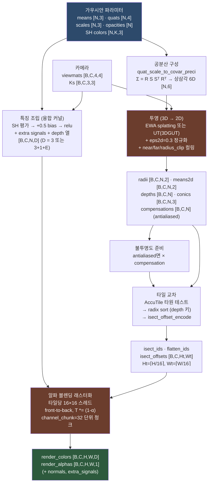
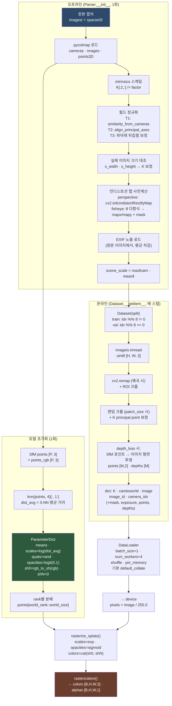
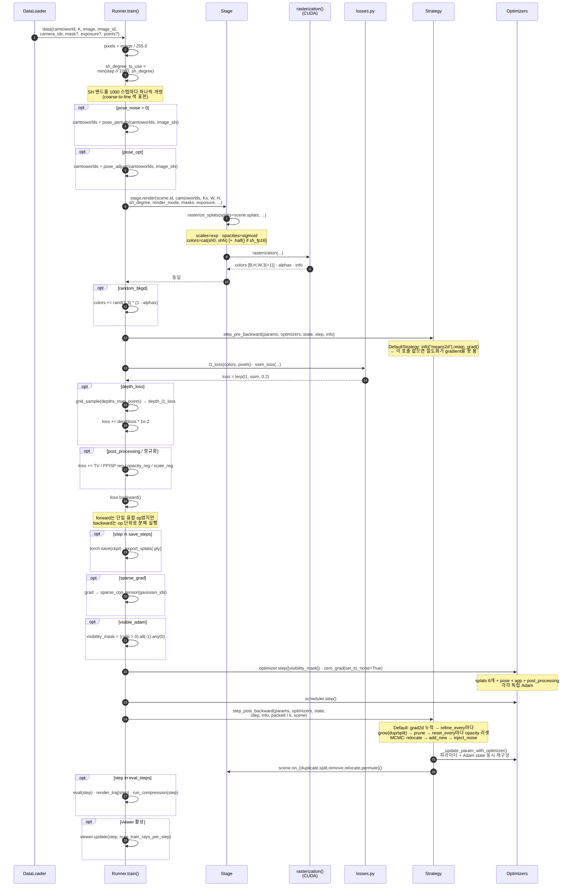

# gsplat ML 심층 분석

> ML 스택 감지 결과: `torch>=2.7` (163개 파일에서 import), **Lightning/HF Transformers/Hydra/wandb 미사용**.
> 설정은 tyro + dataclass, 추적은 TensorBoard + viser.
> Python 파일 292개, `configs/` 디렉토리 없음(설정이 코드 안에 있음).

## ⚠️ 먼저: 이 프로젝트는 일반적인 ML 프로젝트가 아니다

이 분석 템플릿이 전제하는 "backbone/neck/head + Dataset/DataLoader + Trainer" 구조가 gsplat에는 **부분적으로만** 적용된다. 읽기 전에 아래 세 가지를 알아야 오해가 없다.

1. **학습되는 것은 신경망이 아니라 장면 자체다.**
   최적화 대상은 `torch.nn.ParameterDict` 하나 — N개 3D 가우시안의 위치·회전·스케일·불투명도·SH 계수다. 레이어도, 활성 함수도, 가중치 행렬도 없다. `nn.Module`을 상속한 "모델 클래스"가 존재하지 않는다.

2. **파라미터 개수가 학습 중에 변한다.**
   밀도화(densification)가 매 100 스텝마다 가우시안을 복제/분할/제거해 N을 바꾼다. Optimizer state도 그때마다 함께 재구성된다. 일반적인 ML에서 파라미터 shape가 고정인 것과 정반대다.

3. **일반화가 목표가 아니다 — 의도적 과적합이다.**
   한 장면당 하나의 모델을 30,000 스텝 학습시켜 그 장면의 학습 뷰에 최대한 맞춘다. train/val 분리는 "8장마다 1장"이라는 뷰 홀드아웃일 뿐이고, 사전학습 가중치도 전이학습도 없다. 유일한 사전학습 가중치는 **평가 지표용 LPIPS 네트워크**(AlexNet/VGG)다.

4. **패키지 본체는 커널 라이브러리이고, 학습 코드는 `examples/`에 있다.**
   `pip install gsplat`으로 얻는 것은 미분 가능한 래스터라이저이며, 트레이너는 참조 구현으로만 제공된다. 아래 Phase 4는 `examples/simple_trainer.py`를 분석한 것이지 라이브러리 API가 아니다.

**진짜 신경망은 세 곳에만 있다** — 모두 선택적 부가 모듈이다:
`AppearanceOptModule`(2층 MLP), `contrib/dynamic`의 `HexPlaneField` + `DeformNetwork`(G-SHARP), `examples/lib_bilagrid.py`의 `BilateralGrid`.

---

## Phase 1: 프로젝트 개요

### 과제 유형

| 축 | 분류 |
|---|---|
| 도메인 | 3D 컴퓨터 비전 / 미분 가능 렌더링 (inverse rendering) |
| 태스크 | Novel-View Synthesis (신규 시점 합성), 3D 장면 재구성 |
| 학습 방식 | Per-scene 최적화 (self-supervised photometric reconstruction) |
| 감독 신호 | 학습 이미지 자체 (레이블 없음). 선택적 sparse depth, LiDAR 거리/강도 |
| 출력 | 명시적 3D 표현 (가우시안 집합) → 임의 시점 RGB/depth 렌더 |
| 부수 태스크 | 카메라 포즈 정제, appearance/노출 보정, LiDAR 시뮬레이션, 압축 |

전통적 분류(classification/detection/segmentation/generation/LLM/RL)에는 **어느 것도 해당하지 않는다**. 가장 가까운 것은 "generation"이지만 생성 모델이 아니라 결정론적 최적화다.

### 기술 스택

| 계층 | 구성 |
|---|---|
| 프레임워크 | PyTorch ≥2.7. `torch.library.register_autograd` / `TORCH_LIBRARY` custom op |
| CUDA | 12.6 / 12.8 / 13.2 검증. C++20. glm(submodule). Blackwell(sm_120)은 torch≥2.7 필요 |
| 커널 빌드 | setuptools + `torch.utils.cpp_extension` (AOT) 또는 JIT (`BUILD_NO_CUDA=1`) |
| 설정 | **tyro** (dataclass → CLI). Hydra/OmegaConf/yacs/argparse 아님 |
| 실험 추적 | **TensorBoard** (`SummaryWriter`) + JSON stats. wandb/mlflow 미사용 |
| 평가 지표 | **torchmetrics 1.8.2** — PSNR, SSIM, LPIPS(AlexNet 기본 / VGG 선택) |
| 데이터 I/O | pycolmap, opencv-python(undistort), imageio[ffmpeg], Pillow, piexif(EXIF 노출) |
| 시각화 | **viser** (실시간 브라우저 뷰어, 학습 중 라이브 렌더) |
| 타입 검증 | jaxtyping, typeguard |
| 선택적 | nerfacc(순수 torch 경로), scipy(LiDAR), PLAS + torchpq(PNG 압축), cupy(dev) |

`examples/requirements.txt`가 `torch==2.9.1` / `torchvision==0.24.1`로 **정확히 핀**하고 있다 — "torchvision이 PyPI 공개 torch를 끌어와 내부 빌드를 덮어쓰는 것을 막기 위함"이라는 주석이 붙어 있다.

### 구현 논문 / 방법론

이 저장소는 **여러 논문의 커널 구현을 한 곳에 모은 것**이다. 어떤 것이 켜지는지는 플래그로 결정된다.

| 논문 / 기법 | arXiv | 저장소 내 위치 | 활성화 방법 |
|---|---|---|---|
| **3D Gaussian Splatting** (기반) | [2308.04079](https://arxiv.org/abs/2308.04079) | 전체 | 기본 |
| **gsplat** (본 저장소 백서) | [2409.06765](https://arxiv.org/abs/2409.06765) | — | JMLR 26(34) |
| **AbsGS** (절대 gradient 프루닝) | [2404.10484](https://arxiv.org/abs/2404.10484) | `DefaultStrategy.absgrad` | `--absgrad --grow_grad2d 8e-4` |
| **3DGS as MCMC** | [2404.09591](https://arxiv.org/abs/2404.09591) | `MCMCStrategy` | `mcmc` 서브커맨드 |
| **Mip-Splatting** (antialiasing) | [niujinshuchong.github.io](https://niujinshuchong.github.io/mip-splatting/) | `rasterize_mode="antialiased"` | `--antialiased` |
| **3DGUT** (NVIDIA, Unscented Transform) | [research.nvidia.com](https://research.nvidia.com/labs/toronto-ai/3DGUT/) | `with_ut` + `with_eval3d` | `--with_ut --with_eval3d` |
| **2DGS** (2D Gaussian Splatting) | — | `rasterization_2dgs()` | `simple_trainer_2dgs.py` |
| **Scaling Up 3DGS Training** (분산) | [2406.18533](https://arxiv.org/abs/2406.18533) | Seam A/B 분산 렌더 | `--distributed` |
| **Revised densification** | [2404.06109](https://arxiv.org/abs/2404.06109) | `revised_opacity` | `--strategy.revised-opacity` |
| **Taming 3DGS** (SelectiveAdam) | — | `optimizers/selective_adam.py` | `--visible_adam` |
| **HiGS** (계층 타일 추론) | [research.nvidia.com](https://research.nvidia.com/labs/sil/projects/higs/) | `experimental/` | `render_scene()` |
| **PPISP** (per-pixel ISP) | [research.nvidia.com](https://research.nvidia.com/labs/sil/projects/ppisp/) | `--post_processing ppisp` | 외부 `ppisp` 패키지 |
| **Bilateral Guided 3DGS** | — | `lib_bilagrid.py` | `--post_processing bilateral_grid` |
| **G-SHARP** (동적 수술 씬) | — | `contrib/dynamic/` | `dynamic_surgical_trainer.py` |
| **AccuTile** (타원 타일 교차) | [PR #927](https://github.com/nerfstudio-project/gsplat/pull/927) | `IntersectTile.cu` | 기본 활성 |

### ML 관점 디렉토리 역할

```
gsplat/                       # ★ 라이브러리: 미분 가능 렌더러 (학습 코드 아님)
├── rendering.py              #   forward 렌더 = "모델의 forward()"에 해당
├── cuda/                     #   커널 + 참조 PyTorch 구현 쌍
├── losses.py                 #   40+ 손실/정규화 함수 (photometric, depth, LiDAR)
├── losses_fused.py           #   CUDA 융합 손실 (FusedGaussianLosses, nn.Module)
├── strategy/                 #   ★ 밀도화 = gsplat 고유의 "옵티마이저 확장"
├── optimizers/               #   SelectiveAdam (가시 가우시안만 갱신)
├── training/schedulers.py    #   TwoStageScheduler (coarse→fine)
├── init_utils.py             #   knn_scale_init, multi_frame_depth_unprojection
├── regularizers.py           #   occlusion 등 정규화
├── compression/              #   학습 후 splat 압축 (PLAS + PQ + PNG)
├── exporter.py               #   .ply 내보내기
└── contrib/dynamic/          #   ★ 진짜 신경망: HexPlaneField + DeformNetwork

examples/                     # ★ 학습 코드 전체가 여기
├── simple_trainer.py         #   표준 트레이너 (Config + Runner)
├── simple_trainer_2dgs.py    #   2DGS 변형
├── av_trainer.py             #   자율주행 멀티센서 (카메라 + LiDAR)
├── dynamic_surgical_trainer.py #  G-SHARP 4D 동적 씬
├── datasets/                 #   Parser + Dataset (COLMAP / NCore v4 / EndoNeRF)
│   ├── colmap.py             #     Parser(SfM 로드·정규화·언디스토션) + Dataset
│   ├── normalize.py          #     similarity_from_cameras, align_principal_axes
│   └── traj.py               #     평가용 카메라 궤적 생성 (spiral/ellipse/interp)
├── utils.py                  #   CameraOptModule, AppearanceOptModule, knn, set_random_seed
├── lib_bilagrid.py           #   BilateralGrid (nn.Module)
├── benchmarks/*.sh           #   재현 스크립트 (basic / mcmc / 4gpus / 3dgut / fisheye)
└── simple_viewer*.py         #   viser 기반 추론 뷰어
```

---

## Phase 2: "모델" 아키텍처

### 2.1 학습 대상 파라미터 (모델 정의에 해당)

`nn.Module`이 아니라 `ParameterDict`다. [examples/simple_trainer.py:288](examples/simple_trainer.py#L288) `create_splats_with_optimizers()`가 생성한다.

| 파라미터 | shape | 활성 함수 | 초기화 | 기본 LR |
|---|---|---|---|---|
| `means` | `[N, 3]` | 없음 (raw 3D 좌표) | SfM 포인트 클라우드 (또는 random / LiDAR) | `1.6e-4 × scene_scale` |
| `scales` | `[N, 3]` | `exp()` | `log(dist_avg × init_scale)`, dist_avg = 3-NN 평균 거리 | `5e-3` |
| `quats` | `[N, 4]` | 커널 내부 정규화 | `torch.rand((N,4))` ⚠️ | `1e-3` |
| `opacities` | `[N]` | `sigmoid()` | `logit(init_opa=0.1)` | `5e-2` |
| `sh0` | `[N, 1, 3]` | SH 평가 + `+0.5` + relu | `rgb_to_sh(SfM 포인트 색)` | `2.5e-3` |
| `shN` | `[N, K-1, 3]` | 동일 | `0` | `2.5e-3/20 = 1.25e-4` |

`K = (sh_degree+1)² = 16` (sh_degree=3 기본).

**파라미터 규모** (garden 장면, sh_degree=3 기준):
- 가우시안당: 3(means) + 3(scales) + 4(quats) + 1(opacity) + 16×3(SH) = **59개 float**
- 초기 N ≈ 140K (SfM) → 학습 후 N ≈ 2~4.5M (DefaultStrategy) 또는 정확히 1M (MCMC `cap_max`)
- 3M 가우시안 → **약 177M 파라미터** (fp32로 ~708MB). Adam state 2배 포함 시 ~2.1GB
- **사전학습 가중치 없음.** SfM 초기화가 유일한 "prior"

⚠️ **`quats` 초기화가 `torch.rand`(즉 `[0,1)` 균등)이다.** 균등 회전 분포가 아니라 4차원 양의 사분면에 치우친 분포다. 첫 스텝에 커널이 정규화하고 최적화가 금방 자유롭게 움직이므로 실전에서 문제가 관측되지 않았지만, 수학적으로는 편향된 초기화다.

### 2.2 forward 흐름 (shape 주석 포함)

`rasterize_splats()` → `rasterization()` → 단일 C++ op. 텐서 변환 경로:

```
[학습 파라미터]                         [렌더 입력]                    [출력]
means      [N, 3]      ─────────────→   means      [N, 3]
scales     [N, 3]      ── exp() ────→   scales     [N, 3]
quats      [N, 4]      ─────────────→   quats      [N, 4]   (커널 내부 정규화)
opacities  [N]         ── sigmoid ──→   opacities  [N]
sh0 [N,1,3] + shN [N,15,3] ─ cat(1) →   colors     [N, 16, 3]
camtoworld [B, 4, 4]   ── inverse ──→   viewmats   [B, 4, 4]
K          [B, 3, 3]   ─────────────→   Ks         [B, 3, 3]
                                              │
                                              ▼
                                   rasterization(..., sh_degree=d)
                                              │
                              render_colors  [B, H, W, 3]  (또는 +1 depth 채널)
                              render_alphas  [B, H, W, 1]
                              meta           dict (means2d, radii, gaussian_ids, ...)
```

C++ 내부 파이프라인 (각 단계의 텐서 shape):



**"레이어"가 아니라 "렌더 스테이지"다.** backbone/neck/head 개념이 없고, 대신 projection → intersection → rasterization의 3단 그래픽스 파이프라인이 미분 가능하게 구현되어 있다.

### 2.3 커스텀 연산 / CUDA 커널

이것이 이 프로젝트의 실질적 본체다 (56K LOC).

| 커널 그룹 | 역할 | 주요 파일 |
|---|---|---|
| **Projection** | 3D 가우시안 → 2D 화면 공간. EWA splatting / UT(3DGUT) / 2DGS ray-splat | `ProjectionEWA3DGS{Fused,Packed}.cu`, `ProjectionUT3DGSFused.cu`, `Projection2DGS*.cu` |
| **Intersection** | 가우시안-타일 교차 + radix sort. AccuTile 보수적 타원 테스트 | `IntersectTile.cu`, `IntersectTileLidar.cu`, `IntersectTileSparse.cu` |
| **Rasterization** | 타일별 알파 블렌딩. Serial/Parallel batch × Fwd/Bwd | `RasterizeToPixels3DGSSerialBatch{Fwd,Bwd}.cu`, `RasterizeToPixelsFromWorld3DGSParallelBatch{Fwd,Bwd}.cu` |
| **Spherical Harmonics** | SH → RGB. v1.6.0에서 L0(diffuse)/L1+(view-dep) 분리, fp16 지원 | `SphericalHarmonicsCUDA.cu`, `SphericalHarmonicsL1PlusCUDA.cu`, `SphericalHarmonicsViewDirectionCUDA.cu` |
| **Camera models** | pinhole / ortho / fisheye / ftheta + OpenCV 왜곡 + 윈드실드 왜곡 | `sensors/kernels/cuda/csrc/*_kernel{,_backward}.cu` (13K LOC) |
| **Query ops** | 픽셀별 기여 가우시안 ID / 개수 / top-k | `RasterizeContributingGaussianIds.cu`, `RasterizeTopContributingGaussianIds.cu` |
| **Optimizer** | 융합 Adam (`adam`), SelectiveAdam | `AdamCUDA.cu` |
| **MCMC** | 네이티브 noise injection (`inject_noise`) | `MCMCPerturbCUDA.cu` |
| **Relocation** | MCMC 재배치 (이항계수 기반 opacity/scale 보정) | `RelocationCUDA.cu` |
| **Losses** | 융합 가우시안 정규화 손실 | `GaussianLossesCUDA.cu` |
| **Geometry** | SE(3) pose 합성/보간, quaternion 연산 | `geometry/kernels/cuda/csrc/{pose,quaternion}.cu` |
| **Inference (HiGS)** | fp16 macro-tile 융합 래스터화 (gradient 없음) | `experimental/.../gaussian_inference/*.cu` |

**모든 주요 커널이 `gsplat/cuda/_torch_impl*.py`에 순수 PyTorch 쌍둥이를 가진다.** 이것이 커널 검증의 기반이며(1,322개 테스트), 새 커널을 디버깅할 때 첫 번째 도구다.

### 2.4 부가 신경망 (선택적)

**`CameraOptModule`** ([examples/utils.py:27](examples/utils.py#L27)) — 카메라 포즈 정제
```
nn.Embedding(n_images, 9) → split → dx [3] + drot [6]
                                     └→ rotation_6d_to_matrix → R [3,3]
camtoworld_new = camtoworld @ [[R, dx], [0, 1]]
```
6D 회전 표현(Zhou et al.)을 쓰고 `zero_init()`으로 항등 시작. 파라미터: `9 × n_images` (garden 161장 → 1,449개).

**`AppearanceOptModule`** ([examples/utils.py:66](examples/utils.py#L66)) — 이미지별 외관 보정
```
embeds = nn.Embedding(n_images, 16)              → [C, 16]
features (학습 파라미터)                          → [C, N, 32]
sh_bases = _eval_sh_bases_fast(K, normalize(dirs)) → [C, N, 16]
cat → [C, N, 64] → Linear(64→64) ReLU → Linear(64→64) ReLU → Linear(64→3)
colors = sigmoid(mlp_out + splats["colors"])
```
마지막 층을 `zeros_`로 초기화해 초기 출력이 0(= 보정 없음). `app_opt=True`면 `sh0`/`shN` 대신 `features [N,32]` + `colors [N,3]`을 학습한다. **`sh_degree`와 상호 배타적 경로**임에 주의.

**`HexPlaneField` + `DeformNetwork`** ([gsplat/contrib/dynamic/](gsplat/contrib/dynamic/)) — G-SHARP 4D 동적 씬
```
HexPlaneField: (x,y,z,t) 4D 좌표
  → 6개 2D 평면 (xy, xz, xt, yz, yt, zt) 각각 bilinear grid_sample
  → 스케일별 element-wise 곱
  → multires (1, 2) 스케일 concat
  → plane_features [N, 32 × 2 = 64]
  grid 해상도: [64, 64, 64, 25] (공간만 multires 배율, 시간축 고정)

DeformNetwork: plane_features [N, 64]
  → Linear(64→64) ReLU × 3 (trunk)
  → 3-way head: pos_head(→3), quat_head(→4), opacity_head(→1)
  → means += Δ, quats += Δ, opacities += Δ
  세 head 모두 zeros_ 초기화 → 초기 상태가 항등 변형
  (테스트 `test_deform_net_zero_init_is_identity`가 이를 고정)
```
HexPlane 파라미터: 6 planes × 32 features × (64×64 등 해상도) × 2 scales ≈ **수백만 개**. 이것이 이 저장소에서 가장 "전통적 ML"에 가까운 부분이다.

**`BilateralGrid`** ([examples/lib_bilagrid.py:177](examples/lib_bilagrid.py#L177)) — 학습 뷰 색 보정. 격자 shape `(16, 16, 8)` 기본. TV 정규화 `10 × total_variation_loss`.

---

## Phase 3: 데이터 파이프라인

### 3.1 데이터 소스

| 백엔드 | 포맷 | Parser | 다운로드 |
|---|---|---|---|
| **COLMAP** (기본) | `sparse/0/` (cameras/images/points3D) + `images*/` | [colmap.py:120](examples/datasets/colmap.py#L120) `Parser` | `python examples/datasets/download_dataset.py` (Mip-NeRF 360) |
| **NCore v4** | 메타 JSON + 멀티센서 (카메라 + LiDAR/radar) | [ncore.py](examples/datasets/ncore.py) `NCoreParser` (1,140행) | `python examples/download_ncore.py` |
| **EndoNeRF** | 수술 내시경 스테레오 + depth + mask | [endonerf.py](examples/datasets/endonerf.py) | 수동 |
| **3DGS paper scenes** | COLMAP | 동일 | `python examples/download_3dgs_paper_scenes.py` |
| **PandaSet** (AV) | — | `examples/prepare_pandaset.py` | 수동 |

**레이블이 없다.** 감독 신호는 학습 이미지 픽셀 자체다 (self-supervised photometric).

### 3.2 Parser: 오프라인 전처리 (한 번만 실행)

COLMAP `Parser.__init__`이 하는 일 — 이게 실질적 데이터 준비 단계다:

1. **pycolmap 로드** — `cameras`, `images`, `points3D` 읽고 world-to-camera 행렬 추출
2. **intrinsics 스케일** — `K[:2,:] /= factor` (다운샘플 반영)
3. **월드 공간 정규화** (`normalize=True`, 기본 on) — 세 단계:
   - `similarity_from_cameras()` → T1 (카메라 분포 기반 유사변환, `center_method="focus"`)
   - `align_principal_axes()` → T2 (포인트 클라우드 주축 정렬)
   - **위아래 뒤집힘 보정** → T3: `median(z) > mean(z)`이면 x축 180° 회전. "이미지에 바닥이 보이면 아래쪽에 점이 더 많다"는 휴리스틱 ⚠️
   - `transform = T3 @ T2 @ T1`
4. **실제 이미지 크기 대조** — 첫 이미지를 읽어 COLMAP intrinsics와 비율 차이(`s_width`, `s_height`)를 K에 반영. Tanks&Temples가 2x 업샘플 intrinsics를 저장하는 문제 대응
5. **언디스토션 맵 사전계산**:
   - perspective: `cv2.getOptimalNewCameraMatrix` + `cv2.initUndistortRectifyMap`
   - fisheye: `theta` 다항식 `1 + k1θ² + k2θ⁴ + k3θ⁶ + k4θ⁸`로 mapx/mapy 직접 계산 + 유효 영역 mask + ROI 크롭
6. **EXIF 노출 로드** (`load_exposure=True`, 기본 on) — **원본(비다운샘플) 이미지**에서 읽음(PNG는 EXIF 미지원). 전체 평균을 빼서 상대 EV로 변환
7. **카메라 인덱스 재매핑** — COLMAP camera_id → 0-based 연속 인덱스 (임베딩용)
8. **`scene_scale` 계산** — `max(‖camera_pos - mean(camera_pos)‖)`. 트레이너가 `× 1.1 × global_scale`로 조정해 LR 스케일링과 밀도화 임계값에 사용

### 3.3 Dataset: 온라인 로딩

[colmap.py:443](examples/datasets/colmap.py#L443). **transform 체인이 거의 없다** — Albumentations도 torchvision transforms도 쓰지 않는다.

```
__getitem__(item):
  1. imageio.imread(path)[..., :3]              # uint8 [H, W, 3]
  2. (왜곡 있으면) cv2.remap(image, mapx, mapy) # 언디스토션
     + roi 크롭
  3. (patch_size 지정 시) 랜덤 크롭 + K의 principal point 보정
  4. torch.from_numpy(...).float()              # [H, W, 3], 값 범위 0~255
```

증강이 **랜덤 크롭 하나뿐**이며 그것도 `patch_size` 지정 시에만(기본 None). 이유는 명확하다 — 특정 장면에 과적합하는 것이 목표이므로 증강은 오히려 해롭다. 플립/회전/색상 변화는 카메라 포즈-이미지 대응을 깨뜨린다.

**train/val 분리** ([colmap.py:456](examples/datasets/colmap.py#L456)):
```python
train: indices[indices % test_every != 0]   # test_every=8 → 87.5%
val:   indices[indices % test_every == 0]   # → 12.5%
```
결정론적 stride 분할. 랜덤 셔플 없음 → 재현 가능하지만, 캡처 순서와 stride가 상관되면 편향될 수 있다.

### 3.4 배치 구성

| 항목 | 값 |
|---|---|
| collate_fn | **커스텀 없음** (PyTorch 기본 `default_collate`) |
| train batch_size | `1` (기본) |
| val batch_size | `1` (고정) |
| num_workers | train `4` (persistent, pin_memory), val `1` |
| shuffle | train `True`, val `False` |
| 패딩/마스킹 | 없음 (배치 내 이미지 크기 동일 가정) |

⚠️ **기본 collate는 배치 내 모든 이미지가 같은 shape이어야 한다.** 카메라가 여러 개(해상도가 다를 수 있음)면 트레이너가 `batch_size != 1`을 명시적으로 거부한다 ([simple_trainer.py:463](examples/simple_trainer.py#L463)). PPISP 후처리도 `batch_size=1` 강제.

배치 딕셔너리 키:
```python
{
  "K":          [B, 3, 3]    float   # 언디스토트된 intrinsics
  "camtoworld": [B, 4, 4]    float
  "image":      [B, H, W, 3] float   # 0~255 (트레이너에서 /255.0)
  "image_id":   [B]          int     # dataset 내 인덱스 (임베딩 키)
  "camera_idx": [B]          int     # 0-based 연속 카메라 인덱스
  "mask":       [B, H, W]    bool    # 선택 (fisheye ROI, ego 차량 등)
  "exposure":   [B]          float   # 선택 (상대 EV)
  "points":     [B, M, 2]    float   # depth_loss=True 시
  "depths":     [B, M]       float   # depth_loss=True 시
}
```

`depth_loss=True`면 `__getitem__`이 SfM 포인트를 해당 이미지 평면에 투영해 sparse depth 감독을 만든다 — 별도 depth 센서 없이 COLMAP 재구성만으로.

### 3.5 데이터 흐름 플로우차트



---

## Phase 4: 학습 루프

분석 대상: [examples/simple_trainer.py](examples/simple_trainer.py) `Runner.train()`. **Lightning도 HF Trainer도 아닌 완전 수동 루프**다.

### 4.1 Optimizer / Scheduler

**파라미터별 독립 Adam** — `strategy.check_sanity()`가 "파라미터 1개당 optimizer 1개, param_group 정확히 1개"를 강제한다. 밀도화가 파라미터와 optimizer state를 짝지어 재구성해야 하기 때문이다.

```python
optimizer_class = SparseAdam if sparse_grad else SelectiveAdam if visible_adam else Adam

BS = batch_size * world_size
optimizers[name] = optimizer_class(
    [{"params": splats[name], "lr": lr * math.sqrt(BS), "name": name}],
    eps  = 1e-15 / math.sqrt(BS),
    betas= (1 - BS*(1-0.9), 1 - BS*(1-0.999)),   # ⚠️ BS>10에서 betas[0] ≤ 0
    fused= True,
)
```

**배치 크기 스케일링 규칙**: LR은 `√BS`배, eps는 `/√BS`, betas는 `1-BS(1-β)`. 근거로 [SDE scaling rules](https://www.cs.princeton.edu/~smalladi/blog/2024/01/22/SDEs-ScalingRules/)와 [arXiv:2402.18824](https://arxiv.org/pdf/2402.18824v1)를 인용하며, "정확히 등가는 아니다"라고 명시한다.

⚠️ **`BS > 10`에서 `betas[0] = 1 - 10×0.1 = 0`이 되고 그 이상에서는 음수.** 코드에 `TODO: check betas logic when BS is larger than 10` 주석이 있다. 4 GPU × batch_size 1 = BS 4는 안전하지만, batch_size 3 이상 × 4 GPU는 위험하다.

**Scheduler** — `means`에만 걸린다:
```python
ExponentialLR(optimizers["means"], gamma=0.01 ** (1/max_steps))
# 30,000 스텝에 걸쳐 초기값의 1%까지 지수 감쇠
```
- `pose_opt`: 동일한 `ExponentialLR`
- `bilateral_grid`: `ChainedScheduler([LinearLR(0.01→1, 1000 iters), ExponentialLR])` — warmup 있음
- `ppisp`: `post_processing_module.create_schedulers()`가 자체 스케줄 제공
- **`scales`/`quats`/`opacities`/`sh0`/`shN`은 상수 LR** (스케줄 없음)

부가 모듈 optimizer:
| 모듈 | LR | weight_decay |
|---|---|---|
| `pose_adjust` | `1e-5 × √BS` | `1e-6` |
| `app_module.embeds` | `1e-3 × √BS × 10` | `1e-6` |
| `app_module.color_head` | `1e-3 × √BS` (별도 그룹) | `1e-6` |

### 4.2 Loss 함수

```python
# 1. Photometric (필수)
l1loss  = l1_loss(colors, pixels).mean()                              # masks면 colors[masks]
ssimloss = ssim_loss(colors.permute(0,3,1,2), pixels.permute(0,3,1,2))
loss = torch.lerp(l1loss, ssimloss, ssim_lambda)   # = (1-λ)·L1 + λ·SSIM, λ=0.2

# 2. Depth (선택, depth_loss=True)
depths = F.grid_sample(depths_map, normalized_points)   # sparse 포인트에서 샘플
depthloss = depth_l1_loss(depths, depths_gt, scene_scale)   # disparity 공간
loss += depthloss * depth_lambda                            # λ=1e-2

# 3. 후처리 정규화 (선택)
loss += 10 * total_variation_loss(bilateral_grid.grids)     # bilateral_grid
loss += ppisp_module.get_regularization_loss()              # ppisp

# 4. 가우시안 정규화 (선택)
loss += opacity_reg * opacity_reg_loss(splats["opacities"])  # mcmc 프리셋: 0.01
loss += scale_reg   * scale_reg_loss(splats["scales"])       # mcmc 프리셋: 0.01
```

**mask 처리의 미묘한 차이**: L1은 `colors[masks]`로 마스크 픽셀을 **제외**하지만, SSIM은 패치 기반이라 제외할 수 없어 양쪽을 0으로 **곱한다**. 주석에 이유가 명시되어 있다 — "마스크된 패치가 색을 임의 값으로 끌어당기지 않도록".

프리셋별 손실 가중치:

| 항 | `default` | `mcmc` |
|---|---|---|
| `ssim_lambda` | 0.2 | 0.2 |
| `opacity_reg` | 0.0 | **0.01** |
| `scale_reg` | 0.0 | **0.01** |
| `init_opa` | 0.1 | **0.5** |
| `init_scale` | 1.0 | **0.1** |

라이브러리 `gsplat/losses.py`는 40개 이상의 손실을 제공한다(LiDAR distance/intensity/raydrop/background, Pearson depth, binocular disparity, masked L1/SSIM, huber, BCE, normal cosine 등). 트레이너가 쓰는 것은 그중 일부다.

### 4.3 학습 기법 — 없는 것들

| 기법 | 사용 여부 |
|---|---|
| AMP / mixed precision (`autocast`, `GradScaler`) | ❌ **미사용** |
| Gradient accumulation | ❌ 미사용 |
| Gradient clipping | ❌ 미사용 |
| EMA (weight averaging) | ❌ 미사용 |
| Learning rate warmup | 부분 (bilateral_grid만) |
| Dropout / BatchNorm / LayerNorm | ❌ 없음 (신경망이 거의 없으므로) |

**AMP를 쓰지 않는 것은 의도적으로 보인다.** 대신 선택적 fp16 경로가 두 곳에 있다:
- `sh_fp16: bool = False` — SH 계수만 fp16으로 캐스트해 커널에 넣음. **파라미터와 Adam state는 fp32 유지**
- `experimental/` HiGS — 추론 전용 fp16 패킹

즉 "손실 스케일링이 필요한 전체 AMP" 대신 "커널 단위 정밀도 선택"을 택했다. 알파 블렌딩 누적의 수치 안정성 때문일 가능성이 높다.

**gsplat 고유 기법 — 밀도화가 사실상 "학습 기법"의 자리를 차지한다:**

| DefaultStrategy 파라미터 | 기본값 | 의미 |
|---|---|---|
| `prune_opa` | 0.005 | 이보다 불투명도 낮으면 제거 |
| `grow_grad2d` | 0.0002 | 이보다 화면 gradient 크면 복제/분할 (absgrad 시 8e-4 권장) |
| `grow_scale3d` | 0.01 | scene_scale 정규화 3D 크기. 이하면 duplicate, 이상이면 split |
| `grow_scale2d` | 0.05 | 이미지 정규화 2D 크기. 이상이면 split |
| `prune_scale3d` | 0.1 | 이상이면 제거 |
| `prune_scale2d` | 0.15 | 이상이면 제거 |
| `refine_start_iter` | 500 | 밀도화 시작 |
| `refine_stop_iter` | 15,000 | 밀도화 종료 (max_steps의 절반) |
| `refine_every` | 100 | 밀도화 주기 |
| `reset_every` | 3,000 | 불투명도 리셋 주기 |
| `pause_refine_after_reset` | 0 | 리셋 후 일시정지 스텝. **학습 이미지 수로 설정 권장** |
| `absgrad` | False | AbsGS 절대 gradient 사용 |
| `revised_opacity` | False | arXiv:2404.06109 opacity 휴리스틱 |

| MCMCStrategy 파라미터 | 기본값 | 의미 |
|---|---|---|
| `cap_max` | 1,000,000 | **가우시안 개수 상한** (DefaultStrategy엔 상한 없음) |
| `noise_lr` | 5e5 | MCMC 샘플링 노이즈 LR |
| `refine_start_iter` / `refine_stop_iter` | 500 / 25,000 | |
| `noise_injection_stop_iter` | -1 (never) | 노이즈 주입 종료 |
| `min_opacity` | 0.005 | |
| `noise_opacity_t` / `_k` | 0.005 / 100 | 노이즈 억제 게이트의 전이점/급격도 |

`MCMCStrategy.initialize_state()`가 `binoms [51, 51]` 이항계수 테이블을 미리 만든다 — relocation 시 opacity/scale 보정에 쓰인다.

`Config.adjust_steps(steps_scaler)`가 `max_steps`뿐 아니라 **밀도화 스케줄까지 함께 스케일**한다. 4 GPU 학습에서 `--steps_scaler 0.25`를 쓰면 `refine_every`도 100→25가 된다.

### 4.4 분산 학습

| 항목 | 구현 |
|---|---|
| 방식 | **커스텀 데이터/모델 하이브리드 병렬** (DDP가 아니다) |
| 가우시안 분배 | `points[world_rank::world_size]` — stride 분할, 각 rank가 부분집합 소유 |
| 렌더 협업 | C++ Seam A(카메라 all-gather) / Seam B(가우시안 all-to-all scatter) |
| backend | NCCL |
| DDP 사용처 | **부가 모듈만** (`pose_adjust`, `pose_perturb`, `app_module`) |
| 런처 | [gsplat/distributed.py:319](gsplat/distributed.py#L319) `cli()` — `CUDA_VISIBLE_DEVICES`로 GPU 수 자동 감지 |
| 멀티 노드 | `OMPI_COMM_WORLD_*` 환경변수 감지 (OpenMPI) |
| FSDP / DeepSpeed | ❌ 미사용 (모델이 신경망이 아니므로 무의미) |

논문 [On Scaling Up 3D Gaussian Splatting Training](https://arxiv.org/abs/2406.18533) 구현. 각 rank가 가우시안 부분집합을 갖고, 렌더 시 통신으로 협업한다. `--packed`가 rank 간 전송량을 줄여 더 빠르다(4gpus 벤치마크가 이를 권장).

제약:
- 카메라 수는 rank마다 **동일해야** 한다 (강제)
- 가우시안 수는 균등할 필요 없지만 균형이 성능에 유리 (권장, 미강제)
- `post_processing`(bilateral_grid/ppisp)은 **단일 GPU만** — `world_size > 1`에서 명시적 에러
- viewer는 분산 학습 시 자동 비활성

`distributed=True`가 `world_size=1`에서도 그대로 실행되어 gather/scatter가 항등이 된다 — 멀티 GPU 없이 분산 경로를 테스트할 수 있다.

### 4.5 체크포인트

| 항목 | 값 |
|---|---|
| 저장 시점 | `save_steps = [7000, 30000]` + 항상 `max_steps - 1` |
| 위치 | `{result_dir}/ckpts/ckpt_{step}_rank{world_rank}.pt` |
| 내용 | `step`, `scene_id`, `splats.state_dict()` (+ `pose_adjust`, `app_module`, `post_processing`) |
| `.ply` 내보내기 | `save_ply=True` 시 `ply_steps`에 `{result_dir}/ply/point_cloud_{step}.ply` |
| stats | `{result_dir}/stats/train_step{step:04d}_rank{rank}.json` (mem, ellipse_time, num_GS) |
| **resume** | ❌ **학습 재개 미지원** |

⚠️ **`--ckpt`는 resume이 아니라 "평가 전용 모드"다.** [main():1531](examples/simple_trainer.py#L1531)에서 체크포인트를 주면 학습을 완전히 건너뛰고 `eval()` + `render_traj()` + `run_compression()`만 실행한다. optimizer state / scheduler state / strategy state를 저장하지 않으므로 중단된 학습을 이어갈 방법이 없다. 30,000 스텝이 30분~2시간이라 실용상 큰 문제는 아니지만 장시간 실험에서는 제약이다.

멀티 GPU 평가 시 rank별 체크포인트를 `torch.cat`으로 합친다:
```python
for k in runner.splats.keys():
    runner.splats[k].data = torch.cat([ckpt["splats"][k] for ckpt in ckpts])
```

### 4.6 평가 루프

| 항목 | 값 |
|---|---|
| 주기 | `eval_steps = [7000, 30000]` (`--eval_steps -1`로 비활성) |
| 지표 | **PSNR**, **SSIM**, **LPIPS** (torchmetrics, `data_range=1.0`) |
| LPIPS 네트워크 | `alex` 기본 / `vgg` 선택 (`--lpips_net`) ← **유일한 사전학습 가중치** |
| 색 보정 지표 | `use_color_correction_metric=True` 시 `cc_psnr`/`cc_ssim`/`cc_lpips` (affine 또는 quadratic 보정 후) |
| 속도 지표 | `ellipse_time` = 이미지당 렌더 시간 (`torch.cuda.synchronize()` 전후 측정) |
| 규모 지표 | `num_GS` = 최종 가우시안 개수 |
| 출력 | `{render_dir}/{stage}_step{step}_{i:04d}.png` (GT ‖ 렌더 나란히), `{stats_dir}/{stage}_step{step:04d}.json`, TensorBoard |
| **best model 선정** | ❌ **없음** |

⚠️ **best model 선정 로직이 존재하지 않는다.** 검증 지표로 체크포인트를 고르지 않고, 정해진 스텝의 산출물을 그대로 쓴다. Early stopping도 없다. per-scene 과적합이 목표이므로 "검증 성능으로 모델 선택"이라는 개념 자체가 약하지만, 그럼에도 30k 스텝이 항상 7k보다 나은지는 자동 검증되지 않는다.

궤적 렌더 (`render_traj`): `interp`(기본) / `ellipse` / `spiral` / `raw`. `traj.py`의 `generate_interpolated_path`, `generate_ellipse_path_{y,z}`, `generate_spiral_path`가 카메라 경로를 만들고 mp4로 저장한다.

### 4.7 한 학습 step의 실행 흐름



**주목할 순서**: `step_post_backward`가 `optimizer.step()` **뒤에** 호출된다. 즉 gradient로 파라미터를 갱신한 다음 밀도화가 일어난다. 주석에 "Run post-backward steps after backward and optimizer"라고 명시되어 있다.

---

## Phase 5: 설정 시스템

### 방식: tyro + dataclass

Hydra도 OmegaConf도 yacs도 argparse도 아니다. **`configs/` 디렉토리가 없고 설정이 Python dataclass 안에 산다.**

```python
# examples/simple_trainer.py:1560
configs = {
    "default": ("...원논문 densification...", Config(strategy=DefaultStrategy(verbose=True))),
    "mcmc":    ("...MCMC...",                 Config(init_opa=0.5, init_scale=0.1,
                                                     opacity_reg=0.01, scale_reg=0.01,
                                                     strategy=MCMCStrategy(verbose=True))),
}
cfg = tyro.extras.overridable_config_cli(configs)
cfg.adjust_steps(cfg.steps_scaler)
cli(main, cfg, verbose=True)   # gsplat.distributed.cli → DDP 런처
```

`Config`가 dataclass이고 `strategy` 필드가 `Union[DefaultStrategy, MCMCStrategy]`이므로, tyro가 **중첩 dataclass까지 CLI 플래그로 자동 노출**한다 — `--strategy.cap-max`, `--strategy.grow-grad2d` 등. Hydra 없이 계층 설정을 얻는 깔끔한 방법이다.

### 주요 하이퍼파라미터

| 카테고리 | 파라미터 | 기본값 |
|---|---|---|
| **데이터** | `data_type` | `"colmap"` (`"ncore"` 선택) |
| | `data_dir` | `"data/360_v2/garden"` ⚠️ 하드코딩 |
| | `data_factor` | `4` |
| | `test_every` | `8` |
| | `normalize_world_space` | `True` |
| | `patch_size` | `None` (랜덤 크롭 비활성) |
| | `load_exposure` | `True` |
| | `camera_model` | `"pinhole"` |
| **학습** | `max_steps` | `30_000` |
| | `batch_size` | `1` |
| | `steps_scaler` | `1.0` |
| | `eval_steps` / `save_steps` / `ply_steps` | `[7000, 30000]` |
| **초기화** | `init_type` | `"sfm"` (`random` / `lidar`) |
| | `init_num_pts` | `100_000` (random 시만) |
| | `init_extent` | `3.0` (random 시만) |
| | `init_opa` / `init_scale` | `0.1` / `1.0` |
| **SH** | `sh_degree` | `3` (K=16) |
| | `sh_degree_interval` | `1000` |
| | `sh_fp16` | `False` |
| **LR** | `means_lr` | `1.6e-4` (× scene_scale) |
| | `scales_lr` / `quats_lr` / `opacities_lr` | `5e-3` / `1e-3` / `5e-2` |
| | `sh0_lr` / `shN_lr` | `2.5e-3` / `1.25e-4` |
| **손실** | `ssim_lambda` | `0.2` |
| | `depth_lambda` | `1e-2` (`depth_loss=False` 기본) |
| | `opacity_reg` / `scale_reg` | `0.0` / `0.0` (mcmc는 0.01) |
| **렌더** | `near_plane` / `far_plane` | `0.01` / `1e10` |
| | `packed` | `False` (분산 시 `True` 권장) |
| | `antialiased` | `False` |
| | `random_bkgd` | `False` |
| | `with_ut` / `with_eval3d` | `False` / `False` (3DGUT는 둘 다 True) |
| **최적화 변형** | `sparse_grad` / `visible_adam` | `False` / `False` |
| **부가 모듈** | `pose_opt` / `app_opt` | `False` / `False` |
| | `post_processing` | `None` (`"bilateral_grid"` / `"ppisp"`) |
| **로깅** | `tb_every` | `100` |
| | `lpips_net` | `"alex"` |

### 설정 오버라이드 예시

```bash
# 서브커맨드 선택 (프리셋)
python examples/simple_trainer.py default --data_dir data/360_v2/garden
python examples/simple_trainer.py mcmc    --data_dir data/360_v2/garden

# 최상위 필드
python examples/simple_trainer.py default \
    --data_dir data/360_v2/bicycle --data_factor 4 \
    --result_dir results/bicycle --max_steps 30000 \
    --ssim_lambda 0.2 --means_lr 1.6e-4 --disable_viewer

# 중첩 dataclass (strategy) — tyro가 자동 노출
python examples/simple_trainer.py mcmc --strategy.cap-max 1000000
python examples/simple_trainer.py default \
    --absgrad --strategy.grow-grad2d 8e-4 \
    --strategy.refine-stop-iter 15000

# AbsGS 권장 조합 (EXPLORATION.md 기준: 메모리 절반, 품질 향상)
python examples/simple_trainer.py default --absgrad --strategy.grow-grad2d 8e-4

# 3DGUT
python examples/simple_trainer.py mcmc --with_ut --with_eval3d --camera_model fisheye

# 평가 전용 (학습 건너뜀)
python examples/simple_trainer.py default --ckpt results/garden/ckpts/ckpt_29999_rank0.pt

# 도움말로 전체 플래그 확인
python examples/simple_trainer.py default --help
```

### 환경 변수 의존성

| 변수 | 역할 |
|---|---|
| `CUDA_VISIBLE_DEVICES` | **GPU 수가 world_size를 결정** — `cli()`가 이것으로 프로세스를 띄운다 |
| `OMPI_COMM_WORLD_{RANK,SIZE,LOCAL_RANK}` | 멀티 노드 (OpenMPI) |
| `BUILD_NO_CUDA=1` | 설치 시 컴파일 생략 → JIT (CUDA 개발 시 권장) |
| `NUM_CHANNELS` | 커널 인스턴스화 채널 목록. 테스트: `1,3,4,6,8,21,23,24,32,128` |
| `BUILD_{2DGS,3DGS,3DGUT,ADAM,RELOC,LOSSES,CAMERA_WRAPPERS}` | 피처별 컴파일 아웃 |
| `DEBUG` / `FAST_MATH` / `VERBOSE` / `MAX_JOBS` | 빌드 진단 |
| `GSPLAT_ENFORCE_CONTRACTS` | shape/dtype 계약 검증 강제 |
| `GSPLAT_INPUT_CAPTURE_RASTERIZATION` / `_DIR` | 렌더 입력 덤프 (프로파일 리플레이용) |
| `GSPLAT_MCMC_BACKEND` | MCMC perturb 백엔드 (native CUDA vs PyTorch) |
| `HF_TOKEN` | 일부 데이터셋 다운로드 |

⚠️ **데이터 경로에 환경 변수를 쓰지 않는다.** `data_dir` 기본값이 `"data/360_v2/garden"` 상대 경로로 하드코딩되어 있고, 벤치마크 스크립트도 `SCENE_DIR="data/360_v2"`를 스크립트 안에 박아둔다. 데이터 위치가 다르면 매번 CLI로 넘겨야 한다.

---

## Phase 6: 실험 추적 및 재현성

### 로깅 도구

**TensorBoard만 쓴다.** wandb / mlflow / neptune / clearml / trackio 모두 미사용.

```python
self.writer = SummaryWriter(log_dir=f"{cfg.result_dir}/tb")
```

| 로깅 항목 | 주기 | 종류 |
|---|---|---|
| `train/loss`, `train/l1loss`, `train/ssimloss` | `tb_every=100` | scalar |
| `train/num_GS` | 100 | scalar — 밀도화 추적에 핵심 |
| `train/mem` (`max_memory_allocated`/GB) | 100 | scalar |
| `train/depthloss`, `train/post_processing_reg_loss` | 100 | scalar (활성 시) |
| `train/render` (GT ‖ 렌더 concat) | 100 | image (`tb_save_image=True` 시) |
| `val/{psnr,ssim,lpips,cc_*,ellipse_time,num_GS}` | `eval_steps` | scalar |
| tqdm 진행바 | 매 스텝 | `loss`, `sh degree`, `depth loss`, `pose err` |

추가 산출물:
- `{result_dir}/cfg.yml` — **실행 설정 전체를 yaml로 덤프** (재현성에 중요)
- `{result_dir}/stats/train_step{step:04d}_rank{rank}.json` — mem, ellipse_time, num_GS
- `{result_dir}/stats/{stage}_step{step:04d}.json` — 평가 지표
- `{result_dir}/renders/*.png`, `*.mp4` — 정성 결과
- `{result_dir}/ply/point_cloud_{step}.ply` — 뷰어용

**viser 실시간 뷰어**: 학습 중 브라우저(`localhost:8080`)에서 현재 상태를 인터랙티브 렌더한다. `viewer.lock`으로 학습 스텝과 렌더 요청을 직렬화하고, `num_train_rays_per_sec`를 뷰어에 표시한다. TensorBoard 스크린샷보다 훨씬 직관적인 디버깅 수단이다.

### 시드 고정

```python
# examples/utils.py:168
def set_random_seed(seed: int):
    random.seed(seed)
    np.random.seed(seed)
    torch.manual_seed(seed)

# Runner.__init__:387
set_random_seed(42 + local_rank)
```

| 항목 | 상태 |
|---|---|
| `random` / `numpy` / `torch` CPU | ✅ 고정 (42 + local_rank) |
| `torch.cuda.manual_seed_all` | ❌ **미호출** (`simple_trainer.py`) |
| `torch.backends.cudnn.deterministic` | ❌ 미설정 |
| `torch.use_deterministic_algorithms` | ❌ 미설정 |
| DataLoader `worker_init_fn` / `generator` | ❌ 미설정 (worker 4개) |
| CLI 노출 | ❌ **`seed`가 Config 필드가 아님** — 42 하드코딩 |

⚠️ `dynamic_surgical_trainer.py`는 더 낫다 — `seed: int = 42`를 Config 필드로 노출하고 `torch.cuda.manual_seed_all`까지 호출한다. `simple_trainer.py`가 이를 따르지 않는 것은 일관성 문제다.

**근본적으로 비트 단위 재현은 불가능하다**: 알파 블렌딩 래스터화가 원자적 부동소수점 누적을 쓰고 타일 내 스레드 실행 순서가 비결정적이다. `-use_fast_math`(기본 on)도 정확도를 희생한다. [conftest.py](conftest.py)가 GPU CI의 "marginal FP mismatch" 22건을 xfail로 관리하는 것이 이 현실의 증거다.

### 학습 실행 명령어

```bash
# ── 준비 ──
python -m pip install -e .                # 또는 BUILD_NO_CUDA=1 pip install -e ".[dev]"
python -m pip install -r examples/requirements.txt --no-build-isolation
python examples/datasets/download_dataset.py      # Mip-NeRF 360

# ── 단일 GPU ──
CUDA_VISIBLE_DEVICES=0 python examples/simple_trainer.py default \
    --data_dir data/360_v2/garden --data_factor 4 \
    --result_dir results/garden --disable_viewer

# 모듈 형태 (README 권장)
CUDA_VISIBLE_DEVICES=0 python -m examples.simple_trainer default

# ── 멀티 GPU (4장) ──
# CUDA_VISIBLE_DEVICES의 GPU 수가 곧 world_size.
# 실효 배치가 4배이므로 스텝을 1/4로 줄인다. --packed로 rank 간 전송량 감소.
CUDA_VISIBLE_DEVICES=0,1,2,3 python examples/simple_trainer.py default \
    --steps_scaler 0.25 --packed --eval_steps 30000 --disable_viewer \
    --data_dir data/360_v2/garden --result_dir results/garden_4gpu

# ── 멀티 노드 (OpenMPI) ──
mpirun -np 8 -H host1:4,host2:4 python examples/simple_trainer.py default ...

# ── 벤치마크 (7개 장면 일괄) ──
bash examples/benchmarks/basic.sh        # DefaultStrategy
bash examples/benchmarks/mcmc.sh         # MCMC, cap_max=1M
bash examples/benchmarks/basic_4gpus.sh  # 4 GPU
bash examples/benchmarks/basic_2dgs.sh   # 2DGS
```

### 추론 / 데모

```bash
# viser 실시간 뷰어 (학습된 .ply 또는 .pt 로드)
python examples/simple_viewer.py --ckpt results/garden/ckpts/ckpt_29999_rank0.pt
python examples/simple_viewer.py --ckpt ... --use_gaussian_render_inference_scene  # HiGS 경로
python examples/simple_viewer_3dgut.py --ckpt ...
python examples/simple_viewer_2dgs.py  --ckpt ...

# 평가 전용 (학습 건너뜀, 지표 + 궤적 비디오 + 압축)
python examples/simple_trainer.py default \
    --ckpt results/garden/ckpts/ckpt_29999_rank0.pt \
    --data_dir data/360_v2/garden --render_traj_path ellipse

# 라이브러리 직접 사용 (추론 경로)
python - <<'EOF'
from gsplat.experimental import render_scene, GaussianInferenceScene
scene = GaussianInferenceScene.from_gaussian_scene(gaussian_scene)
ret = render_scene(scene, camera=...)
EOF

# 프로파일링
python -m gsplat.profile
GSPLAT_INPUT_CAPTURE_RASTERIZATION=1 GSPLAT_INPUT_CAPTURE_DIR=/tmp/cap python <script>
```

### 재현성 기준선 (EXPLORATION.md)

| Garden 7k (TITAN RTX) | T(train) | T(render) | Memory | SSIM | PSNR | LPIPS | #GS |
|---|---|---|---|---|---|---|---|
| 기본 | 7m07s | 0.021s/im | 7.54 GB | 0.8332 | 26.29 | 0.123 | 4.46M |
| `--absgrad --grow_grad2d 8e-4` | 5m50s | 0.012s/im | **3.80 GB** | 0.8365 | 26.44 | 0.121 | 2.17M |
| 위 조합 (30k) | — | 0.013s/im | 4.04 GB | 0.8639 | 27.33 | 0.079 | 2.35M |
| `--antialiased` | 6m43s | 0.020s/im | 6.74 GB | 0.8265 | 26.13 | 0.137 | 3.99M |

**AbsGS가 메모리를 절반으로 줄이면서 지표를 개선한다.** 새 실험의 기본 조합으로 검토할 값어치가 있다. `--antialiased`는 in-distribution 지표를 약간 해치지만 학습 분포 밖 시점의 시각 품질을 개선한다고 문서가 밝힌다.

---

## Phase 7: 코드 품질 관찰

### 잘된 점

1. **참조 구현 쌍이 커널 검증을 지탱한다**
   모든 주요 CUDA 커널이 `cuda/_torch_impl*.py`에 순수 PyTorch 쌍둥이를 가진다. 1,322개 테스트가 "커널 == 참조 구현" 수치 비교로 성립한다. 커스텀 커널을 쓰는 ML 프로젝트라면 반드시 훔쳐올 패턴이다.

2. **설정 전체를 실행 디렉토리에 덤프한다**
   `{result_dir}/cfg.yml`에 `vars(cfg)`를 yaml로 저장. 어떤 하이퍼파라미터로 돌렸는지 사후 확인 가능. wandb 없이도 실험 추적의 최소선을 지킨다.

3. **`Config.adjust_steps()`가 밀도화 스케줄까지 함께 스케일한다**
   `--steps_scaler 0.25`가 `max_steps`만 줄이면 `refine_every=100`이 상대적으로 4배 드물어져 결과가 크게 달라진다. `refine_start_iter`/`refine_stop_iter`/`reset_every`/`refine_every`를 모두 함께 스케일해 이 함정을 막는다. 이런 종류의 "스케일 일관성"은 흔히 놓치는 부분이다.

4. **밀도화 계약을 `check_sanity()`로 강제한다**
   "학습 가능 파라미터 집합 == optimizer 키 집합", "optimizer마다 param_group 정확히 1개". 밀도화가 파라미터와 optimizer state를 짝지어 재구성해야 하므로 이 불변식이 깨지면 무성 버그가 된다. 학습 시작 전에 명시적으로 검증한다.

5. **mask 처리에서 손실 종류별 차이를 인지한다**
   L1은 픽셀 인덱싱으로 마스크를 **제외**하고, SSIM은 패치 기반이라 제외 불가하므로 양쪽을 0으로 **곱한다**. "마스크된 패치가 색을 임의 값으로 끌어당기지 않도록"이라는 이유가 주석에 있다. 이 구분을 안 하는 코드가 훨씬 많다.

6. **부가 모듈 head를 zero 초기화하고 테스트로 고정한다**
   `AppearanceOptModule.color_head[-1]`, `DeformNetwork`의 3개 head 모두 `zeros_` 초기화 → 초기 forward가 항등. `DeformNetwork`는 `test_deform_net_zero_init_is_identity`로 이 성질을 테스트에 못박았다.

7. **viser 실시간 뷰어**
   학습 중 브라우저에서 현재 장면을 인터랙티브하게 돌려볼 수 있다. `viewer.lock`으로 학습 스텝과 렌더 요청을 직렬화한다. 3D 재구성 디버깅에서 TensorBoard 스칼라보다 압도적으로 유용하다.

8. **`--distributed`가 단일 GPU에서도 실행 가능하다**
   rank 1개에서 gather/scatter가 항등 연산이 되어 수치적으로 동일하면서 코드 경로는 그대로 돈다. 멀티 GPU 확보 전에 분산 로직을 로컬에서 디버깅할 수 있다.

9. **비호환 조합을 명시적으로 거부한다**
   `num_cameras > 1 && batch_size != 1` → ValueError. `post_processing && world_size > 1` → ValueError. `ppisp && batch_size != 1` → ValueError. 조용히 잘못된 결과를 내는 대신 실패한다.

### 개선 가능한 점

1. **학습 재개(resume) 구현** — 우선순위 높음
   현재 `--ckpt`는 평가 전용이다. 체크포인트에 optimizer state / scheduler state / strategy state / step을 추가하고 `--resume` 경로를 만들면 장시간 실험(멀티 장면 배치, 대규모 씬)에서 실패 복구가 가능해진다. 밀도화가 N을 바꾸므로 optimizer state 저장·복원이 단순하지 않다는 점이 미구현 이유로 보이지만, `_update_param_with_optimizer`가 이미 그 로직을 갖고 있어 재활용 가능하다.

2. **`seed`를 Config 필드로 노출 + CUDA 시드 고정** — 우선순위 높음, 비용 낮음
   ```python
   # Config에 추가
   seed: int = 42
   # Runner.__init__
   set_random_seed(cfg.seed + local_rank)
   # utils.set_random_seed에 추가
   torch.cuda.manual_seed_all(seed)
   ```
   `dynamic_surgical_trainer.py`가 이미 이렇게 한다. 시드 스윕(같은 설정 3회 반복으로 분산 측정)이 현재는 코드 수정 없이 불가능하다.

3. **`betas` 계산의 BS 상한 처리** — 우선순위 높음 (버그 위험)
   `betas=(1 - BS*(1-0.9), ...)`는 `BS ≥ 10`에서 `betas[0] ≤ 0`이 되어 Adam이 의미를 잃는다. 코드에 `TODO` 주석이 있다. 최소한 `assert BS < 10` 또는 `betas[0] = max(betas[0], 0.5)` 같은 클램프가 필요하다.

4. **best-checkpoint 선정 추가** — 우선순위 중
   현재 `eval_steps`의 마지막 지표를 그대로 쓴다. PSNR 기준 best를 추적해 `ckpt_best.pt`를 심볼릭 링크하는 정도만 해도 "30k가 항상 7k보다 나은가"를 자동 확인할 수 있다.

5. **데이터 경로를 환경 변수로** — 우선순위 중, 비용 낮음
   `data_dir = "data/360_v2/garden"` 하드코딩과 벤치마크 스크립트의 `SCENE_DIR="data/360_v2"`를 `os.environ.get("GSPLAT_DATA_ROOT", "data")` 기반으로 바꾸면 공유 데이터 마운트에서 스크립트 수정 없이 돌 수 있다.

6. **DataLoader 결정론 강화** — 우선순위 중
   `worker_init_fn`과 `generator`를 시드에서 파생시키면 worker 4개의 랜덤 크롭(`patch_size` 사용 시)이 재현 가능해진다.

7. **`quats` 초기화를 균등 회전으로** — 우선순위 낮음
   `torch.rand((N,4))`는 균등 회전 분포가 아니다. `torch.randn((N,4))` 후 정규화하거나 `F.normalize(torch.randn(...))`가 수학적으로 올바르다. 실전 영향은 작아 보이지만 무비용 개선이다.

8. **활성 함수 규약의 비대칭 문서화** — 우선순위 낮음
   `scales`(exp), `opacities`(sigmoid)는 호출자 책임인데 `quats`만 커널 내부 정규화다. `rasterize_splats()`에 주석은 있으나 API 레벨에서 `normalize_quats: bool = True` 같은 명시적 인자가 예측 가능성을 높인다.

9. **`app_opt` 경로가 SH 경로와 상호 배타적임을 타입으로 표현**
   `app_opt=True`면 `sh0`/`shN` 대신 `features`/`colors`를 학습한다. 두 파라미터 집합이 조용히 갈린다. `feature_dim = 32 if cfg.app_opt else None`이라는 한 줄이 이 분기를 결정하는데, 체크포인트 호환성이 깨진다는 사실이 드러나지 않는다.

### 잠재적 이슈

#### 메모리 (OOM 위험 지점)

| 위험 지점 | 원인 | 완화 |
|---|---|---|
| **가우시안 무제한 증가** | `DefaultStrategy`에 개수 상한이 **없다**. Garden 기본 설정이 4.46M까지 자란다 | `MCMCStrategy --strategy.cap-max N` 또는 `--absgrad --strategy.grow-grad2d 8e-4` (메모리 절반) |
| Adam state 2배 | 파라미터당 `exp_avg` + `exp_avg_sq`. 3M 가우시안 → ~2.1GB | `--sparse_grad`(+`--packed` 필수) 또는 `--visible_adam` |
| `packed=False` 기본 | 비가시 가우시안까지 dense 텐서 유지 | `--packed` (메모리↓, 약간 느림) |
| 고해상도 × 큰 `channel_chunk` | 래스터화 중간 버퍼가 `[B,C,H,W,D]` | `--data_factor` 상향, `channel_chunk` 하향 |
| LPIPS 평가 | AlexNet/VGG 로드 + 전체 해상도 forward | `--lpips_net alex` (VGG보다 가벼움), `eval_steps` 축소 |
| 밀도화 순간의 피크 | 파라미터 + optimizer state를 **새로 할당한 뒤** 옛 것을 해제 → 순간 2배 | `refine_every` 상향 또는 `cap_max` 하향 |
| `tb_save_image` | 100 스텝마다 전체 해상도 이미지를 TensorBoard에 기록 | 기본 `False` 유지 |

**밀도화 순간의 피크가 가장 놓치기 쉽다.** `num_GS`가 안정적인데도 특정 스텝에서만 OOM이 나면 `refine_every` 경계를 확인해야 한다.

#### 데이터 로딩 병목

| 지점 | 성격 |
|---|---|
| `cv2.remap` 언디스토션 | **매 `__getitem__`마다** CPU에서 실행. 왜곡 있는 데이터셋에서 병목 가능. 언디스토트된 이미지를 한 번 디스크에 캐시하는 것이 개선책 |
| `imageio.imread` | 매번 디스크에서 원본 읽기. 다운샘플 캐시(`images_4/`)는 있으나 디코딩은 매번 |
| `num_workers=4` 고정 | Config로 노출되지 않음. 코드 수정 필요 |
| EXIF 로드 | Parser 초기화 시 전체 이미지를 순회(`tqdm`). 이미지 많으면 시작이 느림 |
| `knn(points, 4)` | 초기화 1회. SfM 포인트가 수백만이면 느릴 수 있음 |
| val DataLoader `num_workers=1` | 평가 시 로딩이 직렬화. `eval_steps`가 잦으면 영향 |

일반적으로 **GPU 래스터화가 지배적**이라 데이터 로딩은 병목이 아니다. 단 `--data_factor 1`(전해상도) + 왜곡 있는 데이터셋 조합에서는 확인할 값어치가 있다.

#### 수치 안정성

| 위험 | 세부 |
|---|---|
| **`-use_fast_math` 기본 on** | denormal/정확도 희생. `conftest.py`의 xfail 22건과 무관하지 않을 가능성 |
| **비결정적 원자 누적** | 알파 블렌딩이 타일 내 스레드 순서에 의존 → 같은 시드로도 비트 단위 재현 불가 |
| `eps2d=0.3` | 투영 공분산 고유값에 더하는 정규화. 최소 3픽셀 보장. 이걸 낮추면 작은 가우시안에서 불안정 |
| `eps=1e-15/√BS` (Adam) | 매우 작은 eps. `BS`가 크면 더 작아짐. fp32 한계 근처 |
| `torch.logit(init_opacity)` | `init_opa`가 0 또는 1에 가까우면 ±inf. 기본 0.1/0.5는 안전 |
| `sh_fp16=True` | SH 계수만 fp16. 파라미터/Adam은 fp32라 안전하지만 SH 값이 크면 오버플로 가능 |
| **AMP 없음** | 손실 스케일링이 없으므로 fp16 gradient underflow 문제는 애초에 없다. 트레이드오프의 다른 면 |
| `noise_lr=5e5` (MCMC) | 매우 큰 값. `noise_opacity_{t,k}` 게이트가 억제하지만 조합을 바꿀 때 주의 |

#### 하드코딩된 경로 / 값

```python
data_dir      = "data/360_v2/garden"           # Config 기본값
result_dir    = "results/garden"               # Config 기본값
set_random_seed(42 + local_rank)               # 시드 42 하드코딩 (Config 필드 아님)
num_workers   = 4  (train) / 1  (val)          # Config에 없음
val batch_size = 1                             # 고정
port          = 8080                           # viewer (Config에 있음)
feature_dim   = 32 if cfg.app_opt else None    # app_opt 경로의 feature 차원
n_max         = 51  (MCMC binoms 테이블)
```

벤치마크 스크립트:
```sh
SCENE_DIR="data/360_v2"                        # basic.sh, mcmc.sh 등
SCENE_LIST="garden bicycle stump bonsai counter kitchen room"
DATA_FACTOR=2 if scene in {bonsai,counter,kitchen,room} else 4   # 장면별 하드코딩
CUDA_VISIBLE_DEVICES=0                         # 스크립트에 박혀 있음
```

### 재현성 리스크 요약

| 리스크 | 심각도 | 세부 |
|---|:-:|---|
| CUDA 시드 미고정 | 중 | `torch.cuda.manual_seed_all` 미호출 |
| `seed`가 CLI에 없음 | 중 | 42 하드코딩. 시드 스윕 불가 |
| DataLoader worker 시드 | 낮 | `worker_init_fn`/`generator` 미설정 (증강이 거의 없어 영향 작음) |
| cuDNN/알고리즘 결정론 미설정 | 낮 | 신경망이 거의 없어 영향 작음 |
| **비결정적 원자 누적** | 높 | 래스터화의 근본 성질. 코드로 해결 불가 |
| **`-use_fast_math` 기본** | 중 | `FAST_MATH=0` 재빌드로 배제 가능 |
| **JIT vs AOT 빌드 차이** | 중 | 같은 `build.py`를 공유하지만 컴파일 환경(CUDA 버전, GPU arch)이 결과에 영향 |
| **`PLAS` git URL 미핀** | 중 | `[dev]` extras가 `git+https://.../PLAS.git`을 커밋 SHA 없이 참조. 업스트림 변경이 조용히 반영 |
| torch/torchvision 핀 | ✅ 양호 | `examples/requirements.txt`가 `torch==2.9.1` 정확히 핀 |
| `cfg.yml` 덤프 | ✅ 양호 | 실행 설정이 결과 디렉토리에 남음 |
| GPU 종류 의존 | 중 | `EXPLORATION.md`가 TITAN RTX / RTX 2080 Ti 기준. 다른 GPU에서 수치가 다를 수 있음 |
| **알려진 FP 불일치 22건** | — | `conftest.py`에 nodeid로 명시 관리. 숨기지 않은 것이 오히려 좋은 신호 |

---

## Phase 8: 빠른 참조 가이드

### 필수 파일 읽기 순서

1. **[EXPLORATION.md](EXPLORATION.md)** — 5분. AbsGS/antialiasing의 실측 지표 표. "어떤 플래그가 무엇을 바꾸는가"의 감각을 먼저 잡는다.
2. **[examples/simple_trainer.py:78-288](examples/simple_trainer.py#L78)** `Config` dataclass — 사용 가능한 모든 하이퍼파라미터의 카탈로그. 주석이 각 필드를 한 줄로 설명한다.
3. **[examples/simple_trainer.py:795-1200](examples/simple_trainer.py#L795)** `Runner.train()` — 학습 루프 전체. render → pre_backward → loss → backward → optimizer → post_backward 순서를 눈으로 확인한다.
4. **[examples/datasets/colmap.py](examples/datasets/colmap.py)** — `Parser.__init__`(오프라인 전처리)와 `Dataset.__getitem__`(온라인 로딩)의 역할 분리. 데이터를 바꿀 때 건드릴 곳.
5. **[gsplat/strategy/default.py](gsplat/strategy/default.py)** + **[gsplat/strategy/mcmc.py](gsplat/strategy/mcmc.py)** — 밀도화가 gsplat의 고유 메커니즘이다. dataclass 필드와 docstring이 각 하이퍼파라미터를 설명한다.

*(커널을 수정할 예정이면 [docs/analysis/2026-08-22-full-analysis.md](docs/analysis/2026-08-22-full-analysis.md)의 Phase 2-3을 참고. 여기서는 ML 측면만 다뤘다.)*

### 핵심 용어 사전 (ML/도메인)

| 용어 | 정의 |
|---|---|
| **splat** | 화면에 투영된 하나의 3D 가우시안. 이 프로젝트의 "파라미터 단위" |
| **densification (밀도화)** | 학습 중 가우시안을 복제/분할/제거해 개수 N을 조정. gsplat의 고유 메커니즘 |
| **duplicate / split** | 화면 gradient가 큰 가우시안을 복제(작으면) 또는 분할(크면) |
| **prune** | 불투명도나 크기 기준으로 가우시안 제거 |
| **opacity reset** | `reset_every=3000`마다 불투명도를 낮은 값으로 리셋 → 불필요한 가우시안이 프루닝되게 유도 |
| **absgrad** | 2D 평균 gradient의 **절댓값**. 프루닝 기준으로 쓰면 메모리 절반 + 품질 향상 (AbsGS) |
| **cap_max** | MCMC 전략의 가우시안 개수 상한. DefaultStrategy에는 없음 |
| **scene_scale** | `max‖camera_pos - mean(camera_pos)‖`. `means_lr`과 밀도화 임계값의 정규화 기준 |
| **SfM initialization** | COLMAP Structure-from-Motion 포인트 클라우드로 가우시안 초기 위치·색 설정 |
| **SH (spherical harmonics)** | 시점 의존 색을 표현하는 구면조화 계수. `sh0`=diffuse(DC), `shN`=view-dependent |
| **SH degree scheduling** | `min(step // 1000, sh_degree)` — SH 밴드를 1000 스텝마다 하나씩 개방. coarse-to-fine 색 표현 |
| **rgb_to_sh** | RGB → SH DC 계수 변환. `(rgb - 0.5) / 0.28209479177387814` |
| **novel-view synthesis** | 학습에 쓰이지 않은 카메라 시점에서 이미지 합성. 이 프로젝트의 평가 태스크 |
| **photometric loss** | 렌더 이미지와 GT 이미지의 픽셀 차이. 레이블 없는 self-supervision |
| **PSNR / SSIM / LPIPS** | 이미지 품질 지표. LPIPS만 사전학습 네트워크(AlexNet/VGG) 사용 |
| **cc_psnr / cc_ssim / cc_lpips** | 색 보정(affine/quadratic) 후 계산한 지표. 후처리 방법 간 공정 비교용 |
| **ellipse_time** | 이미지당 렌더 시간 (초). 평가에서 함께 보고 |
| **antialiased** | 투영 공분산에 저역통과 필터 + opacity 보정 (Mip-Splatting). in-dist 지표는 약간↓, 시각 품질↑ |
| **eps2d** | 투영 2D 공분산 고유값에 더하는 epsilon. `0.3`이면 최소 3픽셀 |
| **packed** | 가시 가우시안만 희소 인덱스로 담는 메모리 절약 레이아웃 |
| **3DGUT** | NVIDIA Unscented Transform 경로. 왜곡·롤링셔터를 UT로 처리. `with_ut + with_eval3d` |
| **eval3d** | 2D 화면 공간이 아니라 3D 월드 공간에서 가우시안 응답 평가 |
| **PPISP** | NVIDIA Per-Pixel ISP. 학습 뷰 노출/색 보정 후처리. bilateral grid의 대안 |
| **bilateral grid** | 학습 뷰별 색 보정 격자 `(16,16,8)`. TV 정규화 필요 |
| **appearance embedding** | 이미지별 16차원 임베딩 + 2층 MLP로 외관 변화 흡수 (`app_opt`) |
| **pose optimization** | 카메라 포즈를 학습 파라미터로 정제. 6D 회전 표현 + 3D 이동 델타 |
| **HexPlane** | 4D (x,y,z,t) 필드를 6개 2D 평면으로 분해. G-SHARP 동적 씬 |
| **G-SHARP** | 동적 수술 씬 재구성. HexPlane + DeformNetwork로 시간에 따른 가우시안 변형 |
| **HiGS** | Hierarchically Tiled Gaussian Splatting. fp16 추론 전용 경로 (gradient 없음) |
| **Seam A / Seam B** | 분산 렌더의 두 통신 지점. A=카메라 all-gather, B=가우시안 all-to-all scatter |
| **steps_scaler** | 학습 스텝과 **밀도화 스케줄을 함께** 스케일하는 배율. 멀티 GPU에서 `1/n_gpus` |
| **test_every** | train/val 분리 stride. `8`이면 8장 중 1장이 val |
| **data_factor** | 이미지 다운샘플 배율. `4`면 1/4 해상도 (`images_4/`) |

### 실험 변경 지점

**하이퍼파라미터만 바꾼다** → 파일 수정 불필요
```bash
python examples/simple_trainer.py default --ssim_lambda 0.3 --means_lr 3e-4
python examples/simple_trainer.py mcmc --strategy.cap-max 500000
python examples/simple_trainer.py default --help   # 전체 플래그 확인
```

**새 프리셋(서브커맨드)을 추가한다** → [examples/simple_trainer.py:1560](examples/simple_trainer.py#L1560) `configs` dict
```python
configs = {
    "default": (...), "mcmc": (...),
    "myexp": ("설명", Config(absgrad=True, strategy=DefaultStrategy(grow_grad2d=8e-4))),
}
```

**새 하이퍼파라미터를 추가한다** → [Config](examples/simple_trainer.py#L78) dataclass에 필드 추가 (tyro가 CLI에 자동 노출) + 사용처

**손실을 바꾼다**
- 새 항 추가: [Runner.train()](examples/simple_trainer.py#L945) 의 loss 조립 블록
- 새 손실 함수 정의: [gsplat/losses.py](gsplat/losses.py) (이미 40개 이상 있으니 먼저 확인)
- 가중치만: `Config`의 `ssim_lambda` / `depth_lambda` / `opacity_reg` / `scale_reg`

**데이터셋을 교체한다**
1. `Parser` 클래스 작성 — 필수 속성: `image_paths`, `camtoworlds`, `Ks_dict`, `params_dict`, `imsize_dict`, `mask_dict`, `points`, `points_rgb`, `camera_ids`, `camera_indices`, `num_cameras`, `scene_scale`, `exposure_values`, (`depth_loss`용 `point_indices`, `points_err`)
2. `Dataset` 클래스 작성 — `__getitem__`이 `{K, camtoworld, image, image_id, camera_idx}` 반환
3. [Runner.__init__:411](examples/simple_trainer.py#L411)의 `data_type` 분기에 등록
4. `Config`에 백엔드별 옵션 추가 (`ncore_*` 필드들이 참고 예시)
   → 기존 예시: [colmap.py](examples/datasets/colmap.py)(562행, 가장 단순), [ncore.py](examples/datasets/ncore.py)(1,140행, 멀티센서), [endonerf.py](examples/datasets/endonerf.py)(304행, 스테레오+depth)

**밀도화 전략을 바꾼다**
- 하이퍼파라미터: `--strategy.<field>` CLI
- 새 전략 클래스: `Strategy`(base) 상속 → `check_sanity`, `initialize_state`, `step_pre_backward`, `step_post_backward` 구현. [gsplat/strategy/ops.py](gsplat/strategy/ops.py)의 9개 원시 연산 재사용
- `Config.strategy` Union에 추가 + `adjust_steps()`의 `isinstance` 분기 + `Runner.__init__`의 `initialize_state` 분기 + `train()`의 `step_post_backward` 분기 (**4곳 모두** — `assert_never`가 놓친 곳을 잡아준다)

**초기화를 바꾼다** → [create_splats_with_optimizers()](examples/simple_trainer.py#L288). `init_type` 분기, `knn` 기반 scale 초기화, `quats`/`opacities` 초기값

**Optimizer를 바꾼다** → 같은 함수의 `optimizer_class` 분기 + `betas`/`eps`/`lr` 스케일링 로직. **파라미터 1개당 optimizer 1개, param_group 1개 규약을 반드시 지킬 것** (`check_sanity`가 강제)

**Scheduler를 바꾼다** → [Runner.train()](examples/simple_trainer.py#L811)의 `schedulers` 리스트 조립부

**평가 지표를 추가한다** → [Runner.eval()](examples/simple_trainer.py#L1201) + [Runner.__init__:606](examples/simple_trainer.py#L606)의 metric 객체 생성

**렌더 옵션을 바꾼다** → [Runner.rasterize_splats()](examples/simple_trainer.py#L649)가 `rasterization()`에 넘기는 인자

**부가 신경망을 수정한다** → [examples/utils.py](examples/utils.py) (`CameraOptModule`, `AppearanceOptModule`), [gsplat/contrib/dynamic/](gsplat/contrib/dynamic/) (HexPlane, DeformNetwork), [examples/lib_bilagrid.py](examples/lib_bilagrid.py)

### 디버깅 팁

#### shape mismatch

**배치 규약을 먼저 확인한다.**
```
가우시안:  [..., N, 3]      ← 선행 ...이 배치 차원
카메라:    [..., C, 4, 4]   ← C가 카메라 수
SH 계수:   [N, K, D]        ← ⚠️ 예외! 배치/카메라 차원을 공유
```
SH만 다른 규약을 쓰는 것이 shape 버그의 단골 지점이다.

```bash
GSPLAT_ENFORCE_CONTRACTS=1 python examples/simple_trainer.py ...   # 계약 검증 조기 발동
```

**`app_opt` 경로 확인**: `app_opt=True`면 파라미터가 `sh0`/`shN` 대신 `features [N,32]`/`colors [N,3]`이다. 체크포인트 호환성이 깨진다.

**batch_size 제약**: 카메라 여러 개 → `batch_size=1` 강제. PPISP → `batch_size=1` 강제. 기본 collate가 배치 내 동일 shape을 요구하므로 해상도가 섞이면 여기서 터진다.

#### OOM

확인 순서:
1. **`num_GS`를 TensorBoard `train/num_GS`에서 본다.** 무한정 자라는지가 첫 질문. DefaultStrategy는 상한이 없다.
2. **`train/mem`**(`max_memory_allocated`) 곡선이 밀도화 스텝(`refine_every=100` 경계)에서 튀는지 확인. 밀도화 순간은 파라미터+state를 새로 할당한 뒤 옛 것을 해제하므로 순간 2배 피크가 있다.
3. 즉시 시도할 완화책:
   ```bash
   --absgrad --strategy.grow-grad2d 8e-4    # 메모리 절반, 품질도 개선 (권장 1순위)
   --packed                                  # 비가시 가우시안 제외
   --data_factor 8                           # 해상도 하향
   mcmc --strategy.cap-max 500000            # 개수 상한 강제
   --visible_adam                            # 가시 가우시안만 Adam 갱신
   --sparse_grad --packed                    # sparse gradient (packed 필수)
   --lpips_net alex                          # VGG보다 가벼움
   --eval_steps 30000                        # 평가 횟수 축소
   ```
4. `tb_save_image=False` 확인 (기본값). 100 스텝마다 전체 해상도 이미지를 TensorBoard에 쓰면 누적된다.

#### loss 발산 / NaN

1. **`quats` 정규화 확인** — 커널이 내부 정규화하지만 `covars`를 직접 넘기면 그 경로는 다르다.
2. **`opacities` 초기값** — `torch.logit(init_opa)`가 `init_opa`∈{0,1}에서 ±inf. 기본 0.1/0.5는 안전.
3. **LR 스케일링** — `means_lr`은 `scene_scale`이 곱해진다. `scene_scale`이 이상하면(정규화 실패, 카메라 분포 이상) LR이 폭발한다. 시작 로그의 `Scene scale:` 값을 확인.
4. **`betas` 확인** — `BS = batch_size × world_size ≥ 10`이면 `betas[0] ≤ 0`. 알려진 TODO.
5. **밀도화 임계값** — `grow_grad2d`가 너무 낮으면 가우시안이 폭발적으로 늘고, 너무 높으면 디테일이 안 생긴다. `absgrad=True`면 **반드시** `grow_grad2d`를 8e-4 수준으로 올려야 한다(gradient 크기 자체가 달라짐).
6. **`FAST_MATH=0` 재빌드**로 `-use_fast_math` 영향 배제.
7. **참조 구현 A/B** — `gsplat/cuda/_torch_impl*.py`의 대응 함수로 같은 입력을 흘려보내 커널 문제인지 학습 설정 문제인지 가른다.

#### 밀도화 관련 버그

**gradient가 밀도화에 안 잡힌다** → `step_pre_backward`가 `loss.backward()` **전에** 호출되는지 확인. `DefaultStrategy`는 여기서 `info["means2d"].retain_grad()`를 호출한다. 이게 없으면 `means2d.grad`가 None이고 밀도화가 조용히 아무것도 안 한다.

**`DefaultStrategy` + `with_eval3d` 조합** → **비호환**. eval3d는 2D 평균을 만들지 않으므로 `means2d.grad`가 없다. 트레이너가 경고만 출력하고 진행한다. 3DGUT는 `mcmc` 서브커맨드를 써야 한다.

**밀도화 후 학습이 망가진다** → `_update_param_with_optimizer`가 파라미터와 Adam state를 짝지어 재구성했는지, `Scene`의 topology hook(`on_split`/`on_remove`/`on_permute` 등)이 사이드카를 동기화했는지 확인.

#### 렌더가 이상하다

| 증상 | 확인 |
|---|---|
| 장면이 위아래 뒤집힘 | `Parser`의 T3 휴리스틱(`median(z) > mean(z)`)이 오작동. `normalize_world_space=False`로 배제 테스트 |
| FTheta 광각에서 화면 잘림 | `global_z_order=False` 필요. `max_angle`을 올려 FOV를 넓히려 하면 안 됨 |
| fisheye/ftheta 결과가 틀림 | `--with_eval3d True` 필요. NCore Parser가 FTheta 감지 시 경고 출력 |
| 이미지 크기가 안 맞음 | `Parser`가 첫 이미지를 읽어 `s_width`/`s_height`로 K를 보정한다. 데이터셋 내 해상도가 섞이면 이 보정이 틀림 |
| depth 채널이 예상과 다름 | `D`/`ED`(투영 z) vs `d`/`Ed`(광선 거리) 구분. 대소문자만 다르다. `global_z_order`가 의미를 또 바꿈 |

#### 성능 조사

```bash
python -m gsplat.profile                    # 내장 워크로드 벤치
GSPLAT_INPUT_CAPTURE_RASTERIZATION=1 \
GSPLAT_INPUT_CAPTURE_DIR=/tmp/cap \
  python examples/simple_trainer.py default ...   # 실제 입력 덤프
python -m gsplat.profile                    # → 캡처된 입력 리플레이
nsys profile python examples/simple_trainer.py ... # NVTX range가 타임라인에 표시
```
- 학습 속도는 TensorBoard의 `train/mem`과 tqdm의 it/s, 뷰어의 `num_train_rays_per_sec`로 본다
- 렌더 속도는 평가의 `ellipse_time` (이미지당 초)
- `channel_chunk=32`를 넘는 채널 수는 순차 청크 처리 → D>32에서 병목 의심

#### 분산 학습

- **`meta`의 `gaussian_ids`/`radii`는 Seam B(scatter) 이전, rank-local 가우시안 축 기준**이다. 전역 인덱스로 착각하면 안 된다.
- 카메라 수는 rank마다 동일해야 한다 (강제). 가우시안 수는 균형이 권장(미강제).
- `post_processing`(bilateral_grid/ppisp)은 `world_size > 1`에서 명시적 에러.
- `--steps_scaler`를 GPU 수의 역수로 주는 것을 잊지 말 것 — 밀도화 스케줄까지 함께 스케일된다.
- `--packed`가 rank 간 전송량을 줄여 더 빠르다.
- 단일 GPU에서 `distributed=True`가 그대로 돌아가므로(gather/scatter가 항등) 멀티 GPU 확보 전에 로컬 재현 가능.
