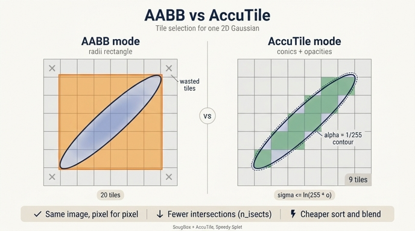

# AABB 모드 vs AccuTile 모드

> **Q.** AABB 모드와 AccuTile 모드의 차이는?
>
> **A.** AABB는 radii 사각형이 겹치는 타일을 전부 고르고, AccuTile은 `conics`/`opacities`를 함께 넘겨 알파가 1/255 이상인 타원과 실제로 겹치는 타일만 고른다. 결과 이미지는 같고 정렬·블렌딩 비용만 줄어든다.

---

## 0. 어디에서 벌어지는 이야기인가

3DGS 파이프라인 ⑤단계 `isect_tiles`의 이야기다. 픽셀마다 N개 Gaussian을 다 보는 건 불가능하니
화면을 16×16 타일로 쪼개고 **"각 Gaussian이 어느 타일들을 덮는가"**를 (Gaussian, 타일) 쌍의 리스트로 만든다.
이 쌍의 총 개수가 `n_isects`이고, 이후의 모든 비용 — 64비트 키 radix sort, 타일별 오프셋,
블렌딩 커널이 shared memory로 퍼 나르는 Gaussian 수 — 이 전부 `n_isects`에 비례한다.

그러니까 **"덮는 타일"을 얼마나 헐겁게/빡빡하게 세느냐**가 곧 래스터화 속도다.
AABB와 AccuTile은 바로 이 판정 규칙 두 가지다.

---

## 1. AABB 모드 — 사각형과 격자의 겹침

`conics`/`opacities` 없이 `isect_tiles`를 부르면 커널은 `radii`만 본다
(`IntersectTile.cu`의 `else` 분기, 주석에 `// AABB fallback` 이라 적혀 있다):

```cuda
tile_min.x = floor((mean2d.x - radius_x) / tile_size);
tile_max.x = ceil ((mean2d.x + radius_x) / tile_size);
// y도 동일 → [tile_min, tile_max) 직사각형 안의 타일을 전부 emit
```

즉 **축 정렬 사각형(Axis-Aligned Bounding Box)이 걸치는 타일 격자를 통째로** 담는다.
순수 PyTorch 참조 구현 `_torch_impl._isect_tiles`가 쓰는 규칙도 이것이라,
walkthrough에서 CUDA 결과와 `torch.equal`로 비트 단위 일치를 확인할 수 있다.

```python
# AABB 모드: conics/opacities를 넘기지 않는다
tiles_per_gauss, isect_ids, flatten_ids = isect_tiles(
    means2d_c, radii_c, depths_c, TILE, tile_w, tile_h, n_images=1)
_tpg, _ids, _fids = _isect_tiles(means2d_c, radii_c, depths_c, TILE, tile_w, tile_h)
# → isect_ids / flatten_ids 모두 일치
```

### 이게 왜 낭비인가

투영된 2D Gaussian은 일반적으로 **기울어진 타원**이다. 벽·바닥·나뭇가지처럼 시점에 대해
비스듬히 놓인 splat일수록 길고 가늘며, 축에 대해 45°쯤 기울어진다.

- 45° 기울어진 가늘고 긴 타원의 면적은 그 AABB 면적의 몇 분의 일밖에 안 된다.
  극단적으로 얇은 선분에 가까운 타원이면 사각형의 대각선만 채우고 **네 모서리 삼각형은 전부 빈 공간**이다.
- 게다가 타일 격자에 스냅되면서 한 번 더 부풀려진다. 사각형이 타일 경계를 1픽셀만 넘어가도
  그 타일 행/열이 통째로 추가된다.
- 결과적으로 리스트에 올라온 (Gaussian, 타일) 쌍의 상당수는 **그 타일 안 어느 픽셀에서도
  α가 1/255을 못 넘기는** 쌍이다. 정렬도 하고, shared memory에도 싣고, 블렌딩 루프도 한 바퀴 도는데
  결과 픽셀에는 아무 영향이 없다.

> 참고로 gsplat은 AABB 모드에서도 이미 한 번 조인 상태다. `fully_fused_projection`에 `opacities`를
> 넘기면 반경이 3.33σ 대신 `min(3.33, sqrt(2·ln(o·255)))·σ`로 줄어든다(**불투명도 인지 반경**).
> 하지만 그건 **사각형을 줄인 것**이지 사각형을 없앤 게 아니다. 기울어짐에서 오는 낭비는 그대로 남는다.

---

## 2. AccuTile 모드 — Speedy-Splat의 SnugBox + AccuTile

출처는 **Speedy-Splat: Fast 3D Gaussian Splatting with Sparse Pixels and Sparse Primitives**
(Hanson et al., arXiv:2412.00578, CVPR 2025). 논문은 원본 3DGS의 타일 할당이 지나치게 헐겁다는
관찰에서 출발해 두 단계로 조인다.

| 단계 | 아이디어 |
|---|---|
| **SnugBox** | 3σ 반경 대신 **불투명도 임계 등고선 타원의 정확한 축 정렬 경계 상자**를 닫힌 형태로 계산 |
| **AccuTile** | SnugBox 안에서 **타원이 실제로 지나가는 타일만** 골라낸다 (타일 행/열마다 교차 구간 계산) |

논문 보고 기준 SnugBox+AccuTile만으로 렌더 품질 저하 없이 약 **1.99× 가속**.
gsplat의 `IntersectTile.cu`에는 아예 출처가 주석으로 박혀 있다:

```
// SNUGBOX + AccuTile helper functions as propsed by SpeedySplat: https://arxiv.org/pdf/2412.00578
```

### 2-1. 1/255 등고선은 왜 "타원"인가

블렌딩 커널의 알파 계산은

$$\sigma_i = \tfrac12\big(a\,dx^2 + 2b\,dx\,dy + c\,dy^2\big),\qquad
\alpha_i = \min(0.99,\; o_i\,e^{-\sigma_i})$$

이고 커널은 `alpha < ALPHA_THRESHOLD (= 1/255)`면 그 Gaussian을 **건너뛴다**. 따라서 기여가 있는 영역은

$$o\,e^{-\sigma} \ge \tfrac{1}{255}
\quad\Longleftrightarrow\quad
\boxed{\;\sigma \le \ln(255\,o)\;}$$

$\sigma$는 conic $(a,b,c) = \Sigma_2^{-1}$의 이차형식이므로, 이 부등식이 그리는 영역은
**중심 `means2d`, 모양 `conics`로 정해지는 하나의 타원**이다. 즉 "이 Gaussian이 실제로 뭔가를 칠하는
영역"은 사각형이 아니라 처음부터 타원이었고, 그 타원의 크기는 불투명도 $o$가 정한다.
투명한 Gaussian일수록 등고선이 작아지고, $o \le 1/255$면 아예 사라진다.

CUDA 쪽 코드는 $q = 2\sigma$ (마할라노비스 거리 제곱) 기준으로 같은 식을 쓴다:

```cuda
// alpha = opacity * exp(-0.5*q) >= ALPHA_THRESHOLD  =>  q <= 2*ln(opacity/ALPHA_THRESHOLD)
float t = fminf(GAUSSIAN_EXTEND * GAUSSIAN_EXTEND,      // 3.33^2 상한 (AABB와 같은 예산)
                2.0f * __logf(opacity / ALPHA_THRESHOLD));
```

`GAUSSIAN_EXTEND = 3.33` 상한을 AABB 경로와 **똑같이** 씌우는 게 중요하다. 두 모드가 같은
"σ 예산"을 쓰기 때문에, AccuTile이 잘라내는 건 순수하게 "사각형이었기에 딸려온 잉여 타일"뿐이다.

### 2-2. SnugBox — 타원의 정확한 경계 상자 (닫힌 형태)

$B^2 - AC = -\det\Sigma_2^{-1}$이므로 `disc = B*B - A*C`를 두면

```cuda
float neg_t_over_disc = -t / disc;
float x_extent = sqrtf(neg_t_over_disc * C);   //  = sqrt(t * Sigma_xx)
float y_extent = sqrtf(neg_t_over_disc * A);   //  = sqrt(t * Sigma_yy)
```

$C/\det = \Sigma_{xx}$이므로 `x_extent`는 정확히 $\sqrt{t}\,\sigma_x$ — **타원의 진짜 x 방향 최대 폭**이다.
반복이나 근사 없이 몇 번의 곱셈과 sqrt로 나온다.

여기에 더해 **극점의 위치**도 같이 구해 둔다 (AccuTile이 쓴다):

```cuda
float2 bbox_argmin = {mean.y + B*x_extent/C,  mean.x + B*y_extent/A};
float2 bbox_argmax = {mean.y - B*x_extent/C,  mean.x - B*y_extent/A};
```

= "타원이 x 최소/최대에 닿는 지점의 y좌표" (와 그 반대). 기울어진 타원에서는 이 극점이
상자 모서리가 아니라 변 중간 어딘가에 있다.

### 2-3. AccuTile — 타일 줄마다 교차 구간을 구한다

`accutile_process_tiles`의 알고리즘 개요:

1. **짧은 쪽을 바깥 루프로.** `bool isY = y_span < x_span;` — 타일 span이 짧은 축을 따라 훑는다.
   (스캔 횟수를 줄이는 최적화. `isY`면 x/y 역할을 통째로 swap해서 같은 코드를 재사용한다.)
2. 바깥 루프의 각 타일 **줄(slab)**에 대해, 그 줄의 양쪽 경계선 `min_line`, `max_line`과
   타원의 교점을 푼다. `accutile_ellipse_intersection`이 이차방정식을 닫힌 형태로 풀어
   두 근 $(v_{lo}, v_{hi})$를 준다:
   ```cuda
   float h = coord - p_u;
   float sqrt_term = sqrtf(disc*h*h + t*coeff);
   return {(-B*h - sqrt_term)/coeff + p_v, (-B*h + sqrt_term)/coeff + p_v};
   ```
3. 이 줄 안에서 타원이 도달하는 v방향 최소/최대는 **두 경계선 교점의 min/max**다.
   단, **극점이 이 줄 안에 들어 있으면**(`min_line <= bbox_argmin.y < max_line`) 경계선 교점이 아니라
   `bbox_min.y` / `bbox_max.y`(SnugBox의 값)를 써야 한다 — 타원이 줄 안쪽에서 배가 불룩한 경우다.
4. 얻은 구간 `[ellipse_min, ellipse_max]`를 타일 크기로 나눠 그 줄에서 **연속된 타일 몇 개만** emit.
   ```cuda
   int min_tile_v = max(rect_min.y, min(rect_max.y, (int)(ellipse_min / BLOCK)));
   int max_tile_v = min(rect_max.y, max(rect_min.y, (int)(ellipse_max / BLOCK + 1)));
   for (int v = min_tile_v; v < max_tile_v; v++) { ...emit... }
   ```

결과적으로 각 타일 줄마다 **타원이 실제로 지나간 구간만** 담긴다. 기울어진 타원이면 이 구간이
줄마다 대각선을 따라 미끄러지듯 이동하므로, AABB가 통째로 담던 네 모서리 영역이 빠진다.
2패스 구조(1차: 개수만 세기 → prefix sum → 2차: 키 채우기)에서 두 패스 모두 같은 함수를 타고
`isect_ids == nullptr` 여부로만 갈리므로, 개수와 실제 emit이 어긋날 일이 없다.

---

## 3. 왜 결과 이미지가 픽셀 단위로 같은가

AccuTile이 잘라낸 타일 T와 Gaussian g를 생각해 보자. T가 잘렸다는 건
**T 안의 어떤 픽셀도 $\sigma \le \ln(255o)$ 타원 안에 없다**는 뜻이다. 그런데 블렌딩 커널은

```
alpha = opacity * exp(-sigma);
if (alpha < ALPHA_THRESHOLD) continue;   // 1/255 미만이면 스킵
```

이므로, 만약 g가 T 리스트에 남아 있었더라도 **모든 픽셀에서 `continue`로 스킵**된다.
색도 안 더하고 투과율 $T$도 안 깎는다. 즉 **제거된 쌍은 애초에 출력에 0을 기여하던 쌍**이다.

정렬 순서도 안전하다. 키가 `[image_id | tile_id | float32(depth)]`이므로 정렬 결과는
"타일별 depth 오름차순"이고, 리스트에서 원소 몇 개를 빼도 남은 것들의 **상대 순서는 그대로**다.
따라서 앞→뒤 블렌딩 순서가 바뀌지 않고, $T$의 갱신 순서·early termination 시점도 동일하다.
그래서 논문도 gsplat 구현도 "bit-identical / no quality loss"를 주장할 수 있다.

(주의: 3.33σ 상한 때문에 아주 불투명한 Gaussian은 진짜 1/255 등고선보다 살짝 작은 타원을 쓴다.
하지만 **AABB 경로도 같은 3.33σ 예산**을 쓰므로 두 모드 사이에는 차이가 없다.)

---

## 4. 이득은 정확히 어디서 나오는가

줄어드는 건 오직 `n_isects` 하나인데, 파이프라인 뒷단이 전부 여기에 비례한다.

| 항목 | n_isects 감소의 효과 |
|---|---|
| **radix sort** | 64비트 키 배열이 짧아진다. 보통 프레임 시간의 큰 몫 |
| **메모리** | `isect_ids`(int64) + `flatten_ids`(int32) 버퍼가 그만큼 작아진다 |
| **타일별 리스트 길이** | `isect_offsets[t+1]-isect_offsets[t]`가 줄어든다 |
| **shared memory 적재** | 블렌딩 커널이 배치 단위로 퍼 나르는 Gaussian 수가 줄어든다 |
| **블렌딩 루프** | 픽셀당 도는 반복 횟수 감소 (어차피 스킵되던 반복이 사라짐) |
| **backward** | 역전파도 같은 리스트를 되짚으므로 학습 속도까지 같이 빨라진다 |

**품질은 그대로인데 계산만 사라지는**, 드물게 공짜에 가까운 최적화다.

---

## 5. gsplat에서 켜는 법 / 기본값

### 켜는 법 — 인자 두 개

```python
tpg, isect_ids, flatten_ids = isect_tiles(
    means2d, radii, depths, tile_size, tile_w, tile_h, n_images=C,
    conics=conics,        # [..., N, 3]  Sigma_2^{-1} 상삼각
    opacities=opac,       # [..., N]     카메라별 불투명도
)
```

`gsplat/cuda/_wrapper.py`의 docstring이 못을 박아 둔다:

> When `conics` and `opacities` are provided the kernel uses conservative ellipse intersection
> (AccuTile/SNUGBOX), skipping tiles that the opacity-thresholded ellipse does not touch.
> When either is `None` the kernel falls back to the original axis-aligned bounding box.

**둘 중 하나라도 `None`이면 AABB로 폴백**한다 (커널 조건이 `conics != nullptr && opacities != nullptr`).

### 기본값 — 소스로 확인

- **C++ 오케스트레이터** (`gsplat/cuda/csrc/Rendering.cpp`): `intersect_tile` 호출에
  `intersect_conics` / `intersect_opacities`를 넘긴다. 즉 `rasterization()`은 **기본적으로 AccuTile**이다.
  ```cpp
  at::optional<at::Tensor> intersect_conics    = as_optional_tensor(with_ut ? at::Tensor{} : kernel_conics);
  at::optional<at::Tensor> intersect_opacities = as_optional_tensor(with_ut ? at::Tensor{} : kernel_opacities);
  ```
- **Python 경로** (`gsplat/rendering.py`)도 동일하게 `conics=None if with_ut else conics`.
- **예외 1 — `with_ut`**: unscented transform 기반 투영(비핀홀/롤링셔터 카메라)에서는 conic이
  타원을 제대로 대표하지 못하므로 AABB로 되돌린다.
- **예외 2 — 2DGS 등**: 커널 주석 그대로 `// AABB fallback: used when conics/opacities are not available (e.g. 2DGS)`.
- **예외 3 — LiDAR**: `intersect_tile_lidar`는 애초에 conics/opacities 인자가 없다.

---

## 6. stepwise 재현에서 모드를 맞춰야 하는 이유

walkthrough의 `rasterize_stepwise`가 `rasterization()`과 **비트 단위로** 같은 결과를 내려면
C++ 오케스트레이터(`Rendering.cpp`의 `rasterization_3dgs`)와 **같은 인자 조합**을 써야 한다.
그래서 두 군데에 인자를 더 넘긴다.

```python
# ①②③ 투영 — opacities를 넘겨 "불투명도 인지 반경"을 켠다
radii, means2d, depths, conics, _ = fully_fused_projection(
    means, None, quats, scales, viewmats, Ks, W, H,
    eps2d=eps2d, near_plane=near_plane, far_plane=far_plane, opacities=opacities)
opac = opacities[None].expand(C, N)

# ⑤ 타일 교차 — conics/opacities를 넘겨 AccuTile을 켠다
tiles_per_gauss, isect_ids, flatten_ids = isect_tiles(
    means2d, radii, depths, tile_size, tw, th, n_images=C, conics=conics, opacities=opac)
```

모드를 안 맞추면 무슨 일이 생기나:

- `n_isects`가 달라진다 → `isect_ids`, `flatten_ids` **배열 길이 자체가 다르다**.
  `torch.equal(m_fused["isect_ids"], m_step["isect_ids"])`는 shape에서부터 False.
- `tiles_per_gauss`가 Gaussian마다 다르다 (walkthrough가 `AABB` vs `AccuTile`로 나란히 찍어 비교하는 값).
- `isect_offsets`도 누적값이 전부 밀린다.
- `opacities`를 투영에 안 넘기면 `radii`부터 달라진다 (3.33σ 고정 vs 불투명도 인지).
- 다만 **`render`/`alpha`는 여전히 일치**한다 — §3의 이유로 제거된 쌍은 기여가 0이니까.
  즉 "이미지는 맞는데 meta 비교만 줄줄이 False"라는 헷갈리는 상황이 나온다.
  이게 stepwise 재현에서 모드를 꼭 맞춰야 하는 실질적인 이유다.

---

## 한 줄 요약

| | AABB | AccuTile (+SnugBox) |
|---|---|---|
| 입력 | `means2d`, `radii`, `depths` | + `conics`, `opacities` |
| 판정 기준 | radii 축 정렬 사각형 ∩ 타일 격자 | $\sigma \le \ln(255\,o)$ 타원 ∩ 타일 |
| 기울어진 길쭉한 splat | 모서리 낭비 큼 | 타원 따라 대각선만 |
| 출력 이미지 | — | **동일** (제거된 픽셀은 α<1/255) |
| 비용 | 기준 | `n_isects` ↓ → 정렬·적재·블렌딩 ↓ (논문 ~1.99×) |
| gsplat 기본 | 2DGS / `with_ut` / LiDAR | `rasterization()`의 3DGS 경로 |

**출처**
- [Speedy-Splat: Fast 3D Gaussian Splatting with Sparse Pixels and Sparse Primitives (arXiv:2412.00578)](https://arxiv.org/pdf/2412.00578)
- [CVPR 2025 open access PDF](https://openaccess.thecvf.com/content/CVPR2025/papers/Hanson_Speedy-Splat_Fast_3D_Gaussian_Splatting_with_Sparse_Pixels_and_Sparse_CVPR_2025_paper.pdf)
- gsplat: `gsplat/cuda/csrc/IntersectTile.cu`, `gsplat/cuda/_wrapper.py`, `gsplat/cuda/csrc/Rendering.cpp`, `gsplat/rendering.py`

## 인포그래픽


