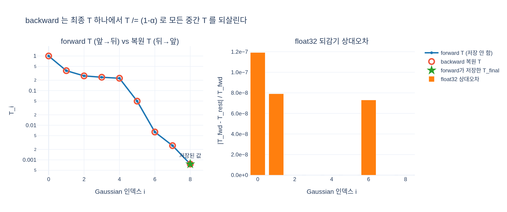

# backward 커널이 투과율 T를 어떻게 복원하는가?

forward가 저장한 최종 $T$에서 시작해 같은 타일 목록을 뒤→앞으로 순회하며 `T /= (1-α)`로 되돌린다.
그래서 중간 $T$를 모두 저장할 필요가 없다.

- [`hi.md`](hi.md) — 고교 수준에서 쌓아 올린 설명 (등비수열 되감기, $\partial C/\partial\alpha_i = T_i(c_i - S_{i+1})$ 유도, MAX_ALPHA=0.99의 이유, float 오차)
- [`expy.py`](expy.py) — 실행 가능한 jupyter-percent 예제 (되감기 검증, autograd 대조, α→1 붕괴 데모)

## 시각화

