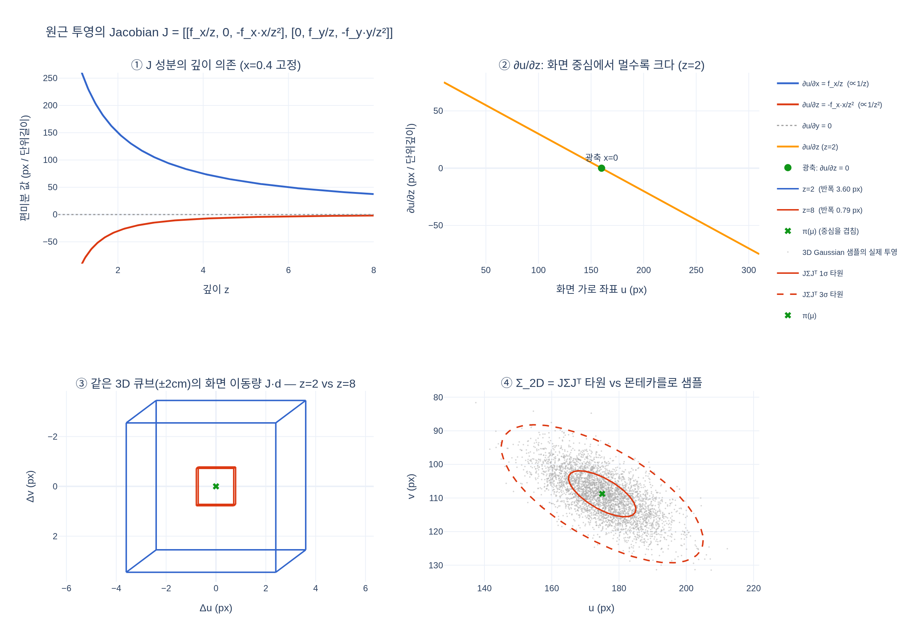

# 원근 투영의 Jacobian J 행렬은 어떤 형태인가?

$$J = \begin{bmatrix} f_x/z & 0 & -f_x x/z^2 \\ 0 & f_y/z & -f_y y/z^2 \end{bmatrix}$$

투영 함수 $\pi(x,y,z) = (f_x x/z + c_x,\ f_y y/z + c_y)$ 를 미분한 **2×3** 행렬이다 (출력 2개 × 입력 3개).

- [`hi.md`](hi.md) — 고교 미적분(닮은 삼각형 + 몫의 미분)에서 출발한 단계별 유도
- [`expy.py`](expy.py) — 해석식 / 유한차분 / autograd 교차 검증과 $\Sigma_{2D} = J\Sigma J^\top$ 실험

## 시각화

