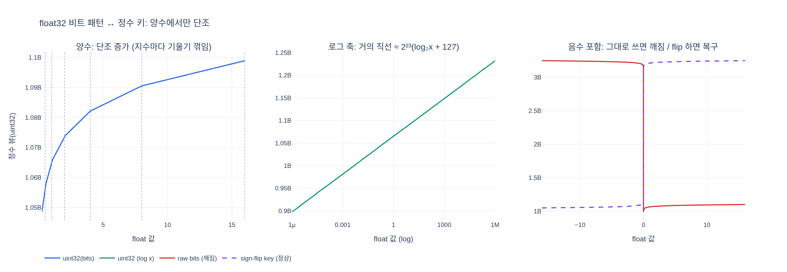

# float32 depth 비트를 정수 키에 그냥 써도 정렬 순서가 맞는 이유

**Q.** float32 depth 비트를 정수 키의 일부로 그냥 써도 정렬 순서가 맞는 이유는?

**A.** 양수 float의 비트 패턴은 정수로 비교해도 크기 순서가 보존되기 때문이다. 따라서 별도 변환 없이 radix sort에 그대로 넣을 수 있다.

---

## 1. 어디서 나온 이야기인가

gsplat의 타일 교차 단계(`isect_tiles`)는 (Gaussian, 타일) 쌍마다 **64비트 정수 키** 하나를 만든다.

```
[ image_id | tile_id | float32(depth) 비트 ]      ← 상위 → 하위
     10bit      22bit          32bit
```

이 키 배열을 **한 번의 radix sort**로 정렬하면

1. 이미지별로 뭉치고,
2. 그 안에서 타일별로 뭉치고,
3. 그 안에서 **depth 오름차순(가까운 것부터)**

이 세 가지가 동시에 끝난다. 그리고 depth는 **아무 변환 없이 비트 패턴 그대로** 하위 32비트에 들어간다.

`gsplat/cuda/csrc/IntersectTile.cu`:

```cuda
float depth_f = static_cast<float>(depths[idx]);
// The float-bit key is monotonic only for non-negative depths: a set
// sign bit would invert the unsigned ordering.
assert(depth_f >= 0.f);
depth_id_enc = __float_as_uint(depth_f);          // 비트 재해석, zero-extend
...
isect_ids[cur_idx] = iid_enc | (tile_id << 32) | depth_id_enc;
```

PyTorch 참조 구현(`gsplat/cuda/_torch_impl.py::_isect_tiles`)도 똑같이 한다.

```python
depth_id = struct.unpack("i", struct.pack("f", depth_f32))[0]
depth_id = int(depth_id) & 0xFFFFFFFF     # 상위 32비트 0으로
```

`float(3.25)`를 `3.25`라는 정수로 바꾸는 게 아니다. **32비트 덩어리를 float으로 보던 걸 정수로 보기만 하는 것**(reinterpret / `.view(torch.int32)`)이다. 값 자체는 `1078984704` 같은 엉뚱한 수가 된다. 그런데도 순서는 맞는다.

## 2. IEEE 754 single 레이아웃

32비트를 세 조각으로 나눈다.

| 필드 | 비트 수 | 위치(상위→하위) |
|---|---|---|
| 부호 $s$ | 1 | bit 31 |
| 지수 $e$ (biased) | 8 | bit 30..23 |
| 가수 $m$ (fraction) | 23 | bit 22..0 |

정규 수(normal, $1 \le e \le 254$)의 값은

$$ x = (-1)^s \times 2^{\,e-127} \times \left(1 + \frac{m}{2^{23}}\right) $$

핵심 두 가지.

**(a) 지수가 biased(offset binary)로 저장된다.**
실제 지수 $-126 \ldots 127$을 $+127$ 해서 $1 \ldots 254$의 **부호 없는 정수**로 넣는다.
그래서 "지수가 크다 = 저장된 8비트 필드가 크다"가 그대로 성립한다.
만약 지수를 2의 보수로 저장했다면 음의 지수($0.5$, $0.1$ 같은 값)가 필드의 최상위 비트를 세워서
$100.0$보다 커 보였을 것이다. IEEE 754는 **정확히 이 비교 가능성을 노리고** offset binary를 골랐다.

**(b) 지수가 가수보다 상위 비트에 있다.**
그리고 같은 지수 구간 $[2^k, 2^{k+1})$ 안에서 값은 가수 $m$에 **선형**이다.

$$ x = 2^{k}\left(1 + \frac{m}{2^{23}}\right), \qquad m = 0 \ldots 2^{23}-1 $$

즉 같은 지수 안에서는 가수가 사전식(lexicographic)으로 증가하는 것이 곧 값이 증가하는 것이다.

**(a) + (b)** 를 합치면: 상위 필드(지수)로 먼저 갈리고, 같으면 하위 필드(가수)로 넘어간다.
이건 **사전식 비교 = radix 비교의 구조 그 자체**다. 그래서 음이 아닌 float 전체에 대해

$$ 0 \le a \le b \quad\Longleftrightarrow\quad \mathrm{bits}(a) \le \mathrm{bits}(b) \quad (\text{unsigned 비교}) $$

라는 **단조(monotonic) 사상**이 성립한다.

실제로 확인해 보면 비트를 $+1$ 하는 것이 곧 "다음으로 표현 가능한 float"(nextafter)이다.

```
uint32  1073741823 -> 1.99999988
uint32  1073741824 -> 2            ← 지수 경계를 넘어가도 끊김 없이 이어진다
uint32  1073741825 -> 2.00000024
```

양의 float32 전체가 $0 \ldots \mathtt{0x7F800000}$ 정수 구간에 **틈 없이, 순서 그대로** 대응한다.

## 3. 왜 radix sort와 특히 잘 맞는가

비교 기반 정렬이라면 "정수로 비교해도 결과가 같다"만 알면 충분하다.
radix sort는 한 걸음 더 나간다 — **애초에 값을 비교하지 않고 비트 자리(digit)별로 버킷에 뿌리는** 알고리즘이다.
CUB의 `DeviceRadixSort`는 64비트 키를 4~8비트씩 끊어서 LSB→MSB로 여러 패스를 돈다.

float 비트 패턴은 위에서 본 대로 "상위 자리부터 의미가 큰 필드"로 배치되어 있으므로,
radix가 자리별로 훑는 순서와 값의 크기 순서가 그대로 일치한다.
**변환 커널도, depth만 따로 정렬하는 2차 패스도 필요 없다.** 프로젝션이 뱉은 `depths` 텐서를
그대로 비트 복사해 넣으면 끝이다.

덤으로: 상위에 `image_id`와 `tile_id`가 있으므로 정렬 하나로 3중 그룹핑이 완성된다.
`isect_offset_encode`는 정렬된 키에서 tile 필드가 바뀌는 지점만 찾으면 되고,
래스터라이저는 `flatten_ids[offsets[t] : offsets[t+1]]`을 앞에서부터 읽는 것만으로
near-to-far 알파 블렌딩 순서를 얻는다.

## 4. 음수에서는 깨진다

두 가지 이유로 동시에 깨진다.

1. **부호 비트가 최상위(bit 31)에 있다.** unsigned 비교에서 음수는 전부 $\ge 2^{31}$이 되어
   **모든 양수보다 크게** 취급된다. 음수 블록이 통째로 뒤로 밀린다.
2. **음수 영역 내부에서도 반전된다.** 부호를 뺀 나머지 31비트에는 *크기(magnitude)* 만 담기므로
   $\mathrm{bits}(-2.0) > \mathrm{bits}(-1.0)$인데 실제 값은 $-2.0 < -1.0$이다.

```
   value      uint32
  -100.0  3267887104     ← 값은 가장 작은데 비트는 가장 크다
    -2.0  3221225472
    -1.0  3212836864
    -0.0  2147483648
     0.0           0
     1.0  1065353216
   100.0  1120403456

정수 뷰 정렬: [   0.    1.    2.  100.   -0.   -1.   -2. -100.]
실제 float 정렬: [-100.   -2.   -1.   -0.    0.    1.    2.  100.]
```

### 일반적인 해법: 부호 비트 flip / XOR 트릭

음수까지 다루려면 비트 패턴을 "순서 보존 부호 없는 정수(order-preserving key)"로 바꾼다.

$$
\mathrm{key}(u) =
\begin{cases}
u \oplus \mathtt{0x80000000}, & \text{부호 비트가 } 0 \ (\text{양수}) \\[4pt]
\sim u \ (= u \oplus \mathtt{0xFFFFFFFF}), & \text{부호 비트가 } 1 \ (\text{음수})
\end{cases}
$$

브랜치 없이 한 줄로:

```c
uint32_t mask = (uint32_t)(-(int32_t)(u >> 31)) | 0x80000000u;
uint32_t key  = u ^ mask;
```

- 양수: 최상위 비트만 세워 음수 블록보다 뒤로 보낸다.
- 음수: 전 비트를 뒤집어 (a) 앞으로 보내고 (b) 내부 반전도 되돌린다.

역변환도 대칭적인 형태라(`mask`의 두 상수만 맞바꾸면 된다) 정렬 후 원래 float를 복원할 수 있다.
DB 인덱스, GPU 정렬 라이브러리(CUB의 float 특수화 포함), 키-값 스토어의 float 인코딩이 전부 이 트릭을 쓴다.

### gsplat이 이 트릭을 쓰지 않는 이유

`depths`는 **near-plane 컬링을 통과한 카메라 좌표 $z$** 다. `fully_fused_projection`이
$z < \text{near}$ 인 Gaussian을 이미 걸러냈으므로 `isect_tiles`에 도달하는 depth는 항상 양수다.
그래서 flip 단계 자체가 불필요하고, 인코딩이 `__float_as_uint(depth_f)` 한 줄로 끝난다.

다만 `isect_tiles`는 독립적으로 호출될 수 있는 op이기도 해서, CUDA 커널은 이 불변식을
`assert(depth_f >= 0.f)`로 못박아 둔다 — 주석이 기대는 전제를 코드로 고정한 것.

또 하나: `static_cast<float>(depths[idx])`로 **먼저 float으로 좁힌 뒤** 재해석한다.
`scalar_t`가 double이면 64비트를 32비트로 그냥 재해석했을 때 절반만 읽어 순서가 깨지기 때문이다.

## 5. 예외 케이스

| 케이스 | 비트 | 정수 비교에서 |
|---|---|---|
| `+0.0` | `0x00000000` | 가장 작은 키. 문제 없음 |
| `-0.0` | `0x80000000` | `+0.0 == -0.0`인데 비트는 다르다 → 정수 비교에선 `-0.0 > +0.0`. 순서 결정 용도로는 무해하지만 "값이 같으면 키도 같다"는 가정은 깨진다 |
| denormal ($e=0$) | `0x000001`~`0x7FFFFF` | 값이 $m$에 선형($x = 2^{-126} \cdot m/2^{23}$)이라 단조성 유지. 정규 수 구간과 매끄럽게 이어진다 |
| `+inf` | `0x7F800000` | 모든 유한 양수보다 큼 → 올바르게 맨 뒤 |
| `NaN` | $e=255, m \ne 0$ | `0x7F800001` 이상 → inf보다 뒤로 정렬된다. 값 비교로는 무의미하지만 크래시는 안 난다. depth에 NaN이 들어오면 애초에 상류가 잘못된 것 |

gsplat 파이프라인에서 depth는 컬링을 통과한 유한한 양수이므로 위 예외는 실질적으로 발생하지 않는다.

## 6. 원조 3DGS도 같은 방식

이건 gsplat이 새로 만든 트릭이 아니라, 원 3D Gaussian Splatting의
`diff-gaussian-rasterization`이 쓰던 방식 그대로다.

```cpp
gaussian_keys_unsorted[off]  = key;                          // tile_id << 32
gaussian_keys_unsorted[off] |= *((uint32_t*)&depths[idx]);   // depth 비트를 그대로 OR
```

`*((uint32_t*)&depths[idx])` — 포인터 캐스팅으로 float 주소를 uint32로 읽는 것,
gsplat의 `__float_as_uint` / `.view(torch.int32)`와 정확히 같은 연산이다.

## 한 줄 요약

> IEEE 754 single은 `[부호 | biased 지수 | 가수]` 순서로 배치되어 있고, 이 배치가 음이 아닌 값에 대해
> **비트 패턴 = 순서 보존 정수 키**를 만든다. depth가 항상 양수인 gsplat에서는 그래서 변환 없이
> 64비트 키에 비트를 그대로 얹고 radix sort 한 번으로 (image, tile, depth) 정렬을 끝낸다.

## 시각화



- **왼쪽**: $x$축 float 값, $y$축 uint32 비트값. 단조 증가하지만 지수 경계(점선: 0.5, 1, 2, 4, 8, 16)마다
  기울기가 절반씩 꺾이는 계단(piecewise-linear) 모양. 지수가 1 오를 때 값의 폭은 2배가 되는데
  정수 키는 항상 $2^{23}$씩만 늘기 때문이다. **중요한 건 "직선"이 아니라 "단조"** 라는 점 — 정렬에는 그것으로 충분하다.
- **가운데**: 같은 데이터를 $x$축 로그 스케일로 보면 거의 직선. $\mathrm{bits}(x) \approx 2^{23}(\log_2 x + 127)$,
  즉 float 비트 패턴은 값의 로그에 대한 구간별 선형 근사 정수다.
- **오른쪽**: 음수를 포함하면 빨간 곡선이 $x < 0$에서 $\ge 2^{31}$로 튀어 오르며 단조성이 깨진다.
  보라 점선이 sign-flip 키를 적용해 전 구간에서 단조성을 복구한 모습.

재현: `python3 expy.py` (필요 패키지: numpy, plotly, kaleido — gsplat은 import하지 않는다)
