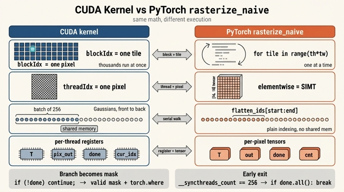

# `rasterize_naive` ↔ CUDA 커널 구조 대응

**Q.** `rasterize_naive`에서 CUDA 커널의 각 구조가 PyTorch로 어떻게 대응되는가?

**A.** 타일 루프가 CUDA 블록, 타일 안 픽셀 텐서가 스레드들, Gaussian 루프가 직렬 순회에 대응한다. `T`, `out`, `done`, `cnt`는 스레드별 레지스터에 해당한다.

---

## 0. 두 코드가 무엇인가

| | 파일 | 정체 |
|---|---|---|
| CUDA | `gsplat/cuda/csrc/RasterizeToPixels3DGSSerialBatchFwd.cu`의 `rasterize_to_pixels_3dgs_fwd_kernel<CDIM, TILE_SIZE=16, CTA_SIZE=256>` | 실제로 도는 알파 블렌딩 커널 (⑦단계) |
| PyTorch | 워크스루 노트북의 `rasterize_naive` | 같은 알고리즘을 **순수 파이썬 루프 + 텐서 연산**으로 옮긴 교육용 참조 구현 |

`TILE_SIZE=16, CTA_SIZE=256`이면 `PIXELS_PER_THREAD = 16*16/256 = 1`, 즉 **스레드 하나 = 픽셀 하나**다. 이 설정에서 대응 관계가 가장 깔끔하므로 아래는 전부 이 경우를 기준으로 한다.

---

## 1. 핵심 대응표

| CUDA 구문 | `rasterize_naive` 구문 | 의미 |
|---|---|---|
| `blockIdx.x`(+`block_offset`) → `tile_id` | `for tile in range(th * tw):` + `ty, tx = divmod(tile, tw)` | **블록 하나 = 타일 하나.** GPU에서 동시에 도는 것을 파이썬에서는 순차 for로 흉내 |
| `dim3 grid = {n_tiles,1,1}` | `range(th * tw)`의 길이 | 그리드 크기 = 타일 개수 (× 이미지 수) |
| `threadIdx.x` → `thread_x = tid & 15`, `thread_y = tid >> 4` | `torch.meshgrid(arange(y0,y1), arange(x0,x1))` → `py, px` `[≤16,≤16]` | **스레드 하나 = 픽셀 하나.** 256개 스레드 ↔ `[16,16]` 텐서의 256개 원소 |
| `const float px = out_x + 0.5f;` `py[p] = out_y[p] + 0.5f;` | `arange(...) + 0.5` | 픽셀 **중심** 좌표. 양쪽 다 `+0.5` — 빠뜨리면 반 픽셀 어긋난다 |
| `range_start = isect_offsets[tile_id]`, `range_end = isect_offsets[tile_id+1]` | `offsets[tile]`, `offsets[tile+1]` (마지막 칸은 `n_isects`로 패딩) | 이 타일이 훑을 Gaussian 구간 |
| `for b in num_batches` + shared memory 적재 + `for t in batch_size` | `for k in range(offsets[tile], offsets[tile+1]):` `g = flatten_ids[k].item()` | **깊이 정렬된 Gaussian을 앞→뒤로 직렬 순회.** 배치/shared memory는 순수 캐싱 최적화라 파이썬에서는 그냥 인덱싱 |
| `float T[PPT]` (레지스터) | `T = torch.ones_like(px)` | 픽셀별 투과율 |
| `float pix_out[PPT][CDIM]` (레지스터) | `out = torch.zeros(px.shape + (D,))` | 픽셀별 누적 색 |
| `uint32_t done_mask` (레지스터 비트) | `done = torch.zeros_like(px, dtype=bool)` | 픽셀별 조기 종료 플래그 |
| `uint32_t cur_idx[PPT]` → `last_ids` | `cnt = torch.zeros_like(px, dtype=int32)` → `n_contrib` | 픽셀별 기여 추적 (§5 참고) |
| `eval_gaussian_weight`: `sigma = 0.5*(a*dx*dx + c*dy*dy) + b*dx*dy` | 동일 식 | 마할라노비스 거리의 절반. conic `(a,b,c)` = `conic.x/.y/.z` |
| `alpha = min(MAX_ALPHA, opac * __expf(-sigma))` | `torch.clamp_max(opacities[g] * torch.exp(-sigma), MAX_ALPHA)` | α 상한 0.99 |
| `gw.valid = !(sigma < 0 \|\| alpha < ALPHA_THRESHOLD)` + `if(done_mask & bit) continue;` | `valid = (sigma >= 0) & (alpha >= ALPHA_THRESHOLD) & ~done` | **분기 ↔ 마스크** (§4) |
| `if(next_T <= TRANSMITTANCE_THRESHOLD){ done_mask \|= bit; continue; }` | `saturated = valid & (next_T <= TRANSMITTANCE_THRESHOLD)`; `done \|= saturated` | 포화된 픽셀 종료. **이 Gaussian은 제외** |
| `pix_out[p][k] += c_ptr[k] * (alpha * T[p]); T[p] = next_T;` | `out += (blend * alpha * T)[...,None] * colors[g]`; `T = torch.where(blend, next_T, T)` | 누적 + 갱신 |
| `if(__syncthreads_count(done_mask == ALL_DONE) >= BATCH_SIZE) break;` | `if bool(done.all()): break` | **블록(타일) 전체 조기 종료** (§6) |
| `render_alphas[pix] = 1.0f - T[p];` | `return img, 1.0 - T_map, n_contrib` | `render_alpha = 1 − T` |

---

## 2. `blockIdx` ↔ 타일 이중 루프

CUDA는 `n_tiles = I * grid_h * grid_w`개의 블록을 한꺼번에 띄우고, 각 블록이 자기 `blockIdx`에서 타일 좌표를 역산한다.

```cuda
const uint32_t tile_linear = linear_block_index % tiles_per_image;
const uint32_t tile_x = tile_linear % grid_width;
const uint32_t tile_y = tile_linear / grid_width;
```

naive는 같은 선형 인덱스를 파이썬 for로 돌면서 `divmod`로 푼다.

```python
for tile in range(th * tw):        # ← CUDA: 블록 하나
    ty, tx = divmod(tile, tw)
    y0, y1 = ty * tile_size, min((ty + 1) * tile_size, H)
    x0, x1 = tx * tile_size, min((tx + 1) * tile_size, W)
```

**결정적 차이는 순서 보장이 아니라 동시성이다.** 타일끼리는 완전히 독립(출력 픽셀 영역이 겹치지 않고 공유 상태도 없음)이라, GPU에서 순서 없이 병렬 실행해도 순차 for와 **비트 단위로 같은 결과**가 나온다. 그래서 `maxdiff("render naive vs CUDA", ...)`가 성립한다.

## 3. `threadIdx`/픽셀 ↔ `[16,16]` 텐서 — 벡터화가 곧 SIMT

CUDA에서 256개 스레드는 각자 자기 `(px, py)` 하나만 들고 같은 명령을 실행한다(SIMT: Single Instruction, Multiple Threads).

```cuda
const uint32_t thread_x = tid & TILE_MASK;    // tid % 16
const uint32_t thread_y = tid >> TILE_SHIFT;  // tid / 16
const float px = (float)(tile_x * TILE_SIZE + thread_x) + 0.5f;
```

naive에서는 그 256개 스레드가 **하나의 `[16,16]` 텐서**가 된다.

```python
py, px = torch.meshgrid(torch.arange(y0, y1) + 0.5,
                        torch.arange(x0, x1) + 0.5, indexing="ij")
```

이후 `dx, dy = means2d[g,0] - px, means2d[g,1] - py` 같은 elementwise 연산 한 줄이, CUDA에서는 256개 스레드가 각자 자기 레지스터로 수행하는 같은 한 줄에 해당한다. **PyTorch의 브로드캐스팅/벡터화가 SIMT 병렬성의 파이썬 표현**인 셈이다. 실제로 이 텐서 연산도 GPU에서 병렬로 도니, 픽셀 방향 병렬성만은 naive에도 그대로 살아 있다.

## 4. `if (!done)` 분기 ↔ `valid` 마스크 — 왜 분기가 마스크가 되는가

CUDA 쪽은 픽셀별 `if`/`continue`로 쓰여 있다.

```cuda
if(done_mask & (1u << p)) continue;          // 이미 끝난 픽셀
if(!gw.valid) continue;                       // sigma < 0 또는 alpha < 1/255
if(next_T <= TRANSMITTANCE_THRESHOLD) { done_mask |= (1u << p); continue; }
```

naive는 같은 세 조건을 **불리언 텐서**로 합친다.

```python
valid     = (sigma >= 0) & (alpha >= ALPHA_THRESHOLD) & ~done
saturated = valid & (next_T <= TRANSMITTANCE_THRESHOLD)
blend     = valid & ~saturated
done     |= saturated
out += (blend * alpha * T)[..., None] * colors[g]
T    = torch.where(blend, next_T, T)
```

이게 자연스러운 번역인 이유:

- 텐서 연산에는 "원소마다 다른 제어 흐름"이 없다. 전체를 계산해 두고 **쓸 것만 골라 쓰는(predication)** 방식이 유일한 표현이다. `blend * alpha * T`에서 `blend`가 False면 기여가 0이 되고, `torch.where(blend, next_T, T)`는 갱신 자체를 막는다.
- **하드웨어도 사실 같은 일을 한다.** 한 워프(32스레드) 안에서 `if`의 결과가 갈리면 GPU는 두 경로를 순차로 실행하면서 각 경로에서 해당하지 않는 스레드를 마스크로 비활성화한다(warp divergence / predicated execution). 즉 CUDA의 `if`는 워프 단위로는 이미 마스크 실행이다. naive의 `valid` 마스크는 그 실제 동작을 그대로 드러낸 것이지, 어설픈 대용품이 아니다.
- 다만 성능 의미는 반대다. CUDA에서는 워프의 32스레드가 전부 skip이면 그 경로를 아예 건너뛰어 **실제로 이득**을 보지만, naive에서는 마스크가 False여도 `sigma`, `alpha`, `next_T`를 **전부 계산한 뒤 버린다.** 조기 종료가 절약해 주는 건 `done.all()`로 루프를 빠져나갈 때뿐이다.

`saturated`를 `blend`에서 빼는 처리도 CUDA와 정확히 맞춘 것이다: T가 임계값 아래로 떨어지게 만든 **그 Gaussian은 제외하고** 종료(exclusive)한다. 이 한 칸 차이를 놓치면 `maxdiff`가 0이 되지 않는다.

## 5. `last_ids` ↔ `cnt`, 그리고 `done`

- `done` (naive) ↔ `done_mask` (CUDA): CUDA는 `PIXELS_PER_THREAD`개 픽셀 상태를 **한 `uint32_t`의 비트들**로 압축해 레지스터에 넣는다. `TILE=16, CTA=256`이면 PPT=1이므로 `ALL_DONE = 1`, 사실상 불리언 하나다. naive는 이걸 `[16,16]` bool 텐서로 편다.
- `cnt` ↔ `cur_idx`/`last_ids`: **둘 다 backward를 위한 "픽셀별 마지막 기여" 기록**이지만 담는 값이 다르다. CUDA는 `cur_idx[p] = batch_start + t`, 즉 `flatten_ids` 상의 **절대 위치**를 저장해 `last_ids`로 내보낸다. backward가 이 지점부터 뒤→앞으로 되짚으며 `T /= (1-α)`로 T를 복원하기 때문이다. naive의 `cnt`는 `cnt += blend.int()`로 **실제 블렌딩된 개수**를 센다(= `n_contrib`, 시각화용). 건너뛴 Gaussian이 없다면 `last_ids ≈ range_start + cnt - 1`이지만, `valid == False`인 Gaussian이 있으면 어긋난다. 역할("어디까지 기여했나")은 같고 인코딩이 다르다고 보면 된다.

## 6. `__syncthreads_count(done_mask == ALL_DONE) >= 256` ↔ `if done.all(): break`

```cuda
if(__syncthreads_count(done_mask == ALL_DONE) >= BATCH_SIZE) break;
```

`__syncthreads_count(pred)`는 블록의 모든 스레드를 동기화하면서 `pred != 0`인 스레드 수를 **모든 스레드에게 같은 값으로** 돌려준다. 그 수가 `BATCH_SIZE`(=CTA_SIZE=256)라는 건 256개 스레드 전부가 끝났다는 뜻이고, 그러면 블록 전체가 남은 배치를 건너뛴다. 블록 안 모든 스레드가 **같은 판단**을 내려야 하므로 (일부만 break하면 이후 `__syncthreads()`에서 데드락) 반드시 집단 연산이어야 한다.

naive에서는 상태가 애초에 한 텐서 안에 다 있으므로 리덕션 한 번이면 된다.

```python
if bool(done.all()):
    break
```

`done.all()`이 `__syncthreads_count(...) == 256`의 정확한 짝이다. 다만 `bool(...)`은 GPU→CPU 동기화를 유발하므로, Gaussian마다 한 번씩 이걸 하는 게 naive가 느린 이유 중 하나이기도 하다.

## 7. 이미지 경계 밖 픽셀

이미지 크기가 16의 배수가 아니면 마지막 타일 행/열은 이미지 밖으로 삐져나간다. 두 구현의 처리 방식이 다르다.

- **CUDA**: 스레드 수는 항상 256으로 고정이라 OOB 스레드를 그냥 `return`시킬 수 없다. `__syncthreads_count`가 **블록의 모든 스레드**를 기다리기 때문에, 먼저 빠져나간 스레드가 있으면 나머지가 영원히 멈춘다. 그래서 소스 주석대로 OOB 픽셀을 "이미 끝난 픽셀"로 취급해 루프에는 참여시키되 아무 일도 안 하게 만든다.
  ```cuda
  uint32_t done_mask = (out_x >= image_width) ? ALL_DONE : 0;
  if(out_y[p] >= image_height) done_mask |= (1u << p);
  ```
  그리고 **출력을 쓸 때만** `if(out_x < image_width && out_y[p] < image_height)`로 걸러낸다.
- **naive**: 애초에 그런 픽셀을 만들지 않는다. `y1 = min((ty+1)*tile_size, H)`, `x1 = min((tx+1)*tile_size, W)`로 슬라이스를 잘라 두므로, 경계 타일의 `px`/`py`는 `[16,16]`보다 작은 텐서(예: `[7,16]`)가 되고 이후 모든 연산이 자동으로 그 모양을 따른다. 별도 `inside` 마스크가 필요 없다 — 텐서 모양 자체가 마스크 역할을 한다.

두 방식은 결과가 같다. CUDA가 굳이 마스크를 쓰는 건 **블록 동기화 제약** 때문이지 알고리즘 때문이 아니다.

## 8. CUDA에만 있고 naive에는 없는 것

| CUDA 구조 | naive에서 사라진 이유 |
|---|---|
| **협력 적재(cooperative load)**: 256개 스레드가 각자 Gaussian 1개씩(`idx = batch_start + tid`) 읽어 shared memory에 채움 | 전역 메모리 왕복을 줄이는 **캐싱 최적화**. 하나의 Gaussian을 256픽셀이 다 쓰므로 256번 읽을 걸 1번으로 줄인다. 파이썬에서는 `flatten_ids[k]` 인덱싱 한 번이면 끝이므로 대응물이 없다 |
| **shared memory 3배열** `id_batch` / `xy_opacity_batch` / `conic_batch` (`shmem = CTA*(4+12+12)` 바이트) | 위와 같음. 파이썬에는 "블록 안에서만 공유되는 빠른 스크래치패드"라는 개념이 없다 |
| **배치 크기 256** (`BATCH_SIZE = CTA_SIZE`), `num_batches = ceil((range_end-range_start)/256)` | shared memory 용량에 맞춘 청크 크기일 뿐, 수학과 무관. naive는 `range(start, end)` 한 겹으로 편다 |
| **`__syncthreads()`** (적재 후 / 배치 끝) | 파이썬 루프는 애초에 순차라 동기화가 필요 없다 |
| **워프(warp)**: 32스레드 lockstep, `CTA_SIZE <= 32`면 `__syncwarp()`로 대체, backward에서는 warp 리덕션 + `atomicAdd` | 하드웨어 실행 단위. PyTorch 수준에서는 보이지 않는다 |
| **`backgrounds`, `masks`, `packed`, `CDIM` 템플릿 인스턴스화** | naive는 단일 이미지·배경 없음·dense만 다루는 최소 버전 |
| **`__expf`, `#pragma unroll`, `__launch_bounds__`, `__restrict__`** | 저수준 성능 튜닝. `torch.exp`가 대응 |

## 9. 왜 이런 참조 구현이 유용한가

1. **정확성 검증.** 노트북은 두 결과를 직접 대조한다.
   ```python
   img_naive, alpha_naive, n_contrib = rasterize_naive(...)
   img_cuda,  alpha_cuda            = rasterize_to_pixels(...)
   maxdiff("render naive vs CUDA", img_naive, img_cuda[0])
   maxdiff("alpha  naive vs CUDA", alpha_naive, alpha_cuda[0, ..., 0])
   ```
   `maxdiff`는 `(a-b).abs().max()`다. 부동소수점 연산 순서가 같고(앞→뒤 직렬 블렌딩) 임계값도 `_constants.py`와 `Common.h`에 동일하게 정의돼 있으므로, 값이 거의 0으로 떨어진다. `__expf` 같은 fast-math 근사 때문에 완전한 0은 아니어도 오차 크기가 곧 "구조를 제대로 옮겼는가"의 지표가 된다.
2. **디버깅.** CUDA 커널 안은 프린트도 브레이크포인트도 불편하다. naive에서는 특정 타일만 돌려 `sigma`, `alpha`, `T`, `done`을 그대로 찍어 볼 수 있다. 커널을 수정할 때 먼저 naive를 고쳐 기대값을 만들고 대조하는 워크플로가 가능하다.
3. **교육.** 커널의 최적화 껍데기(shared memory, 배치, 언롤, 템플릿)를 벗겨 내면 남는 알고리즘이 겨우 스무 줄이라는 걸 보여 준다.
4. **시각화 지표.** `n_contrib`처럼 커널이 안 내보내는 값을 자유롭게 뽑아 픽셀별 블렌딩 개수를 그림으로 볼 수 있다.

## 10. 성능 차이가 나는 이유

naive가 느린 건 수학이 달라서가 아니라 **실행 모델이 달라서**다.

- **타일 병렬성 상실.** CUDA는 수천 개 블록을 동시에 돌리지만, naive는 `for tile in range(th*tw)`로 타일을 하나씩 처리한다. 1920×1080에서 타일은 120×68 ≈ 8,160개다.
- **Gaussian 직렬 순회 + 파이썬 오버헤드.** 안쪽 루프가 Gaussian마다 파이썬 반복을 돈다. 워크스루의 장난감 씬은 괜찮지만 실제 씬은 `n_isects`가 수백만이라 그 자체로 비현실적이다.
- **커널 런치 수의 폭발.** naive의 Gaussian 한 번마다 `sub`, `mul`, `exp`, `clamp`, 비교들, `where`, `all` 등 수십 개의 작은 CUDA 커널이 런치된다. 총 런치 수 ≈ (타일 수) × (타일당 Gaussian 수) × (연산 수). 각 커널은 `[16,16]`짜리 256원소만 다루므로 GPU 점유율이 바닥이고, 시간은 전부 **런치 오버헤드**로 간다. CUDA 커널은 전체를 **런치 한 번**으로 끝낸다.
- **매 Gaussian마다의 GPU→CPU 동기화.** `flatten_ids[k].item()`과 `bool(done.all())`이 파이프라인을 세운다.
- **메모리 재사용 없음.** 협력 적재와 shared memory가 없으니 Gaussian 파라미터를 매번 전역 메모리에서 다시 읽고, 중간 텐서를 계속 새로 할당한다.
- **불필요한 계산.** §4처럼 마스크로 걸러질 픽셀의 σ/α도 전부 계산한다.

정리하면 **알고리즘 복잡도는 같고 상수가 다르다.** 노트북의 `bench` 절이 보여 주듯, 같은 커널을 쓰는 `rasterization()`과 `rasterize_stepwise()`의 차이는 파이썬 오버헤드 몇 밀리초 수준이지만, `rasterize_naive`는 애초에 벤치마크 대상이 아니라 **정답지**다.

---

## 한 줄 요약

```
CUDA                              rasterize_naive
─────────────────────────────────────────────────────────────
blockIdx        (타일)      ↔     for tile in range(th*tw)
threadIdx       (픽셀)      ↔     [16,16] 텐서의 각 원소
batch loop + shared mem     ↔     for k in range(start, end)  (그냥 인덱싱)
레지스터 T/pix_out/done/cur_idx ↔ 텐서 T/out/done/cnt
if (!done) 분기             ↔     valid 마스크 + torch.where
__syncthreads_count == 256  ↔     if done.all(): break
```

## 인포그래픽


