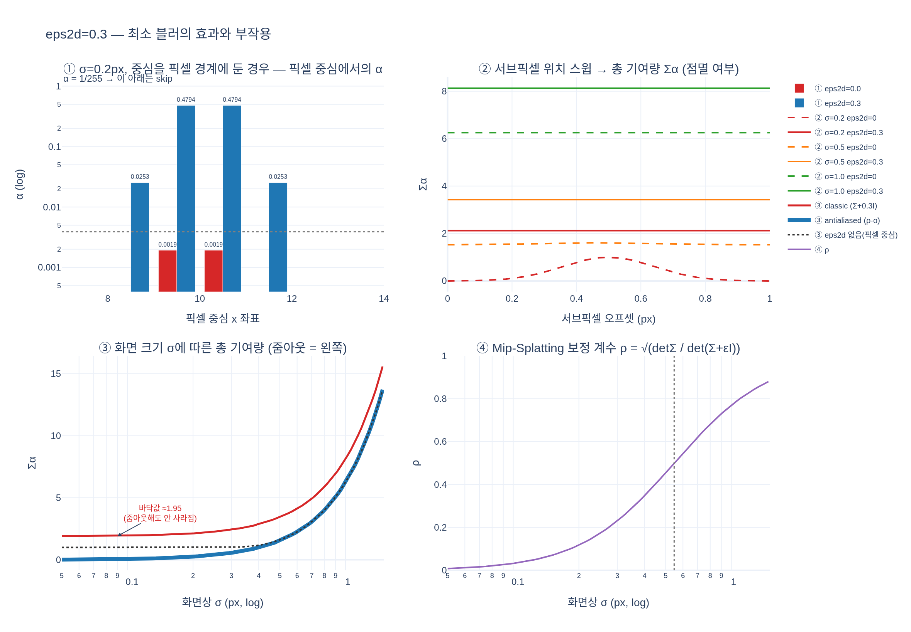

# `eps2d=0.3` — 2D 공분산에 강제로 더하는 최소 블러

> **Q.** `eps2d=0.3`은 무엇이고 왜 필요한가?
> **A.** 2D 공분산에 더하는 최소 블러(단위 px²)다. 이게 없으면 1px보다 작은 Gaussian이 픽셀 중심 사이로 빠져 사라진다.

---

## 1. 어디서 더해지는가

walkthrough의 ②③ 단계(EWA 투영)에서, 3D 공분산을 화면으로 밀어낸 직후에 상수 대각 행렬이 더해진다.

$$\Sigma_{2D} \;=\; J\,\Sigma_c\,J^\top \;+\; \epsilon I,
\qquad \epsilon = \texttt{eps2d} = 0.3\ \ [\text{px}^2]$$

`.fm/assets/rasterization_walkthrough.py`의 `project_manually`:

```python
cov2d = J @ covars_c @ J.transpose(-1, -2)
cov2d = cov2d + eps2d * torch.eye(2, device=means.device)   # 최소 0.3px² 블러
```

**단위가 중요하다.** $J$를 적용한 뒤이므로 $\Sigma_{2D}$는 이미 **픽셀 제곱** 단위다. 따라서 $\epsilon = 0.3$은
"0.3 픽셀제곱만큼의 분산을 모든 방향에 바닥으로 깔아준다"는 뜻이고, 고윳값 관점에서는

$$\lambda_i(\Sigma_{2D}) \;=\; \lambda_i(J\Sigma_c J^\top) + \epsilon \;\ge\; 0.3$$

즉 **모든 축의 표준편차가 최소 $\sqrt{0.3} \approx 0.55$ px**로 보장된다. gsplat 문서에 "eps2d=0.3 leads to
minimal 3 pixel unit"이라 적힌 것은 반경을 $3.33\sigma$로 잡기 때문 — $3.33 \times 0.55 \approx 1.8$px 반경,
지름으로 약 3~4px짜리 최소 크기 스플랫이 된다.

## 2. 유래: Inria 원본 3DGS의 `cov[0][0] += 0.3f`

이 값은 Kerbl et al. 2023의 공식 구현(diff-gaussian-rasterization)의 `computeCov2D`에서 그대로 온 것이다.

```cpp
// Apply low-pass filter: every Gaussian should be at least
// one pixel wide/high. Discard 3rd row and column.
cov[0][0] += 0.3f;
cov[1][1] += 0.3f;
```

주석 자체가 "low-pass filter"라고 말한다. 논문 본문에는 근거가 거의 없는 **매직 넘버**이고,
gsplat도 이를 기본값으로 물려받았다. CUDA 커널 일부 경로에는 0.3이 하드코딩되어 있어
래퍼에 `assert eps2d == 0.3, "This is hard-coded in CUDA to be 0.3"`가 걸려 있는 곳도 있다
(`gsplat/rendering.py`의 `_rasterization`/`rasterization_inria_wrapper` 계열).

## 3. 왜 필요한가 — 픽셀 중심 샘플링과 나이퀴스트

래스터화기 ⑦단계가 픽셀 하나에서 실제로 계산하는 값은 (walkthrough의 식과 동일)

$$\sigma_i = \tfrac12\,\mathbf{d}^\top \Sigma_{2D}^{-1}\mathbf{d},\qquad
\alpha_i = \min\!\left(0.99,\ o_i e^{-\sigma_i}\right),\qquad
\alpha_i < \tfrac{1}{255} \Rightarrow \text{skip}$$

여기서 $\mathbf{d}$는 Gaussian 중심과 **픽셀 중심**(정수 + 0.5)의 차이다.
즉 Gaussian은 **픽셀 면적에 대해 적분되지 않고, 픽셀 중심이라는 점 하나에서만 샘플링된다.**
이건 전형적인 **점 샘플링(point sampling)** 이고, 신호가 격자의 나이퀴스트 한계보다 고주파면
에일리어싱이 생긴다.

- 픽셀 격자의 표본 간격은 1px → 나이퀴스트 차단 주파수는 0.5 cycle/px.
- 화면상 표준편차 $\sigma < 0.5$px인 Gaussian은 그 한계를 넘는 고주파 신호다.
- 결과: 중심이 픽셀 중심에 정확히 얹히면 $\alpha \approx 1$로 밝게 찍히고,
  픽셀 경계(정수 좌표)에 놓이면 가장 가까운 픽셀 중심까지 거리가 $(0.5, 0.5)$라
  $\sigma_i = \frac{0.5^2 + 0.5^2}{2\sigma^2}$가 커져 $\alpha$가 `1/255` 아래로 떨어지고 **완전히 사라진다**.

`σ = 0.2`px의 실제 숫자 (expy.py 실행 결과):

| Gaussian 중심 | eps2d = 0 | eps2d = 0.3 |
|---|---|---|
| 픽셀 중심 (10.5, 10.5) | max α = 0.99, 기여 픽셀 1개, Σα = 0.99 | max α = 0.99, 9개, Σα = 2.12 |
| 픽셀 경계 (10.0, 10.0) | max α = **0.00193 < 1/255 → 0개, Σα = 0** | max α = 0.479, 12개, Σα = 2.12 |

서브픽셀 오프셋을 0→1px 스윕했을 때 총 기여량 $\sum_p \alpha_p$의 변동폭:

| σ | eps2d = 0 | eps2d = 0.3 |
|---|---|---|
| 0.2 px | **281.1 %** (0.00 ↔ 0.99, 점멸) | 0.8 % |
| 0.5 px | 5.8 % | 0.6 % |
| 1.0 px | 0.3 % | 0.2 % |

카메라가 서브픽셀만큼만 움직여도 점이 켜졌다 꺼졌다 하는 **시간적 에일리어싱(깜빡임)** 이 그대로 드러난다.
학습 중에는 더 나쁘다: 사라진 Gaussian은 그래디언트를 못 받아 그대로 죽고, 최적화가 불안정해진다.

### 0.3 px² ≈ (0.55 px)² 저역통과 필터로 읽기

두 Gaussian의 합성곱은 공분산의 덧셈이다:

$$\mathcal{N}(0,\Sigma) * \mathcal{N}(0,\epsilon I) = \mathcal{N}(0,\ \Sigma + \epsilon I)$$

따라서 $+\,\epsilon I$는 **표준편차 $\sqrt{0.3} \approx 0.55$px인 등방 Gaussian 저역통과 필터를 씌우는 것과 정확히 같다.**
0.55px는 나이퀴스트 한계(≈0.5px)와 같은 스케일이고, "0.3"은 그 근처에서 경험적으로 고른 값이다.

### EWA 원 논문과의 연결 — resampling filter

이 아이디어의 원조는 Zwicker et al.의 **EWA Splatting** (그리고 그 뿌리인 Heckbert의 EWA 텍스처 필터링)이다.
거기서 화면에 실제로 그리는 커널은 두 가지의 합성곱이다:

$$\underbrace{\rho}_{\text{resampling filter}} \;=\;
\underbrace{r}_{\text{reconstruction kernel}} * \underbrace{h}_{\text{low-pass filter}}$$

- **reconstruction kernel** $r$: 3D Gaussian을 화면으로 투영한 $J\Sigma_c J^\top$. 장면을 표현하는 신호.
- **low-pass (prefilter) $h$**: 출력 격자의 나이퀴스트에 맞춘 필터. 화면 공간에서 정의된다.

두 Gaussian의 합성곱이 곧 공분산 덧셈이므로 $\Sigma_\rho = J\Sigma_c J^\top + \epsilon I$가 되고,
3DGS/gsplat의 `+0.3I`는 정확히 이 **화면 공간 prefilter $h$의 (단순화된, 등방 고정폭) 구현**이다.
원 EWA에서는 $h$의 폭을 출력 필터 설계에 따라 정하지만, 3DGS는 상수 0.3으로 못 박았다.

## 4. 부작용 — 작은 Gaussian이 실제보다 밝고 두꺼워진다

$\Sigma \to \Sigma + \epsilon I$는 면적(행렬식)을 키우므로, 화면에 남는 총 에너지도 커진다.
문제는 이게 **크기에 비대칭적으로** 작용한다는 것이다.

- $\sigma \gg \sqrt{0.3}$ (가까이/크게 보이는 Gaussian): $\epsilon$은 무시할 만큼 작아 거의 영향 없음.
- $\sigma \to 0$ (줌아웃 / 멀리 있는 Gaussian): 원래는 화면에서 사라져야 하는데,
  $\Sigma+\epsilon I$가 만든 **바닥 크기**에 걸려 계속 최소 3px짜리 얼룩으로 남는다.

expy.py의 ③패널 수치 (픽셀 중심 기준 $\sum_p \alpha_p$):

| σ (px) | ρ | eps2d 없음 | classic (Σ+0.3I) | antialiased (ρ·o) |
|---|---|---|---|---|
| 0.10 | 0.0327 | 0.990 | **1.947** | 0.059 |
| 0.30 | 0.2353 | 1.008 | 2.445 | 0.572 |
| 0.55 | 0.4999 | 1.887 | 3.750 | 1.880 |
| 0.99 | 0.7646 | 6.099 | 7.971 | 6.102 |
| 1.99 | 0.9294 | 24.702 | 26.570 | 24.703 |

`classic`은 $\sigma \to 0$에서 **1.95라는 바닥값**에 걸린다. 이것이 "줌아웃하면 장면이 뿌옇게 밝아지는"
전형적인 3DGS 아티팩트(scale/zoom-dependent brightness dilation)의 원인 중 하나다.
학습 해상도와 다른 해상도로 렌더하면 특히 눈에 띈다.

### Mip-Splatting의 `antialiased` 모드

Yu et al. **Mip-Splatting: Alias-free 3D Gaussian Splatting** (2023)은 이 밝기 팽창을
**불투명도 보정 계수**로 되돌린다. 블러 전후 행렬식 비의 제곱근을 불투명도에 곱한다:

$$\rho = \sqrt{\frac{\det \Sigma}{\det(\Sigma + \epsilon I)}},
\qquad o \leftarrow \rho\,o$$

직관: Gaussian의 최댓값 $\times$ 면적 $\propto o\sqrt{\det\Sigma}$가 총 에너지이므로,
면적이 $\sqrt{\det(\Sigma+\epsilon I)}$로 커진 만큼 최댓값을 깎아 **에너지를 보존**한다.
등방 $\Sigma = \sigma^2 I$이면 $\rho = \dfrac{\sigma^2}{\sigma^2 + \epsilon}$이고,
$\sigma = \sqrt{0.3} \approx 0.55$px에서 정확히 $\rho = 0.5$가 된다.

위 표에서 $\sigma \gtrsim 0.55$px 구간의 `antialiased` 열이 `eps2d 없음` 열과 소수점 셋째 자리까지
일치하는 것을 볼 수 있다 — 블러는 유지하되(깜빡임 없음) 밝기는 원래대로(팽창 없음).
그리고 $\sigma \to 0$에서는 0.059까지 매끄럽게 **옅어진다** — 서브픽셀 크기의 점이 취해야 할 올바른 거동이다.

> 참고: Mip-Splatting 논문의 본체는 여기에 더해 **3D smoothing filter**(학습 뷰들의 최대 샘플링
> 주파수에 맞춰 3D 공분산 자체에 최소 크기를 주는 것)도 제안한다. gsplat의 `rasterize_mode="antialiased"`가
> 구현하는 것은 그중 2D 쪽(=위 $\rho$ 보정, 논문의 "2D Mip filter")이다.

## 5. gsplat에서의 파라미터 위치

| 위치 | 내용 |
|---|---|
| `gsplat/rendering.py::rasterization(...)` | `eps2d: float = 0.3` 인자. docstring: *"An epsilon added to the eigenvalues of projected 2D covariance matrices... eps2d=0.3 leads to minimal 3 pixel unit."* |
| `gsplat/rendering.py` | `rasterize_mode: "classic" \| "antialiased"` — 후자면 `calc_compensations=True`로 투영 호출 |
| `gsplat/cuda/_torch_impl.py::_fully_fused_projection` | `det_orig` 계산 → `covars2d = covars2d + torch.eye(2) * eps2d` → `det` 계산 → `compensations = sqrt(clamp(det_orig / det, MIN_COMPENSATION²))` |
| `gsplat/rendering.py` | `if compensations is not None: opacities = opacities * compensations` |
| `gsplat/cuda/_constants.py` | `MIN_COMPENSATION = 0.005` (보정 계수 하한; `Common.h`에도 동일 매크로) |
| `gsplat/cuda/include/Utils.cuh` | CUDA 쪽 동일 로직: `compensation = sqrtf(max(MIN_COMPENSATION², det_orig / det_blur))` |
| CUDA 하드코딩 경로 | 일부 래퍼에 `assert eps2d == 0.3, "This is hard-coded in CUDA to be 0.3"` |

## 6. 한 줄 요약

`eps2d=0.3`은 **픽셀 중심 점샘플링 때문에 서브픽셀 Gaussian이 사라지거나 깜빡이는 것을 막는
화면 공간 저역통과 필터**($\approx 0.55$px 폭)이고, 그 대가인 밝기 팽창은
`rasterize_mode="antialiased"`의 $\rho = \sqrt{\det\Sigma / \det(\Sigma+\epsilon I)}$ 보정으로 되돌린다.

## 시각화



- **①** σ=0.2px Gaussian을 픽셀 경계에 두면 `eps2d=0`(빨강)에서는 모든 픽셀 중심의 α가 0.0019로
  `1/255` 점선 아래 → 전부 skip. `eps2d=0.3`(파랑)은 0.479로 살아남는다.
- **②** 서브픽셀 위치를 0→1px 스윕. 점선(eps2d=0, σ=0.2)만 0↔0.99로 요동친다 = 깜빡임.
  실선(eps2d=0.3)은 평평하다.
- **③** 화면 크기 σ에 따른 총 기여량. `classic`(빨강)은 σ→0에서 1.95 바닥값에 걸려 안 사라지고,
  `antialiased`(굵은 파랑)는 이상 곡선(검은 점선)을 σ≳0.55px에서 그대로 따라가며 σ→0에서는 0으로 수렴한다.
- **④** 보정 계수 $\rho$. σ=√0.3≈0.55px에서 정확히 0.5.
