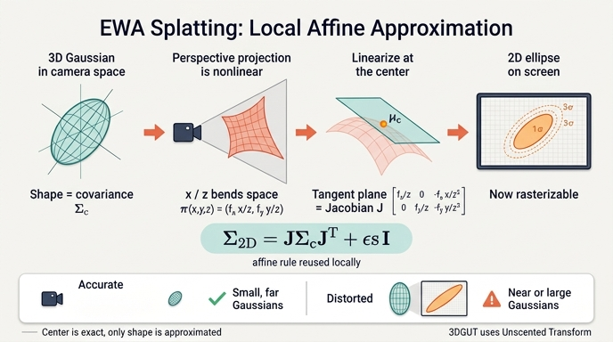

# 원근 투영은 비선형인데, 어떻게 공분산을 2D로 밀어내는가

> **Q.** 원근 투영이 비선형인데도 공분산을 어떻게 2D로 밀어내는가?
>
> **A.** $\mu_c$ 지점에서 투영함수의 1차 근사인 Jacobian $J$를 구해 $\Sigma_{2D} = J\Sigma_c J^\top + \epsilon I$로 계산한다. 이것이 EWA(Elliptical Weighted Average) splatting의 핵심 아이디어다.

---

## 1. 문제의 구조: Gaussian은 아핀에는 닫혀 있지만, 원근 투영은 아핀이 아니다

3D Gaussian Splatting에서 하나의 프리미티브는 평균 $\mu \in \mathbb{R}^3$과 공분산 $\Sigma \in \mathbb{R}^{3\times3}$ (대칭 양정치)로 정의된다.

$$G(\mathbf{x}) = \exp\!\left(-\tfrac12 (\mathbf{x}-\mu)^\top \Sigma^{-1} (\mathbf{x}-\mu)\right)$$

여기서 결정적으로 중요한 성질이 **Gaussian은 아핀 변환에 닫혀 있다(closed under affine transforms)**는 것이다. $\mathbf{y} = A\mathbf{x} + b$라면

$$\mu' = A\mu + b, \qquad \Sigma' = A\,\Sigma\,A^\top$$

이고, 결과도 **여전히 Gaussian**이다. 모양이 다른 분포(예: 바나나 모양)로 변형되지 않는다.

문제는 카메라 파이프라인의 두 단계가 성질이 전혀 다르다는 데 있다.

| 단계 | 변환 | 아핀인가? |
|---|---|---|
| 월드 → 카메라 (view) | $\mathbf{x}_c = R\mathbf{x} + t$ | ✅ 아핀 (실제로는 강체변환) |
| 카메라 → 화면 (원근 투영) | $\pi(x,y,z) = (f_x \tfrac{x}{z} + c_x,\; f_y \tfrac{y}{z} + c_y)$ | ❌ **비선형** ($z$로 나눔) |

즉 view 변환까지는 공분산이 $\Sigma_c = R\Sigma R^\top$로 정확히(근사 없이) 옮겨간다. 하지만 원근 나눗셈 $x/z$는 유리함수이므로, 여기에 Gaussian을 통과시키면 **결과는 더 이상 Gaussian이 아니다**. 정확히 말하면 3D Gaussian을 광선 방향으로 적분해 화면에 투영한 진짜 footprint는 닫힌 형식(closed form)이 없고, 화면 좌표에서 왜곡된(휘어진) 모양이 된다.

래스터라이저는 픽셀마다 `exp(-0.5 * mahalanobis)`를 상수 시간에 평가해야 한다. 즉 **화면 위에서도 반드시 2D Gaussian(=타원)이어야 한다**. 여기서 근사가 불가피해진다.

## 2. EWA Splatting: 국소 아핀 근사 (Zwicker et al., 2001)

Zwicker, Pfister, van Baar, Gross의 **"EWA Volume Splatting"** (IEEE Visualization 2001, 및 후속 "EWA Splatting" TVCG 2002)이 제시한 해법이 지금 3DGS가 쓰는 바로 그 방법이다.

핵심 아이디어는 한 문장이다.

> 투영함수 $\pi$를 **각 Gaussian의 중심 $\mu_c$ 주변에서만** 1차 테일러 전개해 아핀 변환으로 바꿔치기한다. 그러면 "아핀에 닫혀 있다"는 성질을 다시 쓸 수 있다.

### 2.1 테일러 1차 근사

$\mu_c = (x_0, y_0, z_0)$ 근처에서

$$\pi(\mathbf{x}_c) \;\approx\; \underbrace{\pi(\mu_c)}_{\text{정확한 중심}} \;+\; \underbrace{J}_{\partial\pi/\partial\mathbf{x}|_{\mu_c}} (\mathbf{x}_c - \mu_c)$$

이 우변은 $\mathbf{x}_c$에 대한 **아핀 함수**다 ($A = J$, $b = \pi(\mu_c) - J\mu_c$). 따라서 Gaussian이 Gaussian으로 보존되고, 앞의 규칙을 그대로 적용하면

$$\mu_{2D} = \pi(\mu_c), \qquad \boxed{\;\Sigma_{2D} = J\,\Sigma_c\,J^\top\;}$$

중요한 비대칭이 하나 있다. **평균은 근사하지 않는다.** `means2d`는 $J\mu_c + b$가 아니라 실제 $\pi(\mu_c)$를 그대로 쓴다(1차 근사는 전개점에서 정확하므로 어차피 동일하다). 근사가 실제로 개입하는 곳은 **공분산(모양)뿐**이다. 그래서 splat의 위치는 항상 정확하고, 왜곡되는 것은 타원의 모양/크기다.

### 2.2 왜 $J\Sigma J^\top$인가

선형변환 $\mathbf{y} = J\mathbf{x}$에서 공분산의 정의를 직접 밀어보면 나온다. 중심을 0으로 두면

$$\Sigma_y = \mathbb{E}[\mathbf{y}\mathbf{y}^\top] = \mathbb{E}[(J\mathbf{x})(J\mathbf{x})^\top] = \mathbb{E}[J\mathbf{x}\mathbf{x}^\top J^\top] = J\,\mathbb{E}[\mathbf{x}\mathbf{x}^\top]\,J^\top = J\Sigma_x J^\top$$

$J$는 상수 행렬이라 기댓값 밖으로 나온다. 1차원 스칼라의 $\mathrm{Var}(aX) = a^2\mathrm{Var}(X)$가 행렬로 확장된 형태이며, $a^2$가 $J(\cdot)J^\top$로 "양쪽에서 곱하는" 꼴이 되는 이유는 공분산이 이차형식(bilinear)이기 때문이다.

부수적으로 이 형태는 **대칭성과 양반정치성을 자동으로 보존한다**: 임의의 $v$에 대해 $v^\top J\Sigma J^\top v = (J^\top v)^\top \Sigma (J^\top v) \ge 0$. 즉 $\Sigma_{2D}$는 언제나 유효한 공분산이다(단, $J$의 랭크가 부족하면 특이해질 수 있고 — 이 부분이 뒤의 $\epsilon I$와 연결된다).

### 2.3 원근 투영의 Jacobian

$\pi(x,y,z) = \left(f_x\frac{x}{z} + c_x,\; f_y\frac{y}{z} + c_y\right)$를 각 변수로 편미분하면

$$J = \frac{\partial \pi}{\partial (x,y,z)}\Big|_{\mu_c} =
\begin{bmatrix}
\dfrac{f_x}{z} & 0 & -\dfrac{f_x x}{z^2} \\[2mm]
0 & \dfrac{f_y}{z} & -\dfrac{f_y y}{z^2}
\end{bmatrix} \in \mathbb{R}^{2\times3}$$

읽는 법:
- $(1,1)$, $(2,2)$의 $f/z$: **원근 축소**. 멀수록($z$ 큼) 화면상 크기가 작아진다.
- 3열 $-f x/z^2$, $-f y/z^2$: **깊이 방향의 shear**. 화면 중심에서 벗어난($x,y \ne 0$) Gaussian은 깊이 방향으로 늘어난 부분이 화면상에서 기울어진 타원으로 나타난다. 화면 중심($x=y=0$)에서는 이 항이 0이라 depth 성분이 화면에 전혀 기여하지 않는다.
- $J$는 $2\times3$이라 **랭크가 최대 2**다. 3D 타원체를 2D로 눌러버리는 사영이므로 정보 손실은 구조적으로 불가피하다.

$J$가 $2\times3$이므로 $\Sigma_{2D} = J\Sigma_c J^\top$는 자동으로 $2\times2$가 된다. "3행/열을 버린다"는 표현은 아래 원본 EWA와의 비교에서 다시 나온다.

## 3. 3DGS/gsplat이 원본 EWA와 다른 점

Zwicker의 원본 EWA는 볼륨 렌더링 문맥에서 다음 형태로 쓴다 (Kerbl et al. 3DGS 논문에도 이 형태로 인용된다).

$$\Sigma' = J\,W\,\Sigma\,W^\top J^\top$$

여기서 $W$는 월드→카메라 **뷰 변환의 회전 부분**이다. 즉 두 변환을 **하나의 합성 아핀 근사**로 묶은 것이다. 이는 gsplat이 하는 2단계 계산과 수학적으로 동일하다.

$$\Sigma_c = W\Sigma W^\top \quad\longrightarrow\quad \Sigma_{2D} = J\Sigma_c J^\top$$

두 표기의 차이점과 구현상의 세부는 다음과 같다.

1. **$W$ 곱이 명시적이다.** 원본 EWA는 오브젝트→카메라 변환을 별도 항으로 두는데, 3DGS 계열은 이를 커널 안에서 $\Sigma_c = R\Sigma R^\top$로 먼저 계산해 둔다(gsplat CUDA에서는 `covarW2C(R, covar, covar_c)`). 평행이동 $t$는 공분산에 영향이 없어 회전만 들어간다.

2. **3행/열을 버린다.** Zwicker의 원본 유도에서 $J$는 3번째 성분(깊이/광선방향)을 포함한 $3\times3$ 형태로 쓰이고, 화면에 투영된 2D footprint를 얻기 위해 3번째 행과 열을 잘라낸다(이는 3번째 축을 따라 적분/주변화(marginalize)하는 것과 같다 — Gaussian에서 주변화는 해당 행·열을 지우는 것과 동일하기 때문이다). 3DGS/gsplat은 처음부터 $J$를 $2\times3$으로 만들어 같은 결과를 한 번에 얻는다. Inria 원본 3DGS 구현에는 `cov[0][2]`, `cov[1][2]`를 실제로 버리는 코드가 남아 있다.

3. **$+\,\epsilon I$ (dilation / 최소 블러).** 원본 EWA는 재구성 커널(reconstruction kernel)과 저역통과 필터(low-pass filter)를 **합성곱**해 안티에일리어싱하는데, Gaussian끼리의 합성곱은 공분산의 덧셈이다. 3DGS는 이를 등방 필터로 단순화해 $\Sigma_{2D} \leftarrow \Sigma_{2D} + \epsilon I$ ($\epsilon = $ `eps2d` $= 0.3\,\text{px}^2$)로 처리한다. 목적은 두 가지다.
   - **안티에일리어싱/소실 방지**: 1px보다 작은 Gaussian이 픽셀 중심 사이로 빠져 사라지는 것을 막는다.
   - **수치적 안정성**: $J$의 랭크 부족이나 극도로 납작한 Gaussian으로 $\Sigma_{2D}$가 특이(singular)해지면 역행렬(conic)을 못 구한다. $\epsilon I$가 최소 고윳값 하한을 보장한다.

   다만 이 dilation은 밝기를 약간 낮추므로, gsplat은 `compensation = sqrt(det(Σ) / det(Σ+εI))`를 함께 계산해 `rasterize_mode="antialiased"`에서 opacity에 곱해 보정한다(`add_blur`).

4. **저장되는 것은 $\Sigma_{2D}$가 아니라 그 역행렬(conic)이다.** 래스터화 루프는 $\sigma = \tfrac12 (\mathbf{d}^\top \Sigma_{2D}^{-1} \mathbf{d})$만 필요하므로 $\Sigma_{2D}^{-1}$의 상삼각 3성분 $(a,b,c)$를 미리 저장한다. 이름 "conic"은 $\{ \mathbf{d} : \mathbf{d}^\top \Sigma_{2D}^{-1}\mathbf{d} = \text{const}\}$가 원뿔곡선(타원)이라서 붙었다.

5. **Jacobian 폭주를 막는 clamp.** $x/z$가 커질수록 $J$의 3열 $-fx/z^2$이 폭발한다. 화면 밖 멀리 있는 Gaussian은 근사가 무의미할 정도로 커진 $J$ 때문에 거대한 타원이 되어 성능·품질을 망친다. 그래서 Inria 원본부터 이어진 트릭으로, $J$를 만들기 전에 $x/z$, $y/z$를 시야각의 약 1.3배 안으로 clamp한다.

   ```python
   lim_x_pos = (width - cx) / fx + 0.3 * tan_fovx      # tan_fovx = 0.5*width/fx
   tx = tz * torch.clamp(tx / tz, min=-lim_x_neg, max=lim_x_pos)
   # 이 clamp된 tx, ty가 J의 3열에만 쓰인다 (means2d는 clamp 안 된 x,y로 계산)
   ```

   주의: clamp된 값은 **$J$에만** 들어가고, 투영 중심 `means2d`는 원래 $x, y$로 계산된다.

## 4. 근사가 깨지는 곳 — 그리고 그 대안

1차 테일러 근사는 "Gaussian이 $\mu_c$ 주변 좁은 영역에만 질량이 있다"는 가정 위에 서 있다. 이 가정이 약해지면 오차가 커진다.

- **카메라에 아주 가까운 Gaussian ($z$가 작음)**: $J \propto 1/z$, $1/z^2$이므로 $\mu_c$에서 조금만 벗어나도 실제 $\pi$와 선형 근사의 차이가 급격히 벌어진다.
- **아주 큰 Gaussian**: 분포가 넓게 퍼져 있어서, 중심에서 먼 영역까지 "중심에서의 접평면"으로 대신하게 된다.
- **화면 가장자리 / 광각 렌즈**: $x/z$, $y/z$가 커서 3열 shear 항이 지배적이 되고, 곡률이 큰 영역에서 선형 근사를 한다. 어안·FTheta 같은 넓은 FOV 카메라에서는 더 심각하다.
- 증상은 splat이 실제보다 크거나 작게, 혹은 잘못된 방향으로 늘어나 보이는 것이다. 카메라를 움직이면 모양이 "출렁이는" 뷰 의존적 아티팩트로 나타난다.

**대안 1 — Unscented Transform (3DGUT).** 테일러 전개 대신, Gaussian에서 결정론적 시그마 포인트(sigma points) 몇 개를 뽑아 **비선형 함수 $\pi$에 그대로 통과시킨 뒤**, 투영된 점들의 표본 공분산으로 $\Sigma_{2D}$를 추정한다. 미분 가능한 근사 함수가 필요 없고, 비선형성/왜곡 렌즈/롤링 셔터를 훨씬 잘 다룬다. gsplat에서는 `with_ut=True`(커널 `ProjectionUT3DGSFused.cu`)로 켠다.

**대안 2 — 3D에서 직접 평가 (`with_eval3d=True`).** 근사의 근본 원인은 "화면 위의 2D Gaussian으로 만들어야 한다"는 제약이다. 이 제약을 버리고, 픽셀마다 광선을 쏘아 **3D 공간에서 Gaussian 응답을 직접 계산**하면 $J$ 자체가 필요 없다. `with_ut`와 `with_eval3d`를 함께 켜는 것이 3DGUT 구성이며, gsplat은 `rasterize_mode != "classic"`과의 조합을 막아 둔다.

## 5. gsplat 코드에서의 대응 위치

| 단계 | 위치 |
|---|---|
| 워크스루의 개념 설명 + 손계산 (`project_manually`) | `fm/rasterization/.fm/assets/rasterization_walkthrough.py` §3 "②③ 카메라 변환 + 원근 투영 (EWA splatting)" |
| PyTorch 참조 구현 (clamp 포함) | `/home/sungwoo/projects/swcho/gsplat/gsplat/cuda/_torch_impl.py` → `_persp_proj` (L53~108) |
| 전체 투영 파이프라인 참조 구현 | 같은 파일 `_fully_fused_projection` |
| CUDA device 함수 (J 구성 + $J\Sigma J^\top$) | `/home/sungwoo/projects/swcho/gsplat/gsplat/cuda/include/Utils.cuh` → `persp_proj` (L567~) |
| $\epsilon I$ dilation + compensation | 같은 파일 `add_blur` (L455~) |
| 융합 커널 (Σ 생성 → view → 투영 → conic → radii → 컬링) | `/home/sungwoo/projects/swcho/gsplat/gsplat/cuda/csrc/ProjectionEWA3DGSFused.cu` → `projection_ewa_3dgs_fused_fwd_kernel` |
| Unscented Transform 경로 | `/home/sungwoo/projects/swcho/gsplat/gsplat/cuda/csrc/ProjectionUT3DGSFused.cu`, `rasterization(..., with_ut=True, with_eval3d=True)` |

### 워크스루의 최소 재현 코드

```python
R, t = viewmat[:3, :3], viewmat[:3, 3]
means_c  = means @ R.T + t                 # ② μ_c = R μ + t        (아핀 — 정확)
covars_c = R @ covars @ R.T                #    Σ_c = R Σ Rᵀ        (아핀 — 정확)
x, y, z = means_c.unbind(-1)

means2d = torch.stack([fx * x / z + cx, fy * y / z + cy], -1)   # ③ π(μ_c) — 근사 아님
O = torch.zeros_like(z)
J = torch.stack([fx / z, O, -fx * x / z**2,
                 O, fy / z, -fy * y / z**2], -1).reshape(-1, 2, 3)
cov2d = J @ covars_c @ J.transpose(-1, -2)                       # ← 여기서만 1차 근사
cov2d = cov2d + eps2d * torch.eye(2)                             # 최소 0.3 px² 블러
conics = inverse(cov2d)                                          # 래스터화가 실제로 쓰는 것
radii  = ceil(3.33 * cov2d.diagonal().sqrt())
```

## 6. 한 줄 요약

원근 투영은 비선형이라 Gaussian을 Gaussian으로 보존하지 못한다. EWA splatting은 **각 Gaussian의 중심 $\mu_c$에서만 투영함수를 접평면(1차 테일러)으로 갈아끼워** 국소적으로 아핀 문제로 바꾸고, 아핀에서 성립하는 공분산 전파 법칙 $\Sigma \mapsto J\Sigma J^\top$을 적용한다. 중심 위치는 정확한 $\pi(\mu_c)$를 쓰므로 근사 오차는 **타원의 모양에만** 들어가고, 가깝고 큰 Gaussian이나 광각에서 그 오차가 드러나 3DGUT의 Unscented Transform / `with_eval3d` 같은 대안이 나왔다.

## 참고

- Zwicker, Pfister, van Baar, Gross, *EWA Volume Splatting*, IEEE Visualization 2001 / *EWA Splatting*, TVCG 2002.
- Kerbl, Kopanas, Leimkühler, Drettakis, *3D Gaussian Splatting for Real-Time Radiance Field Rendering*, SIGGRAPH 2023 — 식 (5) $\Sigma' = JW\Sigma W^\top J^\top$.
- Wu et al., *3DGUT: Enabling Distorted Cameras and Secondary Rays in Gaussian Splatting*, CVPR 2025 — Unscented Transform 대체.
- Yu et al., *Mip-Splatting* — dilation/필터링과 스케일 의존 아티팩트 논의.

## 인포그래픽


