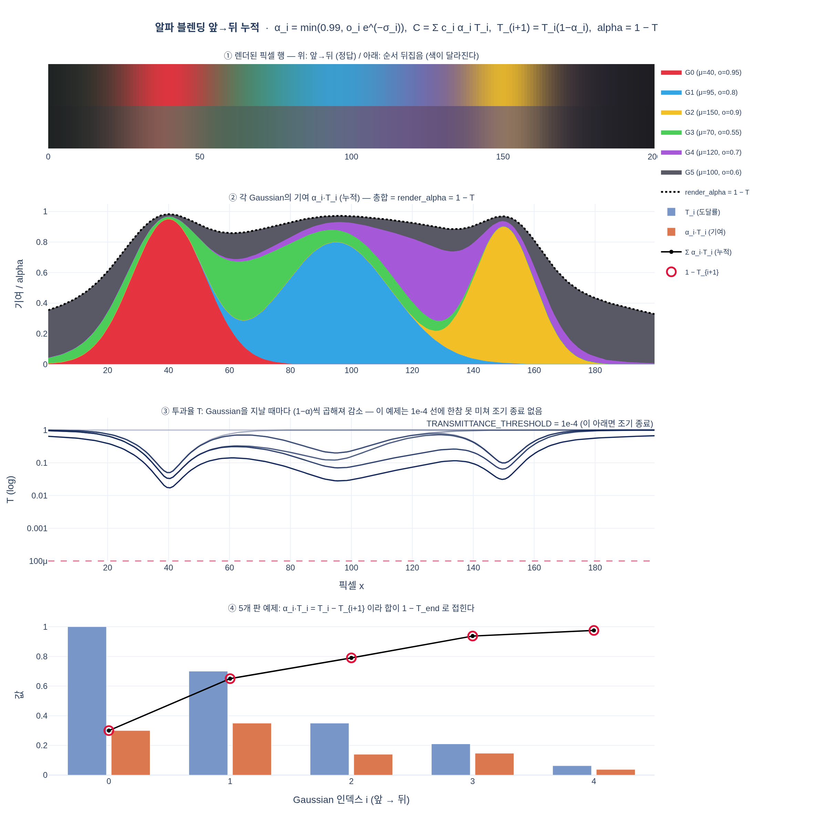
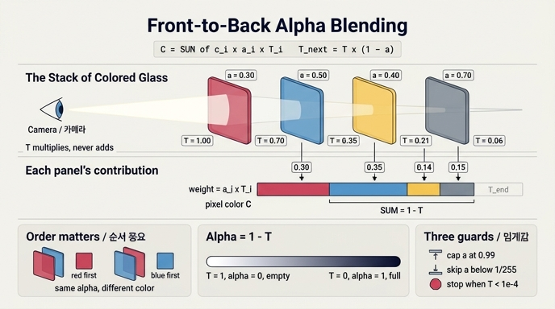

# 알파 블렌딩의 누적 공식(앞→뒤 순회)은?

$$\alpha_i = \min(0.99,\ o_i e^{-\sigma_i}),\qquad
C_p = \sum_i c_i\,\alpha_i\,T_i,\qquad
T_{i+1} = T_i(1-\alpha_i)$$

최종적으로 `render_alpha = 1 - T`가 된다.

## 시각화

## 인포그래픽

