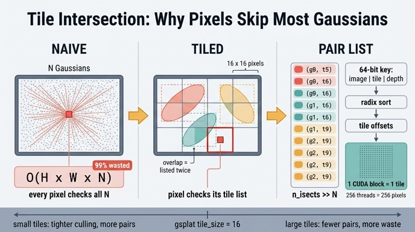

# 타일 교차(tile intersection) — 픽셀마다 N개를 다 보지 않는 법

**Q.** 픽셀마다 모든 N개 Gaussian을 검사하지 않기 위해 무엇을 하는가?

**A.** 화면을 16×16 타일로 나누고, 각 Gaussian이 어느 타일들을 덮는지 **(Gaussian, 타일) 쌍의 리스트**로 만든다. 그러면 픽셀은 자기 타일의 Gaussian만 보면 된다.

---

## 1. 문제: naive는 O(H·W·N)

알파 블렌딩 자체는 단순하다. 픽셀 p의 색은

$$\sigma_i = \tfrac12(a\,dx^2 + c\,dy^2) + b\,dx\,dy,\quad
  \alpha_i = \min(0.99,\ o_i e^{-\sigma_i}),\quad
  C_p = \sum_i c_i\,\alpha_i\,T_i,\quad T_{i+1} = T_i(1-\alpha_i)$$

문제는 "어떤 i를 더할 것인가"다. 아무 구조 없이 하면 **모든 픽셀이 모든 Gaussian을 검사**해야 한다.

| | 검사 횟수 |
|---|---|
| naive | `H·W·N` |
| 1080p, N=1M | 1920·1080·10⁶ ≈ **2×10¹²** |

게다가 대부분은 헛수고다. 화면에서 한 Gaussian이 실제로 닿는 픽셀은 반경 몇 px~수십 px 범위뿐이고, 나머지 수백만 픽셀에서는 α가 `ALPHA_THRESHOLD = 1/255` 아래라 어차피 버려진다. 즉 **계산의 99.99%가 "이건 나랑 상관없다"를 확인하는 데** 쓰인다.

여기에 더 나쁜 것: 알파 블렌딩은 **순서 의존**이라 각 픽셀이 자기와 관련된 Gaussian을 깊이순으로 정렬해야 한다. 픽셀마다 정렬을 돌리는 건 GPU에서 재앙이다.

## 2. 해법: 타일로 공간 분할 → sort-then-splat

핵심 관찰은 **"인접한 픽셀들은 거의 같은 Gaussian 집합을 본다"**는 것이다. 그러면 픽셀 단위가 아니라 **픽셀 묶음(타일) 단위로 한 번만** 후보를 추리고 한 번만 정렬하면 된다.

절차는 세 단계다.

1. **분할** — 화면을 16×16 픽셀 타일 격자로 자른다. `tile_w = ceil(W/16)`, `tile_h = ceil(H/16)`.
2. **교차 열거** — 투영된 각 Gaussian에 대해, 그 `radii` 사각형(또는 AccuTile의 타원)이 겹치는 타일을 모두 찾아 `(Gaussian, 타일)` 쌍을 뱉는다. 쌍의 총 개수가 `n_isects`.
3. **정렬 + 오프셋** — 쌍마다 64bit 키를 붙여 radix sort하면 같은 타일의 Gaussian이 연속 구간으로 모이고, 그 안에서는 가까운 것부터 정렬된다. 타일별 시작 인덱스를 뽑으면 끝.

이후 픽셀 p는 **자기 타일의 구간만** 앞→뒤로 훑는다. 검사 횟수는 `H·W·N`이 아니라 `Σ_tile (타일 픽셀 수 × 그 타일의 리스트 길이)` = `256 · n_isects`로 줄고, 정렬은 픽셀 수만큼이 아니라 **타일당 한 번**만 일어난다(그마저도 전역 radix sort 한 번에 융합).

이게 원 3DGS 논문(Kerbl et al., SIGGRAPH 2023) **Sec. 6 "Fast Differentiable Rasterizer for Gaussians"**의 sort-then-splat 구조다. 논문은 이렇게 소개한다: 화면을 16×16 타일로 나누고 → 절두체·타일 컬링(99% 신뢰 타원 기준) → Gaussian을 자기가 덮는 타일 수만큼 **복제(instantiate)**해서 `[타일 ID | view-space depth]` 키를 붙이고 → GPU radix sort **한 번** → 타일별 리스트 확보 → 타일 하나당 스레드 블록 하나를 띄워 shared memory로 협력 적재 후 앞→뒤 알파 블렌딩. "픽셀별 정렬"을 "쌍의 전역 정렬 한 번"으로 바꾼 것이 이 논문 성능의 뼈대이고, 근사(픽셀별 정확한 깊이 정렬이 아니라 타일 단위 근사)를 감수한 대가로 실시간을 얻었다.

## 3. 왜 하필 16×16인가

`16 × 16 = 256`. 이 숫자가 CUDA 실행 모델과 정확히 맞물린다.

- **블록 = 타일, 스레드 = 픽셀.** 래스터화 커널은 `rasterize_to_pixels_3dgs_fwd_kernel<CDIM, TILE_SIZE=16, CTA_SIZE=256>`로 뜬다. 블록 하나가 타일 하나를 맡고, 256 스레드가 타일 안 256 픽셀에 1:1 대응한다(`PIXELS_PER_THREAD = TILE_SIZE²/CTA_SIZE = 1`). 256은 워프(32) 8개 — 점유율(occupancy)이 좋고 대부분 아키텍처에서 무난한 블록 크기다.
- **shared memory 배치 적재와 맞물린다.** 커널은 타일 리스트를 256개씩 끊어(`BATCH_SIZE = CTA_SIZE`) 처리한다. 각 스레드가 Gaussian **하나씩** shared memory에 적재(`id, xy, opacity, conic`) → `__syncthreads()` → 256 스레드가 그 256개를 **같이 읽으며** 자기 픽셀 값을 누적. 전역 메모리 읽기 한 번이 256 픽셀에 재사용된다. "스레드 수 = 픽셀 수 = 배치 크기"라서 적재 루프가 인덱싱 없이 딱 떨어진다.
- **조기 종료도 블록 단위로.** 타일의 모든 픽셀이 `T ≤ TRANSMITTANCE_THRESHOLD = 1e-4`로 포화되면 `__syncthreads_count(done) == 256`으로 블록 전체가 리스트 나머지를 건너뛴다.
- **타일 크기는 2의 거듭제곱이어야 한다** — 커널이 `TILE_MASK = TILE_SIZE-1`, `TILE_SHIFT = ctz(TILE_SIZE)`로 나눗셈 없이 픽셀 좌표를 뽑기 때문에 `static_assert`가 걸려 있다.

gsplat에서 실제 지원되는 값은 좁다: 3DGS 커널은 `TILE_SIZE=16`으로만 컴파일되고(테스트용 `tile_size=4` 예외), 3DGUT 경로만 `{8, 16}`을 컴파일 타임 디스패치한다.

## 4. `n_isects`는 N보다 훨씬 클 수 있다

여기가 직관을 배신하는 지점이다. 리스트의 길이는 Gaussian 수 N이 **아니다**.

```
n_isects = Σ_g (Gaussian g가 덮는 타일 수)  =  tiles_per_gauss.sum()
```

- 작은 Gaussian: 1~4 타일.
- 화면을 크게 가리는 Gaussian(가까운 배경 판, 하늘, 큰 floater): 수백~수천 타일. 1080p는 120×68 = 8160 타일이므로 최악의 경우 하나가 8160개 쌍을 만든다.

그래서 `n_isects`는 보통 N의 몇 배이고, 큰 Gaussian이 있으면 훨씬 더 커진다. 노트북 8절이 이걸 히스토그램(`tiles_per_gauss`, log 스케일)과 타일별 Gaussian 수 히트맵으로 보여주는 이유다 — 이 분포가 곧 **CUDA 블록별 작업량 불균형**이고, 밀집 영역 타일이 렌더 시간을 지배한다.

부수 효과로 **타일 경계에 걸친 Gaussian은 양쪽 타일에 중복 기록된다.** 이건 버그가 아니라 설계다. 각 타일이 자기 리스트를 독립적으로 갖고 있어야 블록들이 서로 통신 없이 병렬로 돌 수 있다. 중복은 메모리·정렬 비용으로 지불하고, 그 대가로 블록 간 동기화가 0이 된다.

## 5. 흐름: 쌍 → 64bit 키 → 정렬 → 오프셋 → 블록별 순회

노트북 ⑤⑥⑦ 단계가 그대로 이 파이프라인이다.

### (a) 쌍 열거와 키 부착

각 쌍에 64비트 정수 키를 만든다:

```
 [ image_id | tile_id | float32(depth) 비트 ]      ← 상위 → 하위
       Xc bits    Xt bits         32 bits
```

- `Xt = bits_for_count(tile_w * tile_h)`, `Xc = bits_for_count(I)`. `Xc + Xt ≤ 32`이어야 하고, 아니면 `intersect_tile`이 `TORCH_CHECK`로 거절한다.
- 하위 32비트는 depth의 **float32 비트 패턴을 그대로** 넣는다. 양수 float은 비트 패턴을 부호 없는 정수로 비교해도 순서가 보존되므로, 별도 변환 없이 정수 radix sort가 곧 깊이 정렬이 된다.
- 상위 비트가 image·tile이므로 정렬 결과는 자동으로 "이미지별 → 타일별로 뭉치고, 타일 안에서는 가까운 것부터"가 된다.

### (b) CUDA 2패스 + CUB radix sort

`IntersectTile.cu`의 `intersect_tile_kernel`은 같은 커널을 **두 번** 돈다 (`cum_tiles_per_gauss == nullptr`이 1차 패스 표시).

1. **1차 패스**: Gaussian마다 덮는 타일 수만 세서 `tiles_per_gauss[idx]`에 쓴다. `radii.x <= 0 || radii.y <= 0`(컬링됨)이면 0.
2. **prefix sum**: 누적합 → 각 Gaussian이 출력 배열의 어디부터 쓸지(`cum_tiles_per_gauss`) 결정. 이걸로 원자적 연산 없이 자리를 잡는다.
3. **2차 패스**: 같은 타일 범위를 다시 돌며 `isect_ids`(키)와 `flatten_ids`(Gaussian의 flatten 인덱스)를 그 자리에 채운다.
4. **CUB radix sort**: 키로 정렬하고 `flatten_ids`를 같이 따라 움직인다(key-value sort).

순수 PyTorch 참조 `_isect_tiles`는 같은 규칙을 루프로 쓴다 — 타일 AABB를

```python
tile_mins = floor(means2d/tile_size - radii/tile_size)   # clamp(0, tile_w/h)
tile_maxs = ceil (means2d/tile_size + radii/tile_size)
tiles_per_gauss = (tile_maxs - tile_mins).prod(-1) * (radii > 0).all(-1)
```

로 잡고 `for y in range(min.y, max.y): for x in range(min.x, max.x)`로 열거한다. 노트북은 CUDA와 이 참조가 `tiles_per_gauss`, `isect_ids`, `flatten_ids` 모두 정확히 일치함을 확인한다.

### (c) 타일 오프셋 (`isect_offset_encode`)

정렬된 키에서 **타일 ID가 바뀌는 지점**을 찾아 `isect_offsets [I, tile_h, tile_w]`를 만든다. 타일 t의 Gaussian 목록은

```python
flatten_ids[offsets[t] : offsets[t+1]]      # 마지막 타일은 n_isects까지
```

빈 타일은 이전 오프셋을 그대로 물려받아 길이 0이 된다. 이제 **블록 인덱스만으로 O(1)에 자기 작업 범위를 찾을 수 있다** — 이게 이 자료구조의 목적 전부다.

### (d) 블록별 순회 (`rasterize_to_pixels`)

```
블록(blockIdx)  = 타일 하나          →  range = [isect_offsets[tile], isect_offsets[tile+1])
스레드(tid)     = 타일 안 픽셀 하나   →  T=1, pix_out=0
for batch in range(0, len(range), 256):
    각 스레드가 Gaussian 1개씩 shared memory에 적재 (id, xy, opacity, conic)   __syncthreads()
    for g in batch(앞→뒤):  σ, α 계산 → 건너뛰기/누적/종료 판정
    __syncthreads_count(done) == 256 이면 타일 전체 조기 종료
```

노트북의 `rasterize_naive`가 이 커널을 순수 PyTorch로 옮긴 것이다 — 타일 루프 = 블록, 타일 안 픽셀 텐서 = 스레드들, Gaussian 루프 = 직렬 순회. backward도 **같은 타일 리스트를 뒤→앞으로** 재순회하므로, 이 자료구조는 forward/backward 양쪽이 공유한다.

## 6. 타일 크기 트레이드오프

| | 작은 타일 (예: 8×8) | 큰 타일 (예: 32×32) |
|---|---|---|
| 컬링 정확도 | **높음** — 타일이 Gaussian을 촘촘히 감싸 헛일 적음 | 낮음 — 한 타일에 무관한 Gaussian이 많이 섞임 |
| `n_isects` | **많음** — 경계 중복이 늘어 쌍 수 폭증 | 적음 |
| 정렬 비용 | 큼 (`n_isects` 비례) | **작음** |
| 블록당 shared memory | **작음** → SM에 블록 여럿 co-resident, 점유율↑ | 큼 → co-residency↓ |
| 블록 수 | 많음 (스케줄링 오버헤드) | **적음** |
| 픽셀당 헛계산 | 적음 | 많음 |

즉 **정확한 컬링(적은 헛계산) ↔ 적은 교차·정렬 비용**의 맞교환이고, 최적점은 워크로드마다 다르다. gsplat의 `_resolve_tile_size` 주석이 실측 근거를 남겨 놨다:

- `tile=8` (CTA=32, PPT=2): **1080p 미만에서 승리.** 타일당 shared memory가 작아 SM에 블록이 많이 올라가고, 픽셀 수가 적으니 intersect+sort 비용 자체가 작다.
- `tile=16` (CTA=256, PPT=1): **1080p 이상에서 승리.** 해상도가 크면 intersect+sort가 지배적이 되므로, 타일을 크고 적게 만들어 `n_isects`를 줄이는 쪽이 이긴다.

## 7. gsplat의 `tile_size` 파라미터

`rasterization(..., tile_size: Optional[int] = None)`.

- `None`이면 `_resolve_tile_size(tile_size, with_eval3d, width, height)`가 결정한다: 3DGS 경로는 무조건 **16**(커널이 `TILE_SIZE=16`으로만 컴파일됨), 3DGUT(`with_eval3d`) 경로는 `min(W,H) >= 1080`이면 16, 아니면 8.
- 명시적으로 넘긴 값은 그대로 쓴다(호출자 우선). 단 래스터화 커널이 지원하지 않는 값이면 `Unsupported tile_size ...; supported values are {4, 16}.`로 실패한다.
- 회전하는 라이다 그리드는 넓고 얕아서(pandar128 = 128행 × 3600열) `min(W,H)` 게이트가 자동으로 `tile=8`을 고르게 한다.
- 파이프라인 전체가 같은 값을 공유한다: `tile_w = ceil(W/tile_size)`, `tile_h = ceil(H/tile_size)` → `isect_tiles(...)` → `isect_offset_encode(...)` → `rasterize_to_pixels(..., tile_size, ...)`. 한 곳만 바꾸면 키 비트 폭과 블록 구성이 어긋나므로 항상 같이 흐른다.

## 8. 덤: AccuTile — 사각형 대신 타원

기본 규칙은 `radii` **축 정렬 사각형(AABB)**이 겹치는 타일을 전부 담는 것이다. 하지만 길쭉하게 기울어진 Gaussian은 AABB가 실제 타원보다 훨씬 커서, 실제로는 α가 `1/255` 아래인 타일까지 리스트에 들어간다.

`isect_tiles`에 `conics`와 `opacities`를 같이 넘기면(= `rasterization()`이 실제로 하는 일) SNUGBOX/AccuTile(SpeedySplat, arXiv:2412.00578) 경로가 켜져서 **알파가 임계값 이상인 타원과 실제로 겹치는 타일만** 고른다. 결과 이미지는 같고(잘린 타일의 기여는 어차피 임계값 아래) `n_isects`가 줄어 **정렬·블렌딩 비용만 감소**한다. 노트북은 같은 장난감 씬에서 `tiles_per_gauss`의 AABB 버전과 AccuTile 버전을 나란히 찍어 이 차이를 보여준다.

## 9. 한 줄 요약

> 픽셀에게 "N개 중 네 것을 찾아라"고 시키는 대신, Gaussian에게 "네가 덮는 타일을 신고하라"고 시킨다. 신고서(= (Gaussian, 타일) 쌍)를 `[image|tile|depth]` 키로 한 번 정렬하면 타일마다 깊이순 리스트가 공짜로 생기고, CUDA 블록 하나가 타일 하나를 맡아 256 픽셀이 그 리스트를 shared memory로 함께 훑는다.

---

## 관련 코드

| 역할 | 위치 |
|---|---|
| 워크스루 ⑤⑥ 절 | `.fm/assets/rasterization_walkthrough.py` (5. ⑤⑥ 타일 교차와 정렬) |
| Python 래퍼 | `gsplat/cuda/_wrapper.py` `isect_tiles`, `isect_offset_encode` |
| 순수 PyTorch 참조 | `gsplat/cuda/_torch_impl.py` `_isect_tiles`, `_isect_offset_encode` |
| CUDA 커널 | `gsplat/cuda/csrc/IntersectTile.cu` `intersect_tile_kernel` (2패스) + CUB radix sort |
| 래스터화 커널 | `gsplat/cuda/csrc/RasterizeToPixels3DGSSerialBatchFwd.cu` `rasterize_to_pixels_3dgs_fwd_kernel<CDIM,16,256>` |
| 상수 / 타일 크기 결정 | `gsplat/cuda/include/Common.h`, `gsplat/rendering.py` `_resolve_tile_size` |

## 인포그래픽


