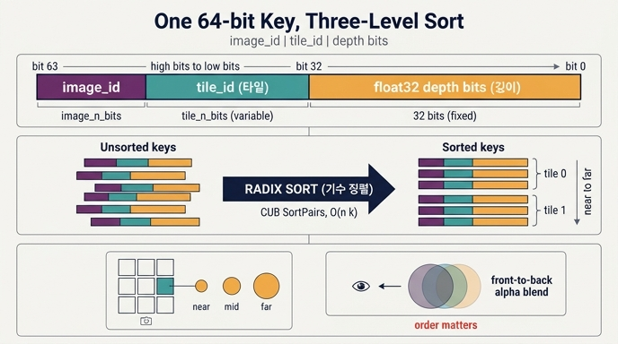

# 타일 교차 64비트 키의 구조

> **Q.** 타일 교차에서 사용하는 64비트 키의 구조는?
>
> **A.** 상위부터 `[image_id | tile_id | float32(depth) 비트]` 순으로 배치한다. 이 키를 radix sort하면 같은 타일의 Gaussian이 연속으로 모이고 그 안에서는 가까운 것부터 정렬된다.

---

## 1. 왜 키가 필요한가

픽셀마다 N개(수백만 개) Gaussian을 전부 검사하는 것은 불가능하다. 그래서 화면을 16×16 타일로 자르고
**(Gaussian, 타일) 쌍**의 리스트를 만든다 — 이것이 "타일 교차(tile intersection)"다.

이 리스트는 만들어진 순서가 Gaussian 인덱스 순이라 쓸모가 없다. 래스터라이저가 원하는 것은
"타일 t를 담당하는 워크그룹이, 그 타일에 걸친 Gaussian만, 가까운 것부터 순서대로" 읽는 것이다.
즉 `(image, tile, depth)` 3단 정렬이 필요하다.

여기서 트릭은 **세 필드를 하나의 64비트 정수로 이어붙이는 것**이다. 그러면 3단 비교 정렬이
단일 64비트 정수 정렬 한 번으로 끝난다.

---

## 2. 정확한 비트 레이아웃

`gsplat/cuda/csrc/IntersectTile.cu`의 `intersect_tile_kernel` 안에서 키가 만들어진다.

```cpp
// 커널 진입부 (packed면 image_ids[idx], 아니면 idx / N)
iid_enc      = iid << (32 + tile_n_bits);        // image id를 최상위로
float depth_f = static_cast<float>(depths[idx]);
depth_id_enc = __float_as_uint(depth_f);         // float32 비트패턴을 하위 32비트에 zero-extend

// 타일 루프 안
int64_t tile_id    = i * tile_width + j;         // 행 우선(row-major) 타일 인덱스
isect_ids[cur_idx] = iid_enc | (tile_id << 32) | depth_id_enc;
flatten_ids[cur_idx] = static_cast<int32_t>(idx);
```

비트 그림 (소스 주석의 예시: `tile_n_bits = 22`, `image_n_bits = 10`):

```
 bit 63                                                                        bit 0
 ┌───────────────────┬────────────────────────────┬────────────────────────────┐
 │   image_id        │        tile_id             │   float32(depth) 비트      │
 │  image_n_bits     │      tile_n_bits           │        32 bits             │
 │  (예: 10)         │      (예: 22)              │        (고정)              │
 └───────────────────┴────────────────────────────┴────────────────────────────┘
   ← 최상위                                                            최하위 →
        shift = 32 + tile_n_bits          shift = 32              shift = 0
```

- **하위 32비트: depth** — `float32`의 raw 비트 패턴(`__float_as_uint`). 항상 정확히 32비트, 고정 폭.
- **그 위 `tile_n_bits`비트: tile_id** — 한 이미지 안에서 타일의 행 우선 인덱스 `y * tile_width + x`.
- **그 위 `image_n_bits`비트: image_id** — 어느 카메라/이미지의 렌더인지.
- 나머지 상위 비트는 0으로 남는다(총 사용 비트 = `32 + tile_n_bits + image_n_bits ≤ 64`).

### 폭을 정하는 함수

```cpp
// gsplat/cuda/csrc/MathUtils.h
inline uint32_t bits_for_count(int64_t count) {
    if (count <= 1) return 0u;
    return static_cast<uint32_t>(std::bit_width(static_cast<uint64_t>(count) - 1u));
}
```

즉 `bits_for_count(n) == (n - 1).bit_length()` — 0..n-1을 표현하는 데 필요한 최소 비트 수다.
파이썬 참조 구현(`gsplat/cuda/_torch_impl.py::_isect_tiles`)과 워크스루의 디코딩 코드가 똑같은 식을 쓴다.

```python
tile_n_bits = (tile_w * tile_h - 1).bit_length()   # == bits_for_count(n_tiles)
image_n_bits = _bits_for_count(I)
assert image_n_bits + tile_n_bits + 32 <= 64
```

CUDA 쪽에도 같은 예산 검사가 있다 (`launch_intersect_tile_kernel`):

```cpp
TORCH_CHECK(image_n_bits + tile_n_bits <= 32,
            "intersect_tile: (image, tile) id packing needs ", ..., " bits but only 32 are available");
```

하위 32비트는 depth가 통째로 차지하므로, `image_id`와 `tile_id`가 **함께 상위 32비트 안에** 들어가야 한다는 뜻이다.

### 디코딩 (워크스루의 실제 코드)

```python
tile_n_bits = (tile_w * tile_h - 1).bit_length()
depth_key = (isect_ids & 0xFFFFFFFF).to(torch.int32).view(torch.float32)   # 하위 32비트 → float32
tile_id   = (isect_ids >> 32) & ((1 << tile_n_bits) - 1)                   # 중간
image_id  =  isect_ids >> (32 + tile_n_bits)                               # 상위
ty, tx    = divmod(tile_id, tile_w)                                        # 타일 좌표 복원
```

---

## 3. `tile_n_bits`가 왜 가변인가

`tile_n_bits`를 32로 고정해 버리면 `[32비트 tile | 32비트 depth]`로 64비트가 꽉 차서
**image_id를 넣을 자리가 남지 않는다**. 그런데 실제로 필요한 타일 비트 수는 훨씬 적다.

| 해상도 | tile_size | `tile_w × tile_h` | `n_tiles` | `tile_n_bits` | 남는 비트 |
|---|---|---|---|---|---|
| 640×480 | 16 | 40 × 30 | 1,200 | 11 | 21 |
| 1920×1080 | 16 | 120 × 68 | 8,160 | 13 | 19 |
| 3840×2160 | 16 | 240 × 135 | 32,400 | 16 | 16 |
| 8K (7680×4320) | 16 | 480 × 270 | 129,600 | 17 | 15 |

4K에서도 타일 인덱스는 16비트면 충분하다. 즉 **필요한 만큼만 잘라 쓰면(비트 절약) 남는 상위
비트를 image_id에 줄 수 있고, 전체가 64비트 예산 안에 들어간다.** `bits_for_count`는 그
"필요한 만큼"을 런타임에 계산하는 함수다.

부수 효과가 하나 더 있다: radix sort가 **실제로 쓰이는 비트만** 훑으면 되므로 정렬 패스 수가 줄어든다
(§5 참조). 만약 해상도가 극단적이고 배치가 커서 `image_n_bits + tile_n_bits > 32`가 되면
`TORCH_CHECK`가 명시적으로 실패한다 — 조용히 키가 깨지는 대신 에러를 낸다.

---

## 4. 왜 이 순서로 붙이면 3단 정렬이 되는가 (사전식 순서)

핵심은 **비트 연결(concatenation)의 정수 비교는 필드의 사전식(lexicographic) 비교와 같다**는 것이다.

두 키 `K = A·2^(32+t) + B·2^32 + C` 와 `K' = A'·2^(32+t) + B'·2^32 + C'` 를 부호 없는 정수로 비교하면:

1. `A ≠ A'` 이면 상위 필드가 크기를 지배한다 → **image_id 순**
   (하위 `32 + tile_n_bits` 비트를 전부 1로 채워도 `A`의 1비트 증가분을 넘지 못한다)
2. `A == A'`, `B ≠ B'` 이면 → **tile_id 순**
3. 둘 다 같으면 → **depth 비트 순**

각 필드가 자기 폭 안에 완전히 들어가고(overflow 없음) 필드끼리 겹치지 않기 때문에 성립한다.
그래서 **정수 정렬 한 번 = `(image, tile, depth)` 3단 정렬**이다. 비교 함수도, 다단 정렬도 필요 없다.

정렬 후 배열을 훑으면 이렇게 생겼다:

```
image 0 | tile 0 : g7(0.9) g2(1.4) g9(3.1)
image 0 | tile 1 : g2(1.4) g5(2.0)
image 0 | tile 2 : (없음)
image 0 | tile 3 : g5(2.0) g1(2.2) g9(3.1) g4(8.0)
image 1 | tile 0 : ...
```

같은 타일의 항목이 **연속 구간**으로 모이므로, 이후 `isect_offset_encode`는 단지
"키의 상위 32비트(`isect_ids >> 32`, depth를 날린 부분)가 바뀌는 지점"을 찾기만 하면 타일별
시작 오프셋을 만들 수 있다. 실제 커널이 그렇게 한다:

```cpp
int64_t isect_id_curr = isect_ids[idx] >> 32;              // depth를 밀어냄 → (image, tile)만 남음
int64_t iid_curr = isect_id_curr >> tile_n_bits;
int64_t tid_curr = isect_id_curr & ((1 << tile_n_bits) - 1);
...
int64_t isect_id_prev = isect_ids[idx - 1] >> 32;          // 이전과 같으면 경계가 아님
```

### 양수 float32 비트가 정수 순서를 보존한다

IEEE-754 float32는 `[sign(1) | exponent(8) | mantissa(23)]`이고, **부호가 0(양수)인 구간에서는
비트 패턴을 부호 없는 정수로 읽어도 대소 관계가 그대로 유지된다.** 그래서 depth를 float 그대로
하위 32비트에 박아 넣기만 하면 정수 정렬이 곧 깊이 정렬이 된다. (자세한 이유는 별도 카드에서 다룬다.)

소스도 이 전제를 명시적으로 못 박는다:

```cpp
// The float-bit key is monotonic only for non-negative depths: a set
// sign bit would invert the unsigned ordering.
assert(depth_f >= 0.f);
```

near-plane 컬링 뒤에는 음수 depth가 남지 않으므로 안전하다. 또한 `depths`가 double일 수 있으므로
**먼저 float32로 좁힌 뒤** 비트를 뜬다 (double의 상위/하위 절반만 읽으면 순서가 깨진다).

---

## 5. 왜 radix sort인가

정렬은 CUB의 `cub::DeviceRadixSort::SortPairs`로 한다 (`radix_sort_double_buffer`).

```cpp
cub::DoubleBuffer<int64_t> d_keys(isect_ids.data_ptr<int64_t>(), isect_ids_sorted.data_ptr<int64_t>());
cub::DoubleBuffer<int32_t> d_values(flatten_ids.data_ptr<int32_t>(), flatten_ids_sorted.data_ptr<int32_t>());
CUB_WRAPPER(cub::DeviceRadixSort::SortPairs,
            d_keys, d_values, n_isects,
            /*begin_bit=*/0,
            /*end_bit=*/32 + tile_n_bits + image_n_bits,     // ← 쓰이는 비트까지만!
            stream);
```

radix sort를 쓰는 이유:

- **비교 없음 · O(n·k)** — 비교 기반 정렬의 O(n log n) 하한을 우회한다. `n_isects`는 수천만 개까지
  가는데, 키가 고정 폭 정수라 자릿수(radix digit) 단위 카운팅 정렬을 몇 번 반복하면 끝난다.
- **GPU 친화적** — 각 패스가 histogram + prefix-sum + scatter로, 전부 병렬화되고 메모리 접근이
  대체로 연속적이다(coalesced). 분기(divergence)가 거의 없어 SIMT에 잘 맞는다.
- **키/값 쌍 정렬** — `SortPairs`가 키(`isect_ids`)를 정렬하면서 값(`flatten_ids`)을 같이 끌고 간다.
- **패스 수 최소화** — `end_bit`을 `32 + tile_n_bits + image_n_bits`로 주기 때문에, §3에서 아낀
  비트만큼 실제 정렬 패스가 줄어든다. 이것이 `tile_n_bits`를 가변으로 두는 두 번째 이득이다.
- **DoubleBuffer** — 보조 메모리를 O(N+P)에서 O(P)로 줄이는 CUB 관용구. 정렬 결과가 어느 버퍼에
  들어갔는지는 `d_keys.selector`로 확인해 텐서를 바꿔치기한다.

### segmented 변형

`segmented=True`이면 `cub::DeviceSegmentedRadixSort::SortPairs`를 쓴다. 이미지별로 키가 이미
연속(segment)이라는 사실을 이용해 **상위 image 비트를 아예 정렬 대상에서 빼고** 하위
`32 + tile_n_bits`비트만 정렬한다.

```cpp
// image dimensions are contiguous in the isect_ids,
// so we can use DeviceSegmentedRadixSort to only sort the lower (tile_n_bits + 32) bits
CUB_WRAPPER(cub::DeviceSegmentedRadixSort::SortPairs, d_keys, d_values, n_isects,
            n_segments, offsets_begin, offsets_end, 0, 32 + tile_n_bits, stream);
```

PyTorch 참조 구현은 그냥 `torch.sort(isect_ids)`로 같은 결과를 낸다(정렬 알고리즘만 다르고 순서 정의는 동일).

---

## 6. `isect_ids`(키) ↔ `flatten_ids`(값)

정렬은 **키-값 쌍**으로 이뤄진다.

| 이름 | dtype / shape | 내용 |
|---|---|---|
| `isect_ids` | int64 `[n_isects]` | 64비트 키 = `image_id \| tile_id \| depth bits` |
| `flatten_ids` | int32 `[n_isects]` | 그 교차가 어느 Gaussian인지 — **평탄화된 인덱스** |
| `isect_offsets` | int32 `[I, tile_h, tile_w]` | 정렬된 배열에서 각 타일의 시작 위치 |

`flatten_ids`의 값 범위는 모드에 따라 다르다:

- **dense 모드**: `[0, I*N)` 범위의 `image_id * N + gauss_id`. 그래서 워크스루가
  `gauss_id = flatten_ids.long() % tN`으로 Gaussian 인덱스를 복원한다.
- **packed 모드**: `[0, nnz)` 범위의 packed 인덱스 (이미 보이는 것만 압축된 배열의 위치).

래스터라이즈 단계는 키를 다시 볼 필요가 거의 없다. 타일 `t`가 처리할 Gaussian 목록은

```python
flatten_ids[isect_offsets[t] : isect_offsets[t+1]]     # 마지막 타일은 n_isects까지
```

이고, 이 슬라이스가 **이미 near→far 순으로 정렬되어 있다**. 빈 타일은 이전 오프셋을 그대로
물려받아 길이 0이 된다. 즉 키는 "정렬을 위한 일회용 인프라"이고, 실제 렌더에 쓰이는 산출물은
`flatten_ids` + `isect_offsets`다.

파이프라인 전체:

```
projection → 타일 교차 1차 패스(Gaussian별 타일 수 세기)
           → prefix sum(cumsum) → 2차 패스(키·값 채우기)
           → radix sort(isect_ids, flatten_ids)
           → isect_offset_encode → rasterize_to_pixels
```

(커널을 두 번 도는 이유는 `n_isects`를 미리 알아야 출력 버퍼를 정확히 잡을 수 있기 때문이다.)

---

## 7. 왜 깊이 정렬이 필수인가

3DGS의 픽셀 색은 앞→뒤(front-to-back) 알파 블렌딩이다:

```
C = Σ_i  c_i · α_i · Π_{j<i} (1 - α_j)
T_i = Π_{j<i} (1 - α_j)          # 누적 투과율
```

- **비가환(non-commutative)** — 곱 항 `Π_{j<i}` 자체가 "앞에 뭐가 있었는지"에 의존하므로,
  순서를 바꾸면 결과 색이 달라진다. 뒤에 있는 Gaussian이 먼저 합성되면 앞의 것이 가려주지 못한다.
- **조기 종료(early termination)** — 앞에서부터 쌓다가 `T`가 임계값(gsplat/3DGS는 1e-4) 아래로
  떨어지면 그 뒤 Gaussian은 픽셀에 기여하지 못하므로 루프를 끊는다. 가까운 것부터 와야만 성립하는 최적화다.
- **backward 패스** — 역전파는 정렬 순서를 거꾸로(뒤→앞) 훑으며 `T`를 복원한다. 이것도 순서가
  결정론적이어야 가능하다.

그래서 키의 최하위 필드가 depth인 것이다: **타일별 그룹핑(정확성 아닌 성능 목적)이 먼저,
그 안의 깊이 순서(정확성 목적)가 나중**이라는 우선순위가 비트 순서에 그대로 새겨져 있다.

---

## 8. 원 3DGS 논문과의 차이

Kerbl et al., *3D Gaussian Splatting for Real-Time Radiance Field Rendering* (SIGGRAPH 2023)의
설명은 이렇다:

> 각 인스턴스에 **64비트 키**를 부여한다 — **상위 32비트는 tile ID, 하위 32비트는 view-space depth**.
> 이 키를 GPU radix sort로 한 번 정렬하면 타일별로 깊이 정렬된 리스트를 얻는다.

gsplat은 여기에 **배치 차원(카메라/이미지)을 추가로 끼워 넣은** 확장이다.

| | 원 3DGS | gsplat |
|---|---|---|
| 키 폭 | 64비트 | 64비트 (동일) |
| 상위 | tile ID **고정 32비트** | `image_id` (`image_n_bits`, 가변) |
| 중간 | — | `tile_id` (`tile_n_bits`, 가변) |
| 하위 | depth 32비트 | depth 32비트 (동일) |
| 렌더 단위 | 한 번에 이미지 1장 | 한 번의 정렬로 **여러 카메라 배치** |

원 논문은 카메라 1대만 다루므로 tile ID에 32비트를 다 줘도 됐다. gsplat은 학습 중 여러 뷰를
한 번에 렌더하기 위해 tile 비트를 **필요한 만큼으로 줄이고**(§3) 남은 상위 비트를 image_id에 준다.
그 결과 배치 전체가 **커널 런치 1번 + 정렬 1번**으로 처리되고, 이미지 경계가 정렬 순서에서
자연스럽게 분리된다(§5의 segmented sort가 이 성질을 그대로 활용).

---

## 9. 한계 — 타일 단위 정렬의 대가

이 방식의 근본 가정은 **"타일 안에서는 모든 픽셀이 같은 깊이 순서를 쓴다"**는 것이다. 이건 근사다.

- Gaussian은 점이 아니라 **부피를 가진 타원체**다. 정렬 키는 Gaussian **중심**의 view-space depth
  하나뿐인데, 두 Gaussian이 서로 관통하거나 비스듬히 겹치면 타일 안 픽셀마다 실제 앞뒤 관계가 다를 수 있다.
  픽셀별 정확한 순서 대신 타일 전체가 하나의 순서를 공유한다.
- **Popping 아티팩트** — 카메라가 조금 움직여 두 Gaussian의 중심 깊이 대소가 뒤집히면, 타일 전체의
  블렌딩 순서가 한 프레임 만에 갈아엎어져 색이 툭 튄다. 정지 이미지 품질 지표(PSNR)에는 잘 안 잡히고
  움직이는 영상에서 눈에 띈다.
- **타일 경계 불연속** — 인접한 두 타일이 각자 정렬되므로 경계에서 순서가 달라질 수 있다.

후속 연구들이 이 지점을 공략한다:

- **StopThePop** (Radl et al., SIGGRAPH 2024) — *hierarchical rasterization*으로 타일을 더 잘게 나누고
  **픽셀별(per-pixel) 깊이 재평가**를 도입해 popping을 크게 줄인다. 정렬 키를 Gaussian 중심이 아니라
  각 광선에서의 최대 기여 지점 깊이로 잡는 것이 요점.
- **Sort-free / 순서 무관 블렌딩** 계열 — 알파 블렌딩 대신 순서에 무관한 합성을 써서 정렬 자체를 없애려는 시도.
- **EVER**, **3DGRT**(ray tracing) 계열 — 래스터라이즈 근사 대신 실제 광선-체적 적분으로 순서 문제를 원천 제거.

즉 이 64비트 키는 "정확한 렌더링"이 아니라 **"정확성을 조금 내주고 얻은 극단적인 속도"**의 설계다.
`n_isects`가 수천만 개인 상황에서 정렬 한 번으로 그룹핑과 깊이 순서를 동시에 얻는다는 점이 이 트릭의 값어치다.

---

## 참고 소스

- `gsplat/cuda/csrc/IntersectTile.cu` — `intersect_tile_kernel`(키 패킹), `intersect_offset_kernel`,
  `radix_sort_double_buffer`, `segmented_radix_sort_double_buffer`
- `gsplat/cuda/csrc/MathUtils.h` — `bits_for_count`
- `gsplat/cuda/_wrapper.py` — `isect_tiles` docstring("image_id (Xc bits) | tile_id (Xt bits) | depth (32 bits)")
- `gsplat/cuda/_torch_impl.py` — `_isect_tiles`(순수 PyTorch 참조 구현), `_isect_offset_encode`
- `.fm/assets/rasterization_walkthrough.py` §5 "⑤⑥ 타일 교차와 정렬" — 키 디코딩 실습

## 인포그래픽


