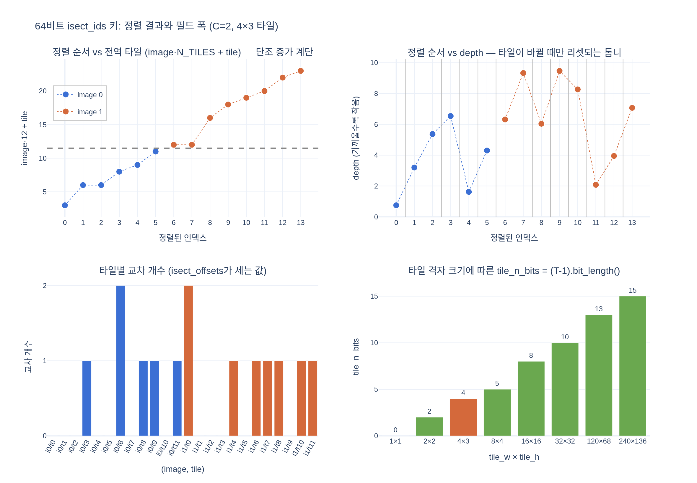

# 정렬된 키에서 64비트 필드를 다시 해독하는 방법은?

`isect_tiles`가 만든 64비트 `isect_ids`는 상위부터 `[image_id | tile_id | float32(depth) 비트]` 세 필드가 이어 붙어 있다.
정렬 후 다시 꺼낼 때는 다음 세 줄을 쓴다.

```python
tile_n_bits = (tile_w * tile_h - 1).bit_length()
depth_key = (isect_ids & 0xFFFFFFFF).to(torch.int32).view(torch.float32)
tile_id   = (isect_ids >> 32) & ((1 << tile_n_bits) - 1)
image_id  =  isect_ids >> (32 + tile_n_bits)
```

실행 가능한 예제는 [expy.py](expy.py) (jupyter percent 스크립트) 참고.

## 시각화


