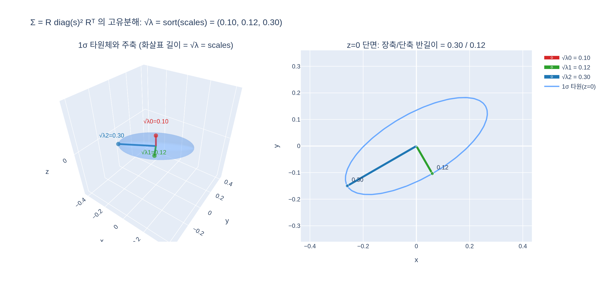

# 3D 공분산 Σ의 고유값 제곱근은 무엇과 같은가?

`scales` 값을 정렬한 것과 같다. `Σ = R diag(s)² Rᵀ`가 그 자체로 고유분해이므로
고유값은 `λ_k = s_k²`, 고유벡터는 `R`의 열(= 주축 방향)이 된다.
따라서 `√λ`는 1σ 타원체의 주축 반길이, 즉 `scales`를 오름차순 정렬한 값이다.

단계별 실행 예제는 [`expy.py`](expy.py) 참고.

## 시각화

