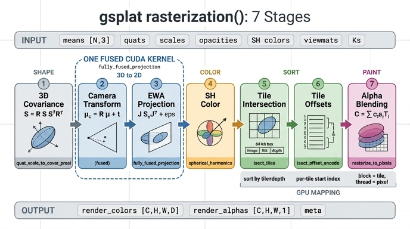

# gsplat `rasterization()` 파이프라인의 7단계

> **정답 요약**
> ① 3D 공분산(Σ = R S Sᵀ Rᵀ) → ② 카메라 좌표 변환 → ③ 원근 투영(EWA) → ④ SH 색 평가 →
> ⑤ 타일 교차 → ⑥ 타일 오프셋 → ⑦ 알파 블렌딩.
> 이 중 **②③은 `fully_fused_projection` CUDA 커널 하나로 융합**되어 처리된다.

---

## 0. 한눈에 보는 데이터 흐름

```
입력: means[N,3] quats[N,4] scales[N,3] opacities[N] colors(SH)[N,K,3]  viewmats[C,4,4] Ks[C,3,3]
  │
  ▼ ① 3D 공분산       Σ = R S Sᵀ Rᵀ                         (quat_scale_to_covar_preci)
  ▼ ② 카메라 좌표     μ_c = R μ + t,  Σ_c = R Σ Rᵀ           ┐
  ▼ ③ 원근 투영(EWA)  Σ₂ = J Σ_c Jᵀ + eps2d·I               ├ fully_fused_projection (CUDA 커널 1개)
        → means2d, conics(=Σ₂⁻¹), radii, depths, 절두체 컬링 ┘
  ▼ ④ SH 색 평가      colors = clamp(SH(μ − cam_pos) + 0.5)  (spherical_harmonics)
  ▼ ⑤ 타일 교차       (Gaussian, tile) 쌍 → 64bit 키 radix sort (isect_tiles)
  ▼ ⑥ 타일 오프셋     타일별 시작 인덱스                      (isect_offset_encode)
  ▼ ⑦ 알파 블렌딩     타일=CUDA 블록, 픽셀=스레드, 앞→뒤 누적 (rasterize_to_pixels)
  │
출력: render_colors[C,H,W,D]  render_alphas[C,H,W,1]  meta(중간 텐서들)
```

외우는 순서의 뼈대는 **"모양 만들기 → 화면에 놓기 → 색 정하기 → 정렬하기 → 칠하기"** 다.
①은 모양(3D), ②③은 화면에 놓기(3D→2D), ④는 색, ⑤⑥은 정렬·인덱싱, ⑦은 실제 픽셀 채우기.

---

## 1. ① 3D 공분산 — `Σ = R S Sᵀ Rᵀ`

Gaussian의 모양은 3×3 대칭 양정치 행렬 Σ지만, **학습 파라미터는 Σ가 아니라 `quats`(회전 R)와 `scales`(축 길이 s)** 다.
Σ를 직접 최적화하면 gradient step 한 번에 양정치성이 깨질 수 있기 때문에, 항상 유효한 Σ가 나오도록 분해 형태로 둔다.

```python
R = quat_to_rotmat(q)          # [N,3,3]
M = R * s[..., None, :]        # R @ diag(s)
Sigma = M @ M.transpose(-1,-2) # = R S Sᵀ Rᵀ  → 언제나 PSD
```

- `sqrt(eigvals(Σ))`는 `scales`를 정렬한 것과 같다 — Σ의 주축 길이가 곧 scale.
- 별도 함수 `quat_scale_to_covar_preci`로도 부를 수 있지만, **실전 경로에서는 이 계산조차 투영 커널 안에 융합**되어 있다
  (`fully_fused_projection`에 covars 대신 quats/scales를 그대로 넘기면 커널이 내부에서 Σ를 만든다).

## 2. ② 카메라 좌표 변환

viewmat(world→camera)의 상단 3×3이 R, 4열이 t.

```
μ_c = R μ + t        (중심은 아핀 변환)
Σ_c = R Σ Rᵀ         (공분산은 회전만 적용, 평행이동은 영향 없음)
```

이 단계는 **선형**이라 Gaussian이 정확히 Gaussian으로 유지된다. 근사가 들어가는 건 다음 단계다.

## 3. ③ 원근 투영 (EWA splatting)

원근 투영 π(x,y,z) = (fx·x/z + cx, fy·y/z + cy)는 **비선형**이므로 Gaussian을 Gaussian으로 보내지 않는다.
그래서 μ_c에서 **1차 테일러 근사(Jacobian J)** 로 공분산을 밀어낸다 — 이것이 EWA(Elliptical Weighted Average) splatting.

$$J=\begin{bmatrix} f_x/z & 0 & -f_x x/z^2 \\ 0 & f_y/z & -f_y y/z^2\end{bmatrix},\qquad
\Sigma_{2D}=J\,\Sigma_c\,J^\top+\epsilon_{2d} I$$

산출물과 세부 규칙:

| 산출 | 의미 |
|---|---|
| `means2d` [C,N,2] | 투영된 중심(px). 학습 시 **이 텐서의 grad 크기가 densification(split/duplicate) 기준** |
| `conics` [C,N,3] | Σ₂의 **역행렬** (a,b,c) 상삼각 성분. 래스터화는 Σ₂가 아니라 conic을 쓴다 |
| `radii` [C,N,2] | 축정렬 반경 `ceil(3.33·√diag(Σ₂))`. **0이면 컬링됨** |
| `depths` [C,N] | 카메라 좌표 z — ⑤단계의 정렬 키 |

- `eps2d = 0.3` (px²)은 **최소 블러**. 이게 없으면 1px보다 작은 Gaussian이 픽셀 중심 사이로 빠져 사라진다.
- 컬링: z가 near/far 밖이거나, radii 사각형이 이미지와 겹치지 않으면 `radii = 0`.
- **불투명도 인지 반경**: `opacities`를 함께 넘기면 반경이 `min(3.33, sqrt(2·ln(α/(1/255))))·σ`로 줄어든다.
  알파가 1/255 아래로 떨어지는 바깥은 어차피 안 그리므로, 투명한 Gaussian은 더 작은 사각형만 타일링하면 된다.
- 참조 구현 `_persp_proj`는 J를 만들기 전 x/z, y/z를 시야각의 1.3배로 clamp한다(화면 밖 Gaussian의 Jacobian 폭주 방지 — Inria 원본 트릭).

### 왜 ②③이 한 커널인가

②의 출력(μ_c, Σ_c)은 오직 ③의 입력으로만 쓰이는 **중간값**이다. 별도 커널로 나누면 [C,N,3]과 [C,N,3,3] 텐서를
글로벌 메모리에 썼다가 다시 읽어야 한다. 그래서 CUDA 커널 `projection_ewa_3dgs_fused_fwd_kernel`
(`ProjectionEWA3DGSFused.cu`)이 **Gaussian×카메라당 스레드 1개**로 ①의 Σ 구성부터 ②변환, ③투영, 컬링까지
레지스터 안에서 한 번에 끝낸다. 함수 이름의 "fully fused"가 바로 이 뜻이다.

## 4. ④ SH 색 평가

색이 SH 계수 `[N,K,3]`(K=(deg+1)²)로 주어지면 Gaussian마다 **보는 방향**에 따라 색이 달라진다(시점 의존 반사).

```python
campos = -Rᵀ t                       # viewmat에서 카메라 위치 복원
dirs   = means - campos              # [C,N,3]
c      = clamp_min(SH(dirs, coeffs) + 0.5, 0.0)
```

- `+0.5`는 초기화 때 `(rgb − 0.5)/C0` (C0 = Y₀₀ = 0.2821)로 뺀 DC 오프셋의 역연산.
- `masks=(radii>0)`를 넘겨 **컬링된 Gaussian은 SH 평가를 건너뛴다** — ③ 뒤에 와야 하는 이유 중 하나.
- 순서상 ④가 ⑤⑥보다 앞이지만, ④는 ⑤⑥과 서로 의존하지 않는다(둘 다 ③의 출력만 소비). 실제 오케스트레이터
  코드에서는 타일 교차를 먼저 부르기도 하는데, **논리적 파이프라인 순서로는 ④가 ⑤ 앞**이라고 외우면 된다.

## 5. ⑤ 타일 교차 (`isect_tiles`)

픽셀마다 N개 Gaussian을 전부 검사하면 O(H·W·N)로 불가능하다. 화면을 **16×16 타일**로 나누고
"각 Gaussian이 어느 타일들을 덮는가"의 (Gaussian, 타일) 쌍 리스트를 만든다.

각 쌍에 붙는 **64비트 키**:

```
[ image_id | tile_id | float32(depth)의 비트 ]     ← 상위에서 하위로
```

이 키를 radix sort하면 **같은 타일의 Gaussian이 연속으로 모이고, 그 안에서 가까운 것부터** 정렬된다
(양수 float의 비트 패턴은 정수로 비교해도 순서가 보존되는 성질을 이용). 결과가 `isect_ids`(키)와 `flatten_ids`(Gaussian 인덱스).

CUDA(`IntersectTile.cu`)는 `intersect_tile_kernel`을 **두 번** 돈다: 1차로 Gaussian별 타일 수를 세고 → prefix sum으로
쓸 위치를 정하고 → 2차로 키를 채운 뒤 → CUB radix sort.

- **AABB 모드**(기본 래퍼): radii 사각형이 겹치는 타일 전부.
- **AccuTile 모드**(`rasterization()`이 쓰는 것): `conics`/`opacities`도 넘겨서 사각형 대신
  **알파 ≥ 1/255인 타원**과 실제로 겹치는 타일만 고른다. 결과 이미지는 같고 정렬·블렌딩 비용만 줄어든다.

## 6. ⑥ 타일 오프셋 (`isect_offset_encode`)

정렬된 키에서 **타일이 바뀌는 지점**을 찾아 타일별 시작 인덱스 `isect_offsets[C, tile_h, tile_w]`를 만든다.

```
타일 t가 담당하는 Gaussian 목록 = flatten_ids[offsets[t] : offsets[t+1]]
```

빈 타일은 이전 오프셋을 그대로 물려받아 길이 0이 된다. 이 배열이 있어야 ⑦에서 **블록 하나가 자기 타일 구간만
O(1)로 찾아** 바로 순회할 수 있다. ⑤가 "정렬", ⑥이 "색인"이라고 보면 된다.

## 7. ⑦ 알파 블렌딩 (`rasterize_to_pixels`)

픽셀 p의 색은 그 타일의 Gaussian 목록을 **앞 → 뒤(가까운 것부터)** 훑으며 누적된다.

$$\sigma_i=\tfrac12(a\,dx^2+c\,dy^2)+b\,dx\,dy,\quad
\alpha_i=\min(0.99,\ o_i e^{-\sigma_i}),\quad
C_p=\sum_i c_i\alpha_i T_i,\quad T_{i+1}=T_i(1-\alpha_i)$$

- dx, dy는 픽셀 **중심**(px+0.5)과 means2d의 차. σ는 마할라노비스 거리의 절반이고, conic (a,b,c)가 곧 Σ₂⁻¹.
- α < `ALPHA_THRESHOLD`(1/255)면 건너뛴다. α는 `MAX_ALPHA`(0.99)로 상한.
- 투과율 T ≤ `TRANSMITTANCE_THRESHOLD`(1e-4)가 되면 그 픽셀은 종료(그 Gaussian은 **제외**하고 끝).
- `render_alpha = 1 − T`.

커널 `rasterize_to_pixels_3dgs_fwd_kernel<CDIM, TILE=16, CTA=256>`의 GPU 매핑:

```
블록(blockIdx) = 타일 하나  →  range = [isect_offsets[t], isect_offsets[t+1])
스레드(tid)    = 타일 안 픽셀 하나  →  T=1, pix_out=0
for batch in range(0, len(range), 256):
    각 스레드가 Gaussian 1개씩 shared memory에 적재 (id, xy, opacity, conic)  __syncthreads()
    for g in batch(앞→뒤): σ, α 계산 → skip / 누적 / 종료 판정
    __syncthreads_count(done) == 256 이면 타일 전체 조기 종료
```

즉 ⑤⑥이 만들어 준 "타일별 정렬 목록"이 있어야 **블록 = 타일, 스레드 = 픽셀**이라는 병렬 구조와
shared memory 협동 적재가 성립한다. 이 지점이 3DGS가 실시간인 이유다.

**backward**(`RasterizeToPixels3DGSSerialBatchBwd.cu`)는 forward가 저장한 최종 T와 `last_ids`(픽셀별 마지막 기여
Gaussian)에서 출발해 같은 목록을 **뒤 → 앞**으로 순회하며 `T /= (1−α)`로 T를 복원하고 ∂L/∂color, ∂L/∂α →
∂L/∂conic, ∂L/∂means2d, ∂L/∂opacity를 구한다. 하나의 Gaussian 기여가 여러 스레드에 흩어져 있어 warp 단위로
합친 뒤 `atomicAdd`로 모은다.

---

## 8. 단계 ↔ 코드 대응표

| 단계 | Python 래퍼 (`gsplat/cuda/_wrapper.py`) | CUDA 소스 / 커널 | 순수 PyTorch 참조 |
|---|---|---|---|
| ① 공분산 | `quat_scale_to_covar_preci` | `QuatScaleToCovarCUDA.cu` | `_math._quat_scale_to_covar_preci` |
| **②③ 투영** | **`fully_fused_projection`** | **`ProjectionEWA3DGSFused.cu` `projection_ewa_3dgs_fused_fwd_kernel`** | `_torch_impl._fully_fused_projection` |
| ④ SH | `spherical_harmonics` | `SphericalHarmonicsCUDA.cu` | `_torch_impl._spherical_harmonics` |
| ⑤ 타일 교차 | `isect_tiles` | `IntersectTile.cu` `intersect_tile_kernel` (2패스) + CUB radix sort | `_torch_impl._isect_tiles` |
| ⑥ 오프셋 | `isect_offset_encode` | `IntersectTile.cu` `intersect_offset_kernel` | `_torch_impl._isect_offset_encode` |
| ⑦ 블렌딩 | `rasterize_to_pixels` | `RasterizeToPixels3DGSSerialBatch{Fwd,Bwd}.cu` | `_torch_impl._rasterize_to_pixels` (nerfacc) |
| 전체 | `rendering.rasterization()` | `Rendering.cpp` `rasterization_3dgs()` | `rendering._rasterization()` |

현재 코드베이스에서 `rasterization()`은 이 단계들을 **C++ 오케스트레이터 `rasterization_3dgs`** 에 한 번에 넘기지만,
단계별 래퍼를 손으로 이어 붙인 `rasterize_stepwise`가 forward/backward 모두 같은 결과를 낸다(워크스루 7절에서 검증).
성능 차이도 미미하다 — "계산 커널은 같고, C++ 쪽은 파이썬 오버헤드와 중간 텐서 cat 몇 개를 절약할 뿐".

## 9. `meta`로 확인하는 중간 산출물

| 키 | 모양 | 나온 단계 |
|---|---|---|
| `radii` | [C,N,2] | ③ (0이면 컬링) |
| `means2d` | [C,N,2] | ③ (grad가 densification 기준) |
| `depths` | [C,N] | ②③ (정렬 키) |
| `conics` | [C,N,3] | ③ (Σ₂⁻¹) |
| `tiles_per_gauss` | [C,N] | ⑤ |
| `isect_ids`, `flatten_ids` | [n_isects] | ⑤ (정렬 결과) |
| `isect_offsets` | [C,tile_h,tile_w] | ⑥ |

## 10. 자주 헷갈리는 포인트

- **"①이 별도 단계인데 왜 커널은 ②③만 융합?"** — ①은 `quat_scale_to_covar_preci`라는 독립 함수로도 존재하지만,
  실전 경로에서는 quats/scales를 그대로 투영 커널에 넘기므로 ①까지 사실상 같은 커널 안에서 처리된다.
  카드가 강조하는 건 **"②와 ③은 개념적으로 두 단계지만 API가 하나(`fully_fused_projection`)"** 라는 점.
- **conics는 Σ₂가 아니라 Σ₂⁻¹** — 블렌딩에서 매 픽셀 역행렬을 구할 수 없으니 미리 뒤집어 둔다.
- **정렬은 픽셀 단위가 아니라 타일 단위** — 같은 타일 안 순서만 깊이로 정렬한다(그래서 타일 경계에서 popping 아티팩트가 생길 수 있다).
- **⑤와 ⑥은 붙어 있지만 하는 일이 다르다** — ⑤ = 쌍 만들기 + 정렬, ⑥ = 정렬된 리스트에 타일별 시작점 색인 붙이기.
- `packed=True`(기본값)에서는 투영 커널이 `[C,N,...]` 대신 **radii>0인 쌍만** `[nnz,...]`로 반환하고
  `camera_ids`/`gaussian_ids`(COO 인덱스)를 함께 준다. 단계 순서는 동일하다.

## 11. 확장 옵션 (같은 7단계 골격 위의 변형)

- `rasterize_mode="antialiased"`: eps2d 블러 전후 행렬식 비 √(det₀/det)를 불투명도에 곱해 밝기 보존(Mip-Splatting) — ③ 변형
- `with_ut=True`: Jacobian 대신 Unscented Transform으로 투영 — 어안/F-theta/롤링셔터 지원(3DGUT) — ③ 대체
- `with_eval3d=True`: 2D 근사 없이 픽셀 광선과 3D Gaussian을 직접 평가 — ⑦ 대체
- `render_mode="D"/"ED"`, `extra_signals`: 깊이·임의 특징을 색과 같은 채널로 블렌딩 — ⑦ 확장
- `rasterization_2dgs`: 표면 지향 2D Gaussian(디스크) 버전, 광선-평면 교차로 σ를 구한다

## 인포그래픽


