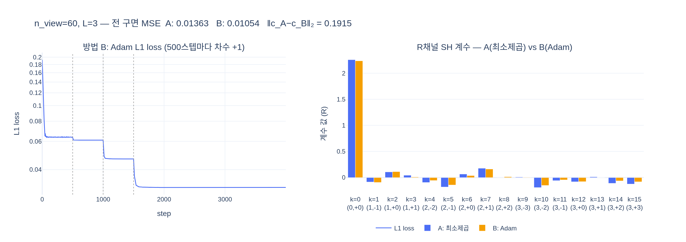

# SH 계수를 관측으로부터 구하는 두 가지 방법 — 방법 A(최소제곱) vs 방법 B(Adam)

**질문**: SH 계수를 관측으로부터 구하는 두 가지 방법(방법 A, B)은?

**답**: 방법 A는 **최소제곱 해** $\min_{\mathbf c}\sum_j\|Y(\mathbf d_j)\mathbf c-f^\star(\mathbf d_j)\|^2$ — 선형이므로 닫힌 형태로 풀린다. 방법 B는 **Adam 경사하강** — 실제 3DGS 학습과 같은 방식이다.

---

## 0. 문제 설정 (노트북 4.2절)

SH 계수의 "정의"는 사영 적분 $c_k=\int_{S^2} f(\mathbf d)Y_k(\mathbf d)\,d\Omega$이지만, 3DGS에서는 Gaussian의 진짜 색 함수 $f$를 구면 전체에서 알 수 없다. 아는 것은 **카메라 $n_{\text{view}}$대가 본 방향 $\mathbf d_j$에서의 색 $f^\star(\mathbf d_j)$** 뿐이다. 그래서 "적분"이 아니라 "관측 맞추기(fitting)"로 계수를 구해야 하고, 노트북은 그 방법 두 가지를 대비시킨다.

- 정답 $f^\star(\mathbf d)$ = 확산 기본색 $(0.6, 0.35, 0.2)$ + 방향 $\mathbf h$ 쪽의 넓은 광택 로브 $0.6\,\max(0,\mathbf d\cdot\mathbf h)^8$
- 관측: 무작위 방향 $n_{\text{view}}$개에서의 $f^\star$ 값 (`obs_d`, `obs_c`)
- 평가: 구면 격자 `sphere_grid()` 전체에서의 가중 MSE `sphere_mse` — 관측점 사이에서 얼마나 틀리는지(일반화)를 본다

## 1. 방법 A — 최소제곱 (닫힌 해)

### 1.1 행렬 형태와 정규방정식

관측 방향마다 16개 기저값을 한 행으로 쌓으면 설계행렬

$$
A=\begin{bmatrix}Y_0(\mathbf d_1)&\cdots&Y_{15}(\mathbf d_1)\\ \vdots&&\vdots\\ Y_0(\mathbf d_n)&\cdots&Y_{15}(\mathbf d_n)\end{bmatrix}\in\mathbb R^{n_{\text{view}}\times K},\qquad K=(L+1)^2=16
$$

이고, 관측을 $\mathbf y\in\mathbb R^{n_{\text{view}}\times 3}$(RGB 세 열)로 두면 문제는

$$
\min_{\mathbf c\in\mathbb R^{K\times 3}}\ \|A\mathbf c-\mathbf y\|_F^2 .
$$

목적함수가 $\mathbf c$에 대해 **2차식(볼록)**이므로 기울기 $2A^\top(A\mathbf c-\mathbf y)=0$을 놓으면 **정규방정식**

$$
(A^\top A)\,\mathbf c = A^\top\mathbf y
$$

이 나오고, $A^\top A\in\mathbb R^{16\times16}$이 가역이면 $\hat{\mathbf c}=(A^\top A)^{-1}A^\top\mathbf y$ — 반복 없이 한 번에 풀린다. RGB 세 채널은 같은 $A$를 공유하므로 우변만 세 열인 하나의 선형계로 동시에 풀린다. 코드 한 줄이다:

```python
def fit_lstsq(obs_dirs, obs_rgb, degree):
    A = sh_bases(obs_dirs, degree)                 # [n_view, K]
    return torch.linalg.lstsq(A, obs_rgb).solution  # [K, 3]
```

### 1.2 해의 유일성 — rank $K$ 조건

$A^\top A$가 가역 $\Leftrightarrow$ $\operatorname{rank}(A)=K$ $\Leftrightarrow$ $A$의 열(16개 기저를 관측 방향에서 샘플한 벡터)들이 선형독립. 그러려면

1. **$n_{\text{view}}\ge K$** — 행이 16개 미만이면 rank는 최대 $n_{\text{view}}$이므로 불가능. 이때 해는 무한히 많고 `lstsq`는 그중 **최소 노름 해**를 돌려준다.
2. **관측 방향이 충분히 다양** — 방향이 한 평면이나 좁은 원뿔에 몰려 있으면 행이 많아도 기저들이 그 부분집합 위에서 서로 구분되지 않아 rank가 떨어지거나(예: 모든 카메라가 $z\approx$ 상수에 있으면 $z$가 들어간 기저들이 상수/다른 기저와 겹침) 조건수가 폭발한다. 3DGS에서 "한쪽 반구에서만 찍은 장면"의 뒷면 SH가 엉망인 이유가 이것이다.

### 1.3 `torch.linalg.lstsq`의 내부 — 왜 정규방정식을 직접 안 푸나

정규방정식은 개념적으로 명확하지만 $A^\top A$를 명시적으로 만들면 **조건수가 제곱**된다: $\kappa(A^\top A)=\kappa(A)^2$. `lstsq`는 $A^\top A$를 만들지 않고 $A$를 직접 분해한다.

| driver | 분해 | 특징 |
|---|---|---|
| `gelsy` (CPU 기본) | 완전 피벗 QR | 빠르고 rank-deficient도 처리 |
| `gels` (CUDA 기본) | QR (full-rank 가정) | 가장 빠름, rank 부족 시 부정확 |
| `gelsd` | SVD (분할정복) | 가장 안정, rank-deficient에서 최소 노름 해 |
| `gelss` | SVD | `gelsd`보다 느림 |

QR 기준으로 $A=QR$이면 $\hat{\mathbf c}=R^{-1}Q^\top\mathbf y$ — $R$의 조건수는 $A$와 같으므로 오차 증폭이 $\kappa(A)$에 머문다. expy에서 두 방법(`solve(AᵀA, Aᵀy)` vs `lstsq`)의 차이는 $6\times10^{-7}$ 수준으로, float32에서 조건수가 작을 때는 실질적으로 같다.

### 1.4 조건수와 관측 분포

조건수 $\kappa(A)=\sigma_{\max}/\sigma_{\min}$는 관측 노이즈·수치오차가 계수로 얼마나 증폭되는지를 말한다. SH가 구면에서 정규직교하므로, 관측이 구면 위에 **고르고 많이** 퍼지면

$$
\tfrac{1}{n}A^\top A\ \approx\ \tfrac{1}{4\pi}\int_{S^2}Y_iY_j\,d\Omega=\tfrac{1}{4\pi}\delta_{ij}
\quad\Rightarrow\quad \kappa(A)\to1 .
$$

expy의 표가 이를 보여준다: $n=300$에서 $\kappa=1.56$, $n=60$에서 $2.8$, $n=20$(16개를 겨우 넘음)에서 $38$. $n=20$은 rank는 16으로 유일한 해가 있지만 조건수가 나빠 **L=3이 L=2보다 전 구면 MSE가 더 나쁘다** — 관측점은 정확히 지나가면서 그 사이에서 고차 항이 요동하는 과적합이다. $n=8$은 rank 8로 해가 유일하지 않고 L=2,3에서 MSE가 수십 배 커진다.

> 주의: $n<K$일 때 `torch.linalg.cond(A)`는 0이 아닌 특이값 $n$개만으로 계산되어 오히려 작아 보일 수 있다. 조건수와 `matrix_rank`를 함께 봐야 한다.

## 2. 방법 B — Adam 경사하강 (3DGS 학습 방식)

### 2.1 Adam 업데이트 개요

파라미터 $\theta$(여기서는 SH 계수), 기울기 $g_t=\nabla_\theta\mathcal L$에 대해

$$
m_t=\beta_1m_{t-1}+(1-\beta_1)g_t,\quad v_t=\beta_2v_{t-1}+(1-\beta_2)g_t^2,\quad
\theta_t=\theta_{t-1}-\eta\,\frac{\hat m_t}{\sqrt{\hat v_t}+\epsilon}
$$

($\hat m,\hat v$는 편향 보정, 기본 $\beta_1=0.9,\ \beta_2=0.999$). 분모가 기울기 크기를 정규화하므로 계수별 스텝이 대략 $\eta$ 크기로 맞춰진다 — 크기 차이가 큰 SH 계수(DC는 $\sim2$, 3차는 $\sim0.01$)를 함께 다룰 때 유리하다.

### 2.2 노트북 셀의 세부 — 3DGS 학습을 축소 재현

```python
sh0 = zeros(1, 3);  shN = zeros(15, 3)                       # DC / 나머지 15개 분리
opt = Adam([{"params": [sh0], "lr": 2.5e-2},
            {"params": [shN], "lr": 2.5e-2 / 20}])            # shN 학습률 = sh0의 1/20
for step in range(4000):
    degree_to_use = min(step // 500, 3)                      # 500스텝마다 차수 +1 (sh_degree_interval)
    Kd = (degree_to_use + 1) ** 2
    pred = clamp_min(A_obs[:, :Kd] @ coeffs[:Kd] + 0.5, 0)   # 렌더러의 +0.5, clamp
    loss = l1_loss(pred, obs_c)                              # L1
```

| 요소 | 노트북/3DGS | 이유 |
|---|---|---|
| `sh0` vs `shN` 학습률 | `2.5e-3` vs `2.5e-3/20` (gsplat `simple_trainer.py`의 `sh0_lr`, `shN_lr`; 노트북은 10배 키워 4000스텝 안에 수렴) | 고차 계수는 작고 민감해서 크게 움직이면 색이 번쩍인다. 기본색(DC)을 먼저 빨리 맞추고 시점 의존성은 천천히 |
| 차수 램프업 | 500(3DGS는 1000)스텝마다 사용 차수 +1 | 초기에 고차가 잡음을 흡수해 국소해에 빠지는 것을 막고, 저주파부터 맞추는 coarse-to-fine |
| `+0.5` | `sh_eval(...) + 0.5` | 계수가 0이면 회색(0.5)이 나오게 하는 오프셋. 초기화 `(rgb−0.5)/C0`와 짝. 비교 시 `c_adam[0] += 0.5/C0`로 DC에 흡수 |
| `clamp_min(0)` | 렌더러와 동일 | 음의 색은 물리적으로 없음. 이 때문에 문제가 비선형이 되고 clamp된 영역에는 기울기가 0 |
| L1 손실 | 3DGS는 $(1-\lambda)\text{L1}+\lambda\,\text{D-SSIM}$, $\lambda=0.2$ | L1이 큰 잔차(outlier·아직 못 맞춘 하이라이트)에 덜 끌려가 안정적 |

### 2.3 왜 3DGS는 A가 아니라 B를 쓰는가

방법 A는 "Gaussian 하나, 방향별 색을 직접 관측"이라는 이상적 상황에서만 가능하다. 실제 3DGS에서는 성립하지 않는다.

1. **관측이 계수의 선형함수가 아니다.** 우리가 가진 것은 픽셀 색 = 여러 Gaussian의 색을 불투명도로 알파 합성한 값이다. 어느 Gaussian이 그 픽셀에 얼마나 기여했는지(가중치 $\alpha_iT_i$)가 위치·크기·회전·불투명도에 비선형으로 걸려 있고, `clamp`까지 있어 $\mathbf y=A\mathbf c$ 꼴로 쓸 수 없다. Gaussian 하나만 떼어 "이 Gaussian의 색이 이 방향에서 얼마였는지" 관측할 방법이 없다.
2. **다른 파라미터와 공동 최적화.** SH 계수는 위치·스케일·회전·불투명도와 함께 하나의 손실을 줄이며 동시에 움직인다. 계수를 고정하고 나머지를 풀고, 다시 계수를 닫힌 해로 갱신하는 교대 최적화도 상상할 수 있지만 그러려면 다른 파라미터가 고정된 상태에서의 선형계를 Gaussian마다 세워야 한다.
3. **규모.** Gaussian 수백만 개 × 카메라 수백 장. 카메라마다 렌더 → 역전파 한 번으로 모든 Gaussian의 모든 파라미터가 조금씩 갱신되는 SGD가 유일하게 감당 가능한 구조다. 게다가 densification/pruning으로 Gaussian이 계속 생기고 사라진다.

즉 B는 "더 좋은 해"가 아니라 **가능한 유일한 방법**이고, 노트북의 방법 A는 "선형 문제라면 이렇게 한 번에 풀린다"는 기준선(reference)이다.

## 3. A와 B의 결과 비교

같은 60개 관측을 쓰면 B가 충분히 수렴했을 때 A에 근접한다 — expy에서 계수 벡터 차이는 $\|\mathbf c_A-\mathbf c_B\|_2=0.19$, 상대 6.7%, 계수 부호와 크기 순서는 거의 일치한다(아래 그림). 그러나 **정확히 같지는 않다**:

| 차이 원인 | 효과 |
|---|---|
| L1(B) vs L2(A) | 최적점 자체가 다르다. B는 관측점 L1이 더 낮고(0.031 vs 0.038), A는 관측점 L2가 최소 |
| `clamp_min(0)` | clamp에 걸린 관측은 기울기가 0이어서 B는 그 점을 "무시"한다. 이 예제의 $f^\star$는 항상 양수라 영향이 작다 |
| 차수 램프업 | 3차 계수는 1500스텝 이후에만 학습 → 학습률이 작은 `shN`이 덜 움직여 고차 계수가 A보다 작게 남는 경향(암묵적 정규화) |
| 유한 스텝 | 노트북 설정(4000스텝)에서 손실은 2000스텝 이후 평탄 — 이 예제는 수렴했지만 일반적으로 B는 근사해 |

흥미롭게도 이 시드에서는 **전 구면 MSE는 B가 약간 낮다**(0.0105 vs 0.0136). A는 60개 관측점의 오차만 최소화하다 고차 계수를 더 크게 잡아 관측 사이에서 과적합했고, B의 L1+램프업이 고차를 억제해 일반화가 나았다. "닫힌 해 = 정답"이 아니라 "관측에 대한 최적해"임을 기억할 것.

## 4. 두 방법 공통의 한계 — 관측 부족 시 과적합

두 방법 모두 **관측점 이외에서의 값에는 아무 제약이 없다.** 16개 계수를 20개 이하의 관측으로 맞추면 관측점은 정확히 지나가지만 그 사이에서 색이 요동친다(expy 표: $n=8$에서 L=3 MSE 0.377, $n=20$에서 L=3 > L=2). 3DGS에서도 시점이 적게 커버된 영역의 Gaussian은 학습 시점에서만 그럴듯하고 새로운 시점에서 색이 튀는 "floater"·"view-dependent artifact"가 생긴다. 차수 램프업, `shN` 작은 학습률, 그리고 데이터셋의 다양한 시점 커버리지가 이를 완화하는 장치이며, 원리적으로는 고차 계수에 대한 정규화(ridge, $\lambda\|\mathbf c_{\ell\ge1}\|^2$)를 더하면 A는 $(A^\top A+\lambda I)\mathbf c=A^\top\mathbf y$로 여전히 닫힌 해가 있다.

## 시각화

`expy.py` 실행 결과. 왼쪽: 방법 B의 Adam L1 손실(log), 점선은 차수 +1 시점. 오른쪽: R채널 16개 SH 계수 — 방법 A(최소제곱)와 방법 B(Adam) 나란히. 두 계수 벡터가 부호·크기에서 근접하되 3차(k ≥ 9) 계수가 B에서 더 작게 나오는 것이 보인다.


