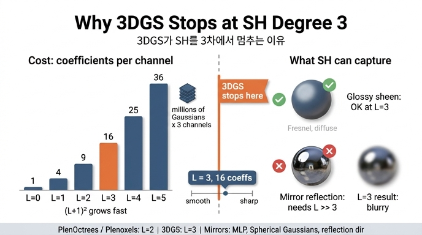

# 3DGS가 SH를 3차(16개 계수)에서 멈추는 이유

> **Q.** 3DGS가 SH를 3차(16개 계수)에서 멈추는 이유는?
>
> **A.** SH는 부드러운 구면 함수를 소수의 계수로 압축하는 데 강하지만, 고주파를 표현하려면 차수를 급격히 올려야 하기 때문이다. 이것이 거울 반사 같은 날카로운 시점 의존성을 3DGS가 잘 못 그리는 이유이기도 하다.

한 줄로 요약하면 **"3차까지는 이득이 크고, 그 이상은 비용만 제곱으로 늘고 이득은 거의 없다"**는 비용–이득 절충의 결과다. 아래에서 비용, 이득, 선례, 한계와 후속 연구 순으로 풀어 본다.

---

## 0. 먼저 복습 — 차수와 계수 수

구면 위 함수 $f(\mathbf d)$를 SH 기저로 전개하면

$$
f(\mathbf d)\approx\sum_{\ell=0}^{L}\sum_{m=-\ell}^{\ell} c_\ell^m\,Y_\ell^m(\mathbf d)
$$

- $\ell$차 band에는 $2\ell+1$개의 기저가 있으므로, $L$차까지 쓰면 계수는 $\sum_{\ell=0}^{L}(2\ell+1)=(L+1)^2$개.
- $\ell$차 SH는 $x,y,z$의 $\ell$차 동차 다항식을 단위구에 제한한 것이다. 차수가 높을수록 구면 위에서 더 잘게 진동한다(고주파).
- 차수 $L$까지만 쓰는 것은 구면 함수에 **저역 통과 필터**를 거는 것과 같다(`sh_walkthrough.py` §1.3). 하늘의 부드러운 그라디언트는 L=1~2에서 이미 맞지만, 태양처럼 좁은 봉우리는 L=3에서도 흐릿하게 퍼지고 주변에 음의 물결(ringing)이 생긴다.

3DGS는 `sh_degree = 3`, 즉 Gaussian 하나에 **16개 계수 × RGB 3채널 = 48개 실수**를 둔다. gsplat `examples/simple_trainer.py`도 `sh_degree: int = 3`이 기본값이고, `colors = torch.zeros((N, (sh_degree + 1) ** 2, 3))`로 `[N, 16, 3]` 텐서를 만들어 `sh0`(DC, `[N,1,3]`)와 `shN`(나머지 15개, `[N,15,3]`)으로 나눈다.

---

## 1. 비용 측면 — 계수 수는 차수의 **제곱**으로 늘어난다

| 차수 $L$ | 계수 수 $(L+1)^2$ | Gaussian당 실수 (×3채널) | Gaussian당 바이트 (float32) | 300만 개 Gaussian |
|---|---|---|---|---|
| 0 | 1 | 3 | 12 B | 36 MB |
| 1 | 4 | 12 | 48 B | 144 MB |
| 2 | 9 | 27 | 108 B | 324 MB |
| **3** | **16** | **48** | **192 B** | **576 MB** |
| 4 | 25 | 75 | 300 B | 900 MB |
| 5 | 36 | 108 | 432 B | 1.30 GB |
| 8 | 81 | 243 | 972 B | 2.92 GB |

세 종류의 비용이 함께 커진다.

### (a) 메모리와 PLY 파일 크기
원본 3DGS의 PLY 포맷은 Gaussian마다 위치 3 + 법선 3 + `f_dc` 3 + `f_rest` 45 + 불투명도 1 + 스케일 3 + 회전 4 = **62개 float32 = 248 바이트**다. 이 중 SH 계수가 48개(`f_dc`+`f_rest`)로 **약 77%**를 차지한다. 이미 L=3에서도 SH가 파일의 대부분인데, Mip-NeRF 360급 장면(수백만 개 Gaussian, PLY 수백 MB~1 GB 이상)에서 L=5로 올리면 SH 부분만 2.25배, L=8이면 5배가 된다. 학습 중에는 파라미터 외에 Adam의 1차·2차 모멘트가 같은 크기로 두 벌 더 붙으므로 GPU 메모리 부담은 3배다. 그래서 후속 압축 연구(Compact3D, LightGaussian, HAC 등)는 오히려 **고차 SH를 잘라내거나 양자화·distill**해서 크기를 줄이는 방향으로 간다.

### (b) 평가 연산량
SH 평가는 카메라마다 **모든 Gaussian에 대해** 기저 $Y_k(\mathbf d)$를 계산하고 계수와 내적하는 일이다(`sh_walkthrough.py` §4). 채널당 $(L+1)^2$번의 곱셈-덧셈이 필요하므로 이것도 제곱으로 늘고, 역전파에서는 계수와 방향 양쪽 기울기가 더해진다. 3DGS가 실시간(1080p 100+ FPS)을 목표로 하는 이상 이 커널이 병목이 되면 안 된다. 참고로 gsplat의 참조 구현 `_eval_sh_bases_fast`와 CUDA 커널은 **4차(25개)까지만** 구현돼 있다 — 구현자도 그 이상은 쓸 일이 없다고 본 것이다.

### (c) 학습 파라미터 수 — 과적합
계수는 적분으로 구하는 것이 아니라 관측 카메라 수십~수백 대의 색으로부터 역전파로 맞춘다(`sh_walkthrough.py` §4.2). 각 Gaussian이 실제로 보이는 카메라 수는 그보다 훨씬 적다(수십 대, 그중 대부분이 비슷한 방향). 관측 방향이 $n$개인데 미지수가 $(L+1)^2 \times 3$개면, $L$이 커질수록 **관측 사이 방향에서 색이 요동치는 과적합**이 일어난다. 노트북의 최소제곱 실험(뷰 수 8/20/60/300 × 차수 0~3)이 이걸 직접 보여 준다 — 관측이 적을 때 고차는 오히려 전 구면 MSE를 키운다. 새로운 시점(test view)에서 색이 튀는 현상(floater 색 변화, 시점 이동 시 반짝임)의 한 원인이다.

---

## 2. 이득 측면 — 3차면 "부드러운 시점 의존성"은 충분하다

3DGS가 SH로 표현하려는 것은 **"이 Gaussian을 어느 방향에서 보면 어떤 색인가"**다. 실제 장면에서 이 함수는 대부분 부드럽다.

- **확산 색**: 방향 무관 → L=0(DC)만으로 끝난다. 사실상 대부분의 Gaussian이 여기 속한다.
- **광택(glossy) 하이라이트**: 넓은 로브. 코사인 $n$제곱 형태의 로브는 $n$이 작으면(거친 표면) 1~3차로 충분히 근사된다. 노트북 §4.2의 $f^\star$ (코사인 8제곱 로브)가 L=3에서 잘 맞는 것이 그 예다.
- **프레넬 효과**: 시선이 비스듬해질수록 반사율이 커지는 완만한 변화. 저차로 충분.
- **반투명·잎사귀·머리카락**: 방향에 따른 완만한 밝기 변화. 역시 저차.

Ramamoorthi & Hanrahan (2001)은 확산 반사면의 조명(irradiance)이 **2차(9개 계수)**로 오차 ~1% 이내로 표현됨을 보였다. 3DGS는 여기에 한 차수를 더 얹어 광택까지 약간 담는 선택을 한 것이다. L=3 → L=4로 올리면 계수는 16 → 25(1.56배)로 늘지만, 실측(원 논문의 ablation과 여러 후속 재현)에서 PSNR 이득은 미미하거나 오히려 과적합으로 떨어지는 경우가 있다. 반대로 L=3 → L=2로 낮추면 하이라이트가 사라져 PSNR이 눈에 띄게 준다. 즉 **3차가 무릎(knee) 지점**이다.

또 하나: 3DGS 학습은 `sh_degree_interval = 1000` 스텝마다 차수를 하나씩 활성화한다(`sh_degree_to_use = min(step // cfg.sh_degree_interval, cfg.sh_degree)`). 차수를 늘리면 이 워밍업 기간도 길어지고, `shN`의 학습률을 `sh0`의 1/20으로 두는 것에서 보듯 고차 계수는 원래 "천천히, 조금만" 배우도록 설계돼 있다. 설계 철학 자체가 시점 의존성을 보정항으로 취급한다.

---

## 3. 선례 — PlenOctrees, Plenoxels도 같은 선택

MLP 없이 SH 계수를 명시적으로 저장해 실시간 렌더링하는 계열은 3DGS 이전부터 같은 결론에 도달했다.

| 방법 (연도) | 표현 | SH 차수 | 비고 |
|---|---|---|---|
| PlenOctrees (Yu et al., 2021) | 옥트리 리프에 밀도 + SH | **2차 (9개)** 기본, 4차(25개) 실험 | NeRF-SH를 먼저 학습한 뒤 옥트리로 변환. 고차는 용량 대비 이득 작음 |
| Plenoxels (Fridovich-Keil et al., 2022) | 희소 복셀 격자에 밀도 + SH | **2차 (9개 × 3 = 27)** | MLP 없이 직접 최적화. 3DGS의 직접 선조 |
| 3DGS (Kerbl et al., 2023) | Gaussian에 SH | **3차 (16개 × 3 = 48)** | 복셀보다 프리미티브 수가 적어(수백만 vs 수억) 한 차수 더 얹을 여유가 있었다 |

복셀 방식은 프리미티브 수가 워낙 많아 2차에서 멈췄고, 3DGS는 프리미티브가 적은 대신 하나가 넓은 영역을 담당하므로 3차까지 올린 것이다. 이 계열 전체가 "**시점 의존성은 저차 SH로 충분하다**"는 경험적 합의를 공유한다.

---

## 4. 한계 — 거울·굴절·날카로운 하이라이트

같은 이유의 뒷면이 3DGS의 대표적 실패 사례다.

- **거울/유리 반사**: 반사 이미지는 시선 방향에 따라 완전히 다른 그림이 보이는 **고주파 구면 함수**다. 이를 SH로 담으려면 반사되는 장면의 세부 크기에 따라 수십~수백 차수가 필요하다(측지학에서 지구 중력장을 수천 차수까지 쓰는 이유와 같다). 16개 계수로는 뿌옇게 번진 하이라이트만 남고 ringing이 생긴다. 실제 3DGS는 이런 경우 **거울 뒤편에 가상의 Gaussian을 만들어** 반사상을 "실제 물체"처럼 흉내내는 편법을 학습하기도 한다(가상 이미지 해결책). 정면에서는 그럴싸하지만 시점을 옮기면 깨진다.
- **굴절(유리병, 물)**: 배경이 뒤틀려 보이는 함수는 방향뿐 아니라 위치 의존도 강해 SH로는 원리적으로 표현이 안 된다.
- **좁은 스페큘러(금속·광택 페인트)**: 코사인 $n$제곱 로브의 $n$이 수백이면 폭이 몇 도 수준이다. 노트북 §1.3의 "태양" 실험이 정확히 이 상황 — L=3에서도 봉우리가 퍼진다.
- **이방성 반사(브러시드 메탈)**: 방향 함수가 축 대칭도 아니어서 더 많은 계수가 필요하다.

---

## 5. 후속 연구 — SH를 어떻게 넘어서는가

한계를 인정한 뒤 후속 연구는 "차수를 올리자"가 아니라 **표현 자체를 바꾸는** 쪽으로 갔다. 차수를 올리는 것은 위에서 본 대로 비용이 제곱으로 늘면서도 과적합만 심해지기 때문이다.

| 접근 | 대표 연구 | 아이디어 |
|---|---|---|
| **작은 MLP 디코더** | Scaffold-GS, Compact3D(feature + MLP), gsplat의 `app_opt`/`feature_dim` 옵션 | Gaussian에 SH 대신 짧은 특징 벡터를 두고, (특징, 시선 방향) → 색을 작은 MLP가 낸다. 비선형이라 같은 파라미터 수로 더 날카로운 함수를 표현할 수 있지만, Gaussian마다 MLP를 호출해야 해 속도가 떨어진다 |
| **Spherical Gaussians / ASG** | Spec-Gaussian (Yang et al., 2024) | 구면 위 가우시안 로브(폭·방향·크기가 파라미터)로 좁은 하이라이트를 **적은 개수로** 직접 표현. SH가 "전역 저주파 기저"라면 SG는 "국소 봉우리 기저"라 스페큘러에 맞다 |
| **반사 방향 인코딩** | Ref-NeRF의 IDE를 계승한 GaussianShader, 3DGS-DR(Deferred Reflection), RefGaussian | 시선 방향 $\mathbf d$ 대신 **법선으로 반사시킨 방향** $\mathbf r = 2(\mathbf n\cdot\mathbf d)\mathbf n - \mathbf d$를 입력으로 쓰거나, 화면 공간에서 법선을 뽑아 환경 맵을 조회한다. 거울 반사는 $\mathbf r$의 함수로는 매끈하므로 저차 표현이 다시 통한다 |
| **물리 기반 셰이딩** | GaussianShader, GS-IR, Relightable 3DGS | 색을 직접 저장하지 않고 albedo·roughness·법선 + 환경 조명으로 BRDF를 계산. 재조명(relighting)까지 가능 |

공통점: **입력 방향을 바꾸거나(반사 방향), 기저를 바꾸거나(SG), 선형 급수를 비선형 함수(MLP)로 대체**한다. 어느 쪽도 "SH 차수 8"로 가지 않는다.

---

## 6. 정리

1. **비용**: 계수 수 $(L+1)^2$이 제곱으로 늘고(16 → 36 → 81), 이는 Gaussian 수백만 개 × 3채널의 메모리·PLY 크기·SH 평가 연산·Adam 상태에 그대로 곱해진다. L=3에서도 SH가 PLY의 77%다.
2. **이득**: 실제 시점 의존성(확산, 광택, 프레넬)은 부드러워 3차로 충분하고, Gaussian당 관측 카메라가 적어 고차는 과적합만 부른다.
3. **선례**: PlenOctrees·Plenoxels가 2차에서 멈췄고, 3DGS는 프리미티브 수가 적은 덕에 3차까지 올렸다.
4. **한계**: 거울·굴절·날카로운 하이라이트는 원리적으로 저차 SH가 못 담는 고주파 함수다.
5. **후속**: 차수를 올리는 대신 MLP·Spherical Gaussians·반사 방향 인코딩·물리 기반 셰이딩으로 표현을 바꿨다.

## 참고 자료

- `sh_walkthrough.py` §1.3 (저역 통과 실험), §4.2 (관측 수 vs 차수 과적합 실험), "정리 — 한계와 확장"
- `examples/simple_trainer.py`: `sh_degree: int = 3`, `sh_degree_interval: int = 1000`, `shN_lr = sh0_lr / 20`
- Kerbl et al., "3D Gaussian Splatting for Real-Time Radiance Field Rendering", SIGGRAPH 2023
- Ramamoorthi & Hanrahan, "An Efficient Representation for Irradiance Environment Maps", SIGGRAPH 2001
- Yu et al., "PlenOctrees for Real-time Rendering of Neural Radiance Fields", ICCV 2021
- Fridovich-Keil et al., "Plenoxels: Radiance Fields without Neural Networks", CVPR 2022
- Verbin et al., "Ref-NeRF", CVPR 2022 — 반사 방향 기반 Integrated Directional Encoding
- Yang et al., "Spec-Gaussian: Anisotropic View-Dependent Appearance for 3D Gaussian Splatting", 2024
- Jiang et al., "GaussianShader", CVPR 2024; Ye et al., "3D Gaussian Splatting with Deferred Reflection", SIGGRAPH 2024

## 인포그래픽

