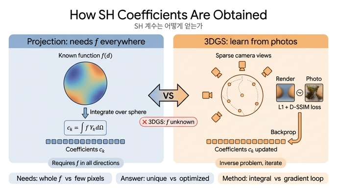

# 3DGS는 왜 SH 계수를 적분(사영)으로 구하지 않는가

> **Q.** 3DGS는 SH 계수를 적분(사영)으로 구하지 않는다. 그 이유와 대안은?
> **A.** 진짜 함수 $f$를 모르기 때문이다. 대신 여러 카메라에서 관측한 색과 렌더 결과의 차이를 **역전파**해서 계수를 갱신하는, "관측으로부터의 역평가" 방식을 쓴다.

## 1. 사영이 요구하는 것 vs 3DGS가 실제로 가진 것

SH 기저는 정규직교하므로, 구면 위 함수 $f(\mathbf d)$를 알고 있다면 계수는 내적 한 번으로 나온다.

$$
c_k=\int_{S^2} f(\mathbf d)\,Y_k(\mathbf d)\,d\Omega
$$

이 식이 성립하려면 **모든 방향 $\mathbf d$에서 $f$의 값을 알아야** 한다. 적분은 구면 전체를 훑기 때문이다. 환경 조명(environment map)이나 지구 중력장처럼 데이터가 구면을 빽빽하게 덮고 있는 응용에서는 이 방식이 자연스럽다.

3DGS의 상황은 전혀 다르다.

| 항목 | 사영이 전제하는 것 | 3DGS가 실제로 가진 것 |
|---|---|---|
| 방향 표본 | 구면 전체(연속, 또는 촘촘한 격자) | 카메라 수십~수백 대 → Gaussian 하나당 **수십~수백 개의 이산 방향**, 그것도 한쪽 반구에 몰려 있음 |
| 관측 값 | Gaussian **하나**의 색 $f(\mathbf d)$ | **픽셀** 색 = 광선 위 여러 Gaussian이 알파 블렌딩된 합 |
| 함수 $f$ | 주어진 것(알려진 함수) | **미지수** — 계수를 정하려는 대상 그 자체 |

즉 "Gaussian $i$가 방향 $\mathbf d$에서 어떤 색인가"를 직접 관측하는 일은 아예 불가능하다. 사진의 한 픽셀에는 여러 Gaussian의 기여가 $\sum_i \mathbf c_i(\mathbf d_i)\,\alpha_i\prod_{j<i}(1-\alpha_j)$ 형태로 섞여 들어오며, 어느 Gaussian이 얼마나 기여했는지는 그 Gaussian들의 위치·크기·불투명도(역시 학습 중인 값)에 달려 있다. 적분에 넣을 $f$가 없으니 사영은 출발부터 성립하지 않는다.

## 2. 문제의 재정식화: 역문제(inverse problem)

그래서 3DGS는 질문을 뒤집는다. "$f$를 알고 계수를 구한다"가 아니라, **"어떤 계수를 넣으면 렌더 결과가 사진과 가장 비슷해지는가"**를 묻는다.

$$
\min_{\{\mathbf c_{i,k}\},\ \boldsymbol\theta}\ \sum_{\text{view }v}\ \mathcal L\big(\mathrm{Render}_v(\{\mathbf c_{i,k}\},\boldsymbol\theta),\ I_v\big),
\qquad
\mathcal L=(1-\lambda)\,\mathcal L_1+\lambda\,\mathcal L_{\text{D-SSIM}}\ (\lambda=0.2)
$$

- $\boldsymbol\theta$: 위치·공분산·불투명도 등 나머지 Gaussian 파라미터
- $I_v$: 카메라 $v$의 실제 사진
- 최적화: Adam 경사하강. 각 스텝에서 카메라 하나를 골라 렌더 → 손실 → 역전파 → 갱신

이것이 노트북 4.2의 표현 **"관측으로부터의 역평가"**다. 순방향은 "계수 → 방향 → 색"(SH 평가)인데, 학습은 그 반대 방향으로 "색 차이 → 계수 수정"을 흘려보낸다.

## 3. SH 부분의 기울기는 단순하다 — 다만 렌더러를 거쳐서 온다

Gaussian $i$의 색은 계수에 대해 **선형**이다.

$$
\mathbf c_i(\mathbf d)=\sum_k \mathbf c_{i,k}\,Y_k(\mathbf d)
\quad\Longrightarrow\quad
\frac{\partial \mathbf c_i}{\partial \mathbf c_{i,k}} = Y_k(\mathbf d)
$$

즉 계수 $k$의 기울기는 "그 방향에서의 기저값 × 색에 대한 상류 기울기"다. gsplat의 `SphericalHarmonicsCUDA.cu` 백워드 커널이 하는 일이 정확히 이것으로, 순방향에서 계산한 $Y_k(\mathbf d)$를 재사용해 `v_coeffs[k] = Y_k(d) * v_color`를 누적한다.

문제는 `v_color`(색에 대한 상류 기울기)가 어디서 오느냐다. 체인은 다음과 같다.

```
손실(L1 + D-SSIM)
  → ∂L/∂픽셀
  → 알파 블렌딩 역전파: 픽셀에 기여한 각 Gaussian의 색으로 분배 (가중치 α_i·T_i)
  → clamp_min(0), +0.5 통과 (clamp는 음수 구간에서 기울기를 끊음)
  → ∂L/∂c_i(d)  =  v_color
  → ∂L/∂c_{i,k} = Y_k(d) · v_color        ← SH 부분
```

한 Gaussian의 계수는 그것이 보이는 모든 카메라, 그것이 덮는 모든 픽셀에서 이런 기울기를 받아 합산한다. 관측이 없는 방향의 계수 성분은 기울기를 받지 못하므로 그대로 남는다 — 이것이 아래 "과적합"의 원인이다.

## 4. 노트북 4.2의 축소판: Gaussian 하나에 대한 두 가지 풀이

블렌딩을 제거하고 Gaussian **하나**만 놓으면 문제는 선형 회귀가 된다. 관측 방향 $\mathbf d_j$에서 정답 색 $f^\star(\mathbf d_j)$가 주어졌다고 하자.

| 방법 | 식 | 노트북 구현 |
|---|---|---|
| A. 최소제곱(닫힌 해) | $\min_{\mathbf c}\sum_j\|Y(\mathbf d_j)\,\mathbf c-f^\star(\mathbf d_j)\|^2$ → $\mathbf c=A^+F$ | `fit_lstsq`: `torch.linalg.lstsq(sh_bases(obs_d), obs_c)` |
| B. Adam 경사하강 | 같은 목적(L1)을 반복 갱신으로 | `sh0`, `shN`을 `requires_grad`로 두고 4000스텝, `sh_degree_interval` 흉내 |

두 방법은 **같은 문제**를 풀고 있으며, 관측이 충분하면(예: 60뷰) 전 구면 MSE가 거의 같게 나온다. 차이는 "어떻게 푸느냐"일 뿐이다. 이 실험이 보여 주는 핵심:

1. **적분 없이도 계수를 구할 수 있다.** 이산 관측 몇십 개만으로 $f^\star$의 SH 근사가 복원된다.
2. **관측 수가 부족하면 고차가 과적합한다.** 노트북 표에서 $n=8$일 때 $L=3$(16개 미지수)은 8개 관측에 정확히 맞추느라 관측 사이 방향에서 색이 요동하고, 전 구면 MSE가 $L=1$보다 오히려 나빠진다. 관측이 300개가 되면 고차가 이긴다.
3. **차수가 낮으면 표현력이 부족하다.** $L=0$~$1$은 광택 하이라이트를 그리지 못한다.

3DGS가 `sh_degree_interval`(1000스텝마다 차수 +1)로 저차부터 활성화하고, `shN` 학습률을 `sh0`의 1/20으로 두는 것은 이 과적합을 억제하는 장치다.

## 5. 사영 방식과 역문제 방식의 대비

| 비교 항목 | 사영 $c_k=\int fY_k\,d\Omega$ | 3DGS(역전파 학습) |
|---|---|---|
| 필요한 정보 | 모든 방향에서의 $f$ | 몇 개 시점의 **픽셀** 색(블렌딩된 결과) |
| 결과의 유일성 | 유일(정규직교 기저의 내적) | 일반적으로 비유일 — 관측 없는 방향은 미결정, 다른 Gaussian과 역할을 나눠 가질 수 있음 |
| 잡음 민감도 | 잡음이 계수에 선형으로 전달되나 전 구면 평균으로 억제 | 관측 부족 시 고차 계수가 잡음·과적합에 취약 → 저차부터 활성화, 낮은 학습률로 완화 |
| 계산 방식 | 수치 적분(구적법) 한 번 | 렌더 → 손실 → 역전파 반복(수만 스텝) |
| 다른 파라미터와의 관계 | 독립 | 위치·불투명도·공분산과 **공동 최적화** — 계수는 그때그때의 블렌딩 가중치에 종속 |
| 근사 오차의 성격 | 잘린 급수의 절단 오차만 | 절단 오차 + 표본 부족 + 국소 최적해 |

## 6. 왜 최소제곱 닫힌 해조차 쓰지 않는가

4절의 방법 A는 닫힌 해가 있으니 "그냥 lstsq를 풀면 되지 않나?" 싶지만, 실제 3DGS에서는 세 가지 이유로 불가능하다.

1. **블렌딩 때문에 비선형이다.** 픽셀 색은 $\sum_i \mathbf c_i\,\alpha_i\,T_i$ 인데 $\alpha_i, T_i$는 위치·공분산·불투명도에 비선형으로 의존한다. 이 값들이 고정돼 있다고 가정해야만 계수에 대해 선형이 되고, 그마저도 `clamp_min(0)`이 선형성을 깨뜨린다.
2. **규모.** Gaussian이 수백만 개, 각 48개 계수, 관측 픽셀은 수억 개. 이를 하나의 선형 시스템으로 세우면 미지수 $10^8$ 규모의 희소 문제가 되며, Gaussian의 개수 자체가 학습 중 densification/pruning으로 계속 바뀐다.
3. **공동 최적화.** 계수는 위치·불투명도와 함께 **같은 손실을 같은 스텝에서** 내려가야 한다. 어떤 Gaussian이 어느 픽셀을 얼마나 덮는지가 바뀌면 그에 맞는 색도 바뀌어야 하는데, 이를 매 스텝 닫힌 해로 다시 푸는 것보다 Adam 한 스텝을 함께 밟는 쪽이 훨씬 싸고, 이미 있는 미분 가능 렌더러의 역전파 경로를 그대로 재사용한다.

결국 "역전파로 계수를 배운다"는 선택은 SH만의 특별한 처리가 아니라, **3DGS 전체가 미분 가능 렌더링 기반의 역문제로 설계되어 있기 때문에** SH 계수도 자연히 그 파이프라인의 한 파라미터로 편입된 결과다.

## 한 줄 요약

사영은 "$f$를 알 때 계수를 읽어내는 공식"이고, 3DGS에는 읽어낼 $f$가 없다. 있는 것은 여러 Gaussian이 섞인 사진 몇 장뿐이므로, 렌더 결과와 사진의 차이를 계수까지 역전파해 "어떤 계수였어야 이 사진이 나오는가"를 거꾸로 찾는다.

## 인포그래픽


