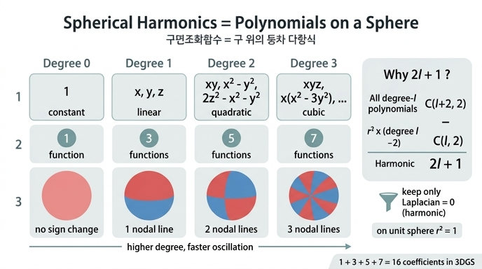

# ℓ차 SH = "x, y, z의 ℓ차 동차 다항식을 단위구에 제한한 것"

> **Q.** $\ell$차 SH를 다항식 관점에서 한 문장으로 정의하면?
> **A.** $x,y,z$의 **$\ell$차 동차 다항식을 단위구에 제한한 것**이다. 0차는 상수, 1차는 선형, 2차는 이차식이므로 $\ell$이 커질수록 구면 위에서 더 잘게 진동한다.

교과서적 정의(연관 르장드르 함수 $P_\ell^m(\cos\theta)$ × $\cos m\varphi$, $\sin m\varphi$)는 외우기 어렵지만, 다항식 관점은 세 마디로 끝난다.

1. $x,y,z$의 **$\ell$차 동차 다항식**을 모은다.
2. 그중 **조화(harmonic)** 인 것, 즉 $\Delta p = 0$ 을 만족하는 것만 남긴다.
3. 그것을 **단위구 $x^2+y^2+z^2=1$ 위에서만** 본다.

한 문장 답에는 2번이 생략되어 있는데, 아래에서 왜 조화 조건이 필요하고 왜 그 덕분에 개수가 $2\ell+1$이 되는지 설명한다. 이 정리가 되면 3DGS의 "16개 계수 = 1+3+5+7"이 자연스럽게 따라온다.

---

## 1. 동차 다항식(homogeneous polynomial)이란

**모든 항의 차수가 똑같은** 다항식이다. 3변수 $x,y,z$에서

| $\ell$ | $\ell$차 단항식(monomial) | 개수 | 예 |
|---|---|---|---|
| 0 | $1$ | 1 | $c$ (상수) |
| 1 | $x,\ y,\ z$ | 3 | $ax+by+cz$ |
| 2 | $x^2,\ y^2,\ z^2,\ xy,\ yz,\ zx$ | 6 | $x^2-y^2,\ xy,\ 3z^2-(x^2+y^2+z^2)$ |
| 3 | $x^3,\ x^2y,\ \dots,\ xyz$ | 10 | $x(x^2-3y^2),\ xyz$ |

$\ell$차 동차 다항식은 스케일링에 대해 $p(t\mathbf{x}) = t^{\ell}\,p(\mathbf{x})$ 를 만족한다. 그래서 **방향만 정해지면 값이 반지름 $r$의 $\ell$제곱에 비례**한다 — 단위구($r=1$) 위 값만 알면 전 공간의 값이 결정된다. "구면 위 함수"를 다항식으로 쓸 때 동차식이 자연스러운 이유가 여기 있다.

3변수 $\ell$차 단항식의 개수는 $x^a y^b z^c$, $a+b+c=\ell$ 인 음이 아닌 정수해의 개수이므로

$$
\dim \mathcal P_\ell = \binom{\ell+2}{2} = \frac{(\ell+1)(\ell+2)}{2}
\qquad (1,\ 3,\ 6,\ 10,\ 15,\ \dots)
$$

**주의: "$3z^2-1$"은 동차식처럼 보이지 않는다?** 노트북의 `sh_bases`에는 `c2 * (3*z*z - 1)`, `c3 * y * (5*z*z - 1)` 처럼 상수항이 섞인 식이 나온다. 하지만 단위구 위에서는 $1 = x^2+y^2+z^2 = r^2$ 이므로

$$
3z^2 - 1 \;=\; 3z^2 - (x^2+y^2+z^2) \;=\; 2z^2 - x^2 - y^2
$$

로 다시 쓰면 순수한 2차 동차식이다. 코드는 단위구 위에서만 평가하므로 $r^2=1$ 을 미리 대입해 곱셈을 아낀 것뿐이다.

---

## 2. 왜 "조화(harmonic)" 다항식만 골라내는가

### 2.1 단위구 위에서는 $r^2$ 를 곱해도 같은 함수다

동차 다항식을 전부 쓰면 **중복**이 생긴다. 단위구 위에서 $r^2 = x^2+y^2+z^2 = 1$ 이므로, 예컨대 2차식 $x^2+y^2+z^2$ 은 구면 위에서 0차 상수 $1$과 **완전히 같은 함수**다. 일반적으로 $(\ell-2)$차 동차식 $q$ 에 $r^2$ 를 곱한 $r^2 q$ 는 $\ell$차 동차식이지만, 구면 위에서는 $q$ 와 구별되지 않는다.

즉 $\ell$차 동차 다항식 공간 $\mathcal P_\ell$ 안에는 "이미 더 낮은 차수로 표현되는 부분" $r^2\mathcal P_{\ell-2}$ 가 들어 있다. **새로운 것**만 남기려면 이 부분을 빼야 한다.

### 2.2 조화 조건이 정확히 그 여분을 걸러낸다

라플라시안 $\Delta = \partial_x^2+\partial_y^2+\partial_z^2$ 은 $\ell$차 동차식을 $(\ell-2)$차 동차식으로 보내는 선형 사상 $\Delta:\mathcal P_\ell\to\mathcal P_{\ell-2}$ 이고, 이 사상은 **전사(onto)** 이다. 그 핵(kernel), 즉 $\Delta p = 0$ 인 다항식들이 **조화 다항식** $\mathcal H_\ell$ 이다. 그리고 다음 직합 분해가 성립한다.

$$
\mathcal P_\ell \;=\; \mathcal H_\ell \;\oplus\; r^2\,\mathcal P_{\ell-2}
$$

말로 풀면: 임의의 $\ell$차 동차식은 "조화 부분" + "$r^2$ × 낮은 차수 부분"으로 **유일하게** 쪼개진다. 구면 위에서 $r^2$ 부분은 낮은 차수에 이미 포함되어 있으므로, **차수 $\ell$에서 진짜 새로 추가되는 함수는 $\mathcal H_\ell$ 뿐**이다. 이것을 단위구에 제한한 것이 바로 $\ell$차 SH $\{Y_\ell^m\}_{m=-\ell}^{\ell}$ 이다.

이 분해를 재귀적으로 적용하면 $\mathcal P_\ell = \mathcal H_\ell \oplus r^2\mathcal H_{\ell-2}\oplus r^4\mathcal H_{\ell-4}\oplus\cdots$ 이고, 구면 위에서 $r=1$ 이므로 "$\ell$차 이하 모든 다항식의 구면 제한" = "$\ell$차 이하 SH의 선형결합"이 된다. 어떤 다항식을 가져와도 SH로 다시 쓸 수 있다는 뜻이다.

### 2.3 조화 조건이 주는 보너스: 직교성과 회전 불변성

조화 동차식을 구면 좌표로 쓰면 $p = r^{\ell}\,Y(\theta,\varphi)$ 꼴이고, $\Delta p = 0$ 을 대입하면 구면 라플라시안(Laplace–Beltrami) $\Delta_{S^2}$ 에 대해

$$
\Delta_{S^2}\,Y_\ell^m = -\ell(\ell+1)\,Y_\ell^m
$$

이 나온다. 즉 SH는 **구면 라플라시안의 고유함수**이고, 고유값 $-\ell(\ell+1)$ 이 차수마다 다르다. 이로부터

- **차수 간 직교성**: 고유값이 다른 고유함수는 자동으로 직교한다 ($\int Y_\ell^m Y_{\ell'}^{m'}\,d\Omega = 0$, $\ell\neq\ell'$). 노트북에서 Gram 행렬이 단위행렬로 나온 것이 이것이다.
- **회전 불변성**: $\Delta$ 는 회전과 가환하므로, $\ell$차 SH를 회전시키면 같은 $\ell$차 SH들의 선형결합이 된다. "차수 $\ell$" 이라는 라벨이 좌표계에 무관한 진짜 물리량이 된다(그래서 "band"라고도 부른다).
- **주파수 해석**: 1차원 $\sin kx$ 가 $\frac{d^2}{dx^2}$ 의 고유함수이고 고유값 $-k^2$ 가 주파수의 제곱인 것과 정확히 대응한다. $\ell$이 구면에서의 "주파수"다(4절).

---

## 3. 차수 $\ell$의 SH가 $2\ell+1$개인 이유

2.2의 직합 분해에서 차원을 세면 끝난다.

$$
\dim\mathcal H_\ell
= \dim\mathcal P_\ell - \dim\mathcal P_{\ell-2}
= \binom{\ell+2}{2} - \binom{\ell}{2}
= \frac{(\ell+2)(\ell+1)}{2} - \frac{\ell(\ell-1)}{2}
= \frac{4\ell+2}{2}
= 2\ell+1
$$

| $\ell$ | 전체 $\ell$차 동차식 $\binom{\ell+2}{2}$ | 빼는 것 $r^2\times(\ell-2)$차 $=\binom{\ell}{2}$ | 조화 = SH 개수 $2\ell+1$ |
|---|---|---|---|
| 0 | 1 | 0 | **1** |
| 1 | 3 | 0 | **3** |
| 2 | 6 | 1 | **5** |
| 3 | 10 | 3 | **7** |
| 4 | 15 | 6 | 9 |

$\ell=0,1$ 에서는 뺄 것이 없으므로(모든 상수·선형식은 $\Delta$ 가 0) 동차식 전부가 그대로 SH다. $\ell=2$ 부터 빼기가 시작된다.

**$\ell=2$ 를 손으로 확인.** 6개 단항식 $x^2,y^2,z^2,xy,yz,zx$ 중

- $xy,\ yz,\ zx$: 각각 $\Delta = 0$ → 조화 (3개)
- $x^2,y^2,z^2$: 각각 $\Delta = 2$ → 단독으로는 조화가 아님. 하지만 계수 합이 0인 조합은 조화: $x^2-y^2$ ($\Delta = 2-2=0$), $2z^2-x^2-y^2$ ($\Delta = 4-2-2=0$) → 2개
- 남는 1방향 $x^2+y^2+z^2 = r^2$ 는 $\Delta = 6 \ne 0$ → 이것이 $r^2\mathcal P_0$, 구면 위에서 상수와 같으므로 버린다.

결과 5개 $\{xy,\ yz,\ 2z^2-x^2-y^2,\ zx,\ x^2-y^2\}$ 는 노트북 `sh_bases`의 $\ell=2$ 줄과 정확히 일치한다.

```python
out += [c1 * x * y, -c1 * y * z, c2 * (3 * z * z - 1), -c1 * x * z, c3 * (x * x - y * y)]
#        Y(2,-2)     Y(2,-1)      Y(2,0) = 2z²-x²-y²   Y(2,1)       Y(2,2)
```

**$\ell=3$ 도 같은 식.** 10개 단항식에서 $r^2\cdot\{x,y,z\}$ 3방향을 빼면 7개. 코드의 `y * (5*z*z - 1)` 은 $r^2=1$ 을 되돌리면 $y(5z^2-r^2) = 4yz^2 - x^2y - y^3$ 이고 $\Delta = -2y - 6y + 8y = 0$ 으로 조화임을 직접 확인할 수 있다.

**3DGS의 16개.** 차수 $L=3$ 까지 쓰면 $\sum_{\ell=0}^{3}(2\ell+1) = 1+3+5+7 = 16 = (L+1)^2$. 계수 배열 인덱스 $k=\ell^2+\ell+m$ 은 앞 차수들의 개수 합 $\ell^2$ 에 차수 안 위치 $\ell+m$ (0부터 $2\ell$) 을 더한 것이다.

---

## 4. 단위구에 제한하면 왜 "더 잘게 진동"하는가

### 4.1 대원(great circle) 위에서 보면 삼각 다항식이다

구면 위 임의의 대원을 따라가 보자. 가장 쉬운 적도 $z=0$ 에서는 $x=\cos\varphi,\ y=\sin\varphi$ 이므로 $\ell$차 동차식의 각 항 $x^a y^b$ ($a+b=\ell$) 는 $\cos^a\varphi\,\sin^b\varphi$, 즉 **주파수가 최대 $\ell$인 삼각 다항식**이 된다.

| SH | 적도 위 값 | 한 바퀴에 진동 횟수 |
|---|---|---|
| $Y_1^{1}\propto x$ | $\cos\varphi$ | 1 |
| $Y_2^{2}\propto x^2-y^2$ | $\cos 2\varphi$ | 2 |
| $Y_2^{-2}\propto xy$ | $\tfrac12\sin 2\varphi$ | 2 |
| $Y_3^{3}\propto x(x^2-3y^2)$ | $\cos 3\varphi$ | 3 |

회전 불변성(2.3) 덕분에 어느 대원을 골라도 결론은 같다: **$\ell$차 SH는 구면 위 어떤 큰 원을 따라가도 최대 $\ell$번밖에 진동하지 못하고, 실제로 어딘가에서는 $\ell$번 진동한다.** 이것이 "차수 = 구면 위 주파수"의 정확한 의미다.

### 4.2 마디선(nodal line) 개수 = $\ell$

$Y_\ell^m$ 의 값이 0이 되는 곡선(빨강↔파랑 경계)은 정확히 $\ell$개다: 위도 방향 원이 $\ell-|m|$개, 경도 방향 대원이 $|m|$개(경선 $2|m|$개). 노트북의 등장방형 지도(행 = $\ell$)에서 아래로 갈수록 빨강·파랑 조각이 잘게 나뉘는 것, 3D 그림에서 $s\to p\to d$ 궤도처럼 로브가 늘어나는 것이 모두 이 마디선 증가다.

### 4.3 왜 "제한"이 진동을 만드는가 — 직관

$\mathbb R^3$ 안에서 $x^2-y^2$ 는 그냥 매끈한 안장 모양 곡면이다. 진동이라 부를 만한 것이 없다. 그런데 반지름 1인 구 위로 시야를 좁히면, 원점을 지나는 방향에 따라 부호가 $+\,-\,+\,-$ 로 바뀌는 것만 보이게 되어 "진동"으로 읽힌다. **차수가 높을수록 다항식은 원점 근처에서 더 많은 방향으로 부호를 바꾸는데(동차성 때문에 모든 스케일에서 같은 패턴), 단위구는 그 부호 패턴을 그대로 지도처럼 펼쳐 보여 준다.** 차수 = 부호가 바뀌는 횟수 = 구면 위 진동 횟수.

### 4.4 3DGS에서의 의미: 저역 통과 필터와 3차에서 멈추는 이유

노트북 1.3절 실험에서 본 것처럼, 차수 $L$ 까지 사영하는 것은 구면 위 주파수 $\ell\le L$ 만 통과시키는 **저역 통과 필터**다. 하늘의 완만한 그라디언트($\ell\le 1$)는 금방 맞지만, 태양처럼 좁은 봉우리는 고주파가 필요해 16개 계수로는 흐려지고 링잉이 생긴다. 3DGS가 Gaussian마다 $L=3$ (16개 × RGB = 48 실수)에서 멈추는 것은 "부드러운 시점 의존성(광택, 프레넬)까지는 잡고, 거울 반사처럼 날카로운 것은 포기한다"는 트레이드오프이고, 그 근거가 바로 "$\ell$차 = 최대 $\ell$번 진동" 이다.

---

## 5. 요약

| 개념 | 내용 |
|---|---|
| 동차 다항식 | 모든 항이 같은 차수 $\ell$; $p(t\mathbf x)=t^\ell p(\mathbf x)$. 3변수에서 $\binom{\ell+2}{2}$차원 |
| 조화 조건 $\Delta p=0$ | 단위구에서 $r^2=1$ 로 인해 중복되는 $r^2\mathcal P_{\ell-2}$ 를 걸러냄. 부수 효과로 직교성·회전 불변성 |
| 개수 $2\ell+1$ | $\binom{\ell+2}{2}-\binom{\ell}{2}$. $L=3$ 까지 합 $=16$ |
| 진동 | 대원을 따라 최대 $\ell$번, 마디선 $\ell$개. $\Delta_{S^2}Y=-\ell(\ell+1)Y$ 가 "주파수²" |
| 코드의 $3z^2-1$ | $r^2=1$ 을 대입한 $2z^2-x^2-y^2$ 의 축약형 |

**한 문장으로 다시:** $\ell$차 SH는 $x,y,z$의 $\ell$차 동차(그리고 조화) 다항식을 단위구에 제한한 것이며, 조화 조건이 $r^2$ 중복을 제거해 개수를 $2\ell+1$로 만들고, 차수 $\ell$은 구면 위에서 최대 $\ell$번 진동하는 "주파수"가 된다.

## 참고

- 노트북 `sh_walkthrough.py` 1.2절(다항식 전개), 1.3절(저역 통과 실험), 기저 등장방형·3D 그림
- Axler, Bourdon, Ramey, *Harmonic Function Theory*, Ch. 5 (Harmonic Polynomials) — $\mathcal P_\ell=\mathcal H_\ell\oplus r^2\mathcal P_{\ell-2}$ 분해
- Sloan, *Efficient Spherical Harmonic Evaluation* (JCGT 2013) — gsplat `_eval_sh_bases_fast` 가 따르는 다항식 점화식
- Ramamoorthi & Hanrahan, *An Efficient Representation for Irradiance Environment Maps* (2001) — 저차 SH로 충분한 이유

## 인포그래픽


