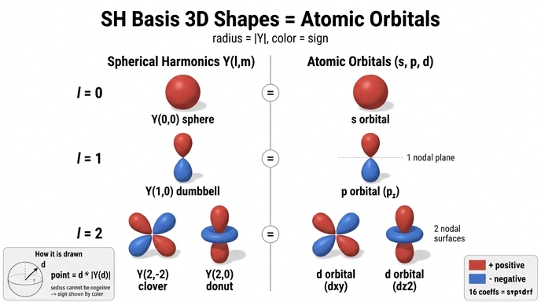

# SH 기저를 3D로 그리기 — 반지름 = |Y|, 색 = 부호, 그리고 원자 궤도

## 질문
SH 기저를 3D로 그릴 때 반지름과 색은 무엇을 나타내며, 어떤 익숙한 그림과 닮았는가?

## 답
- **반지름** = $|Y_\ell^m(\mathbf d)|$ — 그 방향에서 기저 함수의 크기(절댓값)
- **색** = $Y_\ell^m(\mathbf d)$의 **부호** — 빨강 $+$, 파랑 $-$
- 결과 모양은 **양자역학의 원자 궤도(s, p, d 궤도) 그림**과 같다.

---

## 1. 극좌표식 시각화 원리 — "방향에 반지름을 곱해 표면을 만든다"

SH 기저 $Y_\ell^m$은 **구면 위의 함수**다. 입력은 단위 방향 벡터 $\mathbf d$($\|\mathbf d\|=1$), 출력은 실수 하나.
2D에서는 등장방형(equirectangular) 지도(가로 $\varphi$, 세로 $\theta$)에 색으로 값을 칠하면 되지만,
3D에서 "함수의 크기"를 형태로 보이게 하려면 **극좌표(polar plot)의 3차원 판**을 쓴다.

1차원 극좌표 그래프 $r = f(\theta)$가 각도마다 원점에서 $f(\theta)$만큼 떨어진 점을 찍는 것처럼,
구면 위 함수는 **방향 $\mathbf d$마다 원점에서 $|Y(\mathbf d)|$만큼 떨어진 점**을 찍는다.

$$
\mathbf p(\mathbf d) \;=\; \mathbf d \cdot |Y_\ell^m(\mathbf d)|
$$

노트북 `sh_walkthrough.py`의 해당 셀이 정확히 이 계산이다.

```python
r = np.abs(B_np[..., k])            # 반지름 = |Y_k(d)|   (B는 격자 방향마다 계산한 기저값)
xyz = d_np * r[..., None]           # 표면 점 = 방향 d × 반지름
ax.plot_surface(xyz[..., 0], xyz[..., 1], xyz[..., 2],
                facecolors=plt.cm.RdBu_r(0.5 + 0.5 * np.sign(B_np[..., k])),   # 색 = 부호
                ...)
```

- `dirs`는 `sphere_grid()`로 만든 $(\theta,\varphi)$ 격자의 단위 방향 벡터 `[nθ, nφ, 3]`.
- `B[..., k]`는 각 방향에서 $k$번째 기저값 `[nθ, nφ]`.
- 격자를 그대로 유지한 채 각 점을 원점 방향으로 `r`배 늘였다 줄였다 하므로, 함수값이 큰 방향은 **불룩한 로브(lobe)**,
  함수값이 0인 방향은 **원점으로 쪼그라든 잘록한 부분**이 된다.

즉 로브가 크게 튀어나온 방향 = 그 기저가 "크게 반응하는" 방향이고, 원점을 지나는 잘록한 곳 = 기저가 0인 방향이다.

## 2. 왜 부호를 색으로 분리하는가 — 반지름은 음수가 될 수 없다

$Y_\ell^m$은 $\ell \ge 1$이면 반드시 양·음을 모두 가진다 ($Y_0^0$과 직교하므로 구면 적분이 0 → 어딘가는 음수여야 한다).
그런데 극좌표 표면의 **반지름은 "원점에서의 거리"라서 음수를 표현할 수 없다**.

- $r = Y$를 그대로 쓰면 $Y<0$인 방향에서 점이 **반대 방향 $-\mathbf d$** 로 튀어 버려, 반대편 로브와 겹치며 모양이 뒤섞인다.
- 그래서 **크기와 부호를 분리**한다: 크기 $|Y|$는 반지름(형태)으로, 부호 $\operatorname{sign}(Y)$는 표면 색으로.
- 코드에서는 `RdBu_r` 컬러맵에 `0.5 + 0.5*sign(Y)`를 넣어 $+1 \to 1.0$(빨강), $-1 \to 0.0$(파랑)으로 매핑한다.
  이 색 규약은 바로 위 셀의 2D 등장방형 지도(`cmap="RdBu_r"`, 빨강 +, 파랑 −)와 일치시켜서, 같은 기저를 두 가지 방식으로 비교할 수 있게 한 것이다.

부호 정보가 왜 중요한가: SH 계수 $c_k$에 곱해질 때 빨간 로브 방향에서는 $c_k$가 색을 **더하고**, 파란 로브 방향에서는 **뺀다**.
예를 들어 $Y_1^0 \propto z$ 기저에 양의 계수를 주면 "위에서 보면 밝고 아래에서 보면 어둡다"는 시점 의존성이 된다. 형태만 보면 위아래 로브가 대칭이라 이 차이를 알 수 없고, 색이 있어야 구분된다.

## 3. 차수별 모양 — ℓ=0 구, ℓ=1 덤벨, ℓ=2 클로버/도넛

노트북 1.2절에서 $\ell$차 SH는 **$x,y,z$의 $\ell$차 동차 다항식을 단위구에 제한한 것**이라고 했다. 이 다항식 형태가 곧 3D 모양을 결정한다.

| $\ell$ | 기저 (다항식) | 3D 모양 | 마디면(nodal surface) | 원자 궤도 |
|---|---|---|---|---|
| 0 | $Y_0^0 = \tfrac{1}{2\sqrt\pi}$ (상수) | **구**. 모든 방향에서 같은 반지름, 전부 빨강 | 0개 | **s** |
| 1 | $Y_1^{-1}\propto -y$, $Y_1^{0}\propto z$, $Y_1^{1}\propto -x$ | **덤벨** (로브 2개). 축 방향 한쪽 빨강, 반대쪽 파랑 | 1개 (축에 수직인 평면) | **p** ($p_y, p_z, p_x$) |
| 2 | $Y_2^{-2}\propto xy$, $Y_2^{-1}\propto yz$, $Y_2^{1}\propto xz$, $Y_2^{2}\propto x^2-y^2$ | **네잎 클로버** (로브 4개, 빨강·파랑 교대) | 2개 (서로 수직인 평면 2장) | **d** ($d_{xy}, d_{yz}, d_{xz}, d_{x^2-y^2}$) |
| 2 | $Y_2^{0}\propto 3z^2-1$ | **z축 덤벨 + 적도 도넛**. 위아래 로브 빨강, 도넛 파랑 | 2개 (원뿔면 2장, $z=\pm 1/\sqrt3$) | **d** ($d_{z^2}$) |
| 3 | 3차 다항식 7개 | 로브 6~8개의 복잡한 형태 | 3개 | **f** |

각 모양을 다항식으로 읽는 법:
- $Y_1^0 \propto z$: $z>0$(위쪽 반구)에서 양, $z<0$에서 음, $z=0$(적도 평면)에서 0. → 적도에서 잘록해진 위아래 두 로브, 위 빨강·아래 파랑. 마디면은 $z=0$ 평면 1장.
- $Y_2^{-2} \propto xy$: 1·3사분면($xy>0$)에서 양, 2·4사분면에서 음, $x=0$ 또는 $y=0$에서 0. → 대각선 방향으로 뻗은 네 로브, 마디면은 $x=0$, $y=0$ 두 평면.
- $Y_2^{2} \propto x^2-y^2$: 위와 같은 클로버를 $z$축 둘레로 45° 돌린 것 (로브가 $\pm x$, $\pm y$축을 향함).
- $Y_2^{0} \propto 3z^2-1$: $|z| > 1/\sqrt3$ (약 54.7° 이내의 극 근처)에서 양, 적도 띠에서 음. → 극 방향 덤벨(빨강)과 적도 도넛(파랑). 마디면은 원뿔 2장.

**마디면 개수 = $\ell$**: $\ell$차 SH는 구면 위에서 값이 0이 되는 곡선(마디선)이 정확히 $\ell$개 있고, 그것을 원점까지 이어 붙인 마디면이 $\ell$장이다.
이것이 "차수가 높을수록 고주파"의 기하학적 의미다 — 마디면이 많을수록 로브가 잘게 쪼개지고 부호가 자주 바뀐다.

## 4. 왜 원자 궤도와 같은 모양인가

우연이 아니라 **같은 함수**이기 때문이다.

### 4.1 수소 원자 파동함수의 각도 부분이 정확히 $Y_\ell^m$

수소 원자의 슈뢰딩거 방정식은 구 대칭 퍼텐셜($V \propto -1/r$) 덕분에 반지름 부분과 각도 부분으로 **변수 분리**된다.

$$
\psi_{n\ell m}(r,\theta,\varphi) = R_{n\ell}(r)\;Y_\ell^m(\theta,\varphi)
$$

각도 부분 $Y_\ell^m$은 퍼텐셜의 형태와 무관하게 **각운동량 연산자 $\hat L^2$, $\hat L_z$의 고유함수**로 결정되며, 그것이 바로 SH다.
그래픽스와 양자역학이 같은 $Y_\ell^m$을 쓰는 이유는 둘 다 "구면 위 함수를 회전 대칭적으로 분해하는 유일한 정규직교 기저"가 필요하기 때문이다.

### 4.2 s, p, d, f ↔ ℓ = 0, 1, 2, 3

화학의 궤도 이름은 각운동량 양자수 $\ell$과 1:1 대응한다.

| 궤도 | $\ell$ | 궤도 수 $= 2\ell+1$ | 3DGS의 SH 계수 인덱스 $k=\ell^2+\ell+m$ |
|---|---|---|---|
| s | 0 | 1 | $k=0$ (DC) |
| p | 1 | 3 | $k=1,2,3$ |
| d | 2 | 5 | $k=4,\dots,8$ |
| f | 3 | 7 | $k=9,\dots,15$ |

합계 $1+3+5+7 = 16 = (3+1)^2$ — 3DGS가 Gaussian 하나에 채널당 저장하는 계수 개수와 같다. 즉 **3DGS의 색 표현은 "s+p+d+f 궤도까지의 선형 결합"** 이라고 읽어도 된다.

(글자 s, p, d, f는 원래 분광학 용어 sharp, principal, diffuse, fundamental의 머리글자로 역사적 이름일 뿐, 그 뒤로는 g, h, … 알파벳 순이다.)

### 4.3 화학 교과서의 실수형 궤도 = 실수 SH

양자역학의 원래 $Y_\ell^m$은 $e^{im\varphi}$가 들어간 **복소** 함수다. 그러나 화학 교과서에 그려진 $p_x, p_y, p_z$, $d_{xy}, d_{z^2}$ 같은 궤도는
$\pm m$ 짝을 더하고 빼서 만든 **실수형 조합**이다. 노트북 1.2절의 정의($\cos m\varphi$, $\sin|m|\varphi$를 쓰는 실수형 SH)가 정확히 이 조합이고,
직교좌표로 풀면 궤도 아래첨자와 같은 다항식이 나온다.

| 실수 SH (노트북 표기) | 다항식 | 화학 궤도 이름 |
|---|---|---|
| $Y_1^{1}$ | $\propto x$ | $p_x$ |
| $Y_1^{-1}$ | $\propto y$ | $p_y$ |
| $Y_1^{0}$ | $\propto z$ | $p_z$ |
| $Y_2^{-2}$ | $\propto xy$ | $d_{xy}$ |
| $Y_2^{-1}$ | $\propto yz$ | $d_{yz}$ |
| $Y_2^{1}$ | $\propto xz$ | $d_{xz}$ |
| $Y_2^{2}$ | $\propto x^2-y^2$ | $d_{x^2-y^2}$ |
| $Y_2^{0}$ | $\propto 3z^2-1$ ($=2z^2-x^2-y^2$ on the sphere) | $d_{z^2}$ |

그래픽스의 Condon–Shortley 부호(−x, −y 등)는 전체 부호만 뒤집을 뿐 모양에는 영향이 없다.

### 4.4 그림이 같은 마지막 이유 — 화학 교과서도 같은 방식으로 그린다

화학 교과서의 궤도 그림은 대개 두 종류다.
1. **각도 부분만의 극좌표 표면** ($r = |Y|$, 색 또는 ± 기호로 위상 표시) — 노트북의 3D 셀과 **완전히 같은 그림**.
2. 전체 $|\psi|^2$의 등확률면(isosurface) — 반지름 부분 $R_{n\ell}$이 들어가서 크기가 다르지만 로브의 개수·방향·부호 배치는 1과 같다.

특히 "$p$ 궤도의 두 로브가 색이 다르다", "$d_{z^2}$에는 도넛이 있다", "로브 사이에 마디면이 있다"는 교과서 설명은 전부 $Y_\ell^m$의 부호와 영점에 대한 진술이므로, 노트북 그림에 그대로 적용된다.

## 5. 정리

- 3D SH 그림은 **방향 $\mathbf d$에 반지름 $|Y(\mathbf d)|$를 곱한 극좌표 표면**이다 (`xyz = d * |Y|`).
- 반지름은 음수가 될 수 없으므로 **부호는 색으로 분리**한다 (빨강 $+$, 파랑 $-$; 2D 지도와 같은 `RdBu_r` 규약).
- $\ell=0$ 구, $\ell=1$ 덤벨, $\ell=2$ 클로버/도넛(+덤벨), 마디면 개수 $=\ell$.
- 수소 원자 파동함수의 각도 부분이 정확히 $Y_\ell^m$이고, s/p/d/f $=\ell=0/1/2/3$, 화학의 실수형 궤도 $p_x, d_{xy}, d_{z^2}$ 등은 실수 SH와 같은 다항식이므로 **원자 궤도 그림과 같은 모양**이 나온다.
- 3DGS의 16개 계수 = s(1)+p(3)+d(5)+f(7) 궤도의 선형 결합.

## 인포그래픽


