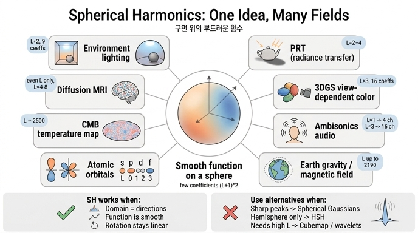

# SH가 응용되는 분야들의 공통점

## 한 줄 답

SH(Spherical Harmonics)가 쓰이는 곳은 예외 없이 **"방향(구면 위 위치)에 따라 값이 부드럽게 변하는 함수"를 소수의 숫자(계수)로 저장하고 연산해야 하는 경우**다. 그래픽스의 환경 조명, PRT, 3DGS의 시점 의존 색, 공간 음향의 앰비소닉스, 지구의 중력장·자기장, 원자 궤도, CMB, 확산 MRI가 모두 "구면 위의 함수 하나"를 다루고 있다는 점에서 같다.

## 왜 그런가 — SH가 잘하는 일

노트북 1장에서 본 대로 SH $Y_\ell^m$은 **구면 위 함수의 푸리에 급수**다.

$$
f(\mathbf d)\approx\sum_{\ell=0}^{L}\sum_{m=-\ell}^{\ell} c_\ell^m\,Y_\ell^m(\mathbf d),\qquad \|\mathbf d\|=1
$$

- $\ell$이 낮으면 부드러운(저주파) 성분, 높으면 잘게 진동하는(고주파) 성분.
- 차수 $L$까지 자르면 계수는 $(L+1)^2$개. 부드러운 함수는 저차 몇 개로 거의 다 표현된다(저역 통과 필터).
- 기저가 정규직교이므로 계수는 내적 한 번으로 얻고, 두 함수의 구면 적분 $\int f g\,d\Omega$는 **계수 벡터의 내적**으로 바뀐다.

즉 "구면 위 부드러운 함수 → 숫자 몇 개"라는 압축과, "구면 적분 → 내적"이라는 연산 단순화가 SH의 두 가지 무기다. 아래 응용들은 이 두 가지를 각자의 문맥에서 쓰고 있다.

## 응용 표 확장 — 각 분야에서 "구면 위 함수"는 무엇이고 몇 차를 쓰는가

| 분야 | 구면 위 함수 $f(\mathbf d)$ — 방향 $\mathbf d$의 의미 | 사용 차수 / 계수 수 | 비고 |
|---|---|---|---|
| 실시간 렌더링 — 환경 조명(irradiance environment map) | **입사 방향** $\mathbf d$별 광량. 확산 표면의 조도 $E(\mathbf n)$은 환경광과 clamped cosine의 합성곱 | $L=2$, **9개 계수**(RGB면 27개) | Ramamoorthi & Hanrahan(2001): clamped cosine 커널이 $\ell\ge3$에서 급감하므로 2차로 오차 ~1%. 셰이더에서 곱셈·덧셈 9번 |
| Precomputed Radiance Transfer(PRT) | 표면 한 점의 **전달 함수**: 방향 $\mathbf d$에서 오는 빛이 가림·상호반사를 거쳐 얼마나 도달하는가 | $L=2\sim4$ (9~25개) | Sloan et al.(2002). 조명 SH 계수 · 전달 SH 계수의 **내적** = 그 점의 밝기. 조명이 바뀌어도 내적만 다시 |
| 신경 장면 표현(PlenOctrees, Plenoxels, **3DGS**) | 한 점(Gaussian)을 **바라보는 시점 방향** $\mathbf d$별 색 | $L=3$, **16개 × RGB = 48개** | MLP 없이 계수 저장 → 실시간 렌더링. 3DGS는 `sh_degree_interval`로 저차부터 단계적으로 활성화 |
| 공간 음향(Ambisonics) | 청취 지점에 **소리가 도달하는 방향** $\mathbf d$별 음압장 | 1차 = 4채널(B-format, W/X/Y/Z), 3차 = 16채널, 고차 HOA 5~7차 | 채널 수 $=(L+1)^2$. 스피커 배치와 무관하게 녹음·회전(머리 회전 추적) 후 디코딩 |
| 측지학·행성과학(EGM, IGRF) | 지구 중심에서의 **방향** $\mathbf d$별 중력 퍼텐셜 / 자기 퍼텐셜 | EGM2008: **2190차**(약 480만 계수), IGRF: 13차 | 라플라스 방정식의 해가 자연스럽게 $r^{-(\ell+1)}Y_\ell^m$ 꼴. $J_2$(편평도) = $\ell=2$ 항 |
| 양자역학 — 원자 궤도 | 전자 파동함수의 **각도 부분** $Y_\ell^m(\theta,\varphi)$ | s, p, d, f 궤도 = $\ell=0,1,2,3$ | SH가 "기저"가 아니라 **해 자체**. 각운동량 연산자의 고유함수. 노트북 3D 그림이 바로 이 모양 |
| 우주론 — CMB | 하늘의 **관측 방향** $\mathbf d$별 온도 요동 $\Delta T(\mathbf d)$ | $\ell$ 최대 **~2500**(Planck) | 파워 스펙트럼 $C_\ell=\langle\lvert a_{\ell m}\rvert^2\rangle$이 우주론 매개변수를 결정. 단극 $\ell=0$·이중극 $\ell=1$은 제거 |
| 의료영상 — 확산 MRI(HARDI, Q-ball) | 복셀 안에서 **확산 방향** $\mathbf d$별 신호 / 섬유 방향 분포(ODF) | 짝수 차수만, 보통 $L=4\sim8$ (15~45개) | $f(\mathbf d)=f(-\mathbf d)$(대칭)이므로 홀수 차수는 자동으로 0 |

읽는 법: 왼쪽에서 오른쪽으로 갈수록 필요한 차수가 급격히 커진다. 그래픽스·음향·3DGS는 "부드러운 것만 필요"해서 $L\le3$에서 멈추고, 지구 중력장·CMB는 "세부까지 필요"해서 수천 차수를 쓴다. 그러나 **"방향의 함수를 SH 계수로 표현한다"는 틀은 완전히 동일**하다.

## 공통 조건 세 가지

위 분야들이 SH를 고르는 조건을 세 가지로 정리하면 다음과 같다.

### 1. 정의역이 방향(구면 $S^2$)이다

값을 결정하는 변수가 "어느 방향인가"(입사 방향, 시점 방향, 소리 도달 방향, 지구 중심에서의 방향, 확산 방향)다. 즉 함수의 입력이 단위 벡터 $\mathbf d$, $\|\mathbf d\|=1$이다. 1D 주기 함수에 푸리에 급수가 맞는 것처럼, 구면 정의역에는 SH가 **자연스러운 직교 기저**다. (반지름 방향도 필요한 중력장·궤도는 $r$에 대한 별도 함수와 SH의 곱으로 분리한다.)

### 2. 함수가 부드럽다(저주파 지배)

확산 조명, 넓은 광택 로브, 대기 중 음향, 지구 중력장의 대부분은 방향에 따라 천천히 변한다. 저차 SH로 자르는 것은 저역 통과 필터이므로, 부드러운 함수는 **저차 몇 개의 계수에 에너지가 거의 다 모인다**. 노트북 1.3의 실험에서 하늘 그라디언트는 $L=1\sim2$에서 이미 맞았던 것이 그 예다. 부드럽기 때문에 계수가 적고, 계수가 적기 때문에 저장·연산이 싸다.

### 3. 회전에 잘 어울린다 — 회전은 같은 차수 안에서 닫힌 선형 변환

SH의 결정적 성질: 함수를 회전 $R$로 돌리면 계수는 **차수 $\ell$마다 $(2\ell+1)\times(2\ell+1)$ 행렬**(Wigner D-행렬)로 선형 변환되고, **다른 차수와 섞이지 않는다**.

$$
f(R^{-1}\mathbf d)=\sum_{\ell}\sum_{m}\Big(\sum_{m'} D^{\ell}_{mm'}(R)\,c_\ell^{m'}\Big)Y_\ell^m(\mathbf d)
$$

- 차수를 $L$에서 자른 근사는 회전해도 여전히 차수 $L$ 근사다(**회전 불변 표현**). 큐브맵 같은 격자 표현은 회전하면 재샘플링 오차가 생기지만 SH는 그렇지 않다.
- 각 차수의 계수 벡터 노름 $\sum_m (c_\ell^m)^2$은 회전에 불변이다. CMB의 $C_\ell$이 하늘 좌표계에 무관한 물리량인 이유, 확산 MRI에서 회전 불변 특징을 뽑는 근거다.
- 응용에서의 쓰임: PRT에서 물체가 돌아가면 조명 계수를 회전해 내적, 앰비소닉스에서 머리가 돌아가면 4·9·16채널을 행렬 한 번으로 회전, 3DGS에서 장면 좌표계를 바꾸면 Gaussian마다 SH 계수를 회전(gsplat의 장면 변환·정렬 유틸리티가 하는 일).

이 세 조건 — **구면 정의역, 부드러움, 회전 친화성** — 이 모두 성립하는 곳에서 SH는 "소수의 숫자로 저장하고 내적·행렬곱으로 연산"이라는 이점을 온전히 발휘한다.

## 대비: SH가 부적합한 경우와 대안

같은 "구면 위 함수"라도 다음 경우에는 SH가 나쁜 선택이다.

| 상황 | SH의 문제 | 대안 |
|---|---|---|
| **날카로운 함수** — 태양 같은 좁은 광원, 거울 반사, 날카로운 하이라이트 | 고주파를 표현하려면 차수를 급격히 올려야 하고(계수 $(L+1)^2$로 증가), 저차에서 자르면 봉우리가 퍼지고 주변에 음의 물결(**ringing, Gibbs 현상**)이 생긴다. 노트북 1.3의 태양이 흐려지고 3DGS가 거울 반사를 못 그리는 이유 | **Spherical Gaussians**(폰 미제스–피셔 로브 몇 개: 국소적, 음수 없음, 곱·적분이 닫힌 형태), 반사 방향 기반 인코딩, 작은 MLP 디코더 |
| **반구에만 정의된 함수** — 표면 위 BRDF, 법선 기준 반구 조명 | 전역 기저인 SH는 아래 반구까지 채워야 하므로 절반이 낭비되고, 반구 경계(적도)의 불연속이 ringing을 만든다 | **Hemispherical Harmonics**(HSH), Zonal Harmonics, 반구용 직교 기저 |
| **고차가 많이 필요한 경우** — 고해상도 환경 맵의 정확한 재현, 국소 세부 | 계수 수가 $(L+1)^2$로 늘고 고차 기저 평가 비용도 증가. 각 계수가 **전역** 기저라 국소 수정이 불가능(한 방향을 바꾸면 모든 계수가 변함) | **큐브맵/등장방형 텍스처**(GPU 하드웨어 샘플링, 국소적), **구면 웨이블릿**(Haar on cubemap 등: 국소성 + 다중해상도), 뾰족한 조명은 SG + 부드러운 잔여는 SH로 나누는 하이브리드 |

핵심 대비: SH는 **전역·부드러움·회전 편의**를 얻고 **국소성·날카로움**을 포기한 기저다. 응용 분야가 앞의 셋을 원하고 뒤의 둘이 필요 없을 때 SH가 선택된다. 3DGS가 3차 16개에서 멈추는 것도 "시점 의존 색은 대부분 부드럽고, 날카로운 반사는 포기한다"는 이 거래의 결과다.

## 정리

- 공통점: **방향의 함수** + **부드러움** + **회전이 쉬운 선형 표현** → 소수의 계수로 저장·연산.
- 분야별로 다른 것은 "방향이 무엇을 뜻하는가"와 "몇 차까지 필요한가"뿐이다(그래픽스·음향 $L\le3$, 중력장·CMB 수천 차).
- 부적합: 날카로운 함수, 반구 함수, 고차 다수 필요 → Spherical Gaussians, 웨이블릿, 큐브맵으로 대체.

## 인포그래픽

