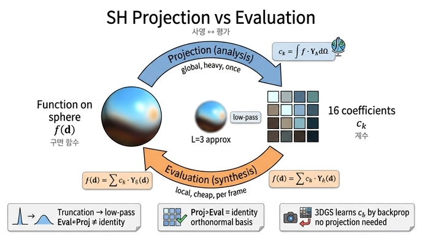

# SH "사영"과 SH "평가"의 관계

> **Q.** SH "사영"과 SH "평가"의 관계를 비교하면?
>
> **A.** 사영은 함수 $f$에서 계수 $c_k=\int fY_k\,d\Omega$를 구하는 **분석(analysis)** 단계이고, 평가는 계수에서 함수값 $\sum_k c_kY_k(\mathbf d)$를 구하는 **합성(synthesis)** 단계다. 서로 역방향 연산이다.

## 1. 분석/합성 쌍이라는 일반 구조

"기저(basis)로 함수를 표현한다"는 모든 방법은 두 개의 짝을 이루는 연산을 가진다.

| 분야 | 분석(analysis): 함수 → 계수 | 합성(synthesis): 계수 → 함수 |
|---|---|---|
| 푸리에 급수 | $\hat f_n = \frac{1}{2\pi}\int f(x)e^{-inx}dx$ (푸리에 변환) | $f(x)=\sum_n \hat f_n e^{inx}$ (역변환) |
| 웨이블릿 | 분해(decomposition): 필터뱅크 통과 후 다운샘플 | 재구성(reconstruction): 업샘플 후 합성 필터 |
| 유한차원 선형대수 | 좌표 구하기: $c_k=\langle \mathbf v,\mathbf e_k\rangle$ | 기저 결합: $\mathbf v=\sum_k c_k\mathbf e_k$ |
| **구면 조화 함수** | **사영(projection)**: $c_k=\int_{S^2} f\,Y_k\,d\Omega$ | **평가(evaluation)**: $f(\mathbf d)=\sum_k c_kY_k(\mathbf d)$ |

공통점은 두 가지다.

1. **분석은 내적**이다. 정규직교 기저($\langle Y_k, Y_j\rangle=\delta_{kj}$)라면 계수는 "함수와 기저 하나의 내적" 한 번으로 결정된다. 연립방정식을 풀 필요가 없다. 노트북 1.1절이 "덕분에 계수는 푸리에 계수처럼 **내적(사영)** 한 번으로 구해진다"고 말하는 부분이다.
2. **합성은 선형 결합**이다. 계수를 가중치로 기저를 더한다. 이는 항상 유한합이며, 기저를 어디서 평가하느냐(방향 $\mathbf d$)만 정하면 된다.

선형대수 관점으로 보면 사영은 "벡터 $f$를 기저 $\{Y_k\}$의 좌표계로 읽어내는" 것이고, 평가는 "좌표 $\{c_k\}$에서 벡터를 다시 조립하는" 것이다. 같은 대상을 두 표현(함수 공간 ↔ 계수 공간) 사이에서 옮기는 좌표 변환 쌍이다.

## 2. 두 연산 비교표

| 항목 | 사영 (projection) | 평가 (evaluation) |
|---|---|---|
| 역할 | 분석 — 함수를 분해 | 합성 — 함수를 조립 |
| 입력 | 구면 전체의 함수값 $f(\mathbf d)$ (모든 방향에서 알아야 함) | 계수 $c_0..c_{K-1}$ + 질의 방향 $\mathbf d$ 하나 |
| 출력 | 계수 $K=(L+1)^2$개 (RGB면 $K\times 3$) | 그 방향의 함수값 하나 (RGB 1개) |
| 수식 | $c_k=\int_{S^2} f(\mathbf d)\,Y_k(\mathbf d)\,d\Omega$ | $f_L(\mathbf d)=\sum_{k=0}^{K-1} c_k\,Y_k(\mathbf d)$ |
| 계산 방식 | **적분** → 실제로는 구적(quadrature): $c_k\approx\sum_{\text{grid}} f(\mathbf d_i)Y_k(\mathbf d_i)w_i$ 혹은 몬테카를로 샘플링 | **유한합** — 기저 16개를 다항식으로 계산 후 계수와 내적 |
| 비용 | 격자 크기에 비례. 노트북은 $128\times256=32{,}768$ 방향 × 16 기저 (전 구면을 훑음) | $O(K)$: $L=3$이면 채널당 곱셈-덧셈 16번. 방향 하나마다 |
| 언제 하나 | 오프라인 한 번 (환경맵 사전 필터링, PRT 등) | 렌더링 시 카메라·Gaussian마다 매 프레임 |
| 필요한 지식 | 진짜 $f$를 알아야 함 | 계수만 있으면 됨 |
| 오차 | 절단 오차(고차 성분 손실) + 구적 오차 | 절단된 계수를 정확히 합산 — 평가 자체는 오차 없음 |

핵심 비대칭: **사영은 "전역" 연산**(구면 전체를 봐야 계수 하나가 나옴), **평가는 "국소" 연산**(방향 하나만 보면 됨). 그래서 사영은 무겁고 한 번만 하며, 평가는 가볍고 반복해서 한다.

## 3. "역방향"의 정확한 의미 — 어느 쪽 합성이 항등인가

두 연산이 "서로 역"이라는 말은 조심해서 읽어야 한다. 차수 $L$로 절단하는 순간 한 방향만 항등이 된다.

### 3.1 사영 → 평가 (함수 → 계수 → 함수): 항등이 **아니다**, 저역 통과다

$$
f \;\xrightarrow{\text{사영}}\; \{c_k\}_{k<K} \;\xrightarrow{\text{평가}}\; f_L(\mathbf d)=\sum_{k<K}c_kY_k(\mathbf d)
$$

$f$가 무한히 많은 SH 성분을 가지고 있어도 사영은 $K=(L+1)^2$개만 남기므로, 되돌린 $f_L$은 $f$의 **$L$차 최적 근사**(최소제곱 의미에서 $L$차 이하 부분공간으로의 직교 사영)다. 고주파가 잘려 나가므로 **저역 통과 필터**와 같다. 노트북 1.3절이 정확히 이 실험이다: 태양처럼 좁은 봉우리는 16개 계수로 흐릿하게 퍼지고 주변에 음의 물결(ringing)이 생기며, $L$을 올릴수록 MSE가 줄어든다. 즉

$$
\text{평가}\circ\text{사영}=P_L \quad(\text{항등이 아니라 } L\text{차 부분공간으로의 사영 연산자})
$$

$L\to\infty$에서만 $f_L\to f$ (완비성)가 되어 진짜 역변환이 된다.

### 3.2 평가 → 사영 (계수 → 함수 → 계수): **정확히 항등**이다

$$
\{c_k\} \;\xrightarrow{\text{평가}}\; g(\mathbf d)=\sum_j c_jY_j(\mathbf d) \;\xrightarrow{\text{사영}}\; \int g\,Y_k\,d\Omega=\sum_j c_j\underbrace{\int Y_jY_k\,d\Omega}_{\delta_{jk}}=c_k
$$

$g$는 이미 $L$차 이하 부분공간 안에 있으므로 잃을 성분이 없고, **정규직교성** $\int Y_jY_k\,d\Omega=\delta_{jk}$ 덕분에 계수가 그대로 복원된다.

$$
\text{사영}\circ\text{평가}=\mathrm{Id}
$$

(수치적으로는 구적 격자의 그람 행렬 $\int Y_jY_k$가 단위행렬에 얼마나 가깝냐에 달렸다. 노트북 1.2절 뒤의 `gram = einsum("abi,abj,ab->ij", B, B, w)` 검사가 바로 이 조건을 확인하는 코드다.)

### 3.3 정리

| 합성 순서 | 결과 | 이유 |
|---|---|---|
| 평가 ∘ 사영 (함수→계수→함수) | $f$의 $L$차 근사 $f_L$ = 저역 통과 | 절단으로 고차 성분 손실 |
| 사영 ∘ 평가 (계수→함수→계수) | 원래 계수 그대로 | $L$차 부분공간 안에서는 손실 없음 + 정규직교성 |

즉 "역방향"은 **계수 공간 쪽에서는 완전한 역**, **함수 공간 쪽에서는 부분공간 위에서만 역**이라는 뜻이다. 이는 푸리에 급수를 $N$항으로 끊을 때와 완전히 같은 구조다.

## 4. 노트북 코드 대응

```python
def project_to_sh(f_vals, bases, w):            # 사영: [nθ,nφ,D] × [nθ,nφ,K] × [nθ,nφ] → [K,D]
    return torch.einsum("abk,abd,ab->kd", bases, f_vals, w)

def reconstruct(coeffs, bases, degree):          # 평가(격자 전체): [K,D] × [...,K] → [...,D]
    K = (degree + 1) ** 2
    return torch.einsum("...k,kd->...d", bases[..., :K], coeffs[:K])

def sh_eval(coeffs, dirs, degree):               # 평가(3DGS식, Gaussian마다 방향 하나): [N,K,3] × [N,3] → [N,3]
    K = (degree + 1) ** 2
    d = F.normalize(dirs, dim=-1)
    return torch.einsum("nk,nkc->nc", sh_bases(d, degree), coeffs[:, :K])
```

einsum 문자열을 나란히 놓으면 두 연산이 서로 전치 관계임이 드러난다.

| 함수 | einsum | 축약(합산)되는 축 | 남는 축 |
|---|---|---|---|
| `project_to_sh` | `abk, abd, ab -> kd` | 방향 격자 `a,b` (= 구면 적분) | 기저 `k`, 채널 `d` |
| `reconstruct` | `...k, kd -> ...d` | 기저 `k` (= 급수 합) | 방향 `...`, 채널 `d` |
| `sh_eval` | `nk, nkc -> nc` | 기저 `k` | Gaussian `n`, 채널 `c` |

- 사영은 **방향 축을 지우고 기저 축을 만든다.** 평가는 **기저 축을 지우고 방향 축을 만든다.** 같은 기저 텐서 `B[a,b,k]`를 공유하면서 어느 인덱스를 합산하느냐만 뒤집혀 있다 — 이것이 "역방향 연산"의 코드 상 모습이다.
- 사영에만 가중치 `w`(구적 가중치 $\sin\theta\,\Delta\theta\Delta\varphi$)가 끼어 있다. 적분을 흉내 내는 항이 분석 쪽에만 필요하다는 점이 비용 비대칭의 원인이다.
- `reconstruct`와 `sh_eval`은 같은 연산이다. 차이는 방향이 격자 전체(`...`)인지 Gaussian마다 하나(`n`)인지, 계수가 공유(`kd`)인지 Gaussian마다 따로(`nkc`)인지뿐이다.
- 1.3절의 실험 `rec = reconstruct(project_to_sh(f, B, w), B, L)`이 곧 3.1절의 "평가∘사영 = 저역 통과"다.

## 5. 3DGS에서는 사영이 없다 — 학습이 사영을 대신한다

사영에는 "전 구면에서 $f$를 안다"는 전제가 필요하다. 3DGS에서 각 Gaussian의 진짜 시점 의존 색 $f(\mathbf d)$는 **알 수 없다**. 있는 것은 몇십~몇백 대 카메라 방향 $\mathbf d_j$에서의 관측 픽셀 색뿐이고, 그것도 Gaussian 하나가 아니라 여러 Gaussian이 알파 블렌딩된 결과다. 그래서 3DGS는

1. 계수 $\mathbf c_{i,k}$를 **학습 파라미터**로 두고(`sh0` + `shN`, Gaussian당 $16\times3$),
2. 매 스텝 **평가**만 수행해 색을 만든 뒤 렌더링하고,
3. 관측 이미지와의 손실을 **평가 식을 미분해 역전파**하여 계수를 갱신한다.

평가 $\mathbf c(\mathbf d)=\sum_k \mathbf c_kY_k(\mathbf d)$는 계수에 대해 **선형**이므로 $\partial \mathbf c/\partial \mathbf c_k = Y_k(\mathbf d)$ — 기저값 자체가 그레이디언트다. 노트북 4.2절은 이를 "관측으로부터의 **역평가**"라 부르고, 두 방식으로 축소 재현한다.

- 방법 A(최소제곱): $\min_{\mathbf c}\sum_j\|Y(\mathbf d_j)\mathbf c-f^\star(\mathbf d_j)\|^2$. 관측 방향이 구면을 고르게 덮고 많아지면 이 해는 사영 적분 $\int fY_k$의 몬테카를로 근사로 수렴한다 — 즉 **이산 관측 위에서의 사영**이다.
- 방법 B(Adam): 실제 3DGS와 같은 경사하강. `sh_degree_interval`마다 사용 차수를 올려 저차부터 맞춘다.

따라서 3DGS에서 사영/평가 관계는 이렇게 재배치된다.

| 단계 | 고전 SH 파이프라인 | 3DGS |
|---|---|---|
| 계수 얻기 | 사영(적분, 전 구면 $f$ 필요) | **학습**: 평가를 미분해 역전파 (희소 관측만 필요) |
| 색 내기 | 평가 | 평가 (`spherical_harmonics` CUDA 커널, `+0.5`, `clamp_min(0)`) |

사영의 부작용도 그대로 이어받는다. 관측이 적으면 고차 계수가 과적합해 관측 사이에서 색이 요동하고(4.2절 표에서 $n=8$일 때 $L=3$의 MSE가 오히려 커짐), 차수가 낮으면 하이라이트를 표현하지 못한다 — 절단(저역 통과)과 표본 부족(구적 오차)이라는 사영의 두 오차원이 학습에서도 나타나는 것이다.

## 6. 한 줄 정리

- **사영** = 분석 = 함수 → 계수 = 적분(전역, 무거움, 한 번) — 3DGS에서는 역전파 학습이 대신함.
- **평가** = 합성 = 계수 → 함수값 = 유한합(국소, 가벼움, 매 프레임) — 렌더링 시 실제로 수행되는 유일한 연산.
- 계수→함수→계수는 정규직교성으로 **정확히 복원**되지만, 함수→계수→함수는 차수 $L$ 절단 때문에 **$L$차 저역 통과 근사**다.

## 인포그래픽


