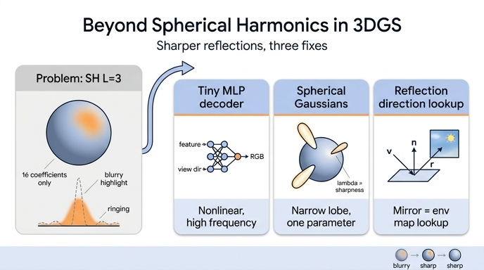

# 3DGS의 SH 한계를 넘는 대안들 — 작은 MLP, Spherical Gaussians, 반사 방향 인코딩

## 질문
3DGS의 SH 한계를 극복하기 위해 후속 연구가 채택한 대안들은?

## 답
작은 MLP(시점 의존 디코더), 구면 가우시안(Spherical Gaussians), 반사 방향 기반 인코딩 등이다. 모두 날카로운 반사·굴절을 더 잘 표현하기 위한 것이다.

---

## 0. 먼저 — SH의 한계가 무엇이었나

`sh_walkthrough.py`의 1.3절 실험이 핵심을 보여 준다. 하늘(부드러운 그라디언트)과 태양(좁고 강한 봉우리)이 있는 환경 조명을 차수 $L=0\ldots3$의 SH로 사영하면,

- 하늘의 부드러운 변화는 $L=1\sim2$에서 거의 맞는다.
- 태양처럼 **좁은 봉우리는 16개 계수로는 흐릿하게 퍼지고**, 주변에 음의 물결(ringing)이 생긴다.

이유는 구조적이다. $\ell$차 SH는 $x,y,z$의 $\ell$차 다항식이므로 **저역 통과 필터**처럼 동작하고, 폭 $\sigma$인 로브를 표현하려면 대략 $\ell \sim 1/\sigma$ 차수가 필요하다. 거울 반사 하이라이트(폭이 몇 도 수준)를 위해서는 수십 차수, 즉 수천 개 계수가 필요해진다. 3DGS는 Gaussian마다 $16\times3=48$개 실수를 저장·평가하는 선에서 멈추므로(실시간·메모리 예산), 결과적으로

> 16개 SH = 부드러운 시점 의존성(광택, 프레넬)까지. **날카로운 반사·굴절은 표현 못 한다.**

또 하나의 숨은 한계: 3DGS의 SH는 **카메라 → Gaussian 중심 방향** $\mathbf d$의 함수다. 거울 반사는 실제로는 시점이 아니라 *반사 방향*(법선에 대해 시점을 접은 방향)의 함수이므로, $\mathbf d$를 그대로 입력으로 쓰면 표면 법선이 조금만 달라도 전혀 다른 함수를 배워야 한다. 아래의 대안 (3)은 정확히 이 지점을 공격한다.

후속 연구는 "SH를 무엇으로 바꾸는가"에 따라 크게 세 갈래(+기타)로 나뉜다.

---

## 1. 작은 MLP — 시점 의존 디코더

**무엇을 SH 대신 쓰는가**
Gaussian(또는 Gaussian 묶음)마다 학습 가능한 **latent feature 벡터** $\mathbf f_i \in \mathbb R^{D}$를 두고, 시점 방향 $\mathbf d$(대개 위치 인코딩이나 SH 저차 기저로 임베딩)와 함께 작은 MLP에 넣어 색을 얻는다.

$$
\mathbf c_i(\mathbf d) = \mathrm{MLP}_\theta\big(\mathbf f_i,\ \gamma(\mathbf d)\big)
$$

MLP 파라미터 $\theta$는 장면 전체가 공유하고, Gaussian별 정보는 $\mathbf f_i$에만 담긴다. NeRF의 "위치 feature + 시점 방향 → 색" 헤드를 Gaussian 단위로 옮겨온 것으로, NeRF 계열의 view-dependent MLP 전통을 그대로 잇는다.

**왜 날카로운 효과에 유리한가**
- SH는 **선형** 모델(기저의 가중합)이지만 MLP는 **비선형**이라, 같은 파라미터 수로 훨씬 좁은 봉우리·급격한 전이를 만들 수 있다.
- 색이 16개 고정 기저로 제한되지 않으므로, 데이터가 요구하는 대로 고주파 함수를 배운다.
- 장면 공유 MLP가 "하이라이트 모양"의 사전 지식을 학습해 Gaussian마다 따로 SH 계수를 맞추는 것보다 일반화가 좋다(관측 뷰가 적을 때 SH 고차가 과적합하는 문제 — 4.2절 실험 — 를 완화).

**비용**
- Gaussian마다·프레임마다 MLP를 평가해야 하므로 SH의 "곱셈-덧셈 48번"보다 훨씬 무겁다. 실시간을 지키려면 MLP를 매우 작게(2~3층, 32~64폭) 하고, anchor 단위로 묶어 평가 횟수를 줄이는 식의 설계가 필요하다.
- 학습 시 MLP와 feature를 함께 최적화해야 하며, 순수 SH보다 병렬성·구현 단순성이 떨어진다.
- 반대로 **메모리는 유리**할 수 있다. 48개 SH 계수 대신 짧은 feature(예: 8~32차원)만 저장하면 되므로 압축 계열이 이 방식을 즐겨 쓴다.

**대표 연구**
- **Scaffold-GS** (Lu et al., CVPR 2024) — anchor 포인트마다 feature를 두고, 시점 방향·거리와 함께 작은 MLP로 주변 neural Gaussians의 색·불투명도·공분산을 예측.
- **Compact 3D Gaussian Representation** (Lee et al., CVPR 2024) — SH를 해시 그리드 + 작은 MLP로 대체해 색 저장량을 크게 줄임.
- **Compact3D** (Navaneet et al.), **HAC** (Chen et al., ECCV 2024) 등 feature 기반 압축 계열 — anchor feature + MLP 디코더에 엔트로피 모델을 결합.
- 배경: NeRF(2020) 이래 view-dependent 색을 MLP 헤드로 내는 것은 표준 방식이었고, PlenOctrees/Plenoxels/3DGS가 속도를 위해 이를 SH로 바꾼 것이었다. MLP 디코더 계열은 이 선택을 부분적으로 되돌린 것이다.

---

## 2. Spherical Gaussians(SG) — 좁은 로브 몇 개

**무엇을 SH 대신 쓰는가**
구면 위의 "가우시안 범프"인 **Spherical Gaussian** 로브를 몇 개 더해 시점 의존 색을 표현한다.

$$
G(\mathbf d;\ \mathbf p,\lambda,\boldsymbol\mu)=\boldsymbol\mu\, e^{\lambda(\mathbf d\cdot\mathbf p-1)}
$$

- $\mathbf p$: 로브 중심 방향(단위 벡터), $\lambda$: 날카로움(sharpness; 클수록 좁은 로브), $\boldsymbol\mu$: 진폭(RGB).
- Gaussian 하나의 색 = 확산 기본색 + $\sum_{j=1}^{J} G_j(\mathbf d)$, $J$는 보통 1~4개.
- 노트북의 `env_radiance`에서 태양을 만들던 `exp(-(1 - d·sun_dir)/0.02)`가 정확히 $\lambda=50$인 SG 한 개다.

**왜 날카로운 효과에 유리한가**
- SH로 좁은 봉우리 하나를 표현하려면 차수를 급격히 올려야 하지만, SG는 **파라미터 하나($\lambda$)로 임의로 좁은 로브**를 만든다. 하이라이트 표현에 필요한 파라미터가 $O(1)$이다.
- 로브 밖에서는 자연스럽게 0으로 감쇠하므로 SH의 **ringing(음의 물결)이 없다**.
- SG끼리의 곱·적분이 닫힌 형태로 계산되어(그래픽스에서 오래 쓰인 성질) BRDF·조명과의 결합이 쉽다.
- **Anisotropic SG(ASG)**로 확장하면 두 접선 방향의 폭을 따로 두어 늘어진(비등방) 하이라이트도 표현한다.

**비용**
- 로브 개수 $J$를 미리 정해야 하고, 로브 중심·폭·진폭의 최적화는 **비볼록**이라 초기화에 민감하다(SH는 선형이라 최소제곱 해가 존재하는 것과 대비).
- 부드러운 저주파 성분은 오히려 SH가 더 효율적이므로, 실제로는 **"저차 SH(확산·부드러운 부분) + SG(하이라이트)" 조합**이 흔하다.
- 평가 비용은 로브당 내적 1회 + exp 1회로 SH와 비슷하거나 약간 무거운 수준.

**대표 연구**
- **Spec-Gaussian** (Yang et al., NeurIPS 2024) — Gaussian별 Anisotropic Spherical Gaussian(ASG)으로 비등방 시점 의존 외관을 표현(작은 MLP와 결합).
- **GaussianShader** (Jiang et al., CVPR 2024), **3DGS-DR** (Ye et al., SIGGRAPH Asia 2024) — 반사 성분을 환경맵/SG 기반으로 모델링(이 둘은 3절의 반사 방향 조회와도 겹친다).
- 배경: 실시간 렌더링에서 SG는 All-frequency rendering, SG 기반 PRT 등으로 오래 쓰여 왔고, 신경 장면 표현에서도 NeRF 계열 재조명(relighting) 연구가 조명·BRDF 로브에 SG를 사용해 왔다.

---

## 3. 반사 방향 기반 인코딩 — Ref-NeRF 방식

**무엇을 SH 대신 쓰는가**
SH 자체를 버리는 것이 아니라 **SH(또는 다른 방향 함수)에 넣는 입력을 바꾼다**. Gaussian의 법선 $\mathbf n$을 추정해 시점 방향 $\mathbf v$(표면에서 카메라를 향하는 방향)를 **반사 방향**으로 바꾸고,

$$
\mathbf r = 2(\mathbf n\cdot\mathbf v)\,\mathbf n-\mathbf v
$$

그 방향의 함수 — SH, Ref-NeRF의 IDE(Integrated Directional Encoding), 또는 명시적 **환경맵**(큐브맵/등장방형 텍스처) — 를 조회해 반사 색을 얻는다.

$$
\mathbf c = \mathbf c_{\text{diffuse}} + \underbrace{s\cdot E(\mathbf r)}_{\text{반사 방향으로 환경맵 조회}}
$$

**왜 날카로운 효과에 유리한가**
- 거울 반사에서 표면 한 점의 색은 시점 $\mathbf v$의 복잡한 함수이지만, **반사 방향 $\mathbf r$의 함수로는 단순히 "그 방향의 환경"**이다. 함수를 배우기 쉬운 좌표계로 바꾸는 것.
- 장면의 모든 반사 표면이 **하나의 환경맵을 공유**하므로, Gaussian마다 고차 계수를 따로 두지 않아도 된다. 날카로움은 환경맵의 해상도가 담당하고, Gaussian은 법선·거칠기·반사 강도만 가진다.
- Ref-NeRF의 IDE는 거칠기(roughness) $\kappa$에 따라 SH 기저를 미리 적분해 두어, 거친 표면은 흐린 반사·매끈한 표면은 날카로운 반사를 같은 틀에서 낸다.
- 법선이 색에 직접 관여하므로 **기하(법선) 정확도가 함께 좋아지는** 부수 효과가 있다.

**비용·전제**
- **좋은 법선이 전제**다. 3DGS의 Gaussian은 얇은 원반이면 최단축을 법선으로 쓸 수 있지만, 학습 초기에는 신뢰할 수 없어 법선 정규화·shortest-axis 정렬·깊이 기반 법선과의 일관성 손실 등이 필요하다.
- 환경맵은 원거리(무한히 먼) 조명을 가정한다. 근거리 물체가 비치는 반사(interreflection)는 표현이 어렵다 → 이 한계를 넘는 것이 4절의 ray tracing 계열이다.
- 3DGS-DR처럼 **지연 셰이딩(deferred shading)**으로 픽셀 단위 법선을 먼저 합성한 뒤 반사를 조회하는 설계가 흔하며, 파이프라인이 2패스로 늘어난다.

**대표 연구**
- **Ref-NeRF** (Verbin et al., CVPR 2022) — 반사 방향 파라미터화 + IDE의 원조(NeRF 계열).
- **GaussianShader** (CVPR 2024) — Gaussian별 법선·거칠기·specular 계수 + 환경맵 조회를 3DGS에 결합.
- **3DGS-DR** (SIGGRAPH Asia 2024) — 지연 셰이딩으로 법선 맵을 만든 뒤 반사 방향으로 환경맵 조회.
- **EnvGS** (2024~2025) — 환경맵 대신 "환경 Gaussian"을 두고 반사 방향으로 ray tracing하여 근거리 반사까지 처리(4절과 겹침).

---

## 4. 기타 확장

| 접근 | 요지 | 예 |
|---|---|---|
| **Anisotropic SG** | SG의 폭을 두 접선 방향으로 분리해 늘어진 하이라이트 표현 | Spec-Gaussian |
| **신경 텍스처 / feature 스플래팅** | Gaussian이 색 대신 feature를 스플랫하고, 화면 공간에서 CNN/MLP로 디코딩 | feature-splatting 계열(디퍼드 신경 렌더링 전통) |
| **명시적 환경맵 + BRDF 분해** | 색을 albedo·roughness·metallic·법선·조명으로 분해해 물리 기반 셰이딩 → 재조명 가능 | GS-IR (CVPR 2024), Relightable 3D Gaussian (2023) 등 inverse rendering 계열 |
| **Ray-traced Gaussians** | 래스터라이저 대신 Gaussian을 직접 광선 추적 → 반사·굴절 광선을 실제로 쏴서 근거리 반사·굴절 처리 | 3DGRT (SIGGRAPH Asia 2024), EnvGS |
| **하이브리드** | 저차 SH(부드러운 부분) + 위 방법 중 하나(날카로운 부분) | 대부분의 실전 시스템 |

굴절(refraction)은 반사보다 더 어렵다. 굴절 방향은 매질 경계와 굴절률에 의존하고 광선이 물체 내부를 통과하므로, 환경맵 조회로는 부족하고 결국 ray tracing 계열이 필요하다.

---

## 5. 비교표

| | **SH (3DGS 기본)** | **작은 MLP 디코더** | **Spherical Gaussians** | **반사 방향 인코딩** | **Ray-traced Gaussians** |
|---|---|---|---|---|---|
| **표현력(날카로움)** | 낮음 — 16개 기저의 저역 통과 | 높음 — 비선형 | 높음 — $\lambda$로 임의 폭 | 매우 높음(원거리 반사) — 환경맵 해상도만큼 | 최고 — 근거리 반사·굴절 포함 |
| **선형성/최적화** | 선형, 최소제곱 해 존재, 안정 | 비선형, 보통 안정 | 비볼록, 초기화 민감 | 법선에 의존, 초기 불안정 | 무거움 |
| **평가 속도** | 매우 빠름(48 MAC) | 느림(MLP 평가) — anchor 묶음으로 완화 | 빠름(로브당 exp 1회) | 빠름(텍스처 조회) + 2패스 | 느림(광선 추적) |
| **Gaussian당 메모리** | 48 float | feature $D$개(8~32) — 압축에 유리 | 로브당 7개($\mathbf p$3, $\lambda$1, $\boldsymbol\mu$3) × $J$ | 법선·거칠기·강도 등 소수 + 장면 공유 환경맵 | 기본 파라미터 + BVH |
| **추가로 필요한 정보** | 없음 | 장면 공유 MLP 가중치 | 로브 수 $J$ 사전 결정 | **좋은 법선**, 원거리 조명 가정 | 광선 추적 인프라(OptiX 등) |
| **약점** | 거울 반사·굴절 불가, ringing | 병렬성·구현 복잡, 프레임당 비용 | 부드러운 성분엔 비효율, 로브 수 선택 | 근거리 반사 불가, 법선 품질에 좌우 | 속도 |
| **대표** | 3DGS, Plenoxels | Scaffold-GS, Compact 3DGS, HAC | Spec-Gaussian, GaussianShader | Ref-NeRF, GaussianShader, 3DGS-DR | 3DGRT, EnvGS |

## 6. 한 줄 정리

SH는 "부드러운 구면 함수를 48개 숫자로 싸게 저장"하는 데 최적화된 선택이었다. 날카로운 반사·굴절이 필요해지면 후속 연구는 (1) 기저를 **비선형 MLP**로 바꾸거나, (2) 기저를 **좁은 로브(SG)**로 바꾸거나, (3) 기저에 넣는 **방향을 반사 방향**으로 바꾸어 문제 자체를 "환경맵 조회"로 단순화했고, 궁극적으로는 (4) **광선을 실제로 추적**하는 쪽으로 나아갔다.

## 인포그래픽

