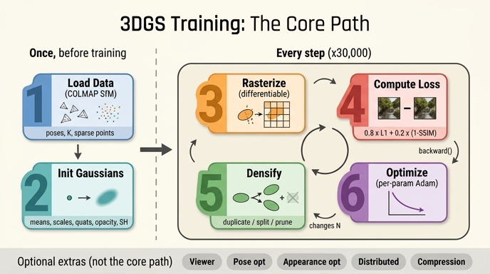

# gsplat 3DGS 학습 파이프라인의 핵심 경로는 어떤 단계들로 이루어지는가?

**답**: 데이터 로드 → Gaussian 초기화 → 렌더(rasterization) → 손실 계산 → 밀도화 → 최적화의 순서다.
viewer, pose/appearance 최적화, 분산 학습, 압축 등은 부가 기능이다.

---

## 큰 그림: "한 번만 하는 것"과 "매 스텝 하는 것"

이 6단계는 한 줄로 늘어선 파이프라인이 아니다. **앞의 두 단계는 학습 시작 전 1회**,
**뒤의 네 단계는 매 스텝 반복되는 루프**다. 이 구분이 이 카드의 핵심 구조다.

```
[1회 준비]                              [매 스텝 루프 × 30,000]
┌──────────────────┐        ┌──────────────────────────────────────────────┐
│ 1. 데이터 로드   │        │  이미지 1장 샘플                             │
│    COLMAP SfM    │        │    ↓                                         │
│  poses, K,       │───┐    │  3. rasterization()  ← 미분 가능 렌더        │
│  sparse points   │   │    │    ↓                                         │
└──────────────────┘   │    │  4. loss = 0.8·L1 + 0.2·(1−SSIM)             │
┌──────────────────┐   └───►│    ↓  loss.backward()                        │
│ 2. Gaussian 초기 │        │  6. optimizer.step()   (파라미터별 Adam)     │
│  means/scales/   │───────►│    ↓                                         │
│  quats/opacity/  │        │  5. strategy.step_post_backward()            │
│  SH              │        │     duplicate / split / prune / opacity reset│
└──────────────────┘        └──────────────────────────────────────────────┘
```

> 순서상 주의: 카드의 "밀도화 → 최적화" 는 **논리적 나열 순서**이고, 실제 코드에서는
> `loss.backward()` → `optimizer.step()` → `strategy.step_post_backward()` 로
> **Adam step이 밀도화보다 먼저** 온다 (`examples/simple_trainer.py` L1131 부근).
> 밀도화가 파라미터 텐서의 **행 수 N을 바꾸기 때문**에, 그 전에 이번 스텝의 gradient를
> 소진(step + zero_grad)해 두어야 optimizer state와 파라미터의 shape가 어긋나지 않는다.

---

## 1단계: 데이터 로드 — COLMAP SfM 결과

입력은 **같은 장면을 여러 각도에서 찍은 사진 + COLMAP SfM 결과**다.
`examples/datasets/colmap.py`의 `Parser`가 세 가지를 읽는다.

| 데이터 | 용도 |
|---|---|
| `camtoworlds` [N,4,4] | 각 학습 이미지의 카메라 포즈 (시점) |
| `Ks` [3,3] + 왜곡계수 | 투영 모델. 왜곡이 있으면 이미지를 미리 undistort |
| sparse 3D 포인트 + RGB | **Gaussian의 초기 위치·색** (`init_type="sfm"`) |

두 가지 부수 작업이 중요하다.

- **정규화**: `normalize=True`면 `similarity_from_cameras` + `align_principal_axes`로
  월드 좌표를 카메라 배치 기준으로 회전·이동·스케일한다. 씬마다 단위가 제각각인 문제를 없앤다.
- **scene_scale**: 카메라 위치들의 중심에서 가장 먼 카메라까지의 거리
  (`colmap.py:437-440` — `np.max(‖camera_locations − scene_center‖)`).
  트레이너는 여기에 1.1을 곱해 쓴다 (`simple_trainer.py:458`).
  이 값이 이후 **`means`의 learning rate**와 **밀도화 임계값의 기준 단위**가 되므로,
  씬 크기가 10배 달라져도 하이퍼파라미터를 그대로 쓸 수 있게 만드는 핵심 상수다.

train/val 분리는 "매 `test_every`번째 이미지는 val"이라는 단순 규칙이다 (`colmap.py:459`).

## 2단계: Gaussian 초기화 — 5종 파라미터와 비제약 공간

하나의 3D Gaussian은 5종류의 파라미터로 표현된다. 최적화 안정성을 위해 **제약 있는 값은
비제약(unconstrained) 공간에 저장하고 렌더 직전에 활성화 함수를 통과**시킨다.

| 파라미터 | shape | 저장 → 활성화 | 초기값 |
|---|---|---|---|
| `means` | [N,3] | 그대로 | SfM 포인트 위치 |
| `scales` | [N,3] | log → `exp` | log(3-NN 평균거리) — 이웃이 멀면 큰 Gaussian |
| `quats` | [N,4] | 미정규화 → 내부 normalize | 랜덤 |
| `opacities` | [N] | logit → `sigmoid` | `logit(0.1)` |
| `sh0`/`shN` | [N,1,3]/[N,15,3] | SH 계수 | DC=(rgb−0.5)/0.2821, 고차항 = 0 |

- 공분산은 quaternion 회전 R과 스케일 대각행렬 S로부터 $\Sigma = R S S^\top R^\top$로
  합성되므로 **항상 양의 정부호(positive definite)** 가 보장된다. 6개 성분을 직접
  학습하면 이 성질이 깨질 수 있어 이렇게 분해한다.
- `sh_degree=3`이면 계수는 $(3+1)^2 = 16$개. DC(0차)만 SfM 색으로 채우고 고차항을 0으로
  두면 초기 상태는 "뷰에 무관한 단색 구슬"이다.
- **파라미터마다 별도의 Adam** (`eps=1e-15`)을 쓴다. 학습률이 크게 다르기 때문이다
  (`simple_trainer.py:288 create_splats_with_optimizers`):

  | 파라미터 | lr | 비고 |
  |---|---|---|
  | `means` | `1.6e-4 × scene_scale` | 위치만 씬 크기에 비례 |
  | `scales` | `5e-3` | |
  | `quats` | `1e-3` | |
  | `opacities` | `5e-2` | 가장 빠르게 움직임 |
  | `sh0` | `2.5e-3` | |
  | `shN` | `2.5e-3 / 20` | 고차 SH는 20배 느리게 |

## 3단계: 렌더 — `rasterization()` 의 4단 CUDA 파이프라인

`gsplat/rendering.py`의 `rasterization()`이 **미분 가능한 렌더러 전체**다.
내부는 4개 커널 단계로 구성된다.

1. **SH 평가** (`spherical_harmonics`) — 카메라→Gaussian 시선 방향으로 SH 계수를 평가해
   뷰 의존적 RGB를 얻는다. `sh_degree` 인자로 활성 차수를 제한한다.
2. **투영** (`fully_fused_projection`) — 3D 공분산을 카메라로 투영(EWA splatting)해
   2D conic, 화면 좌표 `means2d`, 깊이, 반경 `radii`를 얻는다.
   near/far 밖이거나 화면 밖이면 `radii=0`으로 컬링.
3. **타일 교차** (`isect_tiles` + `isect_offset_encode`) — 화면을 16×16 픽셀 타일로 나누고
   (3DGS 커널은 `TILE_SIZE=16`으로만 컴파일된다, `rendering.py:_resolve_tile_size`),
   각 Gaussian이 걸치는 타일마다 (tile_id, depth) 키를 만들어 정렬한다.
   전역 깊이 정렬을 **타일 단위 정렬로 쪼개는** 것이 실시간 속도의 비결이다.
4. **픽셀 래스터화** (`rasterize_to_pixels`) — 타일별로 앞→뒤 알파 블렌딩:

   $$C = \sum_i c_i\,\alpha_i \prod_{j<i}(1-\alpha_j), \qquad
     \alpha_i = o_i \exp\!\left(-\tfrac12 \Delta^\top \Sigma'^{-1} \Delta\right)$$

   누적 투과율 $\prod (1-\alpha_j)$가 임계값 아래로 떨어지면 조기 종료한다.

반환 `info` dict(`means2d`, `radii`, `conics`, `depths`, `gaussian_ids`, `isect_*` …)는
그 자체로 **다음 단계인 밀도화 전략의 입력**이다. 특히 `info["means2d"]`의 gradient가
"이 Gaussian을 더 쪼개야 하는가"의 신호이므로, 렌더와 밀도화는 정보상 한 몸으로 묶여 있다.

## 4단계: 손실 — 놀랄 만큼 단순한 두 항

$$\mathcal{L} = (1-\lambda)\,\mathcal{L}_{L1} + \lambda\,(1-\mathrm{SSIM}),\qquad \lambda = 0.2$$

코드로는 `loss = torch.lerp(l1loss, ssimloss, cfg.ssim_lambda)` 한 줄이다
(`simple_trainer.py:961` 부근).

- **L1** — 픽셀 단위 색 재구성. 이상치에 강건.
- **SSIM** — 11×11 가우시안 윈도우 기반 구조 유사도. 국소 대비/구조를 맞춰
  L1만 쓸 때 생기는 뭉개짐(blur)을 억제한다.

**여기에 정답 depth도, 정답 geometry도 없다.** 3DGS가 얻는 유일한 감독 신호는
"렌더한 사진이 실제 사진과 같아야 한다"뿐이고, 3D 구조는 그 부산물로 떠오른다.

선택 항들은 기본적으로 모두 꺼져 있다: `depth_loss`(SfM 포인트 disparity L1),
`opacity_reg`/`scale_reg`(MCMC 전략용), `random_bkgd`(투명 영역이 배경색으로 도망가는 것 방지),
그리고 `masks`(에고 차량 등 제외 픽셀).

## 5단계: 밀도화 — 파이프라인에서 유일하게 "N을 바꾸는" 단계

SfM 포인트만으로는 씬을 다 덮지 못한다. `gsplat/strategy/default.py`의 `DefaultStrategy`가
원논문 방식으로 Gaussian을 **늘리고 정리**한다. 매 스텝 두 개의 훅이 불린다.

- `step_pre_backward()` — `info["means2d"].retain_grad()`. 중간 텐서의 gradient를
  backward 이후에도 읽을 수 있게 붙잡아 둔다. **backward 전에** 반드시 호출해야 한다.
- `step_post_backward()` — gradient 통계를 누적하고, 주기마다 refine을 실행한다.

| 동작 | 조건 (기본값) | 효과 |
|---|---|---|
| **duplicate** | 화면 grad 평균 > `2e-4`, 크기 ≤ 1%·scene_scale | 작은데 오차 큰 곳 → 그대로 복제 |
| **split** | 화면 grad 평균 > `2e-4`, 크기 > 1%·scene_scale | 큰데 오차 큰 곳 → 2개로 쪼개고 크기 ÷1.6 |
| **prune** | opacity < `0.005`, 또는 크기 > 10%·scene_scale | 기여 없는/비대한 것 제거 |
| **opacity reset** | 매 `3000`스텝 | 전체 opacity를 `0.01`로 리셋 → floater 정리 |

- refine 구간은 스텝 `500 ~ 15000`이고 그 안에서 `100`스텝마다 실행된다
  (`refine_start_iter` / `refine_stop_iter` / `refine_every`).
  15000 이후에는 개수가 고정되고 남은 스텝은 순수 미세조정이다.
- 화면공간 gradient는 `[-1,1]` NDC 기준으로 정규화해 누적한다
  (`grads[...,0] *= width/2 · n_cameras`, `default.py:_update_state`).
  보이지 않은 Gaussian은 카운트하지 않으므로 **평균은 "보인 횟수로 나눈 값"** 이다.
- `absgrad=True`면 픽셀별 gradient의 절대값 합(AbsGS)을 쓴다. 부호 상쇄가 없어 더 민감한
  분할 신호가 되고, 이때 임계값은 `0.0008` 권장이다.

## 6단계: 최적화 — 파라미터별 Adam + means lr 감쇠

```python
for opt in optimizers.values():
    opt.step(); opt.zero_grad(set_to_none=True)
means_lr_scheduler.step()   # ExponentialLR(gamma = 0.01 ** (1/max_steps))
```

`means`의 lr만 스케줄이 붙어 총 스텝에 걸쳐 초기값의 **1%까지 지수 감쇠**한다. 초반에는
Gaussian이 크게 움직여 구조를 잡고, 후반에는 거의 제자리에서 색·크기만 다듬는 셈이다.

SH 차수도 스케줄된다: `sh_degree_to_use = min(step // 1000, 3)`.
처음 1000스텝은 DC(단색)만 학습해 색을 안정화하고, 이후 1000스텝마다 한 차수를 열어
뷰 의존적 하이라이트를 배우게 한다. 처음부터 16계수를 다 열면 고차항이 노이즈를 흡수해버린다.

---

## 이것이 왜 "핵심 경로"이고 나머지는 왜 "부가 기능"인가

핵심 경로 6단계는 **빠지면 학습이 성립하지 않는** 것들이다. 반면 다음은 전부
`Config` 플래그로 껐다 켤 수 있고, 기본값은 대체로 꺼짐/무해다.

| 부가 기능 | 무엇 | 없어도 되는 이유 |
|---|---|---|
| **viewer** | nerfview 기반 실시간 뷰어 | `--disable-viewer`로 끔. 시각화 편의 |
| **pose 최적화** | `pose_opt` — 카메라 포즈를 학습 변수로 | COLMAP 포즈를 신뢰하면 불필요 |
| **appearance 최적화** | `app_opt`, `bilateral_grid`, `ppisp` | 노출/화이트밸런스가 일정하면 불필요 |
| **분산 학습** | `rasterization(distributed=True)` | rank별 Gaussian 분할 소유. 단일 GPU면 무의미 |
| **압축** | PLY/압축 포맷 export, `packed`/`sparse_grad`/`SelectiveAdam` | 메모리·저장 최적화. 품질 경로가 아님 |
| **eval / ckpt / TensorBoard** | PSNR·SSIM·LPIPS, 체크포인트 | 측정·기록. 학습 자체와 무관 |

- **전략 교체는 "부가"가 아니라 5단계의 대안**이다. `MCMCStrategy`
  (`gsplat/strategy/mcmc.py`)는 휴리스틱 duplicate/split 대신 SGLD 방식으로,
  `cap_max`(기본 1,000,000)로 Gaussian 수 상한을 두고 opacity 기반 확률적 재배치 +
  노이즈 주입(`noise_lr=5e5`)을 한다. `opacity_reg`/`scale_reg`와 함께 쓴다.
  즉 밀도화 단계는 **교체 가능한 슬롯**이지 생략 가능한 단계가 아니다.

## 한 줄 요약

**사진과 SfM 포인트로 시작해(1·2), 미분 가능 래스터라이저로 그려보고(3), 사진과의 차이를
재고(4), 그 차이의 화면공간 gradient로 Gaussian을 늘렸다 줄이며(5), Adam으로 파라미터를
미세조정한다(6).** 3·4·5·6이 3만 번 도는 동안 사진들 사이의 일관성만으로 3D가 떠오른다.

## 인포그래픽


