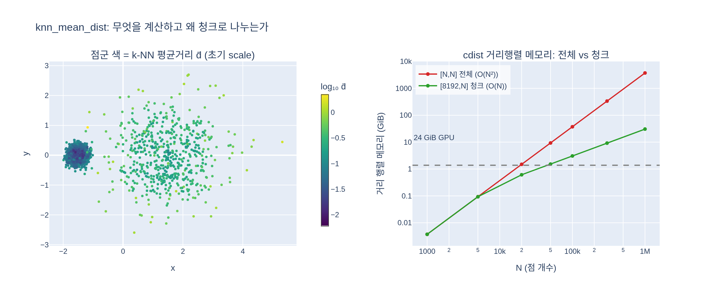

# `knn_mean_dist` 함수는 무엇을 계산하며 왜 청크 처리를 하는가?

## 한 줄 답

각 점에서 **k-최근접 이웃까지의 평균 거리**를 계산한다. `torch.cdist`가 만드는 `[chunk, N]`
거리 행렬이 메모리를 많이 쓰므로, 질의 점을 **8192개 단위로 잘라** GPU에서 처리한 뒤 이어붙인다.

## 원본 코드

`training_walkthrough.py:147` (asset dir)

```python
def knn_mean_dist(points: torch.Tensor, k: int = 3, chunk: int = 8192) -> torch.Tensor:
    """각 점에서 k-최근접 이웃까지의 평균 거리 (GPU, 청크 처리)."""
    out = []
    for i in range(0, len(points), chunk):
        d = torch.cdist(points[i : i + chunk], points)       # [chunk, N]
        knn_d = d.topk(k + 1, largest=False).values[:, 1:]   # 자기 자신 제외
        out.append(knn_d.mean(dim=-1))
    return torch.cat(out)
```

## 1. 무엇을 계산하는가

입력은 SfM(COLMAP) 포인트 클라우드 `[N, 3]`, 출력은 점마다 하나의 스칼라 `[N]`이다.
점 $p_i$의 이웃 거리를 오름차순으로 $d_{i,1}\le\cdots\le d_{i,k}$라 하면

$$\bar d_i = \frac{1}{k}\sum_{j=1}^{k} d_{i,j}$$

즉 $\bar d_i$는 **점 $i$ 주변의 국소 점간 간격**, 다시 말해 국소 밀도의 역수 척도다.

한 루프 안에서 벌어지는 일을 단계별로 보면:

| 단계 | 코드 | shape | 의미 |
|---|---|---|---|
| 1 | `torch.cdist(points[i:i+chunk], points)` | `[chunk, N]` | 이 청크의 각 점 ↔ **전체** 점의 유클리드 거리 |
| 2 | `.topk(k+1, largest=False).values` | `[chunk, k+1]` | 가장 가까운 $k+1$개 거리 (`largest=False` = 최솟값 쪽) |
| 3 | `[:, 1:]` | `[chunk, k]` | 0번째 열은 **자기 자신(거리 0)** 이므로 버린다 |
| 4 | `.mean(dim=-1)` | `[chunk]` | 이웃 $k$개 거리의 산술평균 |
| 5 | `torch.cat(out)` | `[N]` | 청크별 결과를 원래 순서대로 이어붙임 |

**`k+1`을 뽑는 이유**가 3번 단계다. `points`가 질의 집합에도 참조 집합에도 들어가 있으니
각 행의 최솟값은 언제나 자기 자신까지의 거리 0이다. 그래서 `k`개가 아니라 `k+1`개를 뽑아
첫 열을 잘라낸다.

### 왜 이 값이 필요한가 — `scales` 초기화

호출부(`training_walkthrough.py:163`)를 보면 용도가 분명하다.

```python
dist_avg = knn_mean_dist(points, k=3)
scales = torch.log(dist_avg)[:, None].repeat(1, 3)   # [N,3] log-space
```

3DGS의 `scales`는 **log 공간에 저장**되고 렌더 직전 `exp`로 활성화된다. 초기값을
$\log \bar d_i$로 주면 각 Gaussian이 "주변 점 간격만큼의 반경"으로 시작한다.

- 조밀한 영역(표면이 잘 복원된 곳) → $\bar d_i$ 작음 → **작은 Gaussian** → 디테일 보존
- 희소한 영역(먼 배경, 텍스처 없는 벽) → $\bar d_i$ 큼 → **큰 Gaussian** → 빈틈 없이 덮음

`expy.py` 4절의 실측: 조밀 클러스터 $\bar d = 0.034$ vs 희소 클러스터 $\bar d = 0.343$ —
같은 씬 안에서 초기 크기가 **약 10배** 차이 난다. 만약 모든 Gaussian을 같은 크기로 시작하면
조밀 영역은 과하게 겹쳐 흐려지고, 희소 영역은 구멍이 뚫린 상태에서 최적화를 시작해야 한다.

## 2. 왜 청크 처리를 하는가 — `[N, N]` 행렬은 GPU에 안 올라간다

`torch.cdist(A, B)`는 `[len(A), len(B)]` 거리 행렬을 **한 번에 실체화(materialize)** 한다.
게으른 계산이 아니라 실제 텐서 할당이다. float32라면 $4 \cdot |A| \cdot |B|$ 바이트가 필요하다.

`torch.cdist(points, points)`를 그대로 쓰면 $|A| = |B| = N$:

| N (SfM 포인트 수) | `[N, N]` 전체 | `[8192, N]` 청크 | 절감 |
|---|---|---|---|
| 50,000 | 9.3 GiB | 1.5 GiB | 6x |
| 100,000 | 37.3 GiB | 3.1 GiB | 12x |
| 300,000 | **335.3 GiB** | 9.2 GiB | 37x |
| 1,000,000 | **3,725 GiB** | 30.5 GiB | 122x |

MipNeRF360 같은 실제 씬의 COLMAP 포인트는 보통 10만~30만 개다. 즉 순진한 구현은
**24 GiB짜리 GPU는 물론 어떤 단일 GPU에도 올라가지 않는다** (OOM).

핵심은 복잡도의 차수가 바뀐다는 점이다.

$$\text{naive: } O(N^2)\ \text{메모리} \quad\longrightarrow\quad \text{chunked: } O(\text{chunk}\cdot N)\ \text{메모리}$$

`chunk`가 상수이므로 청크 버전의 최대 메모리는 $N$에 대해 **선형**이다. 총 연산량
($N^2$번의 거리 계산)은 똑같다 — 줄어드는 건 **동시에 살아 있어야 하는 메모리**뿐이다.
루프 반복이 끝날 때마다 `[chunk, N]` 행렬은 해제되고, 남는 건 `[chunk]` 크기의 축약 결과다.

`expy.py`의 CUDA 실측(N=40,000): 청크 2.45 GiB vs 순진한 구현 6.03 GiB.

### 청크 크기가 결과를 바꾸지 않는 이유

각 행(질의 점)의 이웃 탐색이 **서로 완전히 독립**이고, 모든 청크가 항상 *전체* `points`를
상대로 거리를 재기 때문이다. 청크는 질의 쪽만 자르고 참조 쪽은 자르지 않는다 — 이 점이
중요하다. 참조 쪽을 잘랐다면 청크 경계를 넘는 이웃을 놓쳐 결과가 **틀렸을** 것이다.
(`expy.py` 1절에서 `chunk=512`와 순진한 구현의 최대 오차가 정확히 `0.0`으로 확인된다.
`chunk=1`에서만 $10^{-5}$ 수준 차이가 보이는데, 이건 행 수에 따라 `cdist`가 다른 커널
경로를 타면서 생기는 float32 반올림 차이이지 알고리즘 차이가 아니다.)

### 왜 하필 8192인가

`chunk`는 **메모리 ↔ 커널 호출 오버헤드**의 트레이드오프 노브다. `expy.py` 3절의 실측
(N=40,000, RTX급 GPU):

| chunk | 시간 | peak 메모리 |
|---|---|---|
| 256 | 108.0 ms | 0.09 GiB |
| 1024 | 87.9 ms | 0.31 GiB |
| 2048 | 84.9 ms | 0.62 GiB |
| 8192 | 82.8 ms | 2.45 GiB |
| 16384 | 82.4 ms | 4.89 GiB |

청크를 너무 작게 잡으면 커널 런치와 `topk` 호출 횟수가 늘어 느려진다(256 → 108 ms).
하지만 chunk ≈ 2048부터는 시간이 거의 평평해지고(83~85 ms) 메모리만 선형으로 증가한다.
GPU를 이미 충분히 채웠기 때문이다. 8192는 "GPU를 포화시키기엔 넉넉하고, 실제 씬 크기에서
수 GiB 안에 머무는" 실용적 상수 — 튜닝된 최적값이 아니라 **안전한 관용값**이다.

## 3. 함정: 중복 점 → `log(0) = -inf`

`[:, 1:]`은 "0번째 열이 자기 자신"이라는 가정에 의존한다. 완전히 겹친 점이 $k+1$개 이상 있으면
이웃 거리까지 0이 되어 $\bar d_i = 0$, 그리고 `torch.log(0) = -inf`가 그대로 `scales`에
들어간다. 이후 `exp(-inf) = 0` 크기의 Gaussian이 되고 gradient가 NaN으로 번질 수 있다.
방어책은 `dist_avg.clamp_min(1e-7)` 같은 하한이다 (`expy.py` 5절에서 재현).

## 4. 상류 gsplat 구현과의 차이

이 워크스루 함수는 `examples/simple_trainer.py`의 로직을 GPU에서 자급자족하도록 다시 쓴 것이다.
상류(`/home/sungwoo/projects/swcho/gsplat/examples/utils.py:156`)는 다르게 구현한다.

```python
def knn(x: Tensor, K: int = 4) -> Tensor:
    x_np = x.cpu().numpy()
    model = NearestNeighbors(n_neighbors=K, metric="euclidean").fit(x_np)
    distances, _ = model.kneighbors(x_np)
    return torch.from_numpy(distances).to(x)
```

```python
# simple_trainer.py:321
dist2_avg = (knn(points, 4)[:, 1:] ** 2).mean(dim=-1)   # [N,]
dist_avg = torch.sqrt(dist2_avg)
scales = torch.log(dist_avg * init_scale).unsqueeze(-1).repeat(1, 3)
```

| | 상류 `utils.knn` + `simple_trainer` | 워크스루 `knn_mean_dist` |
|---|---|---|
| 백엔드 | sklearn `NearestNeighbors` (CPU, KD-tree) | `torch.cdist` (GPU, brute-force) |
| 연산 복잡도 | $O(N \log N)$ 기대 | $O(N^2)$ |
| 메모리 관리 | sklearn 내부가 처리 | **직접 청크** 필요 |
| 집계 | 거리의 **RMS** $\sqrt{\frac1k\sum d_{i,j}^2}$ | 산술평균 $\frac1k\sum d_{i,j}$ |
| CPU↔GPU 전송 | `.cpu().numpy()` → 다시 `.to(x)` | 없음 (GPU 상주) |

즉 브루트포스 GPU 방식을 택한 대가가 바로 청크 처리다. KD-tree를 쓰면 애초에
$[N,N]$ 행렬이 생기지 않으므로 청크가 필요 없지만, 대신 CPU 왕복과 sklearn 의존성이 생긴다.

집계 방식 차이도 미묘하게 결과를 바꾼다. 젠센 부등식에 의해

$$\sqrt{\frac1k\sum_j d_{i,j}^2} \;\ge\; \frac1k\sum_j d_{i,j}$$

이므로 워크스루 쪽이 **항상 같거나 더 작은** 초기 스케일을 준다. `expy.py` 6절 실측으로
RMS/산술평균 비가 평균 1.028, log 공간에서 약 +0.027 차이 — 실질적으로는 무시할 수준이며
`init_scale` 하이퍼파라미터 하나로 흡수되는 크기다.

## 5. 기억할 점 3가지

1. **무엇**: `[N,3]` 점군 → 점마다 k개 최근접 이웃 거리의 평균 `[N]`. `topk(k+1)` 후
   `[:, 1:]`로 자기 자신(거리 0)을 제외한다.
2. **왜 청크**: `cdist(points, points)`가 `[N,N]` 행렬을 실체화하므로 $4N^2$ 바이트가 필요
   (N=30만 → 335 GiB). 질의 쪽만 8192개씩 자르면 최대 메모리가 $O(N)$으로 떨어진다.
   참조 쪽은 절대 자르지 않으므로 결과는 정확히 동일하다.
3. **용도**: `scales = log(dist_avg)` — 국소 밀도에 맞춰 Gaussian 크기를 초기화해
   조밀한 곳은 작게, 희소한 곳은 크게 시작한다.

## 시각화



왼쪽은 조밀/희소 클러스터를 섞은 점군을 $\log_{10}\bar d_i$로 색칠한 것이다. 왼쪽 아래
조밀 클러스터는 어둡고(작은 초기 Gaussian), 오른쪽 희소 영역은 밝다(큰 초기 Gaussian) —
`knn_mean_dist`가 국소 밀도를 그대로 읽어낸다는 뜻이다. 오른쪽은 거리 행렬 메모리의
스케일링으로, 빨간 $O(N^2)$ 곡선은 N ≈ 8만에서 이미 24 GiB 선(회색 점선)을 넘어가지만
초록 $O(N)$ 청크 곡선은 100만 점에서도 30 GiB 수준에 머문다.
