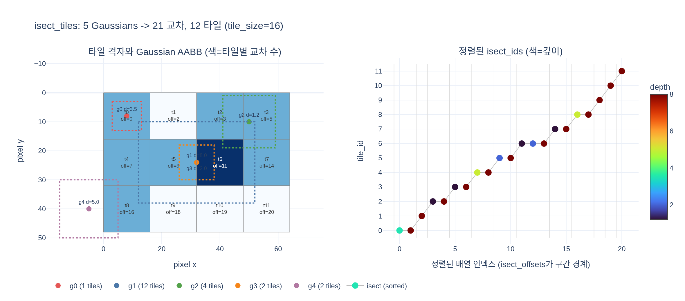

# `isect_tiles` 단계(타일 교차)는 무엇을 하는가?

> 화면을 16×16 픽셀 타일로 나누고, 각 Gaussian이 걸치는 타일마다 `(tile_id, depth)` 키를 만들어 정렬한다. 타일별 깊이순 처리를 가능하게 하는 준비 단계다.

## 한 줄 요약

`isect_tiles`는 **픽셀 값을 하나도 계산하지 않는다.** 다음 단계인 픽셀 래스터화가
"이 타일은 어떤 Gaussian들을, 어떤 순서로 블렌딩해야 하는가"를 O(1)에 알 수 있도록
**작업 스케줄(work assignment)을 미리 만들어 두는** 단계다.

## `rasterization()` 4단계 중 어디인가

워크스루(`training_walkthrough.py:209~221`)가 정리한 forward 파이프라인:

| # | 단계 | 커널 | 역할 |
|---|---|---|---|
| 1 | SH 평가 | `spherical_harmonics` | 시선 방향 → 뷰 의존적 RGB |
| 2 | 투영 | `fully_fused_projection` | 3D 공분산 → 2D conic, `means2d`, `depths`, `radii` (컬링은 `radii=0`) |
| **3** | **타일 교차** | **`isect_tiles`** | **`means2d`/`radii`/`depths` → 타일별 깊이순 정렬 리스트** |
| 4 | 픽셀 래스터화 | `rasterize_to_pixels` | 타일=CUDA 블록 단위로 앞→뒤 알파 블렌딩 |

3단계의 입력은 2단계의 출력(화면공간 위치·반경·깊이)뿐이다. 색은 필요 없다 —
**기하학적 스케줄링만** 한다.

## 왜 타일로 나누는가

알파 블렌딩은 순서 의존적이다.

$$C = \sum_i c_i\,\alpha_i \prod_{j<i}(1-\alpha_j)$$

이 곱을 앞→뒤 순서로 누적해야 하므로, 픽셀마다 자기를 덮는 Gaussian을 깊이순으로
알아야 한다. 픽셀당 정렬은 1080p에서 200만 번의 정렬이라 불가능하다.

그래서 3DGS는 **픽셀 대신 타일 단위로 정렬**한다.

- 타일 하나 = 16×16 = 256 픽셀 = CUDA 블록 하나 (스레드 1개 ↔ 픽셀 1개)
- 타일 안의 256개 픽셀은 **같은 정렬 리스트를 공유**한다
- Gaussian 데이터를 shared memory에 배치로 올려 256개 스레드가 함께 읽는다
  (`RasterizeToPixels3DGSSerialBatchFwd.cu`의 `BATCH_SIZE` 루프)

정렬 비용은 픽셀 수가 아니라 타일 수 기준으로 떨어지고, 메모리 접근은 합쳐진다.
"타일별 깊이순 처리를 가능하게 하는 준비 단계"라는 답의 의미가 바로 이것이다.

격자 크기는 `rendering.py:886`에서 정한다.

$$\text{tile\_width} = \left\lceil \frac{W}{\text{tile\_size}} \right\rceil, \qquad
  \text{tile\_height} = \left\lceil \frac{H}{\text{tile\_size}} \right\rceil$$

`tile_size` 기본값은 `_resolve_tile_size()`(`gsplat/rendering.py:201`)가 고른다.
3DGS 커널은 `TILE_SIZE=16`으로만 컴파일되므로 사실상 **16 고정**이고, 3DGUT(`with_ut`)
경로만 8/16을 컴파일 타임에 디스패치한다(1080p 미만은 8, 이상은 16).

## 구체적으로 무엇을 계산하는가

`isect_tiles()`(`gsplat/cuda/_wrapper.py:1196`)의 반환값 3개:

| 반환값 | 모양/타입 | 의미 |
|---|---|---|
| `tiles_per_gauss` | int32 `[..., N]` | 각 Gaussian이 걸친 타일 수 |
| `isect_ids` | int64 `[n_isects]` | 정렬 키: `image_id \| tile_id \| depth` |
| `flatten_ids` | int32 `[n_isects]` | 각 교차의 원래 Gaussian 인덱스 (`[I*N]` 평탄 인덱스) |

여기서 `n_isects`는 **Gaussian 수 N이 아니다.** 한 Gaussian이 K개 타일에 걸치면
K개의 키가 생기므로 `n_isects = sum(tiles_per_gauss)`, 즉 **화면 면적에 비례**한다.

### (1) 걸치는 타일 찾기 — 2-패스 구조

`IntersectTile.cu`의 `intersect_tile_kernel`은 **똑같은 루프를 두 번** 돈다.

```
1차 패스 (cum_tiles_per_gauss == nullptr): 개수만 세어 tiles_per_gauss 채움
   ↓ cub::DeviceScan::InclusiveSum  (누적합 = 각 Gaussian의 출력 슬롯 시작 위치)
   ↓ n_isects 확정 → isect_ids / flatten_ids 할당
2차 패스: 같은 루프를 돌며 자기 슬롯에 키를 써 넣음
```

출력 배열 크기를 미리 알 수 없기 때문에 필요한 구조다(GPU에서는 동적 append가 비싸다).
`radii <= 0`인 Gaussian(투영 단계에서 컬링됨)은 1차 패스에서 0을 쓰고 즉시 반환한다.

AABB 경로의 타일 범위 계산(`tile_min` 포함, `tile_max` 배타):

```cpp
tile_min.x = min(max(0, (int32_t)floor(mean.x/T - r_x/T)), tile_width);
tile_max.x = min(max(0, (int32_t)ceil (mean.x/T + r_x/T)), tile_width);
```

화면 밖으로 삐져나간 Gaussian은 `[0, tile_width]`로 클램프되어 자동으로 잘린다.

### (2) 64비트 키 인코딩 — 이 단계의 트릭

```
[ image_id : image_n_bits ][ tile_id : tile_n_bits ][ depth : 32 bits ]
 <---------------- 상위 32비트 ----------------->    <---- 하위 32비트 ---->
```

```cpp
isect_ids[cur_idx]   = iid_enc | (tile_id << 32) | depth_id_enc;
flatten_ids[cur_idx] = idx;
```

두 가지 설계 포인트:

- **비트 예산**: `image_n_bits + tile_n_bits <= 32`여야 하고, 넘으면 `TORCH_CHECK` 실패.
  비트 수는 `bits_for_count()`(`MathUtils.h`)가 `bit_width(count-1)`로 계산한다.
- **깊이를 float 비트째로 넣는다**: `depth_id_enc = __float_as_uint((float)depth)`.
  IEEE-754에서 **음수가 아닌** float은 비트 패턴을 부호 없는 정수로 봐도 값의 순서가
  보존된다. 덕분에 부동소수 비교 없이 **정수 radix sort 한 번**으로 깊이 정렬이 끝난다.
  커널이 `assert(depth_f >= 0.f)`를 두는 이유도 이것(부호 비트가 서면 순서가 뒤집힌다).
  double 입력을 float으로 좁히는 것도 32비트 재해석이 값의 절반만 읽지 않게 하려는 것.

### (3) 정렬 — 여기서 "깊이순"이 만들어진다

```cpp
cub::DeviceRadixSort::SortPairs(keys=isect_ids, values=flatten_ids,
                                begin_bit=0, end_bit=32 + tile_n_bits + image_n_bits);
```

상위 비트가 image·tile이므로 정렬 결과는 자동으로

1. 같은 (이미지, 타일)의 교차들이 **연속 구간**으로 모이고,
2. 그 구간 안에서는 **깊이 오름차순(앞→뒤)** 이 된다.

키 하나 정렬로 "그룹화 + 정렬"이 동시에 끝난다. `flatten_ids`가 값(payload)으로 따라가며
같이 재배열되는 것이 핵심 — 정렬 후 `flatten_ids`를 읽으면 처리 순서대로 Gaussian
인덱스가 나온다. 메모리 절약을 위해 `cub::DoubleBuffer`를 쓰고(보조 메모리 O(N+P)→O(P)),
이미지 차원이 이미 연속이므로 `segmented=True`면 `DeviceSegmentedRadixSort`로
하위 `32 + tile_n_bits` 비트만 정렬한다(`sort=False`로 정렬을 아예 끌 수도 있다).

### (4) 후속 단계: `isect_offset_encode`

`rendering.py:902`가 바로 이어서 호출하는 짝 함수다. 정렬된 `isect_ids`를 훑어
타일 경계가 바뀌는 지점을 찾아 `[I, tile_height, tile_width]` 오프셋 텐서를 만든다.

```
ids: [1, 1, 1, 3, 3], n_tiles=6
 → offsets: [0, 0, 3, 3, 5, 5]      (intersect_offset_kernel 주석의 예시)
```

래스터라이저는 이 오프셋으로 자기 구간을 찾는다
(`RasterizeToPixels3DGSSerialBatchFwd.cu:164`):

```cpp
range_start = isect_offsets[tile_id];
range_end   = (마지막 타일) ? n_isects : isect_offsets[tile_id + 1];
```

교차가 없는 타일은 `range_start == range_end`가 되어 블록이 즉시 배경을 쓰고 끝난다.

## AccuTile(SNUGBOX) — AABB보다 정확한 교차

축 정렬 사각형은 **비스듬히 길쭉한** Gaussian에서 크게 과대추정한다. 실제로는 스치지도
않는 타일이 교차로 잡히고, 그 타일의 256개 스레드는 이 Gaussian을 shared memory에
올려놓고 전부 $\alpha < 1/255$로 버린다 — 순수 낭비다.

그래서 `conics`와 `opacities`가 주어지면(3DGS 경로; `with_ut`이면 `None`) 커널이
AccuTile/SNUGBOX 경로(SpeedySplat, [arXiv:2412.00578](https://arxiv.org/pdf/2412.00578))로
전환해, 불투명도 임계값을 넘는 등고선 타원으로 보수적 교차를 판정한다. 임계 레벨은

$$\alpha = o\,e^{-q/2} \ge \frac{1}{255}
  \;\Longrightarrow\; q \le t = \min\!\left(\text{GAUSSIAN\_EXTEND}^2,\ 2\ln\frac{o}{1/255}\right)$$

$q = a\,dx^2 + 2b\,dx\,dy + c\,dy^2$, `conic = (a,b,c)`는 $\Sigma^{-1}$의 상삼각.
상수는 `gsplat/cuda/include/Common.h`의 `ALPHA_THRESHOLD = 1/255`,
`GAUSSIAN_EXTEND = 3.33`(표준편차 단위 절단 반경)이다. 불투명도가 낮은 Gaussian은
등고선 타원이 작아져 **더 적은 타일**을 차지한다는 점이 포인트 — 교차 판정이
기하학뿐 아니라 불투명도에도 의존한다.

`expy.py` 6번 셀의 45도 기울어진 길쭉한 Gaussian 실험: AABB는 12개 타일을 잡지만
알파 임계를 넘는 픽셀이 있는 타일은 8개뿐 → **33%가 헛교차**다.

## 학습 루프에서 왜 중요한가

- **비용의 원천**: `n_isects`가 정렬 시간과 메모리를 지배한다. 크고 흐릿한 Gaussian
  하나가 수천 개 키를 만들 수 있다. 학습 중 화면을 뒤덮는 거대 Gaussian이 생기면
  여기서 OOM/급격한 느려짐이 온다.
- **밀도화 전략과의 연결**: 큰 Gaussian을 쪼개는 `split`(`gsplat/strategy/default.py`)과
  큰 스케일 억제가 결과적으로 이 단계의 비용을 낮춘다.
- **`info` dict로 노출**: `rasterization()`이 돌려주는 `info`에
  `tiles_per_gauss`, `isect_ids`, `flatten_ids`, `isect_offsets`, `tile_width/height`,
  `tile_size`가 담겨 있어(`rendering.py:672~680`) 프로파일링·디버깅에 그대로 쓸 수 있다.
- **`@torch.no_grad()`**: 이 단계는 스케줄링일 뿐이라 gradient가 흐르지 않는다.
  역전파에 필요한 것은 `isect_offsets`/`flatten_ids`를 **인덱스로** 재사용하는 것뿐이다.

## 흔한 오해

| 오해 | 사실 |
|---|---|
| Gaussian을 깊이순으로 전역 정렬한다 | 정렬 단위는 (이미지, 타일)별 구간. 키의 상위 비트가 그룹을 만든다 |
| Gaussian마다 키 1개 | 걸친 **타일마다** 키 1개. `n_isects >> N`이 정상 |
| 픽셀 단위 정확한 교차 판정 | 보수적(conservative) 판정. AABB든 AccuTile이든 실제보다 많이 잡을 수 있고, 나머지는 래스터화 단계가 $\alpha$로 버린다 |
| 여기서 색/알파를 계산한다 | 위치·반경·깊이만 쓴다. 색은 4단계에서 |
| `tile_size`를 키우면 항상 빠르다 | 타일이 커지면 교차·정렬 비용은 줄지만 타일당 헛일이 늘고 shared memory 압박으로 SM 점유율이 떨어진다 (`_resolve_tile_size()` 주석 참고) |

## 시각화

`expy.py`를 실행하면 나오는 그림. 왼쪽은 타일 격자 위의 Gaussian AABB(점선)와 타일별
교차 개수(색), 각 타일에 적힌 `off=`는 `isect_offsets` 값이다. `g1`(반경 20×14) 하나가
12개 타일 전부에 등장해 21개 교차 중 12개를 차지하는 것을 볼 수 있다.
오른쪽은 정렬된 배열: x축이 배열 인덱스, y축이 `tile_id`, 색이 깊이다. `tile_id`가
계단처럼 단조 증가하고(그룹화), 같은 계단 안에서는 색이 남색(깊이 1.2)에서
붉은색(깊이 8.0) 방향으로만 흐르는 것(깊이 정렬)이 이 단계의 결과물이다.


