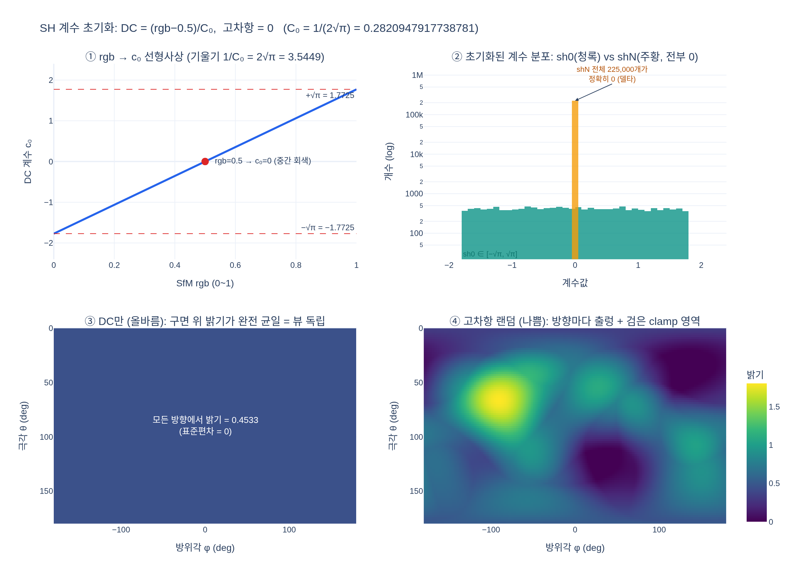

# SH 계수의 초기값은 어떻게 설정하는가?

DC(0차) 항만 SfM 색으로 `(rgb − 0.5) / 0.2821`로 설정하고, 고차항은 모두 0으로 둔다.
상수 $C_0 = 0.28209479177387814 = 1/(2\sqrt{\pi})$이다.

- [`hi.md`](hi.md) — 고교 수학 수준에서 단계적으로 쌓아 올린 설명
- [`expy.py`](expy.py) — SH 기저를 직접 재구현해 검증하는 실행 가능한 예제 (jupyter percent script)

## 시각화

