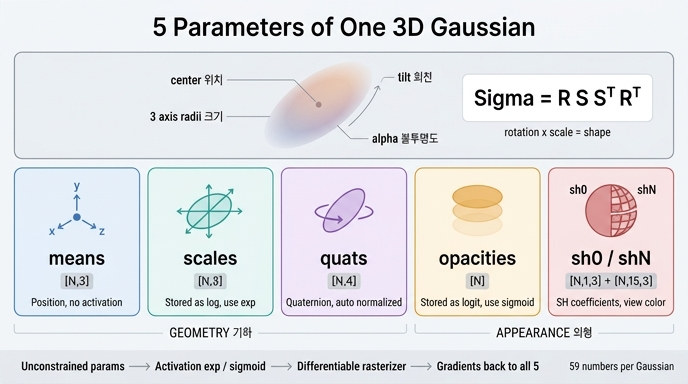

# 하나의 3D Gaussian을 표현하는 5종류 파라미터는?

> `means`(위치), `scales`(크기), `quats`(회전), `opacities`(불투명도), `sh0`/`shN`(색을 나타내는 SH 계수)다.

## 한눈에 보기

3D Gaussian Splatting에서 씬은 수십만~수백만 개의 "타원체 물감방울"로 표현된다.
그 물감방울 하나를 완전히 서술하는 데 필요한 정보는 딱 5가지 종류다.

| 파라미터 | shape | 의미 | 기하학적 역할 |
|---|---|---|---|
| `means` | `[N,3]` | 위치 μ | 물감방울이 **어디에** 있나 |
| `scales` | `[N,3]` | 3축 반경 | **얼마나 크고 납작한가** |
| `quats` | `[N,4]` | 쿼터니언 회전 | 그 타원체가 **어느 방향으로 누워 있나** |
| `opacities` | `[N]` | 불투명도 o | **얼마나 진하게** 알파 블렌딩되나 |
| `sh0`/`shN` | `[N,1,3]` / `[N,15,3]` | SH 계수 | 보는 방향에 따른 **색** |

앞의 셋(`means`, `scales`, `quats`)은 **기하(geometry)**, 뒤의 둘(`opacities`, `sh0`/`shN`)은
**외형(appearance)** 을 담당한다고 묶어 기억하면 편하다.

SH degree 3을 쓸 때 총 계수 개수는 `(3+1)^2 = 16`개이고, 그중 0차(DC) 1개가 `sh0`,
나머지 15개가 `shN`이다. 그래서 Gaussian 하나당 파라미터 수는
`3 + 3 + 4 + 1 + 16*3 = 59`개다.

## 왜 이 5가지면 충분한가

3D Gaussian은 수식으로 이렇게 정의된다.

$$G(x) = o \cdot \exp\!\left(-\tfrac12 (x-\mu)^\top \Sigma^{-1} (x-\mu)\right)$$

- $\mu$ = `means` — 중심
- $\Sigma$ = 3×3 공분산 — **모양**. 그런데 $\Sigma$를 9개(또는 대칭이라 6개) 숫자로 직접
  최적화하면 학습 중에 양의 정부호(positive definite)가 깨져 버린다. 그래서 회전 R과
  스케일 대각행렬 S로 **분해해서** 저장한다:

$$\Sigma = R\,S\,S^\top R^\top$$

  여기서 $S = \mathrm{diag}(\exp(\texttt{scales}))$, $R = R(\texttt{quats})$.
  이렇게 하면 `scales`/`quats`가 어떤 값이 되더라도 $\Sigma$는 **항상** 양의 정부호다.
  이게 `scales`와 `quats`를 따로 두는 이유다.
- $o$ = `opacities` — 픽셀 알파 블렌딩 $\alpha_i = o_i \exp(-\tfrac12 \Delta^\top \Sigma'^{-1}\Delta)$의 진폭
- 색 = `sh0`/`shN` — 방향 $d$에 대해 SH를 평가해 $c(d)$를 얻는다. 같은 물체를 다른 각도에서
  보면 색이 달라지는 반사광·광택을 표현하기 위해 상수 RGB 대신 SH를 쓴다.

## 비제약 공간에 저장하고, 렌더 직전에 활성화

핵심 트릭: **제약이 있는 파라미터는 제약이 없는 공간에 저장**한다. Adam은 값의 범위를
모른 채 업데이트하므로, `scales`가 음수가 되거나 `opacities`가 1을 넘으면 곤란하다.

| 파라미터 | 저장 공간 | → 활성화 | 초기값 |
|---|---|---|---|
| `means` | 그대로 (제약 없음) | — | SfM 포인트 위치 |
| `scales` | **log 공간** | `exp` | `log(3-최근접 이웃 평균거리)` |
| `quats` | 미정규화 | 커널 내부에서 `normalize` | `torch.rand(N,4)` |
| `opacities` | **logit 공간** | `sigmoid` | `logit(0.1)` |
| `sh0`/`shN` | SH 계수 (제약 없음) | SH 평가 | DC = `(rgb-0.5)/C0`, 고차항 = 0 |

`C0 = 0.28209479177387814`는 0차 SH 기저값 $1/(2\sqrt{\pi})$이다
(`examples/utils.py:163` `rgb_to_sh`).

`quats`는 정규화하지 않은 채로 저장한다는 점이 재미있다. `gsplat/rendering.py:400`의
docstring이 명시한다 — *"quats: The quaternions of the Gaussians (wxyz convension).
It's not required to be normalized."* 정규화는 CUDA 커널이 알아서 해 준다.

## 코드에서 확인

초기화 (`examples/simple_trainer.py:288` `create_splats_with_optimizers`, 워크스루의
`init_splats_with_optimizers`도 동일 로직):

```python
scales = torch.log(dist_avg)[:, None].repeat(1, 3)              # [N,3] log-space
quats = torch.rand(N, 4, device=device)                         # [N,4]
opacities = torch.logit(torch.full((N,), 0.1, device=device))   # [N] logit-space

colors = torch.zeros(N, (sh_degree + 1) ** 2, 3, device=device) # [N,16,3]
colors[:, 0, :] = (rgbs - 0.5) / C0                             # DC만 SfM 색

splats = torch.nn.ParameterDict({
    "means":     torch.nn.Parameter(points),
    "scales":    torch.nn.Parameter(scales),
    "quats":     torch.nn.Parameter(quats),
    "opacities": torch.nn.Parameter(opacities),
    "sh0":       torch.nn.Parameter(colors[:, :1, :].contiguous()),
    "shN":       torch.nn.Parameter(colors[:, 1:, :].contiguous()),
})
```

렌더 직전의 활성화 (워크스루 `rasterize_splats`, `simple_trainer.py:649`와 동일):

```python
means     = splats["means"]                            # [N,3]  그대로
quats     = splats["quats"]                            # [N,4]  내부에서 normalize
scales    = torch.exp(splats["scales"])                # [N,3]  log → 실제 크기
opacities = torch.sigmoid(splats["opacities"])         # [N]    logit → (0,1)
colors    = torch.cat([splats["sh0"], splats["shN"]], 1)  # [N,16,3] SH 계수
```

`ParameterDict`의 딱 이 5종류(6개 키) 텐서가 `rasterization()`에 그대로 들어가고,
`rasterization()`이 미분 가능하므로 손실의 gradient가 이 5종류로 전부 되돌아온다.
학습되는 것은 이 다섯 뿐이다 — 신경망 가중치는 없다.

`.contiguous()`가 붙은 이유도 실전 함정이다: `colors[:, :1, :]` 같은 슬라이스 **뷰**를
그대로 `Parameter`로 쓰면 fused Adam이 거부한다.

## 파라미터별로 Adam이 따로 있다

이 5종류는 물리적 단위가 완전히 다르다(미터 / 로그스케일 / 쿼터니언 / logit / SH 계수).
그래서 하나의 optimizer가 아니라 **파라미터마다 독립적인 Adam**을 만들고 학습률도 따로 준다
(`eps=1e-15`).

```python
lrs = {
    "means":     1.6e-4 * scene_scale,  # 위치만 씬 크기에 비례
    "scales":    5e-3,
    "quats":     1e-3,
    "opacities": 5e-2,
    "sh0":       2.5e-3,
    "shN":       2.5e-3 / 20,           # 고차 SH는 20배 천천히
}
```

읽어낼 포인트 셋:

1. **`means`의 lr에만 `scene_scale`이 곱해진다.** 위치는 유일하게 "월드 단위(미터)"를
   갖는 값이라, 씬이 커지면 같은 lr이 상대적으로 너무 작아진다. 다른 파라미터는
   무차원이므로 곱하지 않는다.
2. **`shN`은 `sh0`의 1/20 lr.** 고차 SH가 먼저 날뛰면 색이 뷰마다 요동친다.
   게다가 학습 중 `sh_degree_to_use = min(step // 1000, sh_degree)`로 활성 차수를
   점진적으로 올린다 — 먼저 평균 색을 맞추고 나중에 뷰 의존성을 학습하는 커리큘럼.
3. `means`는 추가로 `ExponentialLR`로 총 스텝에 걸쳐 초기값의 1%까지 감쇠한다
   (`gamma = 0.01 ** (1/max_steps)`). 후반부에 위치를 흔들지 않기 위해서다.

## 밀도화 전략도 이 5종류를 함께 조작한다

`DefaultStrategy`(또는 `MCMCStrategy`)의 duplicate / split / prune은 Gaussian 개수 N을
바꾸므로 **5종류 파라미터 텐서와 그에 대응하는 Adam state를 모두 동시에** 잘라내고
이어붙여야 한다. 그래서 `strategy.check_sanity(splats, optimizers)`가 params 키와
optimizer 키가 정확히 일치하는지 먼저 검사한다. 예를 들어 split 시:

- `means`는 원본 Gaussian 분포에서 샘플링해 두 자식의 위치를 정함
- `scales`는 log 공간에서 `log(1.6)`쯤 빼서 작게 만듦
- `quats`, `opacities`, `sh0`/`shN`은 복제

즉 "5종류"라는 숫자는 단순 암기가 아니라, 밀도화 코드가 항상 5종류 세트를 한 덩어리로
다루어야 한다는 구조적 제약이다.

## 자주 헷갈리는 지점

- **`sh0`/`shN`은 한 종류인가 두 종류인가?** 개념적으로는 "색" 한 종류(SH 계수 하나의
  텐서 `[N,16,3]`)지만, 학습률이 다르므로 코드에서는 두 개의 `Parameter`로 쪼개 놓았다.
  카드가 `sh0`/`shN`을 묶어 하나로 세는 이유다. 렌더 직전에 `torch.cat`으로 다시 합친다.
- **공분산 `covars`는 6번째 파라미터가 아니다.** `scales`+`quats`에서 매 스텝 합성된다
  (`rasterization()`에 `covars`를 직접 넘기는 옵션도 있지만 표준 학습 경로가 아니다).
- **`means2d`는 파라미터가 아니다.** `rasterization()`이 반환하는 `info` dict의 중간
  텐서(화면공간 좌표)로, 그 gradient가 밀도화 판단 신호로 쓰인다.
- **`appearance`/`features` 같은 키가 보이면** `feature_dim`을 준 appearance-embedding
  변형이다. 기본 3DGS 경로는 위 5종류뿐이다.

## 인포그래픽


