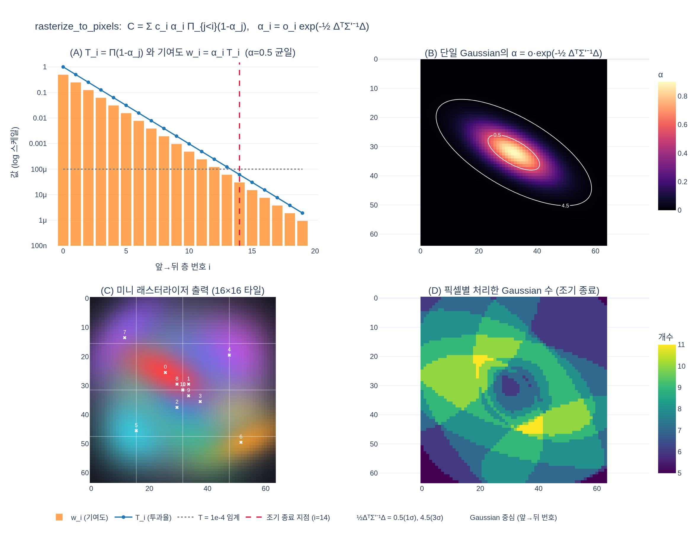

# `rasterize_to_pixels` 단계의 알파 블렌딩 공식은?

타일별로 깊이순 앞→뒤로 $C = \sum_i c_i\,\alpha_i \prod_{j<i}(1-\alpha_j)$를 누적한다.
여기서 $\alpha_i = o_i \exp(-\tfrac12 \Delta^\top \Sigma'^{-1} \Delta)$다.

- 고교 수준 단계별 설명: [hi.md](hi.md)
- 실행 가능한 예제(numpy/torch 토이 래스터라이저): [expy.py](expy.py)

## 시각화

