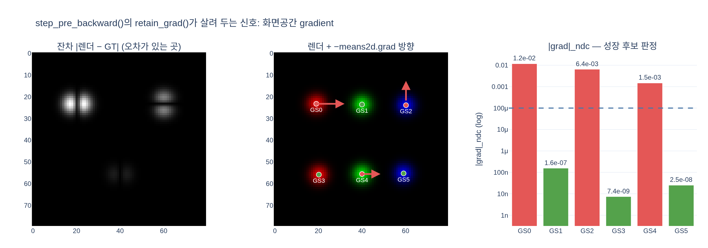

# `step_pre_backward()`가 하는 일은?

## 한 줄 답

`info["means2d"].retain_grad()`를 호출한다. 그게 사실상 전부다.
`means2d`는 계산 그래프의 **중간 텐서(non-leaf)** 라서 PyTorch가 backward 직후 gradient를
버리는데, 밀도화(densification)는 바로 그 **화면공간 gradient**를 신호로 쓴다. 그래서
`loss.backward()` **전에** "이 텐서 gradient는 남겨 둬"라고 미리 표시해 두는 훅이다.

## 실제 코드

`gsplat/strategy/default.py`의 `DefaultStrategy.step_pre_backward()`:

```python
def step_pre_backward(self, params, optimizers, state, step, info):
    """Callback function to be executed before the `loss.backward()` call."""
    assert (
        self.key_for_gradient in info
    ), "The 2D means of the Gaussians is required but missing."
    info[self.key_for_gradient].retain_grad()
```

- `key_for_gradient`의 기본값은 `"means2d"` (2DGS일 때는 `"gradient_2dgs"`).
- 베이스 클래스 `gsplat/strategy/base.py`의 `Strategy.step_pre_backward()`는 그냥 `pass`다.
  즉 훅 자체는 "전략이 backward 전에 끼어들 자리"를 열어 둔 것이고, `DefaultStrategy`만
  그 자리를 `retain_grad()`로 채운다.

## 왜 `retain_grad()`가 필요한가 — leaf vs non-leaf

PyTorch는 메모리를 아끼려고 **leaf 텐서**(직접 만든 `nn.Parameter`, `requires_grad=True`로
생성한 텐서)에만 `.grad`를 채워 놓는다. 그래프 중간에서 만들어진 텐서의 gradient는
체인룰을 위해 잠깐 흐르기만 하고 곧바로 해제된다.

학습 파라미터 관계를 보면:

```
splats["means"]   (leaf, [N,3])
      │  fully_fused_projection()  = EWA 투영
      ▼
info["means2d"]   (non-leaf, [C,N,2] — packed=True면 [nnz,2])
      │  isect_tiles → rasterize_to_pixels
      ▼
render → loss
```

`means2d`는 `means`를 카메라 행렬로 투영해서 만든 **중간 결과**이므로 기본 상태에서
`info["means2d"].grad`는 `None`이다. 실제로 접근하면 PyTorch가
`"use .retain_grad() on the non-leaf Tensor"`라는 UserWarning까지 띄운다.
`step_pre_backward()`는 그 조언을 그대로 실행한다.

중요한 점: `retain_grad()`는 **흘러가는 gradient를 복사해 둘 뿐**이다. 그래프 구조도,
`means`/`scales`/`quats`/`opacities`가 받는 gradient 값도 전혀 바뀌지 않는다. 최적화에는
아무 영향이 없고, 순수하게 **밀도화용 계측(instrumentation)** 이다. 비용도 텐서 하나
(`[C,N,2]` float)를 backward가 끝날 때까지 붙잡는 정도다.

## 남겨 둔 gradient로 무엇을 하나

`step_post_backward()` → `_update_state()`가 그 값을 읽는다. 첫 줄이 바로
`info[self.key_for_gradient].grad.clone()`이므로, pre-backward 훅을 빼먹으면
`AttributeError: 'NoneType' object has no attribute 'clone'`으로 즉사한다.

```python
# default.py _update_state() 발췌
if self.absgrad:
    grads = info[self.key_for_gradient].absgrad.clone()
else:
    grads = info[self.key_for_gradient].grad.clone()
# normalize grads to [-1, 1] screen space
grads[..., 0] *= info["width"]  / 2.0 * info["n_cameras"]
grads[..., 1] *= info["height"] / 2.0 * info["n_cameras"]
...
state["grad2d"].index_add_(0, gs_ids, grads.norm(dim=-1))
state["count"].index_add_(0, gs_ids, torch.ones_like(gs_ids, dtype=torch.float32))
```

- **NDC 정규화**: `means2d`는 픽셀 좌표라서 gradient도 픽셀 단위다. $\partial\mathcal{L}/\partial\mu_{px}
  \cdot \frac{W}{2} = \partial\mathcal{L}/\partial\mu_{ndc}$ 이므로, `width/2`·`height/2`를 곱해
  $[-1,1]$ NDC 기준으로 되돌린다. 덕분에 해상도가 달라도 **같은 임계값**을 쓸 수 있다.
- **보이는 것만 누적**: `radii > 0`인 Gaussian만 골라 `index_add_`. 안 보이는 스텝에서
  0이 섞여 평균이 희석되지 않게 `count`도 따로 센다.
- refine 시점(기본 `refine_start_iter=500` ~ `refine_stop_iter=15000` 구간, `refine_every=100`)에
  평균 $g_i/n_i$를 임계값과 비교한다.

| 동작 | 조건 (기본값) | 효과 |
|---|---|---|
| **duplicate** | 평균 화면 grad > `grow_grad2d=2e-4` **이고** 크기 ≤ `grow_scale3d=1%`·scene_scale | 작은데 오차 큰 곳 → 복제 |
| **split** | 평균 화면 grad > `2e-4` **이고** 크기 > `1%`·scene_scale | 큰데 오차 큰 곳 → 2개로 쪼개고 크기 ÷1.6 |
| **prune** | opacity < `prune_opa=0.005`, 또는 크기 > `prune_scale3d=10%`·scene_scale | 기여 없는/비대한 것 제거 |
| **opacity reset** | 매 `reset_every=3000` 스텝 | 전체 opacity를 0.01로 리셋 → floater 정리 |

즉 `retain_grad()` 한 줄이 없으면 **밀도화 전체가 굴러가지 않는다**. 흥미로운 건
학습 자체(Adam으로 `means` 갱신)는 그 한 줄이 없어도 정상 동작한다는 점 — 그래서
"빼먹어도 loss는 잘 떨어지는데 Gaussian이 안 늘어난다" 같은 증상이 나온다.

## 왜 화면공간 gradient가 "쪼개라"는 신호인가

$\partial\mathcal{L}/\partial\mu_{2D}$ 가 크다는 것은 "이 Gaussian을 화면에서 옮기면 손실이
많이 준다" = **아직 이 영역이 제대로 재구성되지 않았다**는 뜻이다. 한 Gaussian이 감당하기
버거운 디테일이 있는 곳이므로, 옮기는 대신 **개수를 늘려** 표현력을 키운다. 이것이 원
3DGS 논문의 adaptive density control이고, 판단 재료가 정확히 `means2d.grad`다.

## `absgrad` (AbsGS) — 상쇄 문제

`means2d.grad`는 그 Gaussian을 덮는 **모든 픽셀의 기여를 합산**한 값이다. 한 Gaussian이
왼쪽 픽셀에서는 왼쪽으로, 오른쪽 픽셀에서는 오른쪽으로 당겨지면 두 힘이 **상쇄**되어
합이 0에 가까워진다. 정답이 "한 덩어리가 아니라 두 덩어리"인 과소재구성
(under-reconstruction) 상황이 딱 이것이라, 쪼개져야 하는데도 신호가 죽는다.

AbsGS는 픽셀별 gradient의 **절대값 합**을 따로 모아 이 상쇄를 없앤다. gsplat에서는
`rasterization(..., absgrad=True)`를 주면 backward 커널이 `means2d.absgrad` 속성을
채우고(`gsplat/cuda/_wrapper.py`: `means2d.absgrad = means2d_absgrad`),
`_update_state()`가 `.grad` 대신 그걸 읽는다. 값 스케일이 커지므로 임계값은
`grow_grad2d=8e-4` 정도를 권장한다. `retain_grad()`는 `.grad` 경로용이지만,
`absgrad` 경로에서도 훅은 그대로 호출된다(구현이 분기하지 않는다).

## 호출 순서와 주의점

`examples/simple_trainer.py`의 `train()` 루프:

```
1. 이미지 샘플
2. rasterization() forward → info
3. strategy.step_pre_backward(...)   ← 여기
4. loss 계산 → loss.backward()
5. Adam step + zero_grad
6. lr scheduler
7. strategy.step_post_backward(...)  ← grad 통계 누적 + refine
```

- **시점이 전부다.** `backward()` 뒤에 `retain_grad()`를 부르면 이미 gradient가 해제된
  뒤라 아무 효과가 없다. 그래서 이름이 `step_`**`pre`**`_backward`.
- **매 스텝 새로 불러야 한다.** `means2d`는 forward마다 새로 생기는 텐서라 플래그가
  다음 스텝으로 이어지지 않는다.
- **`requires_grad=False`인 forward에서는 예외가 난다**
  (`RuntimeError: can't retain_grad on Tensor that has requires_grad=False`).
  `simple_trainer.py`가 Gaussian을 얼려 둔 구간(`_gaussians_frozen`)에서 이 훅을
  건너뛰는 이유다 — 그때는 밀도화 통계 자체가 무의미하다.
- **`MCMCStrategy`는 이 훅이 비어 있다.** MCMC는 화면공간 grad 대신 opacity 기반
  relocation/샘플링을 쓰므로, `gsplat/strategy/mcmc.py`에는 `step_pre_backward()`가
  주석으로만 남아 있고 베이스의 `pass` 구현을 상속한다.
- `packed=True`면 `means2d`가 `[nnz, 2]`, `packed=False`면 `[C, N, 2]`가 된다.
  훅은 모양에 무관하게 텐서만 붙잡고, 모양별 처리는 `_update_state()`가 담당한다.

## 자주 나오는 오해

- ❌ "gradient를 새로 계산한다" → 아니다. 이미 흐르는 값을 **보관만** 한다.
- ❌ "gradient 흐름/값이 바뀐다" → 아니다. `means`가 받는 gradient는 동일하다.
- ❌ "메모리를 많이 쓴다" → 텐서 하나뿐이다. `retain_graph=True`와는 전혀 다르다.
- ❌ "생략하면 학습이 망가진다" → 학습은 돌아간다. 망가지는 건 **밀도화 통계**다
  (정확히는 `step_post_backward()`에서 `None.clone()`으로 죽는다).

## 시각화

`expy.py`를 실행하면 만들어지는 그림. 왼쪽은 렌더와 GT의 잔차(오차가 남은 곳),
가운데는 각 Gaussian이 받은 `−means2d.grad` 방향(= 손실을 줄이는 화면상 이동 방향),
오른쪽은 NDC로 정규화한 grad 크기다. 정확히 맞은 GS1/GS3/GS5는 grad가 사실상 0이고,
어긋난 GS0 > GS2 > GS4 순으로 신호가 크다 — `retain_grad()`가 살려 둔 정보가 바로 이
랭킹이다.


