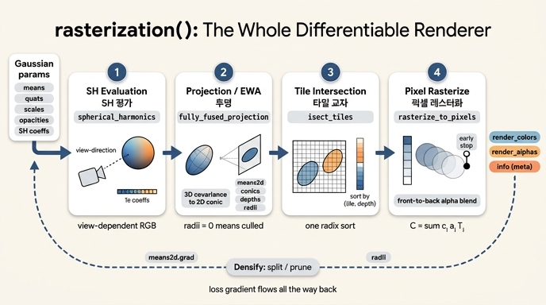

# `gsplat/rendering.py`의 `rasterization()`은 어떤 역할인가?

> **정답**: 미분 가능한 렌더러 전체를 담당하는 함수다. 내부는 4개의 CUDA 커널 단계(SH 평가 → 투영 → 타일 교차 → 픽셀 래스터화)로 구성된다.

---

## 1. 한 줄 요약: 3DGS 학습 루프의 "유일한 forward"

3DGS 학습 코드에서 신경망은 없다. 파라미터는 Gaussian 속성 텐서 5개(`means`, `quats`, `scales`, `opacities`, `sh0`/`shN`)뿐이고, **그 텐서들을 이미지로 바꾸는 유일한 연산이 `rasterization()`**이다. 즉 이 함수가 3DGS의 "모델 forward" 전체다.

워크스루(`training_walkthrough.py` 3단계)의 표현대로:

```
[gsplat/rendering.py:234]의 rasterization()이 미분 가능한 렌더러 전체다.
내부는 4개의 CUDA 커널 단계로 구성된다.
```

미분 가능하다는 것이 핵심이다. 픽셀 색에 대한 손실 gradient가 알파 블렌딩 → 2D 공분산 → 투영 → 3D 공분산 → `quats`/`scales`/`means`까지 전부 역전파된다. 그래서 **"이미지 loss만으로 3D 점군의 위치·모양·색·투명도를 직접 학습"**하는 것이 가능하다.

### 학습 루프 안에서의 위치

```
COLMAP sparse points ─→ splats (means/quats/scales/opacities/SH)
                            │
                            ▼
                    rasterization()      ← 이 카드
                    (SH평가→투영→타일링→블렌딩)
                            │
              render, alpha, info ────────────────┐
                            │                     │
                            ▼                     ▼
           L = 0.8·L1 + 0.2·(1−SSIM)      DefaultStrategy
                            │              (duplicate/split/prune)
                            ▼                     ▲
                        backward ─── info["means2d"].grad ┘
```

`rasterization()`이 반환하는 **세 번째 값 `info`(meta)가 밀도화 전략의 입력**이라는 점이 특히 중요하다. 렌더러는 이미지만 뱉는 게 아니라, "어떤 Gaussian이 화면에 보였고 얼마나 컸는지"라는 중간 통계까지 같이 내보낸다.

---

## 2. 시그니처와 반환값

```python
# gsplat/rendering.py:234
def rasterization(
    means,      # [..., N, 3]   Gaussian 중심 (world)
    quats,      # [..., N, 4]   회전 (내부에서 normalize)
    scales,     # [..., N, 3]   축 길이 (exp 적용된 실제 크기)
    opacities,  # [..., N]      (0,1) — sigmoid 적용된 값
    colors,     # [N, K, D] SH 계수  또는 [..., N, D] post-activation 색
    viewmats,   # [..., C, 4, 4] world→camera  (= inv(camtoworld))
    Ks,         # [..., C, 3, 3] 내부 파라미터
    width, height,
    near_plane=0.01, far_plane=1e10, radius_clip=0.0, eps2d=0.3,
    sh_degree=None, packed=True, tile_size=None,
    render_mode="RGB", rasterize_mode="classic",
    absgrad=False, sparse_grad=False, distributed=False,
    camera_model="pinhole", ...
) -> Tuple[Tensor, Tensor, Dict]
```

반환값 3개:

| 반환 | 형태 | 뜻 |
|---|---|---|
| `render_colors` | `[..., C, H, W, X]` | 렌더된 이미지. `render_mode="RGB"`면 X=D(보통 3), `"RGB+D"`면 D+1(마지막 채널이 depth) |
| `render_alphas` | `[..., C, H, W, 1]` | 누적 알파 = 1 − 최종 투과율. 배경 합성/마스크에 쓴다 |
| `meta`(=`info`) | dict | 중간 결과 전부: `radii`, `means2d`, `depths`, `conics`, `opacities`, `isect_ids`, `flatten_ids`, `isect_offsets`, `tile_width/height`, `tiles_per_gauss`, `width`, `height`, `tile_size`, `n_cameras`, (`packed=True`면) `gaussian_ids`/`camera_ids`/`batch_ids` |

배치 차원이 앞에 붙는 것에 주의: `C`는 **카메라 개수**다. `viewmats`/`Ks`를 배치로 넘기면 한 번의 호출로 여러 뷰를 동시 렌더한다(Batch Rasterization).

---

## 3. 내부 4단계 파이프라인 (카드의 핵심)

### 단계 1 — SH 평가 `spherical_harmonics`

카메라 원점에서 각 Gaussian 중심으로 향하는 **시선 방향**을 구하고, 그 방향으로 구면조화 계수 `[N, K, 3]`을 평가해 **뷰 의존적 RGB** `[C, N, 3]`을 만든다.

- `sh_degree` 인자가 활성 차수를 제한한다. `(sh_degree+1)^2 ≤ K` 여야 한다 (degree 3 → 16개 계수).
- 학습 초반에는 `sh_degree_to_use = min(step // 1000, 3)`처럼 차수를 점진적으로 올린다. DC(0차)만 먼저 학습해 **색부터 안정화**시키는 것이다.
- 화면에 안 보이는 Gaussian(`radii == 0`)은 `masks`로 건너뛴다 — 즉 이 단계는 **투영 결과에 의존**하므로 실제 실행 순서상 투영 뒤에 끼어든다(아래 참고 참조).
- 마지막에 `+0.5`를 더하고 `clamp_min(0)`을 적용한다. 그래서 SfM 색으로 초기화할 때 DC 계수를 `(rgb − 0.5) / 0.2821`로 넣는다.

### 단계 2 — 투영 `fully_fused_projection` (EWA splatting)

3D 공분산을 만들고 카메라 평면으로 투영한다.

$$\Sigma = R S S^\top R^\top \quad (R = \mathrm{quat2mat}(q),\; S = \mathrm{diag}(s))$$

$$\Sigma' = J W \Sigma W^\top J^\top + \epsilon_{2d} I \quad (W: \text{view rotation},\; J: \text{투영 야코비안})$$

출력:

| 출력 | 뜻 |
|---|---|
| `means2d` `[C,N,2]` | 화면 좌표(픽셀) |
| `conics` `[C,N,3]` | 2D 공분산의 **역행렬** 상삼각 3원소 — 픽셀에서 바로 $\Delta^\top \Sigma'^{-1}\Delta$를 계산하기 위함 |
| `depths` `[C,N]` | 카메라 공간 z (또는 `global_z_order=False`면 유클리드 거리) |
| `radii` `[C,N,2]` | 화면상 반경. **`radii=0`이면 컬링됨**(near/far 밖, 화면 밖, `radius_clip` 미달) |
| `compensations` | `rasterize_mode="antialiased"`일 때만. `eps2d` 팽창으로 잃은 밀도를 opacity에 보정 |

`eps2d=0.3`은 저역 통과 필터다. 1픽셀보다 작아진 Gaussian이 사라지지 않도록 2D 공분산에 최소 크기를 더해준다.

### 단계 3 — 타일 교차 `isect_tiles` + `isect_offset_encode`

화면을 **16×16 픽셀 타일**로 자르고, 각 Gaussian이 걸치는 타일마다 하나의 항목을 만든다.

- 각 항목의 정렬 키 = `(image_id, tile_id, depth)`를 하나의 64비트 정수로 packing한 `isect_ids`.
- 이 키로 **radix sort** 한 번을 하면 "타일별 + 깊이순" 정렬이 동시에 끝난다. 타일마다 따로 정렬하지 않는 것이 gsplat/3DGS 속도의 핵심 트릭이다.
- `flatten_ids`는 정렬 후 각 항목이 어느 Gaussian인지 가리키는 인덱스.
- `isect_offset_encode`가 정렬된 배열에서 **타일별 시작 오프셋** `isect_offsets [C, tile_h, tile_w]`를 만든다. 다음 단계의 각 타일 CUDA 블록은 이 오프셋으로 자기 구간만 읽는다.
- 한 Gaussian이 여러 타일에 걸치면 항목이 중복 생성된다(`tiles_per_gauss`). 그래서 큰 Gaussian은 비용이 크다.

`tile_size`는 기본 16으로 고정된다(`_resolve_tile_size`). 3DGS 커널은 `TILE_SIZE=16`으로만 컴파일되어 있고, 8/16 선택은 3DGUT(`with_eval3d=True`) 경로에서만 의미가 있다.

### 단계 4 — 픽셀 래스터화 `rasterize_to_pixels`

타일 하나 = CUDA 블록 하나. 블록이 자기 타일의 Gaussian을 정렬된 순서(앞→뒤)로 shared memory에 배치 로드하고, 스레드마다 자기 픽셀에 대해 알파 블렌딩한다.

$$\alpha_i = o_i \exp\!\left(-\tfrac12 \Delta_i^\top \Sigma'^{-1} \Delta_i\right), \qquad \Delta_i = p_{\text{pixel}} - \text{means2d}_i$$

$$C = \sum_i c_i\,\alpha_i \prod_{j<i}(1-\alpha_j), \qquad A = 1 - \prod_i (1-\alpha_i)$$

- **누적 투과율 $T=\prod(1-\alpha_j)$가 임계값 아래로 떨어지면 조기 종료**(early stop). 앞에서 이미 불투명해졌으면 뒤쪽 Gaussian은 읽지도 않는다.
- 여기가 순서 의존(order-dependent) 연산이라 **깊이 정렬이 반드시 앞 단계에서 끝나 있어야** 한다.
- backward는 이 과정을 역순으로 재생하며 $\partial L/\partial c_i, \partial L/\partial \alpha_i$를 모으고, 그것이 `conics` → 투영 → `quats`/`scales`/`means`로 흘러간다.

---

## 4. `info`가 밀도화의 입력이 되는 이유

```python
render, alpha, info = rasterize_splats(splats, c2w, K, W, H, sh_degree=0)
print("info keys:", sorted(info.keys()))
print(f"화면에 보이는 Gaussian: {(info['radii'] > 0).all(-1).sum().item():,}")
```

`DefaultStrategy`는 `info`에서 두 가지를 읽는다.

```python
# gsplat/strategy/default.py
info[self.key_for_gradient].retain_grad()             # L170  (보통 "means2d")
grads = info[self.key_for_gradient].grad.clone()      # L247  (absgrad면 .absgrad)
grads[..., 0] *= info["width"]  / 2.0 * info["n_cameras"]
grads[..., 1] *= info["height"] / 2.0 * info["n_cameras"]
...
radii = info["radii"][sel].max(dim=-1).values
radii / float(max(info["width"], info["height"]))      # 화면 대비 상대 크기
```

1. **`means2d`의 gradient 크기** — "이 Gaussian을 화면에서 옮기면 loss가 많이 줄어든다" = 이 Gaussian 하나가 다 표현하지 못하는 디테일이 있다 = **쪼개야 한다(split/duplicate)**는 신호.
2. **`radii`** — 화면상 크기. 너무 크면 split, `radii=0`(안 보임)이면 통계에서 제외.

그래서 `means2d`는 단순 중간값이 아니라 `retain_grad()`로 gradient를 붙잡아 두는 **학습 제어 신호**다. `rasterization()`이 이 텐서를 `info`로 노출하지 않으면 밀도화 전략 자체가 성립하지 않는다.

`absgrad=True`는 부호가 상쇄되지 않는 절댓값 gradient 누적(`means2d.absgrad`)을 켜는 옵션으로, AbsGS 계열 밀도화 기준에 쓴다.

---

## 5. 실제 코드를 열었을 때 헷갈리는 점 (중요)

현재 저장소의 `rasterization()` **본문에는 4개 커널 호출이 안 보인다.** 인자를 검증·정규화한 뒤 단일 C++ 오케스트레이터 op 하나를 호출하고, 그 반환 튜플을 `meta` dict로 재포장할 뿐이다.

```python
(render_colors, render_alphas, ..., radii, means2d, depths, conics,
 projected_opacities, tiles_per_gauss, isect_ids, flatten_ids,
 isect_offsets, tile_width, tile_height) = _make_lazy_cuda_func("rasterization_3dgs")(...)
```

즉 **4단계는 성능을 위해 C++/CUDA 쪽으로 융합(fuse)되어 내려갔다.** 4단계 구조를 파이썬 레벨에서 그대로 읽고 싶다면 같은 파일의 **순수 PyTorch 참조 구현 `_rasterization()`(`gsplat/rendering.py:722`)**을 보면 된다. 거기에는 `_fully_fused_projection` → `isect_tiles` → `isect_offset_encode` → `_maybe_evaluate_sh`(내부에서 `spherical_harmonics`) → `rasterize_to_pixels`가 순서대로 쓰여 있다.

참조 구현에서 보이는 실제 실행 순서는 **투영 → 타일 교차 → SH 평가 → 픽셀 래스터화**다. SH 평가가 투영 뒤로 밀리는 이유는 `masks = (radii > 0)`로 **보이는 Gaussian만 SH를 계산**해 낭비를 없애기 위함이다. 카드가 말하는 "SH 평가 → 투영 → 타일 교차 → 픽셀 래스터화"는 **데이터 흐름(색 → 기하 → 정렬 → 합성)의 개념적 순서**로 기억하면 된다.

### 이름이 비슷한 것들 구분

| 이름 | 정체 |
|---|---|
| `rasterization()` | **렌더러 전체** (4단계 묶음). 학습 코드가 부르는 것 |
| `rasterize_to_pixels()` | 4단계 중 **마지막 알파 블렌딩 커널**만 |
| `_rasterization()` | 같은 파일의 순수 PyTorch **참조/디버그 구현** |
| `rasterization_2dgs()` | 2D Gaussian Splatting용 별도 함수 |
| `rasterization_inria_wrapper()` | 원본 INRIA diff-gaussian-rasterization 래퍼(비교용) |
| `rasterize_splats()` | `examples/simple_trainer.py:649`의 **사용자 측 래퍼** — 활성화 함수(exp/sigmoid) 적용, SH 계수 concat, appearance/카메라 왜곡 처리를 하고 `rasterization()`을 부른다 |

---

## 6. 자주 쓰는 인자 정리

| 인자 | 의미 / 실전 팁 |
|---|---|
| `sh_degree` | `None`이면 `colors`를 이미 활성화된 색으로 취급(SH 평가 생략). 정수면 SH 계수로 보고 그 차수까지만 활성화 |
| `packed` | `True`: 보이는 (카메라, Gaussian) 쌍만 sparse로 packing → 메모리 절약, `gaussian_ids` 제공. `False`: dense `[C,N,...]` → 밀도화 상태 갱신 코드와 인덱스가 맞아 다루기 쉽다. 워크스루가 `packed=False`를 쓰는 이유 |
| `render_mode` | `"RGB"`, `"D"`(누적 깊이), `"ED"`(기댓값 깊이), `"RGB+D"`, `"RGB+ED"`, `"d"`/`"Ed"`(광선 따라간 hit distance) |
| `rasterize_mode` | `"classic"` 또는 `"antialiased"`(투영 단계의 `compensations`로 `eps2d` 팽창 보정 → 해상도 변화에 강건) |
| `near_plane`/`far_plane`/`radius_clip` | 투영 단계의 컬링 기준. 걸리면 `radii=0` |
| `eps2d` | 2D 공분산 하한(기본 0.3). 서브픽셀 Gaussian 소멸 방지 |
| `absgrad` | `means2d.absgrad` 누적 활성화(밀도화 기준용) |
| `distributed` | 멀티 GPU: rank별로 Gaussian 일부만 넘기면 협력 렌더 + rank 간 gradient 흐름 (Scaling Up 3DGS, arXiv:2406.18533) |
| `camera_model` | `"pinhole"`, `"ortho"`, `"fisheye"`, `"ftheta"` |
| `with_ut` / `with_eval3d` | 3DGUT 경로: Unscented Transform 투영 / 2D 근사 대신 3D 월드 공간에서 Gaussian 응답 계산 |

---

## 7. 암기 포인트

1. `rasterization()` = **미분 가능한 렌더러 전체** (3DGS의 유일한 forward).
2. 내부는 **4개 CUDA 커널 단계**: **SH 평가 → 투영 → 타일 교차 → 픽셀 래스터화**.
3. 반환은 **3개**: 이미지, 알파, 그리고 **`info`(meta)** — `info["means2d"]`의 gradient가 밀도화 신호.
4. 타일은 **16×16**, 정렬 키는 `(tile_id, depth)` 한 번의 radix sort, 블렌딩은 **앞→뒤 + 투과율 조기 종료**.

## 인포그래픽


