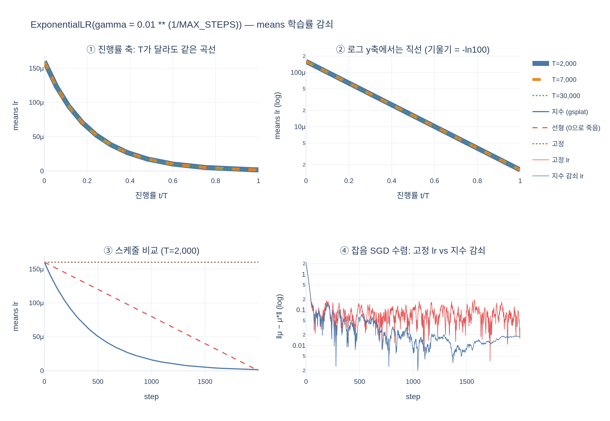

# `means`의 학습률 감쇠 스케줄은 어떻게 설정하는가?

`torch.optim.lr_scheduler.ExponentialLR`에 `gamma = 0.01 ** (1.0 / MAX_STEPS)`를 주어,
총 스텝에 걸쳐 초기값의 1%까지 지수 감쇠시킨다.

- [hi.md](hi.md) — 고교 수준에서 쌓아 올린 설명
- [expy.py](expy.py) — 실행 가능한 예제 (jupyter percent script)

## 시각화

