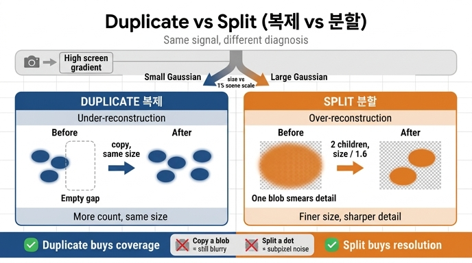

# Gaussian이 "작은데 오차가 큰" 경우와 "큰데 오차가 큰" 경우의 처리가 다른 이유는?

> **한 줄 답**: 오차의 **원인**이 다르기 때문이다. 작은 Gaussian이 오차를 내면 그 자리에 **표현이 모자란 것**(under-reconstruction)이므로 **복제(duplicate)** 해서 개수를 늘리고, 큰 Gaussian이 오차를 내면 하나가 **넓은 영역을 뭉개고 있는 것**(over-reconstruction)이므로 **쪼개고(split) 크기를 줄여** 세밀하게 만든다.

---

## 1. 두 경우가 공유하는 신호: 화면공간 gradient

밀도화의 트리거는 둘 다 똑같다. 래스터화가 돌려주는 `info["means2d"]`(화면상 2D 중심 위치)의 gradient를 스텝마다 누적한 평균값이다.

```
grads = state["grad2d"] / count.clamp_min(1)
is_grad_high = grads > self.grow_grad2d          # 기본 2e-4
```
(`gsplat/strategy/default.py` `_grow_gs`)

이 gradient가 크다는 것은 "**이 Gaussian을 화면에서 이쪽으로 옮기면 loss가 많이 줄어든다**"는 뜻이다. 즉 최적화기가 그 자리에서 계속 갈팡질팡하고 있다는 신호 — **여기에 문제가 있다**까지는 알려주지만, **문제의 종류**는 알려주지 않는다.

## 2. 원인을 갈라내는 판별자: 3D 크기

같은 "오차 크다" 신호를 두 갈래로 나누는 기준이 **Gaussian의 3D 크기**다. 씬 전체 규모(`scene_scale`)로 정규화한 상대 크기를 쓴다.

```
is_small = torch.exp(params["scales"]).max(dim=-1).values
           <= self.grow_scale3d * state["scene_scale"]    # 기본 1% · scene_scale

is_dupli = is_grad_high & is_small          # 작은데 오차 큼 → 복제
is_split = is_grad_high & ~is_small         # 큰데 오차 큼   → 분할
```

워크스루의 표가 그대로 이 코드다.

| 동작 | 조건 (기본값) | 효과 |
|---|---|---|
| **duplicate** | grad 평균 > `2e-4` **이고** 크기 ≤ 1%·scene_scale | 작은데 오차 큰 곳 → 복제 |
| **split** | grad 평균 > `2e-4` **이고** 크기 > 1%·scene_scale | 큰데 오차 큰 곳 → 2개로 쪼개고 크기 /1.6 |

> 왜 `scene_scale`로 나누나: "작다/크다"는 절대 미터 단위로 정할 수 없다. 책상 하나짜리 씬의 1cm와 도시 스캔의 1cm는 전혀 다른 의미다. 카메라 분포에서 뽑은 `scene_scale`로 나눠 **씬 상대 비율**로 판단한다.

## 3. 왜 처리가 달라야 하는가 (핵심 직관)

### 작은데 오차가 큼 = **덮개 부족** (under-reconstruction)

작은 Gaussian은 이미 충분히 뾰족하다. 해상도는 모자라지 않다. 그런데도 gradient가 크다는 건 **주변에 아직 아무것도 없는 빈 공간**이 있고, 그 하나가 그 빈틈까지 끌려가려고 발버둥치는 상황이다. 이때 필요한 건 **면적/개수**다.

→ **복제**: 같은 위치·같은 크기·같은 색으로 하나 더 만든다.

```
def param_fn(name, p):
    return torch.nn.Parameter(torch.cat([p, p[sel]]))   # 전 파라미터 그대로 append
```
(`gsplat/strategy/ops.py` `duplicate`)

두 개가 정확히 겹쳐 태어나지만 **다음 스텝부터 각자 gradient를 받아** 서로 다른 방향으로 밀려나며 빈 공간을 메운다. 크기는 건드리지 않는다 — 크기는 애초에 문제가 아니었으니까.

### 큰데 오차가 큼 = **뭉갬** (over-reconstruction)

큰 Gaussian은 넓은 영역을 **하나의 색·하나의 불투명도**로 칠하고 있다. 그 영역 안에 실제로는 디테일(엣지, 무늬, 깊이 변화)이 있는데 표현할 자유도가 없어서 평균값으로 뭉개진다. 개수를 늘려도 **같은 자리에 같은 크기 얼룩을 두 겹 칠하는 것**이라 디테일은 하나도 안 생긴다. 필요한 건 **해상도**다.

→ **분할**: 부모를 지우고, 부모 분포 안에서 뽑은 두 위치에 **1/1.6 크기**의 자식 두 개를 놓는다.

```
samples = torch.einsum("nij,nj,bnj->bni", rotmats, scales,
                       torch.randn(2, len(scales), 3))   # 부모 Σ에서 2개 샘플링
...
if name == "means":   p_split = (p[sel] + samples).reshape(-1, 3)
elif name == "scales": p_split = torch.log(scales / 1.6).repeat(2, 1)
p_new = torch.cat([p[rest], p_split])          # 부모(sel)는 빠지고 자식 2개가 들어감
```
(`gsplat/strategy/ops.py` `split`)

두 자식은 **부모의 타원체 모양(회전·비등방 스케일)을 따라** 흩뿌려지므로, 길쭉한 Gaussian은 긴 축 방향으로 갈라진다. 크기를 1.6으로 나누는 건 경험적 상수(원 3DGS 논문 φ=1.6)로, 자식 하나의 부피가 약 1/4로 줄어 두 개를 합쳐도 부모보다 작아진다 → 개수는 늘되 **씬이 부풀지 않는다**.

### 반대로 했다면

| 잘못된 조합 | 결과 |
|---|---|
| 큰 Gaussian을 **복제** | 같은 크기의 흐릿한 얼룩 2장. 파라미터만 2배, 디테일 0. 오히려 불투명도가 겹쳐 더 탁해짐 |
| 작은 Gaussian을 **분할** | 이미 작은 것이 다시 /1.6 → 서브픽셀 수준. 화면에서 거의 안 보여 gradient가 굶고, 빈 공간은 여전히 빔 |

즉 **duplicate는 커버리지(coverage)를 사는 연산, split은 주파수(frequency)를 사는 연산**이다. 진단이 다르니 처방이 다르다.

## 4. 구현상의 디테일 두 가지

**(a) 화면 크기(2D) 기반 강제 분할.** 3D로는 작아도 카메라에 아주 가까우면 화면에서 거대해질 수 있다. 그래서 초반 구간에는 2D 반경 조건이 OR로 추가된다.

```
if step < self.refine_scale2d_stop_iter:     # 기본 0 (비활성), 켜면 화면 15% 등
    is_split |= state["radii"] > self.grow_scale2d
```

**(b) 순서가 중요하다.** `duplicate`를 먼저 실행한 뒤, split 마스크를 **복제로 새로 생긴 개수만큼 False로 패딩**한다.

```
duplicate(...)                                # 뒤에 n_dupli개가 append됨
is_split = torch.cat([is_split, torch.zeros(n_dupli, dtype=torch.bool)])
split(...)
```

방금 복제한 놈이 같은 refine 스텝에서 곧바로 쪼개지는 이중 처리를 막는 장치다.

## 5. 대조: MCMC 전략은 이 구분을 안 쓴다

`gsplat/strategy/mcmc.py`의 `MCMCStrategy`는 gradient·크기 판정 대신 **불투명도를 확률로 보고 relocate/add**로 총 개수를 `cap_max`에 맞춰 관리한다. 즉 "작은데 오차/큰데 오차" 이분법은 **DefaultStrategy(원논문 계열)의 densification 휴리스틱**이지, 3DGS의 보편 법칙은 아니다.

---

### 한 문장 요약

같은 "오차 크다" 신호라도 **작으면 빈 공간 문제 → 개수를 늘리고(duplicate)**, **크면 해상도 문제 → 잘게 쪼갠다(split)**. 진단 기준은 `scene_scale`로 정규화한 3D 크기 1%다.

## 인포그래픽


