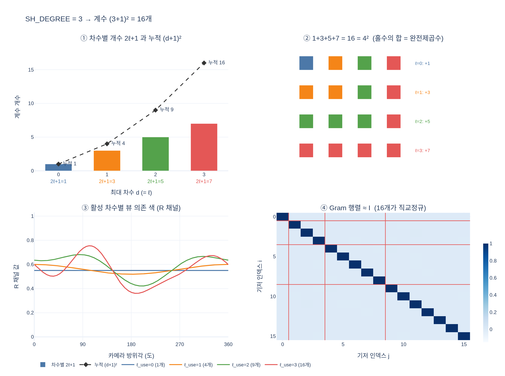

# `SH_DEGREE = 3`일 때 spherical harmonics 계수는 몇 개인가?

$(3+1)^2 = 16$개다. 일반적으로 최대 차수 $d$에 대해 $(d+1)^2$개의 계수를 갖는다.

- [hi.md](hi.md) — 고교 교과 과정에서 출발한 단계별 설명
- [expy.py](expy.py) — 실행 가능한 예제 (jupyter percent script)

## 시각화

