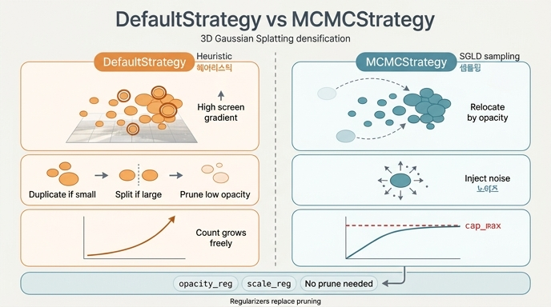

# `MCMCStrategy`는 `DefaultStrategy`와 어떻게 다른가?

> **한 줄 답**: 휴리스틱 분할 대신 SGLD 방식을 쓴다. Gaussian 수의 상한을 두고 opacity 기반 확률적 재배치와 노이즈 주입을 하며, `opacity_reg`/`scale_reg`와 함께 사용한다.

---

## 0. 두 전략은 같은 자리에 꽂히는 부품이다

3DGS 학습 루프에서 "Gaussian을 몇 개, 어디에 둘 것인가"를 결정하는 부분이 **densification 전략**이다.
`gsplat`은 이걸 `Strategy` 인터페이스로 뽑아 두었고 (`gsplat/strategy/base.py`), 학습 루프는 매 스텝
두 개의 훅만 부른다.

```
rasterization() → strategy.step_pre_backward() → loss → loss.backward()
                → optimizer.step() → strategy.step_post_backward()
```

`DefaultStrategy`와 `MCMCStrategy`는 **이 훅 안에서 하는 일이 완전히 다른** 두 구현체다.
`examples/simple_trainer.py`에서는 서브커맨드 하나로 갈아끼운다 (`default` vs `mcmc`).

---

## 1. `DefaultStrategy` — 원논문의 휴리스틱 densification

`gsplat/strategy/default.py`. 원논문 *3D Gaussian Splatting for Real-Time Radiance Field Rendering*
(arXiv:2308.04079)의 방식이다. 핵심은 **화면공간 gradient(`means2d.grad`)를 "여기 표현이 부족하다"는
신호로 보고**, 그 값이 큰 Gaussian을 늘리는 것이다.

| 동작 | 조건 (기본값) | 효과 |
|---|---|---|
| **duplicate** | 화면 grad 평균 > `grow_grad2d=2e-4` 이고 크기 ≤ `grow_scale3d=0.01`·scene_scale | 작은데 오차 큰 곳 → 복제 |
| **split** | 화면 grad 평균 > `2e-4` 이고 크기 > 1%·scene_scale | 큰데 오차 큰 곳 → 2개로 쪼개고 크기 /1.6 |
| **prune** | opacity < `prune_opa=0.005`, 또는 크기 > `prune_scale3d=0.1`·scene_scale | 기여 없는/비대한 것 제거 |
| **opacity reset** | `reset_every=3000` 스텝마다 | 전체 opacity를 0.01로 리셋 → floater 정리 |

특징:

- **`step_pre_backward()`가 필요하다.** `info["means2d"].retain_grad()`를 호출해야 backward 뒤에
  화면공간 gradient를 읽을 수 있기 때문이다.
- **`initialize_state(scene_scale=...)`** — 크기 임계값이 씬 스케일에 상대적이라 scene_scale이 필요하다.
- **Gaussian 개수를 직접 통제하지 못한다.** 임계값을 넘는 Gaussian이 몇 개인지에 따라 개수가 결정되므로,
  씬/하이퍼파라미터에 따라 수백만 개까지 폭증하거나 반대로 덜 자랄 수 있다. VRAM 예산을 맞추려면
  `grow_grad2d`를 손으로 튜닝해야 한다.
- 임계값·비율(`/1.6`)·리셋 주기 같은 **마법의 상수가 많다**. 이게 "휴리스틱"이라 불리는 이유다.
- `absgrad=True`(AbsGS, arXiv:2404.10484)를 켜면 픽셀별 gradient 절대값 합을 쓰므로 상쇄가 없어
  더 민감한 분할 신호가 된다(이때 `grow_grad2d=0.0008` 권장). 여전히 휴리스틱 계열이다.

---

## 2. `MCMCStrategy` — 학습을 사후분포 샘플링으로 재해석

`gsplat/strategy/mcmc.py`. *3D Gaussian Splatting as Markov Chain Monte Carlo*
(arXiv:2404.09591)의 방식이다. 관점 자체를 바꾼다.

> "Gaussian 집합은 최적화의 결과물이 아니라, **씬을 설명하는 확률분포에서 뽑은 샘플**이다."

이 관점을 받아들이면 학습은 최적화가 아니라 **MCMC 샘플링**이 되고, 그 구체적인 알고리즘으로
**SGLD**(Stochastic Gradient Langevin Dynamics)를 쓴다. SGLD의 갱신식은

```
θ ← θ − lr·∇L(θ) + √(2·lr)·ε ,   ε ~ N(0, I)
```

즉 **gradient descent + 노이즈**다. 이 노이즈가 있어야 체인이 국소 최소값에 갇히지 않고
분포 전체를 탐색한다. `MCMCStrategy`의 `step_post_backward()`는 정확히 이 두 번째 항을 담당한다.

### 2-1. 세 가지 동작

```python
# mcmc.py: step_post_backward()
if refine_start_iter < step < refine_stop_iter and step % refine_every == 0:
    n_relocated_gs = self._relocate_gs(...)   # (1) 죽은 것 순간이동
    n_new_gs       = self._add_new_gs(...)    # (2) 상한까지 증식
    torch.cuda.empty_cache()
if step < noise_stop:
    inject_noise_to_position(...)             # (3) 매 스텝 노이즈 주입
```

**(1) 재배치 (relocate / teleport).** `opacity ≤ min_opacity=0.005`인 Gaussian을 "죽었다"고 보고
제거하는 대신 **살아 있는 곳으로 순간이동**시킨다. 목적지는 랜덤이 아니라
**opacity에 비례하는 multinomial 샘플링**이다 — 불투명한(= 씬에 실제로 기여하는) Gaussian이 있는 자리가
더 자주 뽑힌다.

```python
# ops.py: relocate()
probs = opacities[alive_indices].flatten()          # opacity가 곧 샘플링 확률
sampled_idxs = _multinomial_sample(probs, n, replacement=True)
new_opacities, new_scales = compute_relocation(...) # 논문 Eq.9, binomial 보정
```

핵심은 `compute_relocation`(`gsplat/relocation.py`)이다. 한 자리에 Gaussian이 `k`개로 늘어나면
그냥 복제해서는 그 지점의 누적 불투명도가 확 올라가 **렌더 결과가 튄다**. 그래서 이항계수
lookup table(`binoms`, 51×51)을 써서 "겹친 k개가 원래 1개와 같은 알파를 내도록" opacity와 scale을
새로 계산한다. 그래서 `initialize_state()`가 `binoms`만 담고 있는 것이다.
**재배치 전후로 렌더 이미지가 거의 변하지 않는 것**이 이 방식의 설계 목표다.

**(2) 증식 (sample_add).** 매 refine마다 개수를 `min(cap_max, 1.05 × N)`으로 늘린다.
5%씩 지수적으로 늘리다가 **`cap_max`에서 딱 멈춘다**. 새 Gaussian의 위치 역시 opacity 가중
multinomial로 뽑고, 똑같이 `compute_relocation` 보정을 거친다.

**(3) 노이즈 주입 (inject_noise_to_position).** SGLD의 노이즈 항. 그냥 등방성 노이즈가 아니라
두 겹으로 변조된다.

```python
# ops.py: inject_noise_to_position() (PyTorch fallback)
noise = torch.randn_like(means) * torch.sigmoid(-k * (opacities - t)) * noise_scale
noise = torch.einsum("bij,bj->bi", covars, noise)   # 공분산으로 변환
means.add_(noise)
```

- **opacity 게이트**: `sigmoid(-100·(o − 0.005))`. 불투명한(수렴한) Gaussian은 노이즈가 거의 0,
  **투명해서 아직 쓸모를 못 찾은 Gaussian만 크게 흔들린다.**
- **공분산 변조**: 노이즈를 Gaussian 자신의 공분산으로 변환하므로, 큰 Gaussian은 크게, 납작한
  Gaussian은 납작한 방향으로만 움직인다. "자기 크기만큼 돌아다닌다."
- 크기는 `noise_scale = lr × noise_lr`, `noise_lr=5e5`. means의 학습률에 연동되므로 lr이 감쇠하면
  노이즈도 같이 식는다 — **어닐링(annealing)** 이다. 그래서 `step_post_backward()`가
  `lr=schedulers[0].get_last_lr()[0]`를 인자로 받는다.
- CUDA fused 커널(`MCMCPerturbCUDA.cu`)이 있으면 그걸 쓰고, 없으면 위 PyTorch 경로로 fallback한다
  (`GSPLAT_MCMC_BACKEND` 환경변수로 강제 가능).

---

## 3. `opacity_reg` / `scale_reg`가 왜 "함께" 필요한가

MCMC 방식에는 `DefaultStrategy`의 **prune이 없다**. 개수는 `cap_max`가 정하고, 낮은 opacity는
제거가 아니라 재배치의 트리거일 뿐이다. 그러면 "쓸모없는데 어중간하게 남아 있는" Gaussian을
누가 정리하나? → **손실 함수가 한다.**

```python
# simple_trainer.py
if cfg.opacity_reg > 0.0:
    loss += cfg.opacity_reg * opacity_reg_loss(self.splats["opacities"])   # sigmoid(o).mean()
if cfg.scale_reg > 0.0:
    loss += cfg.scale_reg  * scale_reg_loss(self.splats["scales"])         # exp(s).mean()
```

- **`opacity_reg`** (L1 on `sigmoid(opacity)`): 불필요한 Gaussian의 opacity를 0 쪽으로 밀어낸다.
  → `min_opacity` 아래로 내려가면 다음 refine에서 **필요한 곳으로 재배치된다.** 즉 정규화가
  "쓸모없는 Gaussian을 죽이는" 역할을 하고, MCMC가 그 시체를 재활용한다. 이 둘이 한 쌍이다.
- **`scale_reg`** (L1 on `exp(log_scale)`): 거대한 Gaussian이 씬을 뭉개는 것(floater/blob)을 막는다.
  `DefaultStrategy`의 `prune_scale3d` 휴리스틱을 미분 가능한 페널티로 대체한 셈.

`simple_trainer.py`의 `mcmc` 프리셋이 정확히 이 조합이다.

```python
"mcmc": Config(
    init_opa=0.5, init_scale=0.1,
    opacity_reg=0.01, scale_reg=0.01,
    strategy=MCMCStrategy(verbose=True),
)
```

`init_opa`가 `default`보다 높고(0.5) `init_scale`도 다르다는 점에 주의 — MCMC는 초기화 가정도 다르다.

---

## 4. 나란히 놓고 보기

| | `DefaultStrategy` | `MCMCStrategy` |
|---|---|---|
| 논문 | 3DGS (2308.04079) | 3DGS as MCMC (2404.09591) |
| 관점 | 최적화 + 휴리스틱 densification | 사후분포에서의 SGLD 샘플링 |
| 성장 신호 | 화면공간 gradient `means2d.grad` | **없음** — opacity 분포 |
| 성장 방식 | duplicate / split (조건 만족한 것만) | `min(cap_max, 1.05·N)`으로 무조건 5% 증식 |
| 제거 | prune (opacity·크기 임계값) | **없음** — 낮은 opacity는 *재배치* 트리거 |
| 개수 통제 | 간접적(임계값 튜닝), 폭증 가능 | **`cap_max`로 직접 상한** |
| opacity reset | `reset_every=3000`, 전체를 0.01로 | 없음 (노이즈 + `opacity_reg`가 대신) |
| 랜덤성 | 없음 (split 시 샘플링 정도) | 핵심 — multinomial 재배치 + SGLD 노이즈 |
| `step_pre_backward` | **필요** (`means2d.retain_grad()`) | 불필요 (no-op) |
| `initialize_state` | `scene_scale` 인자 | 인자 없음, `binoms` 테이블만 |
| `step_post_backward` | `packed=...` | **`lr=...` 필수** (노이즈 스케일 어닐링) |
| 정규화 | 불필요 | **`opacity_reg`/`scale_reg` 사실상 필수** |
| `refine_stop_iter` | 15,000 | 25,000 |

### 실무적으로 어떤 차이가 나나

- **메모리 예산이 정해져 있을 때**: MCMC가 압도적으로 편하다. `cap_max=1_000_000`처럼 못 박으면 끝이다.
  `DefaultStrategy`는 `grow_grad2d`를 씬마다 다시 맞춰야 한다.
- **같은 Gaussian 개수 기준 품질**: MCMC 논문의 주장은 "동일 예산에서 더 좋다"이다. 노이즈가 나쁜
  국소해를 빠져나가게 하고, 죽은 Gaussian을 버리지 않고 재활용하기 때문이다.
- **SfM 초기화 의존성**: MCMC는 랜덤 초기화에서도 잘 수렴한다고 보고된다. 재배치가 결국 Gaussian을
  필요한 곳으로 옮겨 주기 때문. `DefaultStrategy`는 초기 포인트가 없는 영역을 채우기 어렵다.
- **호출 규약 실수 주의**: MCMC의 `step_post_backward`에 `lr`을 안 넘기면 TypeError고,
  잘못된 `lr`(예: 상수)을 넘기면 노이즈가 끝까지 식지 않아 학습이 수렴하지 않는다.
- `gsplat`에서 `eval3d`는 `MCMCStrategy`만 지원한다 (`simple_trainer.py`: *"DefaultStrategy is
  incompatible with eval3d; use MCMCStrategy (the `mcmc` subcommand)."*).

---

## 5. 한 문장 요약

`DefaultStrategy`는 **"오차가 큰 곳을 보고 쪼갠다"** 는 휴리스틱이고,
`MCMCStrategy`는 **"정해진 개수의 Gaussian을 확률적으로 계속 재배치하며 흔든다"** 는 샘플링이다.
전자는 개수를 못 정하고, 후자는 개수를 먼저 정한 뒤 그 예산 안에서 최선을 찾는다 —
그리고 후자는 prune이 없는 대신 `opacity_reg`/`scale_reg`가 그 자리를 대신한다.

## 인포그래픽


