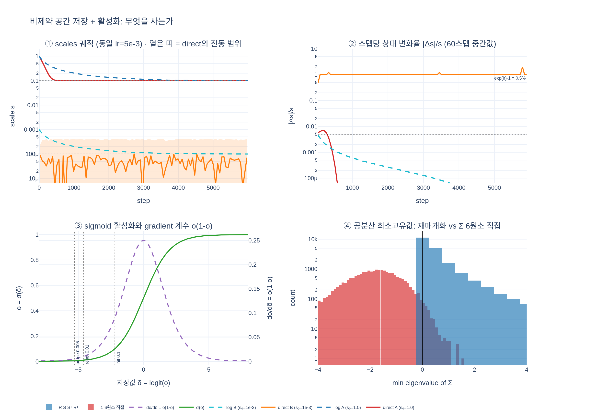

# Gaussian 파라미터를 왜 "비제약 공간"에 저장하는가?

**한 줄 답**: 최적화 안정성을 위해서다. 제약이 있는 값(양수, 0~1 범위 등)은 log/logit 공간에 저장하고 렌더 직전에 활성화 함수를 통과시킨다.

## 문제의 구조: Adam은 제약을 모른다

3DGS의 파라미터에는 **수학적 제약**이 붙어 있다.

| 파라미터 | 제약 | 왜 그 제약이 필요한가 |
|---|---|---|
| `scales` | $s_k > 0$ | 공분산 $\Sigma = R S S^\top R^\top$가 양의 정부호여야 EWA 투영과 $\exp(-\frac12\Delta^\top\Sigma'^{-1}\Delta)$가 정의된다 |
| `opacities` | $o \in (0,1)$ | 알파 블렌딩 $C = \sum_i c_i\alpha_i\prod_{j<i}(1-\alpha_j)$ 에서 투과율이 $[0,1]$을 벗어나면 발산 |
| `quats` | $\lVert q\rVert = 1$ | 단위 quaternion만 회전을 표현한다 |
| `means`, `sh0`/`shN` | 없음 | 부호 있는 좌표 / 실수 계수 |

반면 Adam은 **제약 없는 $\mathbb{R}^n$ 위에서 도는 옵티마이저**다. 제약이 있는 값을 그대로
넘기면 한 스텝이 제약을 깨뜨릴 수 있다. 특히 Adam은 step 크기를 gradient의 2차 모멘트로
정규화하므로, **한 스텝의 크기가 gradient 크기와 거의 무관하게 $\approx$ lr** 이다.
`scales_lr = 5e-3` 이라면 크기가 $10^{-3}$인 작은 Gaussian도 한 걸음에 0.005만큼 움직인다 —
자기 크기의 5배다. 한 스텝에 음수로 튀어나간다.

이때 흔히 쓰는 처방이 `clamp` (projected gradient)인데, 대가가 크다.

- 경계에 붙은 파라미터는 gradient 정보를 잃는다.
- Adam의 1차/2차 모멘트 상태가 "실제로는 일어나지 않은 이동"으로 오염된다.
- 결과적으로 경계 근처에서 진동하며 수렴하지 못한다.

그래서 gsplat(및 3DGS 원논문)의 선택은 **제약을 옵티마이저의 문제로 남기지 않고
재매개화(reparametrization)로 아예 제거해 버리는 것**이다.

## gsplat이 실제로 하는 일

초기화는 `examples/simple_trainer.py:288` `create_splats_with_optimizers`
(워크스루의 `init_splats_with_optimizers`가 같은 로직)에서 이미 비제약 공간 값으로 만든다.

```python
scales    = torch.log(dist_avg * init_scale).unsqueeze(-1).repeat(1, 3)  # log 공간
quats     = torch.rand((N, 4))                    # 미정규화 자유 4-벡터
opacities = torch.logit(torch.full((N,), init_opacity))  # logit 공간, logit(0.1) = -2.1972
colors[:, 0, :] = rgb_to_sh(rgbs)                 # (rgb-0.5)/C0, 제약 없음
```

그리고 **렌더 직전에만** 활성화를 통과시킨다 (`simple_trainer.py:669`, 워크스루 `rasterize_splats`).

```python
means     = splats["means"]                        # [N,3] 그대로
quats     = splats["quats"]                        # [N,4] 커널 내부에서 normalize
scales    = torch.exp(splats["scales"])            # [N,3] log → 실제 크기
opacities = torch.sigmoid(splats["opacities"])     # [N]   logit → (0,1)
colors    = torch.cat([splats["sh0"], splats["shN"]], 1)
```

정리하면 **저장 공간(비제약) ≠ 의미 공간(물리 단위)** 이고, 이 둘 사이의 다리가 활성화 함수다.

| 파라미터 | 저장 | 활성화 | 초기값 |
|---|---|---|---|
| `means` | 그대로 | — | SfM 포인트 위치 |
| `scales` | $\log s$ | `exp` | log(3-최근접 이웃 평균거리) |
| `quats` | 미정규화 4-벡터 | 커널 내부 `normalize` | `torch.rand` |
| `opacities` | $\mathrm{logit}(o)$ | `sigmoid` | logit(0.1) = −2.1972 |
| `sh0`/`shN` | SH 계수 | — | DC = (rgb−0.5)/0.2821, 고차항 0 |

## 얻는 것 1 — 제약이 자동으로 만족된다

`exp`의 상은 $(0,\infty)$, `sigmoid`의 상은 $(0,1)$ 이다. 저장값이 $\pm\infty$로 가더라도
활성화 결과는 **정의상** 제약 안에 있다. 경계가 무한히 먼 곳으로 밀려나므로 clamp가 필요 없고,
"경계에 붙어서 gradient가 죽는" 문제 자체가 사라진다.

공분산은 더 강하다. $S = \mathrm{diag}(e^{\tilde s_1}, e^{\tilde s_2}, e^{\tilde s_3})$ 이므로

$$\Sigma = R\,S\,S^\top R^\top, \qquad \mathrm{eig}(\Sigma) = \{e^{2\tilde s_1}, e^{2\tilde s_2}, e^{2\tilde s_3}\} > 0$$

즉 **어떤 파라미터 값에 대해서도 양의 정부호가 보장된다**. 만약 $\Sigma$의 대칭 6원소를
직접 파라미터로 뒀다면 학습 중 부정부호가 되어 렌더러가 터진다 —
`expy.py`의 실험에서 랜덤 대칭행렬 6원소는 **98.7%**가 최소고유값 음수였고,
재매개화는 **정확히 0%**였다.

## 얻는 것 2 — lr이 "상대 변화율" 단위가 된다 (핵심)

이쪽이 실전에서 더 중요하다. $s = e^{\tilde s}$ 이므로 체인룰은

$$\frac{\partial \mathcal L}{\partial \tilde s} = \frac{\partial \mathcal L}{\partial s}\cdot e^{\tilde s} = s\,\frac{\partial \mathcal L}{\partial s}$$

이고, 업데이트는 저장 공간에서 덧셈이지만 실공간에서는 **곱셈**이 된다.

$$\tilde s \leftarrow \tilde s - \eta \quad\Longleftrightarrow\quad s \leftarrow s \cdot e^{-\eta}$$

따라서 lr $= 5\times10^{-3}$ 은 "스텝당 절대 0.005"가 아니라
**"스텝당 크기 0.5% 변화"** ($e^{0.005}-1 = 0.005$) 를 뜻한다.

이게 왜 결정적인가. 초기 `scales`는 `log(knn 평균거리)`이므로 SfM 포인트 밀도에 따라
**몇 자릿수에 걸쳐 퍼져 있다**. 벽면의 촘촘한 포인트에서 나온 Gaussian과 하늘/원경의 희소한
포인트에서 나온 Gaussian이 크기 1000배 차이날 수 있다. 그런데 옵티마이저는 하나의
`scales_lr`을 공유한다. log 공간에 저장하면 그 하나의 lr이 **모든 크기의 Gaussian에게
같은 의미**를 갖는다.

`expy.py`에서 크기가 1000배 다른 두 Gaussian을 같은 lr로 "각각 10배 축소"시켜 봤다.

| | 제약 공간 + clamp | log 공간 |
|---|---|---|
| A ($s_0=1.0 \to 0.1$) | 상대오차 $7\times10^{-8}$ (성공) | 상대오차 $10^{-4}$ |
| B ($s_0=10^{-3} \to 10^{-4}$) | 상대오차 **183%** (실패) | 상대오차 $10^{-4}$ |
| clamp 충돌 | 6000스텝 중 **2517스텝** | 0 |
| 스텝당 상대 변화 | A 0.55% / B **40%** | A 0.5% / B 0.5% |

제약 공간에서 B는 마지막 1000스텝에서도 $10^{-8}$과 $4.2\times10^{-4}$ 사이를 왕복하며
끝내 자리를 잡지 못한다. log 공간에서는 A와 B의 궤적이 **완전히 겹친다** —
$\log 0.1 - \log 1.0 = \log 10^{-4} - \log 10^{-3} = -2.303$, 즉 "10배 줄이기"가
초기 크기와 무관하게 같은 거리 문제가 되기 때문이다.

> **대조되는 예외: `means`**
> `means`는 부호 있는 좌표라서 log 공간에 넣을 수 없다. 그래서 gsplat은 대신
> **lr에 직접 씬 크기를 곱한다** — `1.6e-4 * scene_scale`
> (워크스루 `lrs["means"]`, `simple_trainer.py:458`의 `scene_scale * 1.1 * global_scale`).
> "스케일 불변성을 어떻게든 확보해야 한다"는 같은 문제를, 재매개화가 불가능하니
> 손으로 보정하는 것이다. 두 방식을 나란히 보면 log 저장이 무엇을 대신해 주고 있는지가 선명해진다.

## 대가 1 — 활성화 함수의 gradient 포화

무료는 아니다. sigmoid의 미분은

$$o = \sigma(\tilde o), \qquad \frac{\partial o}{\partial \tilde o} = o\,(1-o)$$

로, $o \to 0$ 또는 $o \to 1$ 에서 0으로 사그라든다. 실제 값을 보면

| 지점 | $\mathrm{logit}(o)$ | $o(1-o)$ | $o{=}0.5$ 대비 |
|---|---|---|---|
| init `0.1` | −2.1972 | 0.0900 | 0.36× |
| opacity reset `0.01` | −4.5951 | 0.0099 | 0.04× |
| prune 임계 `0.005` | −5.2933 | 0.0050 | **0.02×** |

즉 **한 번 투명해진 Gaussian은 스스로 되살아나기 어렵다**. gradient가 1/50로 줄어드니
남은 학습 스텝으로는 회복이 안 된다. 이것이 3DGS에 `prune`과 `opacity reset`이
**구조적으로 필요한 이유**다 — 되살릴 수 없으니 잘라내거나(prune,
`default.py:351`), 전체를 한 번 리셋해 재출발시킨다(opacity reset, 3000스텝마다).

참고로 `opacities_lr = 5e-2`가 `scales_lr = 5e-3`보다 10배 큰 것도 이 때문이다.
유효 구간이 $\mathrm{logit}(0.005) \approx -5.3$ 부터 $\mathrm{logit}(0.995) \approx +5.3$ 까지
폭 10이 넘는 축이고, 게다가 gradient가 $o(1-o)$로 감쇠되므로 lr로 벌충해야 한다.

## 대가 2 — 밀도화 코드가 두 공간을 왕복해야 한다

저장 공간과 의미 공간이 다르다는 것은, **판단과 연산은 활성화 후 물리 단위에서 하고
결과를 다시 저장 공간으로 되돌려야 한다**는 뜻이다. `gsplat/strategy/ops.py`가
정확히 그렇게 생겼다.

| 연산 | 코드 | 왕복 |
|---|---|---|
| split 크기 축소 | `ops.py:211` `p_split = torch.log(scales / 1.6)` | `exp` → 1/1.6 → `log`. log 공간에서는 상수 $-\log 1.6 = -0.47$ 감산과 동일 |
| split 시 위치 샘플링 | `ops.py:196` `scales = torch.exp(params["scales"])` | 실제 크기로 꺼내서 $R\,S\,\varepsilon$ 샘플 |
| revised opacity | `ops.py:213` `1 - sqrt(1 - sigmoid(p))` → `torch.logit(...)` | 겹친 두 개의 합성 알파 $1-(1-o')^2$가 원래 $o$와 같아지도록 보정한 뒤 되넣음 |
| prune 판정 | `default.py:351,354` `sigmoid(opacities) < 0.005`, `exp(scales).max() > 0.1·scene_scale` | 판정은 **항상** 활성화 후 물리 단위 |
| opacity reset | `ops.py:287` `clamp(p, max=torch.logit(tensor(0.01)))` | 임계값을 logit으로 변환해 저장 공간에서 직접 clamp |
| MCMC relocate/add | `ops.py:339-341, 383-385` `p[idx] = torch.logit(new_opacities)`, `torch.log(new_scales)` | `sigmoid`/`exp`로 꺼내 계산 → `logit`/`log`로 되넣음 |

`opacity reset`이 대입이 아니라 `clamp(max=...)` 인 것도 눈여겨볼 만하다 —
이미 0.01보다 투명한 것은 그대로 두고 불투명한 것만 끌어내린다.

## `quats`는 조금 다른 방식의 "비제약 저장"

`quats`의 제약은 $\lVert q\rVert = 1$ 인 **등식 제약**이라 log/logit 같은 단조 사상으로는
없앨 수 없다. gsplat의 처방은 **제약 위반을 그냥 허용하는 것**이다.

- 저장: `torch.rand((N, 4))` — 정규화되지 않은 자유 4-벡터. 학습 중에도 노름을 강제하지 않는다.
- 사용: 렌더 직전 `F.normalize(quats, dim=-1)` (`rendering.py:1283`), CUDA 커널도
  `quats // [B, N, 4]: Quaternions (No need to be normalized)` 라고 명시한다.

이게 성립하는 이유는 **노름이 gauge 자유도**이기 때문이다. $q$와 $\lambda q$ ($\lambda>0$)는
같은 회전을 준다 (`expy.py`에서 $\lVert q\rVert = 1.19$와 $8.33$의 회전행렬 차이가 $10^{-7}$ 수준).
Riemannian 최적화나 매 스텝 재정규화 같은 비싼 장치 없이, 정규화를 forward에 흡수시켜
gradient가 알아서 구면에 접하는 성분만 쓰게 만든다.

## 요약

1. **제약을 옵티마이저에게 맡기지 말고 파라미터화로 제거하라.** `scales`는 log, `opacities`는 logit.
2. 그래서 얻는 것: (a) clamp 없이 제약 자동 만족, (b) 공분산 양정부호 보장,
   (c) lr이 절대량이 아닌 **상대 변화율** 단위 → 크기가 몇 자릿수 다른 Gaussian이 하나의 lr을 공유.
3. 대가: 활성화의 gradient 포화(→ prune/opacity reset이 필요해지는 근원)와,
   밀도화 코드가 매번 `exp`/`sigmoid` ↔ `log`/`logit`을 왕복해야 하는 번거로움.
4. `quats`는 등식 제약이라 다른 처방 — 위반을 허용하고 렌더 직전 `normalize`로 흡수(gauge 자유도).
5. `means`는 재매개화가 불가능해서 대신 lr에 `scene_scale`을 곱한다 — 같은 목적, 다른 수단.

## 시각화



- **①** 크기가 1000배 다른 두 Gaussian을 같은 lr로 각각 10배 축소. 옅은 띠는 제약공간+clamp의
  진동 범위 — 작은 Gaussian(B)은 4자릿수를 오가며 목표선($10^{-4}$)에 안착하지 못한다.
  log 공간(점선)은 A·B가 나란히 목표에 수렴한다.
- **②** 스텝당 상대 변화율. 제약공간의 B는 스텝당 약 100%씩 요동치는 반면,
  log 공간은 A·B 모두 점선($e^{\eta}-1 = 0.5\%$) 근처에서 시작해 매끄럽게 줄어든다.
- **③** `sigmoid`(초록)와 그 gradient 계수 $o(1-o)$(보라 점선). prune/reset 임계값이
  놓인 왼쪽 꼬리에서 계수가 0.005까지 떨어진다 — 죽은 Gaussian이 되살아나지 못하는 이유.
- **④** 공분산 최소고유값 분포. $RSS^\top R^\top$ 재매개화(파랑)는 전부 양수,
  $\Sigma$ 6원소 직접 파라미터화(빨강)는 98.7%가 음수.

동작하는 예제는 [`expy.py`](expy.py) (jupyter percent 스크립트).
